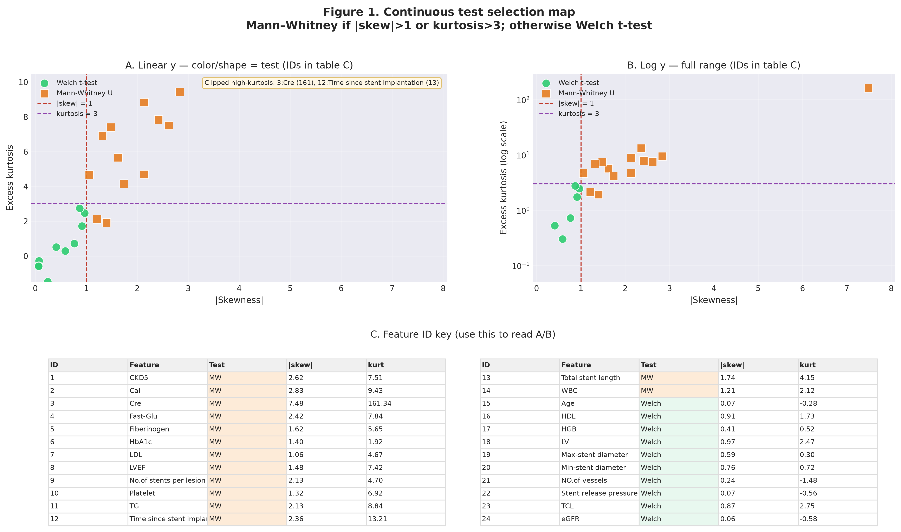
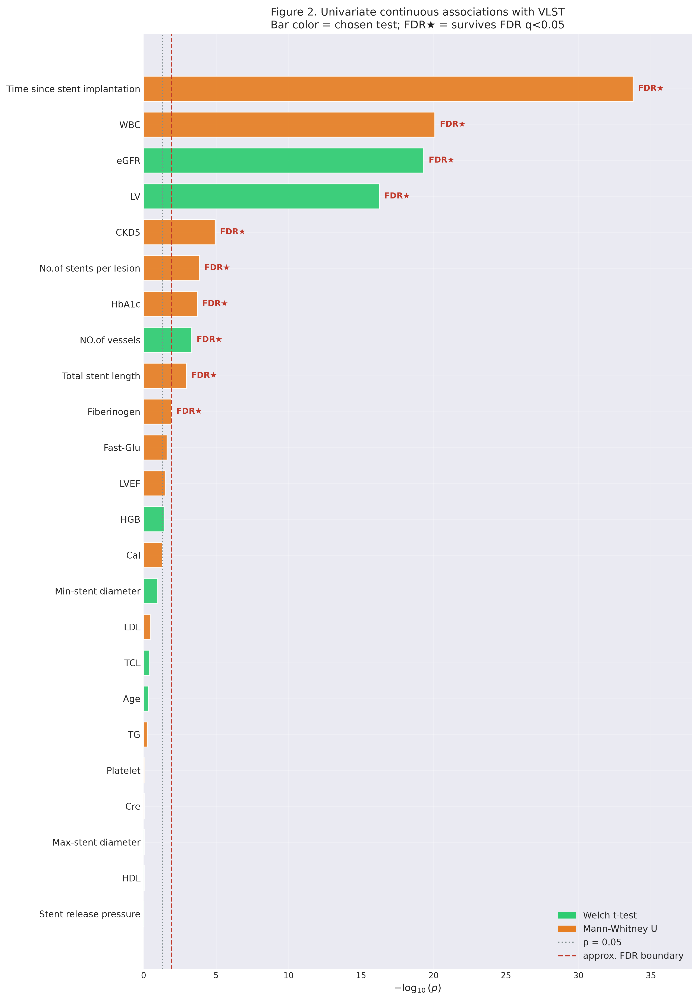
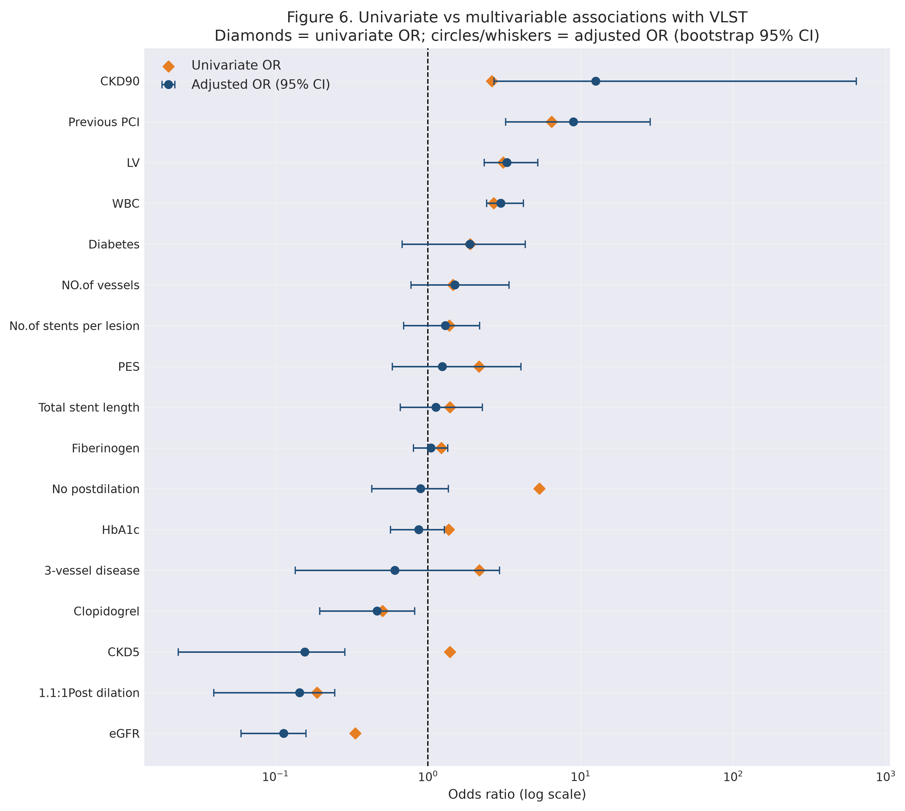
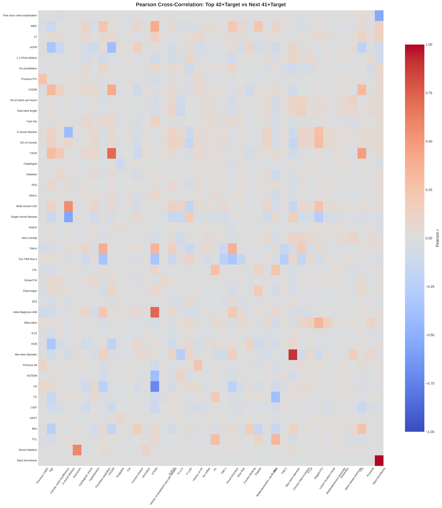
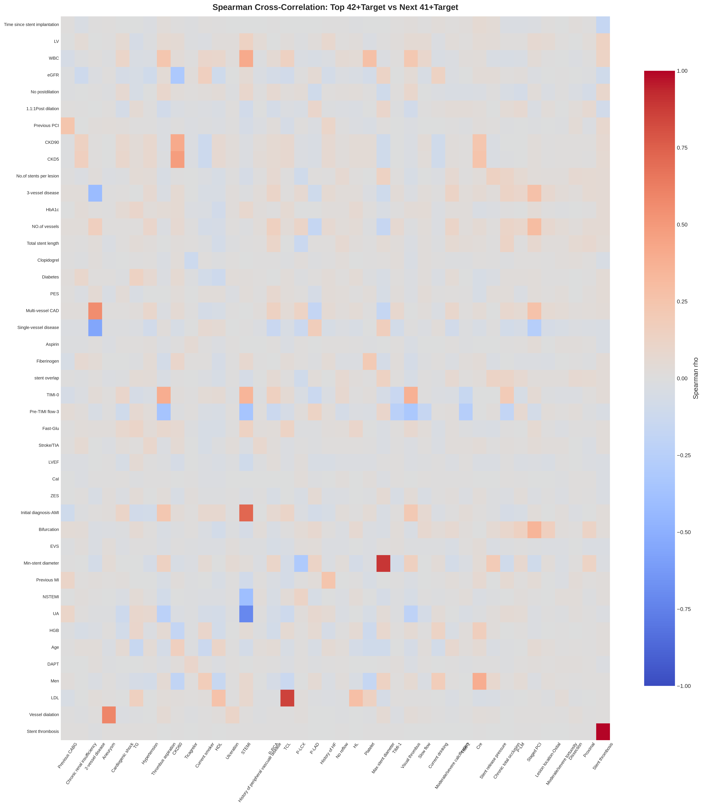
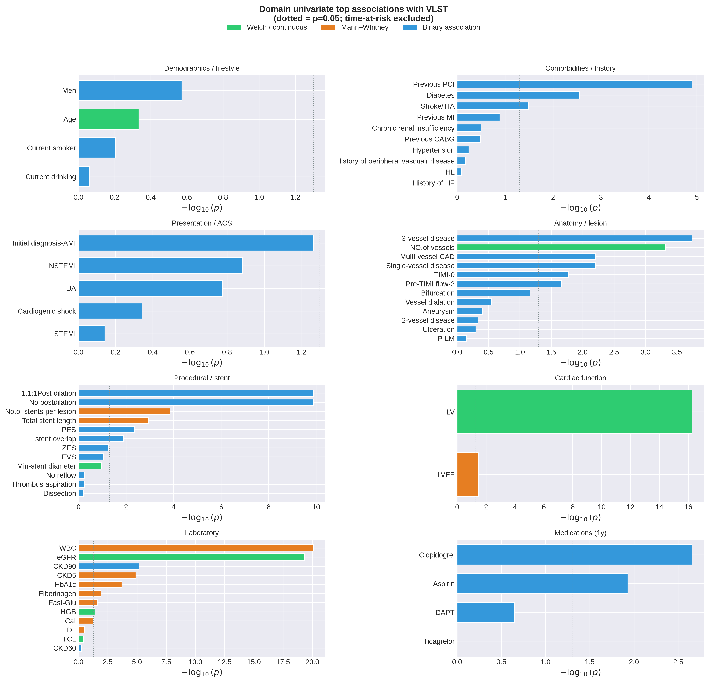
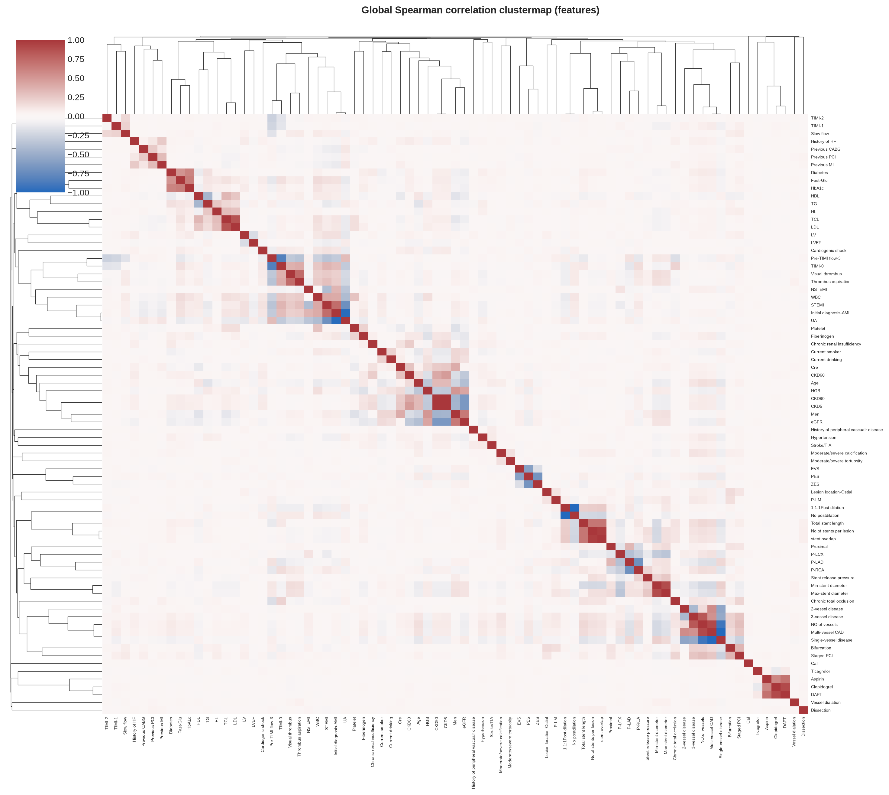
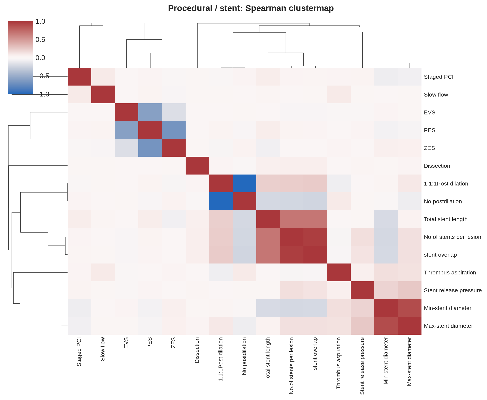
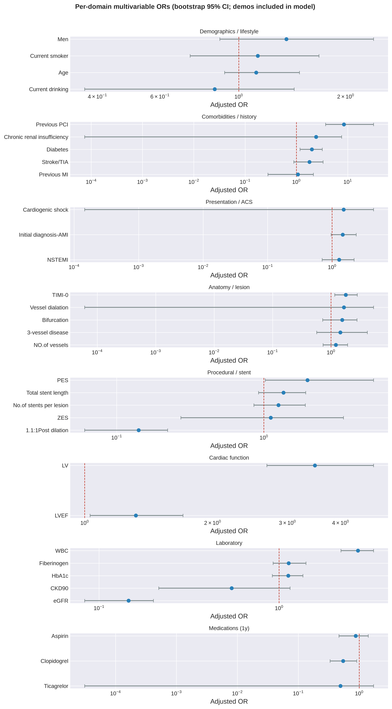

# VLST EDA — Paper Figures and Tables

This document gathers publication-oriented figures and tables from the exploratory data analysis of very late stent thrombosis (VLST) in [eda.ipynb](eda.ipynb).

**Cohort context.** Analyses use the VLST dataset (n = 5,185; 92 VLST events; prevalence 0.0177). The notebook printed **no missing values** in any column — univariate screens do not impute. Univariate continuous tests use Welch t-test when abs(skew) ≤ 1 and excess kurtosis ≤ 3, otherwise Mann–Whitney U. Binary associations use recommended 2×2 tests (chi-square / Fisher / related). Multiplicity is controlled with Benjamini–Hochberg FDR unless noted. Multivariable models are exploratory and sparse given the limited number of events. `Stent type-SES` is collapsed to levels with n ≥ 30 plus `other` (**9 levels**) for the χ² screen — not the 106 raw brand strings one-hot-encoded in Parts 2 and 4. `Time since stent implantation` is treated as a **time-at-risk / follow-up** variable and is **not** interpreted as a baseline clinical risk factor.

**Asset root:** [paper_figures/](paper_figures/) (also at `data/result/eda/paper_figures/`)

> Preview note: large table images are linked (not inlined) so the Markdown preview stays responsive. Figure PNGs are inlined below.

---

## Contents

1. [Test selection](#1-test-selection)
2. [Univariate continuous associations](#2-univariate-continuous-associations)
3. [Univariate binary associations](#3-univariate-binary-associations)
4. [Categorical associations](#4-categorical-associations)
5. [Multivariable adjustment](#5-multivariable-adjustment)
6. [Pairwise / bivariate structure](#6-pairwise--bivariate-structure)
7. [Medical-domain analysis (supplementary)](#7-medical-domain-analysis-supplementary)
8. [File index](#8-file-index)

---

## 1. Test selection

### Figure 1. Continuous test-selection map

**Figure 1.** Map of continuous predictors in the abs(skewness)–excess-kurtosis plane used to choose the primary univariate test for association with VLST. Green markers indicate Welch t-test (abs(skew) ≤ 1 and excess kurtosis ≤ 3); orange markers indicate Mann–Whitney U. Panel A uses a linear kurtosis axis (high-kurtosis features annotated if clipped); panel B uses a log kurtosis scale to show the full range; panel C lists feature IDs, chosen test, and shape statistics. Dashed lines mark the selection thresholds.

**Source file:** [paper_figures/paper_fig1_test_selection_map.png](paper_figures/paper_fig1_test_selection_map.png)

### Table R. Continuous variables: chosen univariate test and rationale

Rendered table image (open separately if needed): [paper_figures/paper_table_test_rationale.png](paper_figures/paper_table_test_rationale.png)

**Table R.** For each continuous predictor, the selected univariate test, distributional rationale (skewness, excess kurtosis, variance ratio), raw p, FDR q, and significance code (`p<0.05` / `p<0.01` / `p<0.001`).

| ID | Feature | Chosen test | Skewness | Kurtosis | Var. ratio | Why this test | p (raw) | q (FDR) | Sig |
| --- | --- | --- | --- | --- | --- | --- | --- | --- | --- |
| 1 | CKD5 | Mann-Whitney U | 2.62 | 7.51 | 1.32 | Heavy skew/tails (/skew/>1 or kurt>3) -> MW | 1.19e-05 | 5.69e-05 | p<0.001 |
| 2 | CaI | Mann-Whitney U | 2.83 | 9.43 | 1.37 | Heavy skew/tails (/skew/>1 or kurt>3) -> MW | 0.0507 | 0.0869 | ns |
| 3 | Cre | Mann-Whitney U | 7.48 | 161.34 | 1.7 | Heavy skew/tails (/skew/>1 or kurt>3) -> MW | 0.878 | 0.938 | ns |
| 4 | Fast-Glu | Mann-Whitney U | 2.42 | 7.84 | 2.13 | Heavy skew/tails (/skew/>1 or kurt>3) -> MW | 0.0246 | 0.0536 | ns |
| 5 | Fiberinogen | Mann-Whitney U | 1.62 | 5.65 | 1.31 | Heavy skew/tails (/skew/>1 or kurt>3) -> MW | 0.0119 | 0.0286 | p<0.05 |
| 6 | HbA1c | Mann-Whitney U | 1.4 | 1.92 | 1.11 | Heavy skew/tails (/skew/>1 or kurt>3) -> MW | 2.00e-04 | 7.00e-04 | p<0.001 |
| 7 | LDL | Mann-Whitney U | 1.06 | 4.67 | 1.78 | Heavy skew/tails (/skew/>1 or kurt>3) -> MW | 0.327 | 0.491 | ns |
| 8 | LVEF | Mann-Whitney U | -1.48 | 7.42 | 1.51 | Heavy skew/tails (/skew/>1 or kurt>3) -> MW | 0.0333 | 0.0666 | ns |
| 9 | No.of stents per lesion | Mann-Whitney U | 2.13 | 4.7 | 2.03 | Heavy skew/tails (/skew/>1 or kurt>3) -> MW | 1.00e-04 | 6.00e-04 | p<0.001 |
| 10 | Platelet | Mann-Whitney U | 1.32 | 6.92 | 1.24 | Heavy skew/tails (/skew/>1 or kurt>3) -> MW | 0.816 | 0.938 | ns |
| 11 | TG | Mann-Whitney U | 2.13 | 8.84 | 1.52 | Heavy skew/tails (/skew/>1 or kurt>3) -> MW | 0.558 | 0.705 | ns |
| 12 | Time since stent implantation | Mann-Whitney U | -2.36 | 13.2 | 12.7 | Heavy skew/tails (/skew/>1 or kurt>3) -> MW | 1.70e-34 | 4.07e-33 | p<0.001 |
| 13 | Total stent length | Mann-Whitney U | 1.74 | 4.15 | 1.76 | Heavy skew/tails (/skew/>1 or kurt>3) -> MW | 0.0011 | 0.003 | p<0.01 |
| 14 | WBC | Mann-Whitney U | 1.21 | 2.12 | 1.47 | Heavy skew/tails (/skew/>1 or kurt>3) -> MW | 7.90e-21 | 9.48e-20 | p<0.001 |
| 15 | Age | Welch t-test | -0.07 | -0.28 | 1.3 | Approx. symmetric (/skew/≤1 & kurt≤3) -> Welch | 0.463 | 0.618 | ns |
| 16 | HDL | Welch t-test | 0.91 | 1.73 | 1.58 | Approx. symmetric (/skew/≤1 & kurt≤3) -> Welch | 0.899 | 0.938 | ns |
| 17 | HGB | Welch t-test | -0.41 | 0.52 | 1.54 | Approx. symmetric (/skew/≤1 & kurt≤3) -> Welch | 0.0388 | 0.0716 | ns |
| 18 | LV | Welch t-test | 0.97 | 2.47 | 1.1 | Approx. symmetric (/skew/≤1 & kurt≤3) -> Welch | 5.44e-17 | 3.26e-16 | p<0.001 |
| 19 | Max-stent diameter | Welch t-test | 0.59 | 0.3 | 1.17 | Approx. symmetric (/skew/≤1 & kurt≤3) -> Welch | 0.885 | 0.938 | ns |
| 20 | Min-stent diameter | Welch t-test | 0.76 | 0.72 | 1.09 | Approx. symmetric (/skew/≤1 & kurt≤3) -> Welch | 0.106 | 0.169 | ns |
| 21 | NO.of vessels | Welch t-test | 0.24 | -1.48 | 1.04 | Approx. symmetric (/skew/≤1 & kurt≤3) -> Welch | 5.00e-04 | 0.0014 | p<0.01 |
| 22 | Stent release pressure | Welch t-test | 0.07 | -0.56 | 1.13 | Approx. symmetric (/skew/≤1 & kurt≤3) -> Welch | 0.949 | 0.949 | ns |
| 23 | TCL | Welch t-test | 0.87 | 2.75 | 1.57 | Approx. symmetric (/skew/≤1 & kurt≤3) -> Welch | 0.381 | 0.537 | ns |
| 24 | eGFR | Welch t-test | 0.06 | -0.58 | 3.02 | Approx. symmetric (/skew/≤1 & kurt≤3) -> Welch | 4.64e-20 | 3.71e-19 | p<0.001 |

**Source files:** [paper_figures/paper_table_test_rationale.png](paper_figures/paper_table_test_rationale.png), [paper_figures/paper_table_test_rationale.csv](paper_figures/paper_table_test_rationale.csv)

---

## 2. Univariate continuous associations

### Figure 2. Univariate continuous significance overview

**Figure 2.** Horizontal ranking of continuous features by -log10(p) for association with VLST. Bar color denotes the chosen test (Welch vs Mann–Whitney). The dotted line marks nominal p = 0.05; the dashed line approximates the FDR discovery boundary among continuous tests. FDR marks label features with FDR q < 0.05.

**Source file:** [paper_figures/paper_fig2_univariate_significance.png](paper_figures/paper_fig2_univariate_significance.png)

### Table 1. Continuous features with FDR q < 0.05 (univariate)

Rendered table image: [paper_figures/paper_table1_continuous_fdr.png](paper_figures/paper_table1_continuous_fdr.png)

**Table 1.** FDR-significant continuous associations with VLST, including test type, effect-size metric (Cohen d or Mann–Whitney r), mean/median differences (VLST − no VLST), raw p, and FDR q. Features annotated as time-at-risk should not be interpreted as baseline risk factors.

| Feature | Test | Direction | Effect size | ES | Δ mean | Δ median | p | q (FDR) | Sig | Note |
| --- | --- | --- | --- | --- | --- | --- | --- | --- | --- | --- |
| Time since stent implantation | Mann-Whitney U | Negative | Mann-Whitney r | -0.17 | -572.05 | -683.00 | 1.70e-34 | 4.07e-33 | p<0.001 | Time-at-risk / structural |
| WBC | Mann-Whitney U | Positive | Mann-Whitney r | 0.13 | 3.75 | 3.82 | 7.90e-21 | 9.48e-20 | p<0.001 | — |
| eGFR | Welch t-test | Negative | Cohen's d | -0.712 | -24.1 | -17.6 | 4.64e-20 | 3.71e-19 | p<0.001 | — |
| LV | Welch t-test | Positive | Cohen's d | 1.13 | 4.56 | 4 | 5.44e-17 | 3.26e-16 | p<0.001 | — |
| CKD5 | Mann-Whitney U | Positive | Mann-Whitney r | 0.04 | 0.18 | 0 | 1.19e-05 | 5.69e-05 | p<0.001 | — |
| No.of stents per lesion | Mann-Whitney U | Positive | Mann-Whitney r | 0.037 | 0.21 | 0 | 1.00e-04 | 6.00e-04 | p<0.001 | — |
| HbA1c | Mann-Whitney U | Positive | Mann-Whitney r | 0.052 | 0.47 | 1.05 | 2.00e-04 | 7.00e-04 | p<0.001 | — |
| NO.of vessels | Welch t-test | Positive | Cohen's d | 0.388 | 0.32 | 0 | 5.00e-04 | 0.0014 | p<0.01 | — |
| Total stent length | Mann-Whitney U | Positive | Mann-Whitney r | 0.045 | 6.76 | 2 | 0.0011 | 0.003 | p<0.01 | — |
| Fiberinogen | Mann-Whitney U | Positive | Mann-Whitney r | 0.035 | 0.2 | 0.17 | 0.0119 | 0.0286 | p<0.05 | — |

**Source files:** [paper_figures/paper_table1_continuous_fdr.png](paper_figures/paper_table1_continuous_fdr.png), [paper_figures/paper_table1_continuous_univariate.csv](paper_figures/paper_table1_continuous_univariate.csv)

### Figure 3. Effect sizes for FDR-significant continuous features

**Figure 3.** Primary effect sizes for continuous features with FDR q < 0.05. Grey highlighting (when present) marks the structural time-at-risk variable (`Time since stent implantation`).

**Source file:** [paper_figures/paper_fig3_continuous_effect_sizes.png](paper_figures/paper_fig3_continuous_effect_sizes.png)

---

## 3. Univariate binary associations

### Figure 4. Odds ratios for binary features (FDR q < 0.05)

**Figure 4.** Univariate odds ratios (OR) for binary clinical/procedural indicators associated with VLST after FDR control. OR > 1 indicates higher odds of VLST when the feature is present.

**Source file:** [paper_figures/paper_fig4_binary_odds_ratios.png](paper_figures/paper_fig4_binary_odds_ratios.png)

### Table 2. Binary features associated with VLST

Rendered table image: [paper_figures/paper_table2_binary_fdr.png](paper_figures/paper_table2_binary_fdr.png)

**Table 2.** Binary predictors with FDR q < 0.05, showing OR, relative risk (RR), phi coefficient, VLST rates by feature level, raw p, and FDR q.

| Feature | Test | OR | RR | Phi | VLST% (1) | VLST% (0) | p | q (FDR) | Sig |
| --- | --- | --- | --- | --- | --- | --- | --- | --- | --- |
| 1.1:1Post dilation | Chi-square | 0.187 | 0.191 | -0.089 | 0.56 | 2.92 | 1.30e-10 | 3.69e-09 | p<0.001 |
| No postdilation | Chi-square | 5.36 | 5.23 | 0.089 | 2.92 | 0.56 | 1.30e-10 | 3.69e-09 | p<0.001 |
| CKD90 | Chi-square | 2.62 | 2.57 | 0.063 | 3.59 | 1.4 | 6.55e-06 | 1.00e-04 | p<0.001 |
| Previous PCI | Fisher exact | 6.49 | 5.96 | 0.085 | 9.62 | 1.61 | 1.25e-05 | 2.00e-04 | p<0.001 |
| 3-vessel disease | Chi-square | 2.17 | 2.13 | 0.052 | 2.87 | 1.34 | 2.00e-04 | 0.0021 | p<0.01 |
| Clopidogrel | Chi-square | 0.503 | 0.509 | -0.043 | 1.17 | 2.29 | 0.0022 | 0.0209 | p<0.05 |
| Diabetes | Chi-square | 1.89 | 1.86 | 0.042 | 2.71 | 1.45 | 0.0028 | 0.0226 | p<0.05 |
| PES | Chi-square | 2.16 | 2.13 | 0.04 | 2.12 | 1 | 0.0044 | 0.0315 | p<0.05 |
| Multi-vessel CAD | Chi-square | 1.89 | 1.87 | 0.038 | 2.19 | 1.17 | 0.0062 | 0.0351 | p<0.05 |
| Single-vessel disease | Chi-square | 0.529 | 0.535 | -0.038 | 1.17 | 2.19 | 0.0062 | 0.0351 | p<0.05 |

**Source files:** [paper_figures/paper_table2_binary_fdr.png](paper_figures/paper_table2_binary_fdr.png), [paper_figures/paper_table2_binary_univariate.csv](paper_figures/paper_table2_binary_univariate.csv)

---

## 4. Categorical associations

### Figure 5. VLST rate by stent type

**Figure 5.** Observed VLST rate (%) across categories of `Stent type-SES` after collapsing rare levels (n < 30) to `other`. Rates are descriptive; formal association testing is summarized in Table 3.

**Source file:** [paper_figures/paper_fig5_categorical_rates_Stent_type-SES.png](paper_figures/paper_fig5_categorical_rates_Stent_type-SES.png)

### Table 3. Categorical feature association with VLST

Rendered table image: [paper_figures/paper_table3_categorical.png](paper_figures/paper_table3_categorical.png)

**Table 3.** Chi-square association between stent-type category and VLST, with degrees of freedom, Cramer V, raw p, and FDR q.

| Feature | Test | Levels used | Chi-square | df | Cramér's V | p | q (FDR) | Sig |
| --- | --- | --- | --- | --- | --- | --- | --- | --- |
| Stent type-SES | Chi-square | 9 | 44.9 | 8 | 0.093 | 3.85e-07 | 3.85e-07 | p<0.001 |

**Source files:** [paper_figures/paper_table3_categorical.png](paper_figures/paper_table3_categorical.png), [paper_figures/paper_table3_categorical.csv](paper_figures/paper_table3_categorical.csv)

**Methods note — 20 FDR names ≈ 12 constructs.** Pooling Tables 1–3 (and excluding `Time since stent implantation`) gives **20** FDR q < 0.05 names. At least 8 are redundant re-encodings: post-dilation complements (2 slots for 1 bit), the vessel-disease family (`3-vessel`, `Multi-vessel`, `Single-vessel`, `NO.of vessels` — 4 slots for 1 construct), and the renal family (`CKD5`, `CKD90` with continuous `eGFR` — 3 slots for 1 construct). Report the headline as roughly **12 distinct clinical constructs**, not 20 independent discoveries.

---

## 5. Multivariable adjustment

### Table 4. Exploratory multivariable logistic model (adjusted ORs)

Rendered table image: [paper_figures/paper_table4_multivariable_or.png](paper_figures/paper_table4_multivariable_or.png)

**Table 4.** Exploratory multivariable logistic regression for VLST (**unweighted MLE**, `statsmodels.Logit`). Continuous predictors are scaled per 1 SD. `Time since stent implantation` is excluded. Primary interval is the **Wald 95% CI**; SE (log-OR) and Wald p are reported. A 2,000-replicate percentile bootstrap of the same unweighted fit is stored in the numeric CSV as a robustness check. `class_weight="balanced"` is **not** used here (it is a predictive device; it distorts the likelihood used for Wald/LR tests). Given ~92 events, EPV is low and the model is for screening/confounding context, not prediction. Re-run `eda.ipynb` cell 10f to refresh the numbers below.

| Feature | Type | Univariate OR | Adjusted OR | 95% CI |
| --- | --- | --- | --- | --- |
| WBC | continuous (per 1 SD) | 2.69 | 3 | [2.424, 4.225] |
| eGFR | continuous (per 1 SD) | 0.334 | 0.113 | [0.060, 0.158] |
| LV | continuous (per 1 SD) | 3.12 | 3.28 | [2.335, 5.254] |
| CKD5 | continuous (per 1 SD) | 1.39 | 0.156 | [0.023, 0.285] |
| No.of stents per lesion | continuous (per 1 SD) | 1.38 | 1.3 | [0.693, 2.177] |
| HbA1c | continuous (per 1 SD) | 1.37 | 0.87 | [0.569, 1.280] |
| NO.of vessels | continuous (per 1 SD) | 1.46 | 1.5 | [0.774, 3.392] |
| Total stent length | continuous (per 1 SD) | 1.39 | 1.13 | [0.658, 2.269] |
| Fiberinogen | continuous (per 1 SD) | 1.22 | 1.04 | [0.804, 1.348] |
| 1.1:1Post dilation | binary | 0.187 | 0.144 | [0.040, 0.245] |
| No postdilation | binary | 5.35 | 0.895 | [0.429, 1.358] |
| CKD90 | binary | 2.62 | 12.5 | [2.708, 639.506] |
| Previous PCI | binary | 6.46 | 8.98 | [3.226, 28.618] |
| 3-vessel disease | binary | 2.17 | 0.605 | [0.135, 2.936] |
| Clopidogrel | binary | 0.504 | 0.464 | [0.195, 0.817] |
| Diabetes | binary | 1.89 | 1.88 | [0.678, 4.331] |
| PES | binary | 2.16 | 1.24 | [0.585, 4.056] |

**Source files:** [paper_figures/paper_table4_multivariable_or.png](paper_figures/paper_table4_multivariable_or.png), [paper_figures/paper_table4_multivariable_or.csv](paper_figures/paper_table4_multivariable_or.csv)

### Figure 6. Univariate versus multivariable associations

**Figure 6.** Comparison of univariate ORs (diamonds) with multivariable adjusted ORs and 95% CIs (circles/whiskers) for features entering the exploratory joint model. Attenuation toward the null suggests confounding or shared information; persistence of association after adjustment supports an independent signal within this sparse specification.

**Source file:** [paper_figures/paper_fig6_uni_vs_multivariable_or.png](paper_figures/paper_fig6_uni_vs_multivariable_or.png)

---

## 6. Pairwise / bivariate structure

A separate “bivariate feature extraction” step is **not** required. The correlation heatmap *is* the feature–feature bivariate analysis; predictor-versus-outcome bivariate work is already the FDR screens in sections 2–4 (the notebook calls those tests “univariate” because each model has one predictor). The three layers already in `eda.ipynb` answer different questions:

| Layer | What is paired | Role in the paper | Where |
| --- | --- | --- | --- |
| Predictor × VLST | Each column vs the outcome | Discovery catalogue (FDR q < 0.05) | Sections 2–4 |
| Feature × feature | Numeric columns vs each other | Multicollinearity / clustering before sparse models | Heatmaps below; Supplementary Figure S2 |
| Pair × VLST | Chosen interactions vs the outcome | Hypothesis-generating likelihood-ratio tests | Supplementary Table S2 |

Heatmaps that include `Stent thrombosis` also show predictor–outcome Pearson/Spearman *r*. That is a linear association measure and is **not** a substitute for the Welch / Mann–Whitney / Fisher screens, which allow non-Gaussian, rank, and 2×2 associations and apply FDR. The heatmap does not produce a second “bivariate FDR set.”

### Supplementary Figure S5. Pearson and Spearman heatmaps (top-42 vs next-41, with target)

**Figure S5a.** Pearson correlation among the 42 numeric columns with strongest |r| versus the outcome, against the next 41, including `Stent thrombosis`. Produced by `eda.ipynb` (no re-run). Off-diagonal blocks are feature–feature structure; the target row/column is the linear predictor–outcome slice.

**Figure S5b.** Spearman rank correlation for the same layout. Prefer this panel when tails or monotonic-but-nonlinear associations matter.

Publication clustering of the same numeric block is Supplementary Figure S2 (global and per-domain Spearman clustermaps). Pairwise *with outcome* beyond linear *r* is Table S2.

**Source files:** [paper_figures/03_correlation_heatmap_top42_vs_next41_with_target.png](paper_figures/03_correlation_heatmap_top42_vs_next41_with_target.png), [paper_figures/03b_spearman_correlation_heatmap_top42_vs_next41_with_target.png](paper_figures/03b_spearman_correlation_heatmap_top42_vs_next41_with_target.png)

---

## 7. Medical-domain analysis (supplementary)

Clinical-block analysis (section 10g): predictors grouped by medical domain; correlation clustering used to drop redundant mates before sparse domain-wise and joint models.

### Supplementary Figure S1. Domain univariate top associations

**Figure S1.** Within each clinical domain (demographics/lifestyle, comorbidities, presentation, anatomy/lesion, procedural/stent, cardiac function, laboratory, medications), the strongest univariate associations with VLST ranked by -log10(p). Time-at-risk is excluded from domain ranking. Color encodes test family (Welch / Mann–Whitney / binary).

### Supplementary Table S1. Domain strength summary

**Table S1.** Domain-level summary of univariate screening: number of features, count of raw p < 0.05, global FDR hits, within-domain FDR hits, minimum p, peak -log10(p), and top feature.

| Domain | n_features | n_raw_p05 | n_fdr_global | n_fdr_domain | min_p | max_neglog10p | top_feature |
| --- | --- | --- | --- | --- | --- | --- | --- |
| Laboratory | 16 | 8 | 6 | 6 | 7.90e-21 | 20.1 | WBC |
| Cardiac function | 2 | 2 | 1 | 2 | 5.44e-17 | 16.3 | LV |
| Procedural / stent | 16 | 6 | 5 | 6 | 1.30e-10 | 9.89 | 1.1:1Post dilation |
| Comorbidities / history | 10 | 3 | 2 | 2 | 1.25e-05 | 4.9 | Previous PCI |
| Anatomy / lesion | 23 | 6 | 4 | 4 | 1.81e-04 | 3.74 | 3-vessel disease |
| Medications (1y) | 4 | 2 | 1 | 2 | 0.0022 | 2.66 | Clopidogrel |
| Presentation / ACS | 5 | 0 | 0 | 0 | 0.0542 | 1.27 | Initial diagnosis-AMI |
| Demographics / lifestyle | 4 | 0 | 0 | 0 | 0.268 | 0.572 | Men |

**Source files:** [paper_figures/domain_strength_summary.csv](paper_figures/domain_strength_summary.csv), [paper_figures/domain_univariate_summary.csv](paper_figures/domain_univariate_summary.csv)

### Supplementary Figure S2. Feature correlation clustermaps

**Figure S2a.** Global Spearman correlation clustermap of numeric predictors (near-constant columns removed). Hierarchical clustering uses average linkage on distance 1 − abs(r).

**Figure S2b.** Laboratory-domain Spearman clustermap.

**Figure S2c.** Anatomy/lesion-domain Spearman clustermap.

**Figure S2d.** Procedural/stent-domain Spearman clustermap.

**Source files:** `domain_clustermap_*.png`, `feature_correlation_clusters.csv`, `feature_correlation_cluster_reps.csv`

### Supplementary Figure S3. Per-domain multivariable odds ratios

**Figure S3.** Domain-specific sparse logistic models (core demographics plus up to five non-redundant domain representatives). The stored PNG uses the previous bootstrap CIs. Notebook cells 10f / 10g-3 now fit **unweighted** `statsmodels.Logit` with **Wald 95% CIs** as primary (2,000-replicate percentile bootstrap stored as robustness). Re-run before quoting the new intervals. The dashed line marks OR = 1.

### Supplementary Figure S4. Joint cross-domain model (uni vs adjusted OR)

**Figure S4.** Joint sparse cross-domain logistic model comparing univariate ORs with adjusted ORs. Continuous covariates are per 1 SD; time-since-stent is excluded. Same inferential note as Figure S3: stored figure is the old bootstrap run; current code uses unweighted Wald CIs (primary) plus a 2,000-replicate bootstrap robustness check. `LVEF`’s adjusted OR **reverses sign** versus its univariate OR when `LV` is in the model.

| Feature | Domain | Univariate OR | Adjusted OR | OR lower | OR upper |
| --- | --- | --- | --- | --- | --- |
| Age | Demographics / lifestyle | 1.08 | 1.1 | 0.836 | 1.34 |
| WBC | Laboratory | 2.69 | 2.94 | 2.34 | 4.4 |
| eGFR | Laboratory | 0.334 | 0.203 | 0.127 | 0.299 |
| LV | Cardiac function | 3.12 | 2.95 | 2.2 | 5.04 |
| LVEF | Cardiac function | 0.851 | 1.65 | 1.3 | 2.26 |
| No.of stents per lesion | Procedural / stent | 1.38 | 1.55 | 1.17 | 2.27 |
| Men | Demographics / lifestyle | 1.29 | 3.28 | 1.58 | 7.9 |
| Current smoker | Demographics / lifestyle | 1.11 | 0.976 | 0.541 | 2.07 |
| Current drinking | Demographics / lifestyle | 0.981 | 1.07 | 0.423 | 2.11 |
| 1.1:1Post dilation | Procedural / stent | 0.192 | 0.191 | 0.0444 | 0.382 |
| Previous PCI | Comorbidities / history | 6.73 | 9.58 | 3.31 | 23.6 |
| Diabetes | Comorbidities / history | 1.9 | 1.46 | 0.789 | 2.6 |

### Supplementary Table S2. Exploratory interaction screen

**Table S2.** Limited, clinically motivated pairwise interaction screen (likelihood-ratio test vs main-effects-only model). FDR q is computed among tested interactions only. With ~92 events, interactions are hypothesis-generating.

| Pair | LR statistic | Interaction p | Interaction OR | q (FDR) |
| --- | --- | --- | --- | --- |
| LV x eGFR | 9.81 | 0.00173 | 1.24 | 0.0277 |
| Men x eGFR | 8.53 | 0.0035 | 0.342 | 0.028 |
| WBC x eGFR | 2.65 | 0.104 | 1.13 | 0.553 |
| Current smoker x DAPT | 2.07 | 0.15 | 1.86 | 0.599 |
| Aspirin x Clopidogrel | 1.49 | 0.222 | 2.97 | 0.623 |
| Diabetes x HbA1c | 1.25 | 0.264 | 0.787 | 0.623 |
| Men x Previous PCI | 1.19 | 0.274 | 0.442 | 0.623 |
| LV x Previous PCI | 0.964 | 0.326 | 0.786 | 0.623 |

**Source file:** [paper_figures/domain_interaction_screen.csv](paper_figures/domain_interaction_screen.csv)

---

## 8. File index

| ID | Type | File |
| --- | --- | --- |
| Fig 1 | Figure | [paper_fig1_test_selection_map.png](paper_figures/paper_fig1_test_selection_map.png) |
| Table R | Table | [paper_table_test_rationale.png](paper_figures/paper_table_test_rationale.png) |
| Fig 2 | Figure | [paper_fig2_univariate_significance.png](paper_figures/paper_fig2_univariate_significance.png) |
| Table 1 | Table | [paper_table1_continuous_fdr.png](paper_figures/paper_table1_continuous_fdr.png) |
| Fig 3 | Figure | [paper_fig3_continuous_effect_sizes.png](paper_figures/paper_fig3_continuous_effect_sizes.png) |
| Fig 4 | Figure | [paper_fig4_binary_odds_ratios.png](paper_figures/paper_fig4_binary_odds_ratios.png) |
| Table 2 | Table | [paper_table2_binary_fdr.png](paper_figures/paper_table2_binary_fdr.png) |
| Fig 5 | Figure | [paper_fig5_categorical_rates_Stent_type-SES.png](paper_figures/paper_fig5_categorical_rates_Stent_type-SES.png) |
| Table 3 | Table | [paper_table3_categorical.png](paper_figures/paper_table3_categorical.png) |
| Table 4 | Table | [paper_table4_multivariable_or.png](paper_figures/paper_table4_multivariable_or.png) |
| Fig 6 | Figure | [paper_fig6_uni_vs_multivariable_or.png](paper_figures/paper_fig6_uni_vs_multivariable_or.png) |
| Fig S5a | Supp. figure | [03_correlation_heatmap_top42_vs_next41_with_target.png](paper_figures/03_correlation_heatmap_top42_vs_next41_with_target.png) |
| Fig S5b | Supp. figure | [03b_spearman_correlation_heatmap_top42_vs_next41_with_target.png](paper_figures/03b_spearman_correlation_heatmap_top42_vs_next41_with_target.png) |
| Fig S1 | Supp. figure | [domain_univariate_top_hits.png](paper_figures/domain_univariate_top_hits.png)
| Table S1 | Supp. table | [domain_strength_summary.csv](paper_figures/domain_strength_summary.csv) |
| Fig S2a | Supp. figure | [domain_clustermap_global.png](paper_figures/domain_clustermap_global.png) |
| Fig S2b | Supp. figure | [domain_clustermap_lab.png](paper_figures/domain_clustermap_lab.png) |
| Fig S2c | Supp. figure | [domain_clustermap_anatomy.png](paper_figures/domain_clustermap_anatomy.png) |
| Fig S2d | Supp. figure | [domain_clustermap_procedural.png](paper_figures/domain_clustermap_procedural.png) |
| Fig S3 | Supp. figure | [domain_multivariable_or_panels.png](paper_figures/domain_multivariable_or_panels.png) |
| Fig S4 | Supp. figure | [domain_joint_uni_vs_multi_or.png](paper_figures/domain_joint_uni_vs_multi_or.png) |
| Table S2 | Supp. table | [domain_interaction_screen.csv](paper_figures/domain_interaction_screen.csv) |

---

*Generated from EDA notebook outputs. Close and reopen this file (or refresh Markdown preview) after updates.*
