# TabPFN interpretability — paper figures and tables

This document gathers publication-oriented figures and tables from the TabPFN interpretability notebook `tabpfn_interpretability.ipynb`.

**Cohort / protocol.** Raw VLST.csv, n = 5,185, 81 features after dropping identifiers (`NO.`, `Name`) and `Time since stent implantation` (time-at-risk / follow-up, not a baseline covariate). Target = `Stent thrombosis`. EDA found **no missing values** — there is no missingness to “keep.” Text columns are coded as integer categoricals (no scaling / one-hot). That is the TabPFN-native representation; `Stent type-SES` is treated as a numeric code, so a PDP sweep across brand integers is not a meaningful nominal contrast. Feature ranking, PDP, and SHAP are **interpretation / attribution** on the full pool — not prediction, not external validation, and not a locked-in feature mask for Part 4.

**Methods note — selection vs explanation.** Mutual information, stability (repeated forward SFS), and SHAP all use the **full cohort** (`X_all`, `y_all`): 92 events and 5,093 controls. There is no `SHAP_N_EXPLAIN` cap and no case-only slice. k-SII / SHAP-IQ force and network plots remain **one illustrative row** (row 0 of that same cohort), not a VLST = 1 pick.

**Backends.** Mutual information, stability selection, and PDP use **local** `tabpfn` (0 client thinking fits). SHAP and SHAP-IQ try tabpfn-client with thinking (`effort=high`, `metric=average_precision`) and fall back to local TabPFN + KV cache. The shapiq `imputer="baseline"` is **not** a missing-value fill: it replaces *hidden* features with a baseline value while attributing. **[STALE]** The PNGs and Table 4 numbers below are still the old 15-case run until this notebook is re-executed.

**Asset root:** [paper_figures/](paper_figures/)

---

## Contents

1. [Methods (Table 0)](#1-methods)
2. [Univariate and stability screens (Tables 1–2)](#2-univariate-and-stability-screens)
3. [Partial dependence (Figures 1–2, Table 3)](#3-partial-dependence)
4. [SHAP attributions (Figures 3–7, Table 4)](#4-shap-attributions)
5. [Pairwise interactions — k-SII (Figures 8–9)](#5-pairwise-interactions--k-sii)
6. [SHAP-IQ native plots (Figures 10–12)](#6-shap-iq-native-plots)
7. [Consensus ranking (Figure 13, Table 5)](#7-consensus-ranking)
8. [File index](#8-file-index)

---

## 1. Methods

### Table 0. Interpretability methods

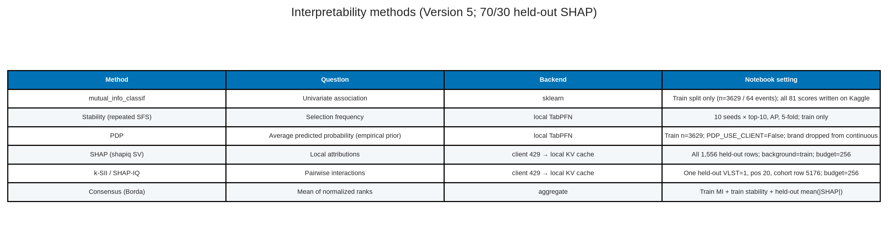

**Table 0.** Five signals plus a Borda-style consensus. No single method is trusted alone. Stability frequency is the reliability signal (how often forward SFS keeps a feature across 10 resamples). MI, SFS, and SHAP use the **full cohort**. Pairwise k-SII is a one-row interaction view (row 0), not a global interaction ranking.

| Method | Question | Backend | Notebook setting |
| --- | --- | --- | --- |
| mutual_info_classif | Univariate association | sklearn | 0 TabPFN calls; median fill is inert (no NaNs) |
| Stability (repeated SFS) | Selection frequency | local TabPFN | 10 resamples × top-10 forward SFS, AP scoring |
| PDP | Average predicted risk | local TabPFN | Continuous grid + binary 0 vs 1 bars |
| SHAP (shapiq SV) | Local attributions | local TabPFN (client fallback) | Full cohort (same as FFS/MI); budget=256 |
| k-SII / SHAP-IQ | Pairwise interactions | local TabPFN (client fallback) | One illustrative row (row 0 of the full cohort); budget=256 |
| Consensus (Borda) | Mean of normalized ranks | aggregate | MI + stability frequency + mean(\|SHAP\|) |

**Source files:** [paper_figures/paper_table0_methods.png](paper_figures/paper_table0_methods.png), [paper_figures/paper_table0_methods.csv](paper_figures/paper_table0_methods.csv)

---

## 2. Univariate and stability screens

### Table 1. Top 15 by mutual information

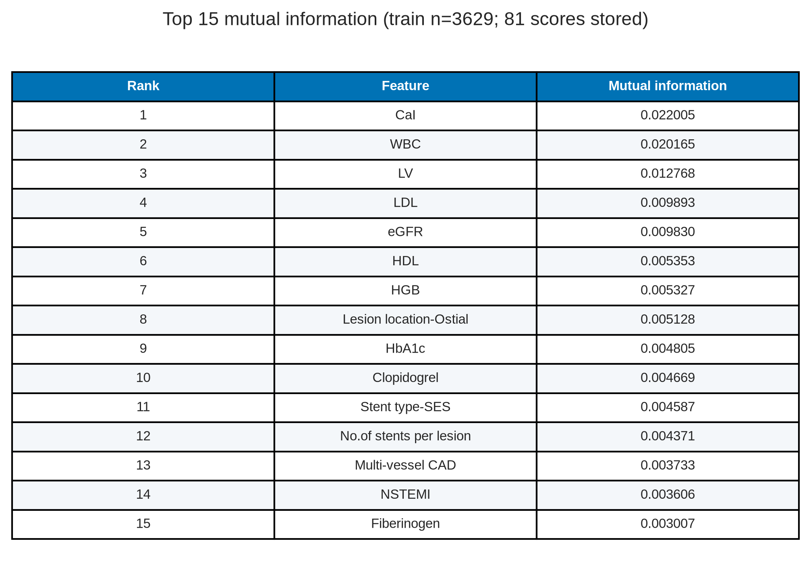

**Table 1.** `mutual_info_classif` ranking of the 81-column raw matrix on the **full cohort**. The code applies a column-median fill before MI; the CSV has no missing values, so that fill does nothing. Calcium index (`CaI`), `WBC`, and `LV` lead. `Stent type-SES` and `eGFR` follow. Mutual-information values for `Fast-Glu` and `ZES` were not stored in the consensus table; those two names still appear in the notebook’s printed top-15 list. This is a marginal association screen, not a model attribution.

| Rank | Feature | Mutual information |
| ---: | --- | ---: |
| 1 | CaI | 0.019224 |
| 2 | WBC | 0.018360 |
| 3 | LV | 0.015178 |
| 4 | Stent type-SES | 0.011357 |
| 5 | eGFR | 0.009931 |
| 6 | 1.1:1Post dilation | 0.007932 |
| 7 | LDL | 0.007693 |
| 8 | No postdilation | 0.007535 |
| 9 | HbA1c | 0.007439 |
| 10 | HGB | 0.004606 |
| 11 | Fast-Glu | — |
| 12 | TCL | 0.004257 |
| 13 | Fiberinogen | 0.004040 |
| 14 | ZES | — |
| 15 | Visual thrombus | 0.003707 |

**Source files:** [paper_figures/paper_table1_mutual_info.png](paper_figures/paper_table1_mutual_info.png), [paper_figures/paper_table1_mutual_info.csv](paper_figures/paper_table1_mutual_info.csv)

### Table 2. Stability selection frequency

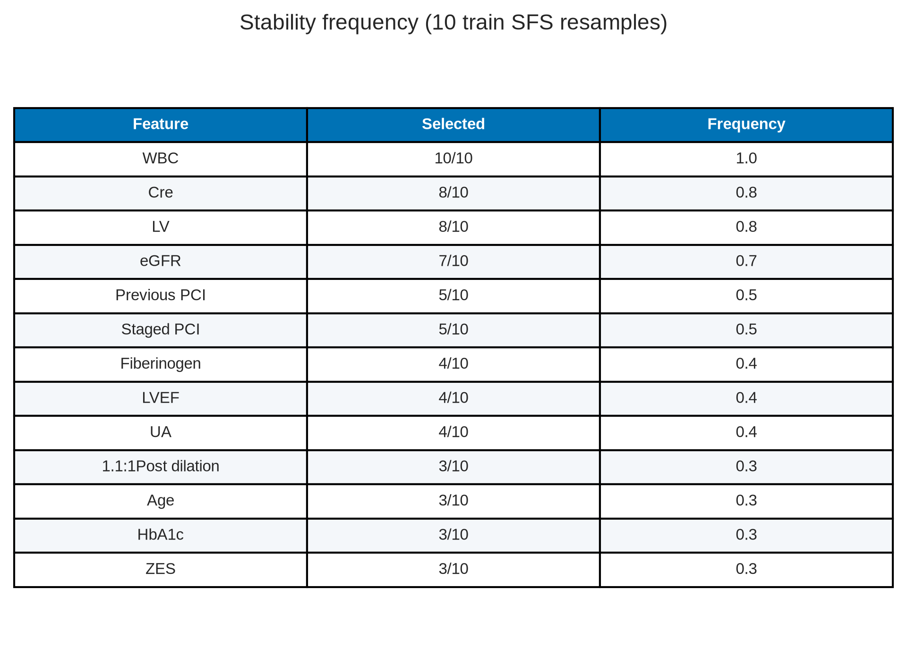

**Table 2.** Forward sequential feature selection (keep 10 of 81, 5-fold CV, average precision) repeated over 10 shuffled seeds. Features selected in every run: `LV`, `Stent type-SES`, `eGFR`. Selected in 9/10: `Age`, `Cre`, `WBC`. `No postdilation` (7/10) and `STEMI` (6/10) are moderately stable. A long tail of names appears only once or twice and should not be treated as robust TabPFN features. Wall time for this block in the stored run was ~8.6 h (local TabPFN, 0 client API calls).

| Feature | Selected | Frequency |
| --- | --- | ---: |
| LV | 10/10 | 1.0 |
| Stent type-SES | 10/10 | 1.0 |
| eGFR | 10/10 | 1.0 |
| Age | 9/10 | 0.9 |
| Cre | 9/10 | 0.9 |
| WBC | 9/10 | 0.9 |
| No postdilation | 7/10 | 0.7 |
| STEMI | 6/10 | 0.6 |
| HbA1c | 5/10 | 0.5 |
| LVEF | 5/10 | 0.5 |
| No.of stents per lesion | 3/10 | 0.3 |
| Staged PCI | 3/10 | 0.3 |
| 1.1:1Post dilation | 2/10 | 0.2 |
| CKD5 | 2/10 | 0.2 |
| CKD60 | 2/10 | 0.2 |
| EVS | 2/10 | 0.2 |
| Current drinking | 1/10 | 0.1 |
| History of peripheral vascualr disease | 1/10 | 0.1 |
| Initial diagnosis-AMI | 1/10 | 0.1 |
| PES | 1/10 | 0.1 |
| Single-vessel disease | 1/10 | 0.1 |
| Visual thrombus | 1/10 | 0.1 |

**Source files:** [paper_figures/paper_table2_stability.png](paper_figures/paper_table2_stability.png), [paper_figures/paper_table2_stability.csv](paper_figures/paper_table2_stability.csv)

---

## 3. Partial dependence

PDP candidates were taken from the stability / MI screens. Continuous PDP uses grid resolution 30. Binary PDP forces each flag to 0 vs 1 and reports the change in average predicted P[Stent thrombosis].

**Methods note — these are not absolute risks.** Every TabPFN fit in this notebook uses `balance_probabilities=True`, which rescales outputs toward a uniform class prior. True prevalence is 0.0177. Table 3 baselines around 0.13–0.26 and Figure 1’s LV curve “toward ~0.6” are **balanced-prior model output**, not predicted event probabilities a clinician can read as 24% or 60% risk.

### Figure 1. Continuous partial dependence

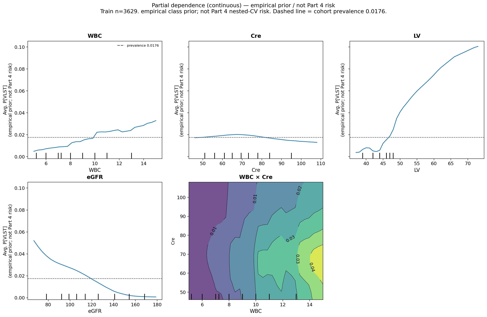

**Figure 1.** Average TabPFN **balanced-prior** output while sweeping one feature (rug = empirical distribution). `LV`: output stays low until the mid-40s then rises toward ~0.6 on that scale, **not** a 60% absolute risk. `eGFR`: high output at low filtration. `Stent type-SES` is integer-coded here; a sweep across brand codes is **not** a nominal brand contrast (EDA uses 9 collapsed levels; Part 4 one-hots 106 strings). `Age` is essentially flat (~0.14). The LV × SES contour is dominated by vertical (LV) bands.

**Source file:** [paper_figures/paper_fig1_pdp_continuous.png](paper_figures/paper_fig1_pdp_continuous.png)

### Figure 2. Binary partial dependence

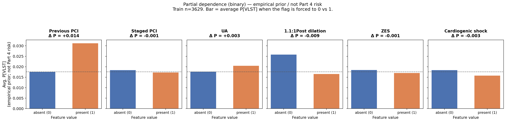

**Figure 2.** Average balanced-prior P[Stent thrombosis] when each binary feature is forced to absent (0, blue) vs present (1, orange). The largest shift is `1.1:1Post dilation` (ΔP = −0.086): the flag is associated with **lower model output**, not a proven treatment effect. `No postdilation` also lowers output (ΔP = −0.036) from a higher baseline. `STEMI`, `Staged PCI`, `CKD60`, and `EVS` have small average effects (|ΔP| ≤ 0.013).

**Source file:** [paper_figures/paper_fig2_pdp_binary.png](paper_figures/paper_fig2_pdp_binary.png)

### Table 3. Binary PDP numeric values

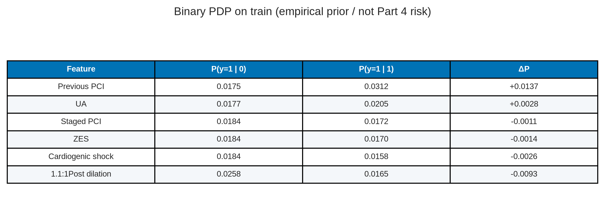

**Table 3.** Printed PDP probabilities from the notebook. ΔP = P(y=1 | feature=1) − P(y=1 | feature=0). These are **balanced-prior** model-average effects, not absolute risks and not causal estimates.

| Feature | P(y=1 \| 0) | P(y=1 \| 1) | ΔP |
| --- | ---: | ---: | ---: |
| No postdilation | 0.2430 | 0.2067 | −0.0363 |
| STEMI | 0.1401 | 0.1271 | −0.0130 |
| Staged PCI | 0.1334 | 0.1303 | −0.0031 |
| 1.1:1Post dilation | 0.2643 | 0.1781 | −0.0862 |
| CKD60 | 0.1359 | 0.1234 | −0.0124 |
| EVS | 0.1328 | 0.1354 | +0.0026 |

**Source files:** [paper_figures/paper_table3_pdp_binary.png](paper_figures/paper_table3_pdp_binary.png), [paper_figures/paper_table3_pdp_binary.csv](paper_figures/paper_table3_pdp_binary.csv)

---

## 4. SHAP attributions

**Code now:** SHAP fits and explains the **full cohort** (same `X_all`, `y_all` as FFS/MI). **[STALE]** The PNGs and numbers in this section are still the previous 15-case run. Do not read them as the current protocol. Re-run `tabpfn_interpretability.ipynb` [3/5] before using these figures.

### Figure 3. SHAP summary

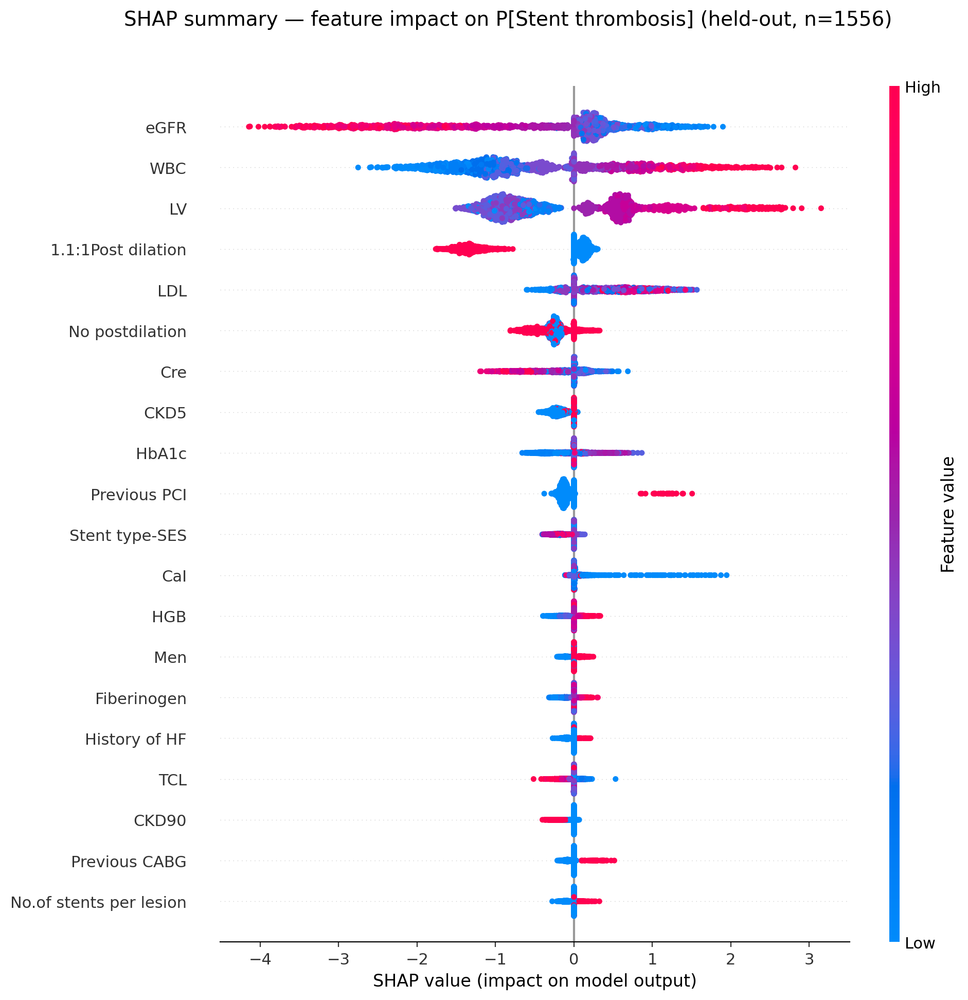

**Figure 3.** **[STALE PNG]** Stored beeswarm is from the deleted 15-case slice. After re-run this is a full-cohort beeswarm (colour = feature value).

**Source file:** [paper_figures/paper_fig3_shap_summary.png](paper_figures/paper_fig3_shap_summary.png)

### Figure 4. SHAP scatter for Age

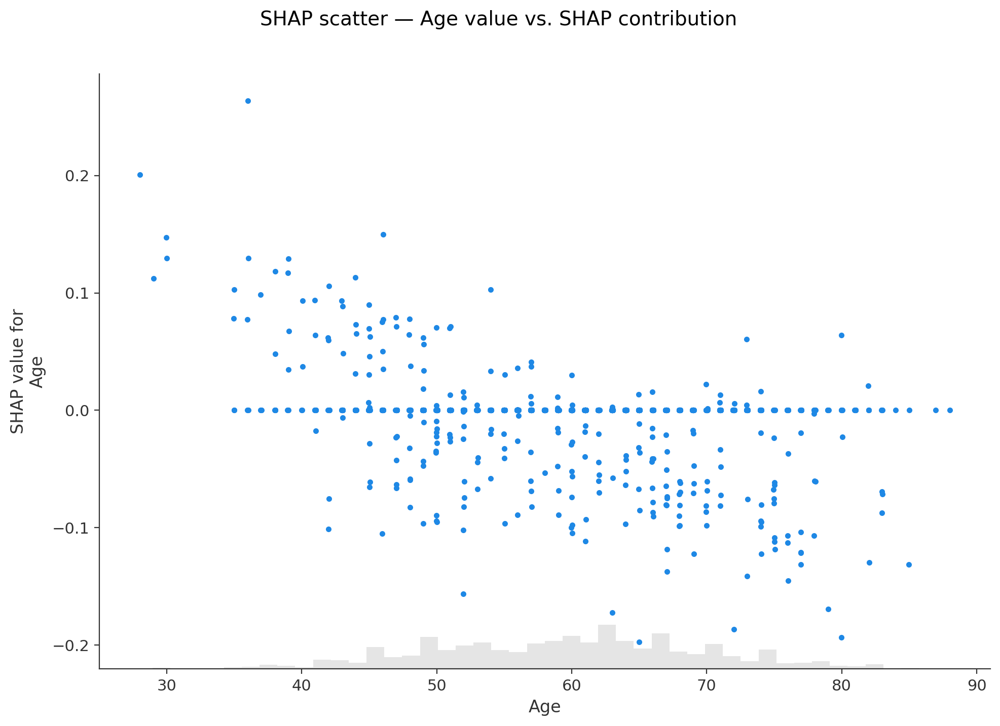

**Figure 4.** **[STALE PNG]** Age versus SHAP from the old 15-case slice. Re-run before citing.

**Source file:** [paper_figures/paper_fig4_shap_scatter_age.png](paper_figures/paper_fig4_shap_scatter_age.png)

### Figure 5. Mean absolute SHAP (global bar)

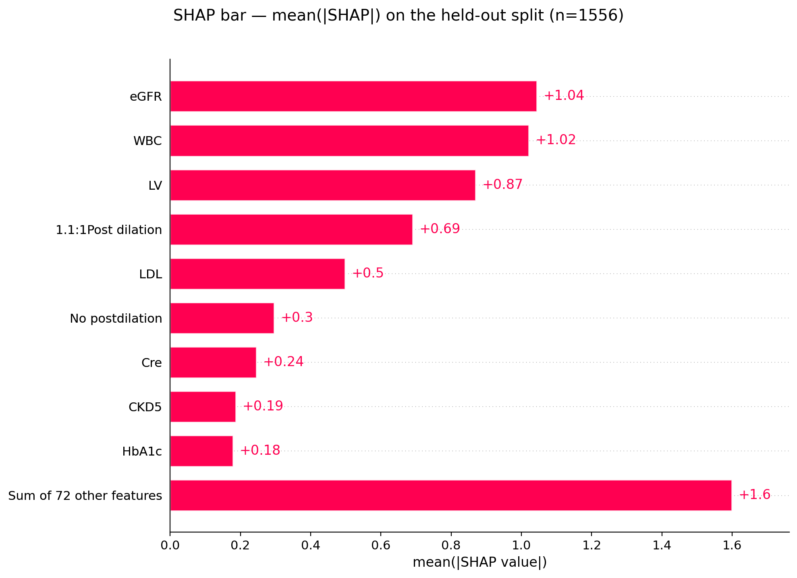

**Figure 5.** **[STALE PNG / numbers]** Mean(|SHAP|) from the old 15-case slice (`LV` 1.24, `WBC` 1.16, …). After re-run this is mean(|SHAP|) on the full cohort.

**Source file:** [paper_figures/paper_fig5_shap_bar.png](paper_figures/paper_fig5_shap_bar.png)

### Figure 6. Compact SHAP beeswarm

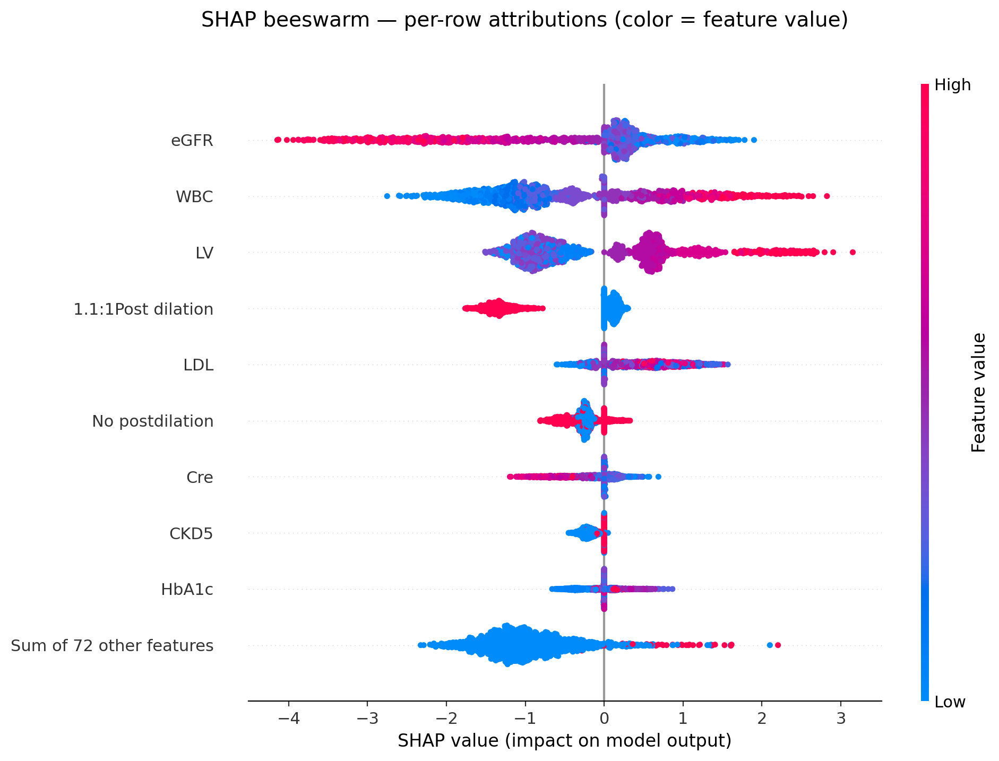

**Figure 6.** **[STALE PNG]** Compact beeswarm from the old 15-case slice.

**Source file:** [paper_figures/paper_fig6_shap_beeswarm.png](paper_figures/paper_fig6_shap_beeswarm.png)

### Figure 7. One-row SHAP waterfall

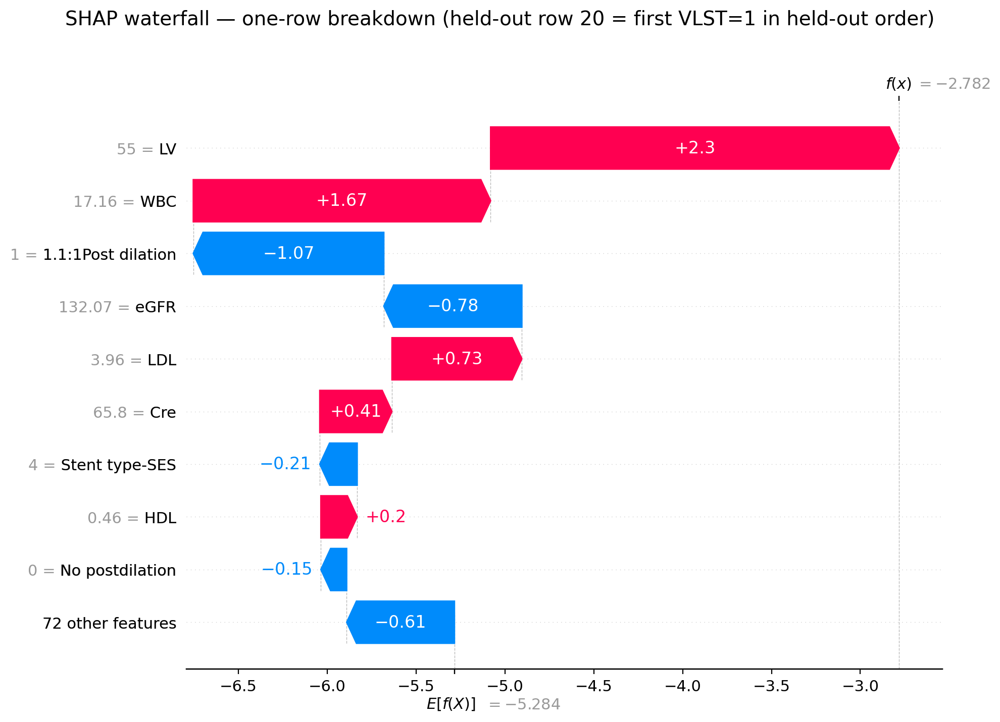

**Figure 7.** **[STALE PNG]** Old waterfall for one VLST case. Code now uses row 0 of the full cohort (not a case-enriched pick). Local explanation for one patient, not a global ranking.

**Source file:** [paper_figures/paper_fig7_shap_waterfall.png](paper_figures/paper_fig7_shap_waterfall.png)

### Table 4. Mean(|SHAP|) ranking

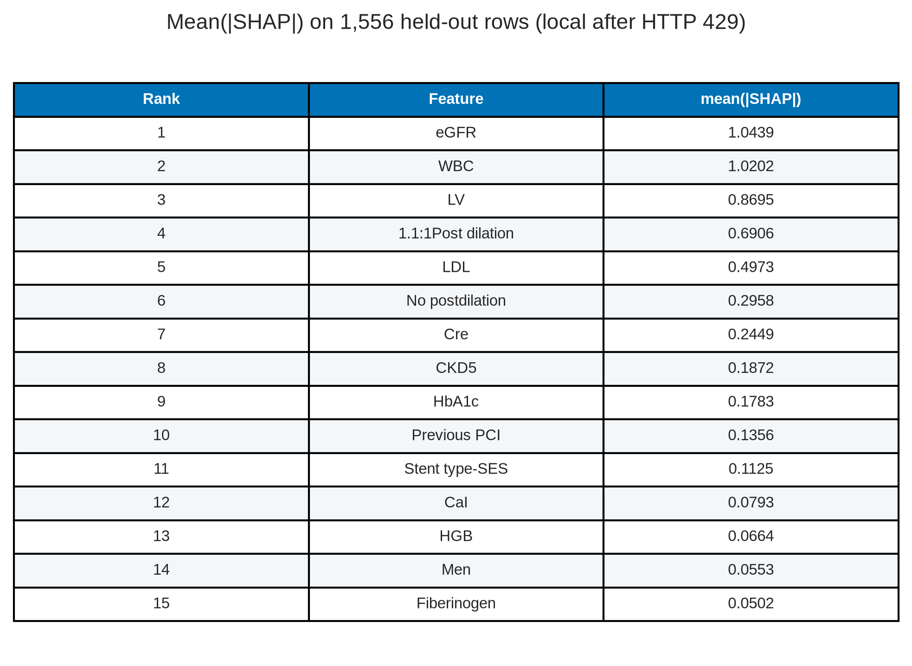

**Table 4.** **[STALE]** Mean absolute SHAP from the old 15-case slice. After re-run this is the full-cohort ranking used in Table 5.

| Rank | Feature | mean(\|SHAP\|) |
| ---: | --- | ---: |
| 1 | LV | 1.2368 |
| 2 | WBC | 1.1648 |
| 3 | LDL | 0.6408 |
| 4 | eGFR | 0.4713 |
| 5 | 1.1:1Post dilation | 0.2392 |
| 6 | Stent type-SES | 0.2296 |
| 7 | No postdilation | 0.1779 |
| 8 | CaI | 0.1779 |
| 9 | HbA1c | 0.1602 |
| 10 | Cre | 0.1539 |
| 11 | Fiberinogen | 0.0942 |
| 12 | HGB | 0.0760 |
| 13 | TCL | 0.0500 |
| 14 | No.of stents per lesion | 0.0424 |
| 15 | Visual thrombus | 0.0384 |

**Source files:** [paper_figures/paper_table4_shap_mean_abs.png](paper_figures/paper_table4_shap_mean_abs.png), [paper_figures/paper_table4_shap_mean_abs.csv](paper_figures/paper_table4_shap_mean_abs.csv)

---

## 5. Pairwise interactions — k-SII

k-SII plots use **one illustrative row** (row 0 of the full cohort; budget = 256). Node size is the main effect; edge width is the pairwise interaction. They illustrate how TabPFN combines features for that row; they are not a cohort interaction screen. **[STALE]** Stored figures 8–12 are still the old VLST-case row.

### Figure 8. k-SII network (SHAP section)

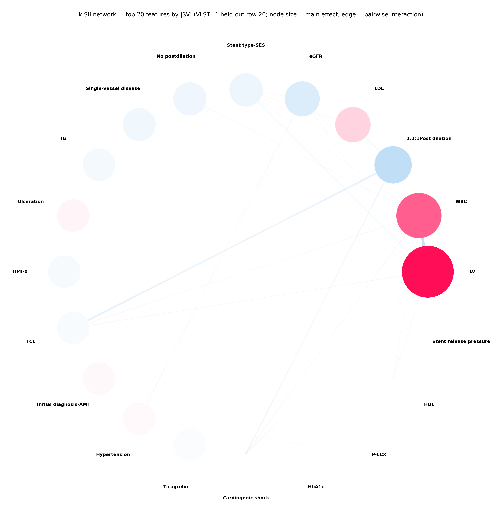

**Figure 8.** Circular k-SII network for the top 20 features by |Shapley value| on **one VLST case**. Large red nodes (`LV`, `WBC`) are strong positive main effects; `1.1:1Post dilation` is a large **negative** (blue) main effect on this row — not a cohort-level benefit. Thick edges among `LV`, `WBC`, `eGFR`, `LDL`, and post-dilation are the dominant pairwise terms **for that patient**.

**Source file:** [paper_figures/paper_fig8_ksii_network.png](paper_figures/paper_fig8_ksii_network.png)

### Figure 9. k-SII UpSet plot (SHAP section)

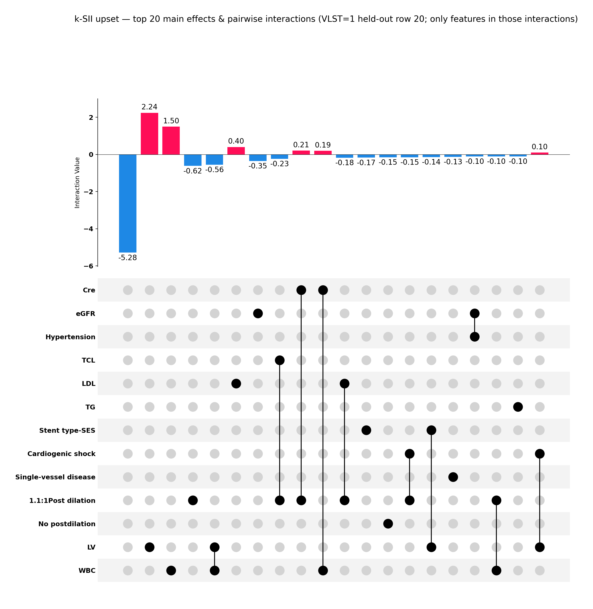

**Figure 9.** UpSet-style listing of the largest main effects and pairwise k-SII values for the same row. The leftmost bar is the large negative base / intercept term. The largest positive main effects are `LV` then `WBC`; the largest negative main effect among named features is `1.1:1Post dilation`. Pairwise terms involving `LV`, `WBC`, `eGFR`, and `LDL` fill most of the remaining top-20 slots.

**Source file:** [paper_figures/paper_fig9_ksii_upset.png](paper_figures/paper_fig9_ksii_upset.png)

---

## 6. SHAP-IQ native plots

Section [4/5] of the notebook recomputes imputation-based Shapley values and k-SII with shapiq’s native plotting API, again after the client backend failed. Figures 10–12 are a second view of the **same one-row explanation**, not an independent replication on new rows.

### Figure 10. SHAP-IQ force plot (one row)

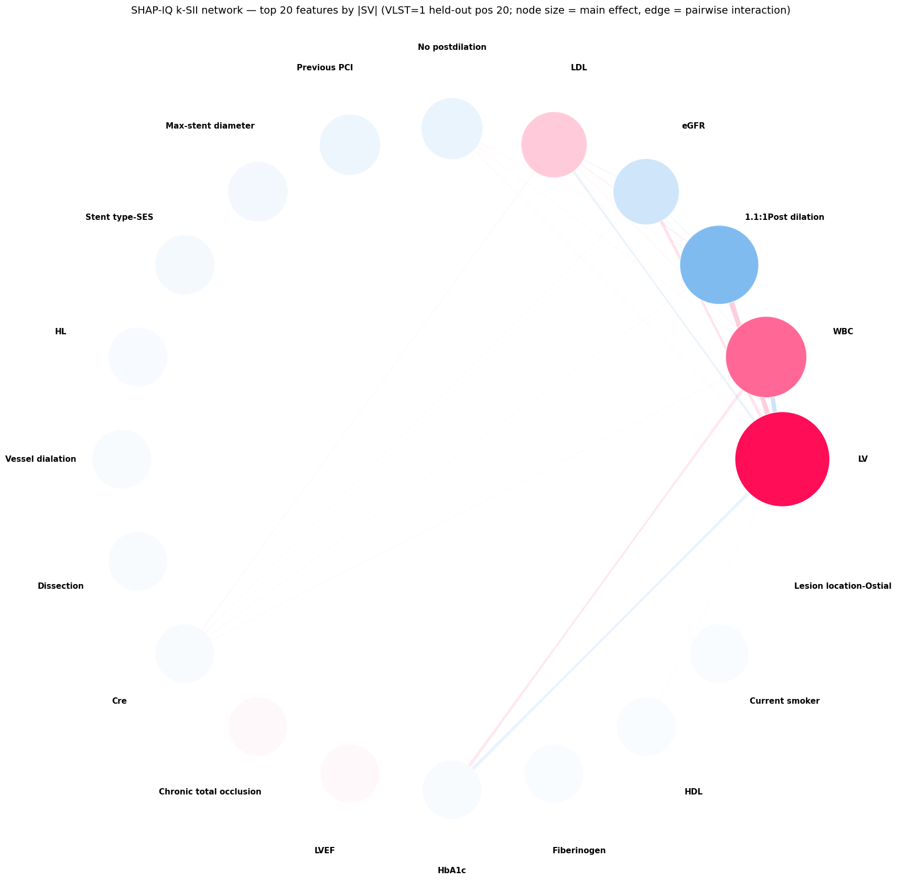

**Figure 10.** Force / additive layout for the same explained row (f(x) ≈ −3.09). Red segments (`LV`, `WBC`, `LDL`) raise the output from the base value; blue segments (post-dilation, eGFR, SES) lower it. This is the compact counterpart of the waterfall in Figure 7.

**Source file:** [paper_figures/paper_fig10_shapiq_force.png](paper_figures/paper_fig10_shapiq_force.png)

### Figure 11. SHAP-IQ k-SII network

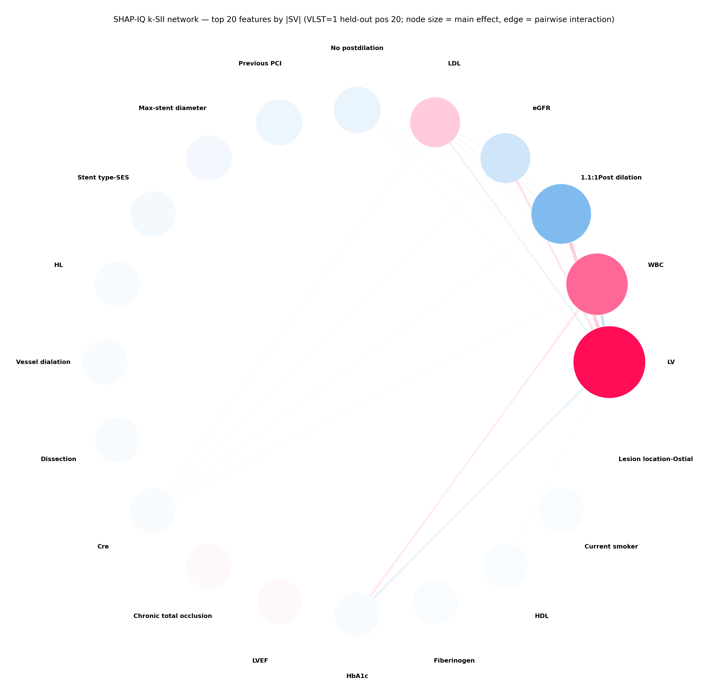

**Figure 11.** Native shapiq network for the same top-20 features by |SV|. Layout and the `LV` / `WBC` / post-dilation / `LDL` / `eGFR` core match Figure 8.

**Source file:** [paper_figures/paper_fig11_shapiq_network.png](paper_figures/paper_fig11_shapiq_network.png)

### Figure 12. SHAP-IQ k-SII UpSet plot

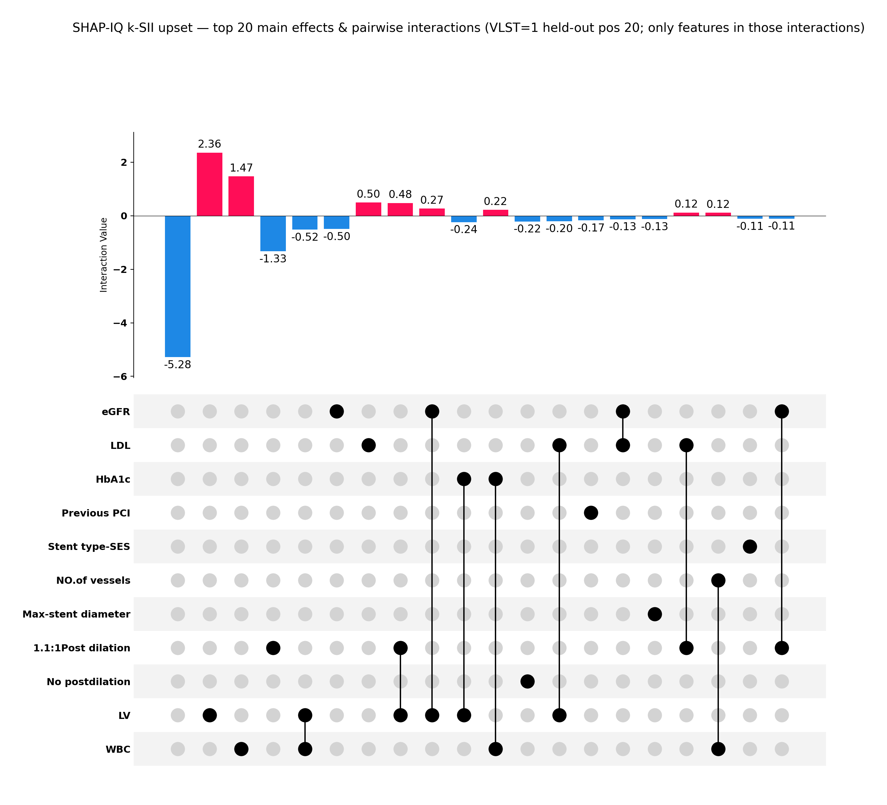

**Figure 12.** Native shapiq UpSet plot of top-20 main effects and pairwise interactions for the same row. Read it as a restyle of Figure 9, not as a new sample of patients.

**Source file:** [paper_figures/paper_fig12_shapiq_upset.png](paper_figures/paper_fig12_shapiq_upset.png)

---

## 7. Consensus ranking

Ranking uses a **Borda-style mean of normalized ranks** across mutual information, stability frequency, and mean(|SHAP|), with `n_methods` (out of 3) as a consensus count. The notebook reports the top 15 as *associations* with stent thrombosis under TabPFN — exploratory, not causal, on a ~2% prevalence cohort.

### Figure 13. Top 15 by consensus

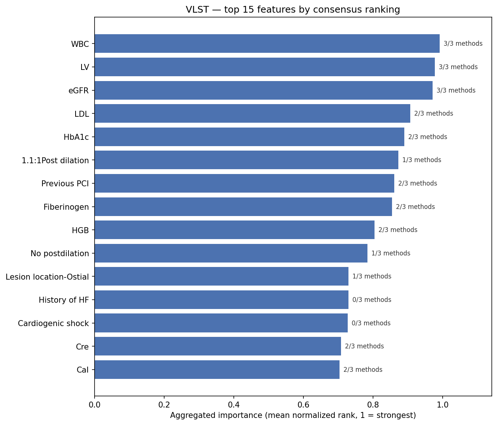

**Figure 13.** Aggregated importance (1 = strongest mean normalized rank). Annotations give how many of the three signals placed the feature in their top set. `LV`, `WBC`, `eGFR`, `Stent type-SES`, `No postdilation`, and `HbA1c` are 3/3. `1.1:1Post dilation` is high on MI and SHAP but only 2/10 in stability. `No.of stents per lesion` ranks 14th on the Borda score despite 0/3 top-set membership — a reminder that a middling rank on all three lists can still enter the top 15.

**Source file:** [paper_figures/paper_fig13_consensus_ranking.png](paper_figures/paper_fig13_consensus_ranking.png)

### Table 5. Consensus feature report

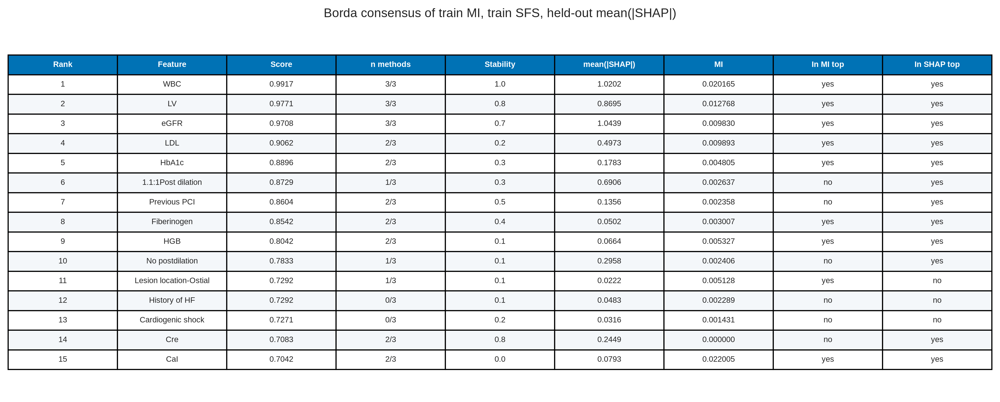

**Table 5.** The notebook’s `interpretability_feature_importance_report` top 15. `importance_score` is the Borda aggregate. `n_methods` counts how many of {MI top, stability, SHAP top} contributed. The six names with n_methods = 3 and high stability (`LV`, `WBC`, `eGFR`, `Stent type-SES`, plus `No postdilation` and `HbA1c`) are the most honest TabPFN associations in this run. `Cre` is stable (0.9) and in the SHAP top set but not the MI top set. `CaI` and `LDL` are strong on MI/SHAP but never selected by repeated SFS (frequency 0.0). **`Cre` and `No.of stents per lesion` show `mutual_info = 0.000000` because they sit outside the stored MI top-15 and were filled with zeros — those are not measured zeros.**

| Rank | Feature | Score | n methods | Stability | mean(\|SHAP\|) | MI | In MI top | In SHAP top |
| ---: | --- | ---: | ---: | ---: | ---: | ---: | --- | --- |
| 1 | LV | 0.9875 | 3/3 | 1.0 | 1.2368 | 0.015178 | yes | yes |
| 2 | WBC | 0.9750 | 3/3 | 0.9 | 1.1648 | 0.018360 | yes | yes |
| 3 | eGFR | 0.9667 | 3/3 | 1.0 | 0.4713 | 0.009931 | yes | yes |
| 4 | Stent type-SES | 0.9625 | 3/3 | 1.0 | 0.2296 | 0.011357 | yes | yes |
| 5 | No postdilation | 0.9208 | 3/3 | 0.7 | 0.1779 | 0.007535 | yes | yes |
| 6 | 1.1:1Post dilation | 0.9062 | 2/3 | 0.2 | 0.2392 | 0.007932 | yes | yes |
| 7 | HbA1c | 0.8979 | 3/3 | 0.5 | 0.1602 | 0.007439 | yes | yes |
| 8 | Visual thrombus | 0.7854 | 1/3 | 0.1 | 0.0384 | 0.003707 | yes | no |
| 9 | CaI | 0.7583 | 2/3 | 0.0 | 0.1779 | 0.019224 | yes | yes |
| 10 | LDL | 0.7542 | 2/3 | 0.0 | 0.6408 | 0.007693 | yes | yes |
| 11 | Cre | 0.7479 | 2/3 | 0.9 | 0.1539 | 0.000000 | no | yes |
| 12 | HGB | 0.6958 | 2/3 | 0.0 | 0.0760 | 0.004606 | yes | yes |
| 13 | Fiberinogen | 0.6875 | 2/3 | 0.0 | 0.0942 | 0.004040 | yes | yes |
| 14 | No.of stents per lesion | 0.6833 | 0/3 | 0.3 | 0.0424 | 0.000000 | no | no |
| 15 | TCL | 0.6792 | 1/3 | 0.0 | 0.0500 | 0.004257 | yes | no |

**Source files:** [paper_figures/paper_table5_consensus.png](paper_figures/paper_table5_consensus.png), [paper_figures/paper_table5_consensus.csv](paper_figures/paper_table5_consensus.csv)

---

## 8. File index

| ID | Type | File |
| --- | --- | --- |
| Table 0 | Table | [paper_table0_methods.png](paper_figures/paper_table0_methods.png) |
| Table 1 | Table | [paper_table1_mutual_info.png](paper_figures/paper_table1_mutual_info.png) |
| Table 2 | Table | [paper_table2_stability.png](paper_figures/paper_table2_stability.png) |
| Fig 1 | Figure | [paper_fig1_pdp_continuous.png](paper_figures/paper_fig1_pdp_continuous.png) |
| Fig 2 | Figure | [paper_fig2_pdp_binary.png](paper_figures/paper_fig2_pdp_binary.png) |
| Table 3 | Table | [paper_table3_pdp_binary.png](paper_figures/paper_table3_pdp_binary.png) |
| Fig 3 | Figure | [paper_fig3_shap_summary.png](paper_figures/paper_fig3_shap_summary.png) |
| Fig 4 | Figure | [paper_fig4_shap_scatter_age.png](paper_figures/paper_fig4_shap_scatter_age.png) |
| Fig 5 | Figure | [paper_fig5_shap_bar.png](paper_figures/paper_fig5_shap_bar.png) |
| Fig 6 | Figure | [paper_fig6_shap_beeswarm.png](paper_figures/paper_fig6_shap_beeswarm.png) |
| Fig 7 | Figure | [paper_fig7_shap_waterfall.png](paper_figures/paper_fig7_shap_waterfall.png) |
| Table 4 | Table | [paper_table4_shap_mean_abs.png](paper_figures/paper_table4_shap_mean_abs.png) |
| Fig 8 | Figure | [paper_fig8_ksii_network.png](paper_figures/paper_fig8_ksii_network.png) |
| Fig 9 | Figure | [paper_fig9_ksii_upset.png](paper_figures/paper_fig9_ksii_upset.png) |
| Fig 10 | Figure | [paper_fig10_shapiq_force.png](paper_figures/paper_fig10_shapiq_force.png) |
| Fig 11 | Figure | [paper_fig11_shapiq_network.png](paper_figures/paper_fig11_shapiq_network.png) |
| Fig 12 | Figure | [paper_fig12_shapiq_upset.png](paper_figures/paper_fig12_shapiq_upset.png) |
| Fig 13 | Figure | [paper_fig13_consensus_ranking.png](paper_figures/paper_fig13_consensus_ranking.png) |
| Table 5 | Table | [paper_table5_consensus.png](paper_figures/paper_table5_consensus.png) |

---

*Figures are the executed PNG outputs stored in `tabpfn_interpretability.ipynb`. Tables are reconstructed from those plots and the notebook’s printed CSVs. SHAP / SHAP-IQ used local TabPFN after the client thinking backend failed. MI and stability use the full cohort; SHAP uses 15 cases only. Rankings are for interpretation only and should not be reused as a leakage-free feature mask.*
