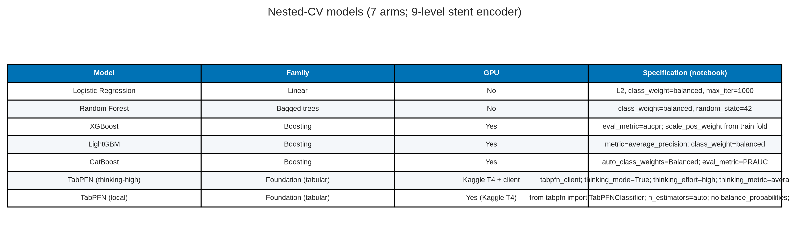
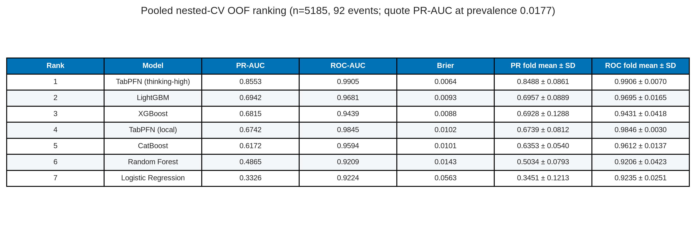
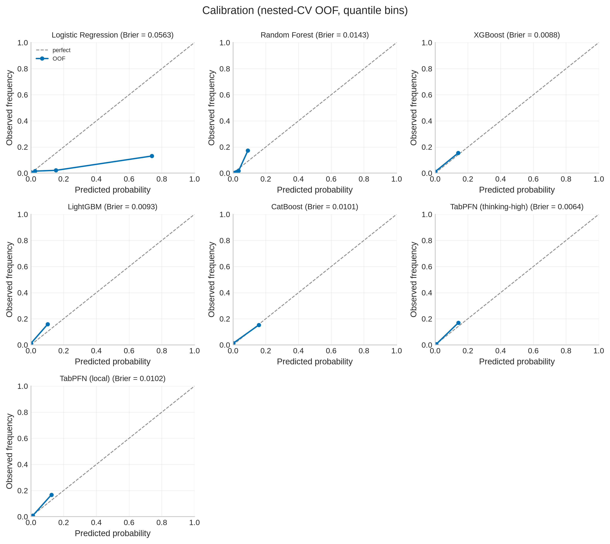
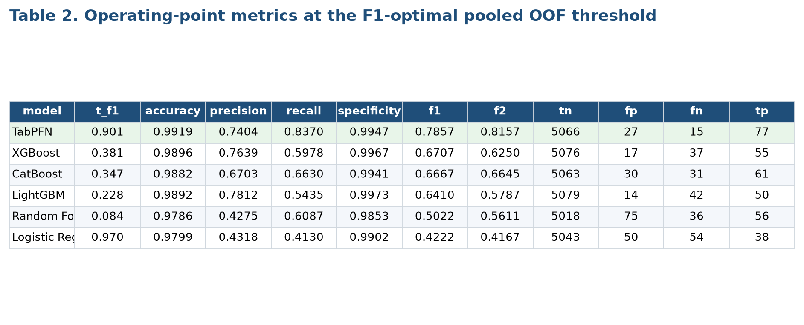
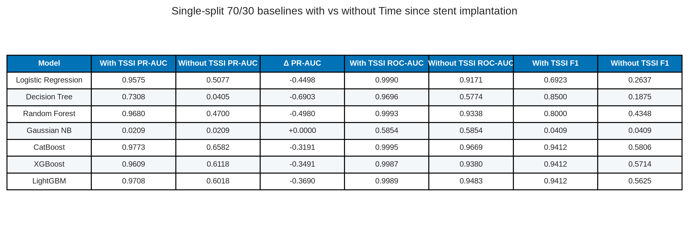
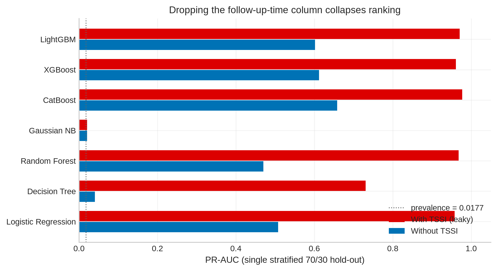
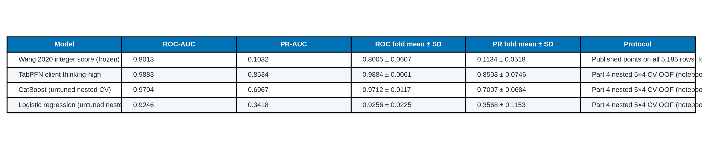
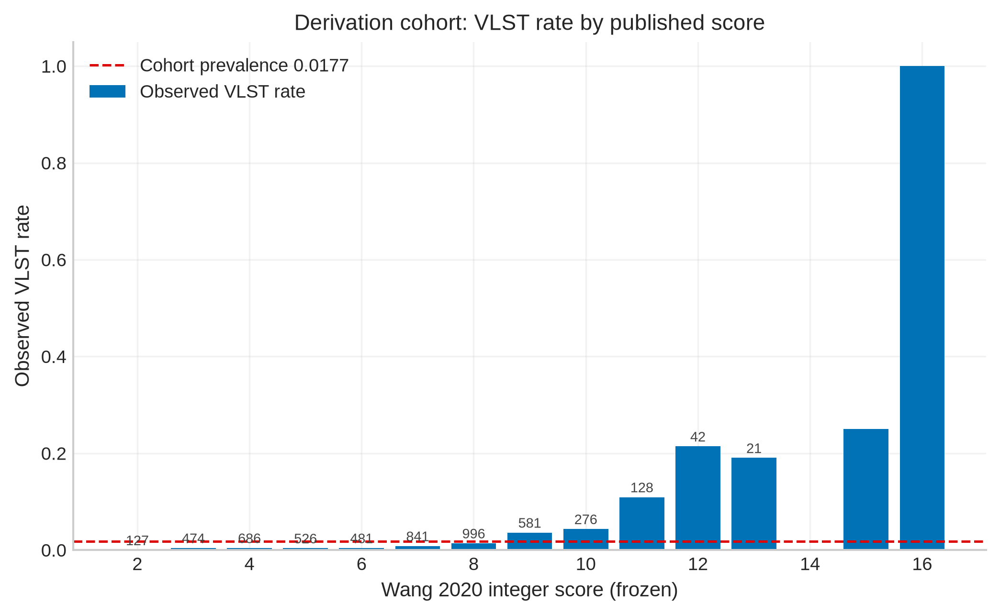

# Nested-CV baselines plus TabPFN — paper figures and tables

This document gathers publication-oriented figures and tables from the nested cross-validation comparison in [baseline_plus_tabpfn.ipynb](baseline_plus_tabpfn.ipynb).

**Cohort / protocol.** Full VLST cohort, n = 5,185 (92 events; prevalence = 0.0177). Target = `Stent thrombosis`. Identifiers (`NO.`, `Name`) and `Time since stent implantation` are dropped; the latter is treated as a time-at-risk / follow-up column, not a baseline covariate. **No Part 2 / Part 5 feature mask is applied.** Evaluation is nested stratified CV: **5 outer folds / 4 inner folds** (outer `random_state=42`). Ranking metrics (PR-AUC, ROC-AUC, Brier) use pooled outer out-of-fold probabilities and are threshold-independent. For precision / recall / F1 / F2, **quote the nested inner-fold thresholds** (Table 2): each outer fold’s cut is chosen on inner OOF scores and applied once to that fold’s unseen cases. Figure 3 / Table 3 additionally show a single pooled F1 cut; that cut is **optimistically biased** (methods note below). These nested-CV metrics are this pack’s only **prediction** results.

**Methods note — feature views are not the same.** The five classic models sit in an sklearn `Pipeline` with a `ColumnTransformer` that is **cloned and fitted inside every CV split**: numeric columns get `SimpleImputer(median)` + `StandardScaler`; `Stent type-SES` gets most-frequent imputation + `OneHotEncoder(handle_unknown="ignore")`. EDA found **no missing values**, so both imputers are inert. What actually changes the comparison is the rest of the transformer: classics see **scaled + one-hot input (~186 columns)** because the 106 raw brand strings become 106 dummy columns. TabPFN is **not** in that pipeline — it receives the **raw 81-column frame** and handles the brand column natively. That unequal input must be read into every “same protocol” claim.

**Methods note — GridSearch is a different notebook.** `baseline_without_tssi.ipynb` / `baseline_tssi_leakage.ipynb` tune hyperparameters on a single 70/30 split. Those `best_params_` are **not** imported here. Classics in this nested CV use library defaults plus class weighting. The inner loop tunes only the F1 **threshold**. A seventh arm, `TabPFN (local)` (`from tabpfn import TabPFNClassifier`, no thinking), is now in the notebook via `RUN_MODELS`; it is **not** in the stored six-model run below.

**Methods note — why the follow-up-time column is dropped.** Wang 2020 analysed this cohort with Cox regression, in which follow-up duration is the *time axis*, not a covariate. Recoded as a binary classifier, the same column (`Time since stent implantation`) mixes two definitions: time-to-event for the 92 VLST cases (min 380 days) and event-free follow-up length for the 5,093 non-events (min 1,241 days). A rule “time < 1,241 → event” has zero false positives among controls. `baseline_tssi_leakage.ipynb` (same 70/30 split, GridSearchCV) shows the resulting inflation; `baseline_without_tssi.ipynb` is the identical protocol with the column removed. Nested-CV results in this document use the without-TSSI feature view. See Supplementary Table S-TSSI.

**Models.** Logistic regression, random forest, XGBoost, LightGBM, CatBoost, and TabPFN (client, `thinking_mode=True`, `thinking_effort="high"`, `thinking_metric="average_precision"`). Average precision (PR-AUC) is the common ranking metric.

**Methods note — published clinical baseline.** Wang 2020’s 8-variable integer score is scored as a **frozen** comparator in [`wang_vlst_score.ipynb`](wang_vlst_score.ipynb) (published Table 2 points; weights not re-fit). It is not a seventh nested-CV arm. See Supplementary Table S-Wang.

**Methods note — two F1 operating points.** Ranking metrics do not use a threshold. Precision, recall, F1, and F2 do. The executed notebook prints both. **Honest nested** (Table 2): inner-CV OOF F1 threshold applied once to the unseen outer fold. **Optimistic pooled** (Figure 3, Table 3): one F1-maximising cut on the concatenated OOF labels that are then scored. Reusing the evaluation labels to pick the cut **optimistically biases** precision, recall, F1, and F2. Quote Table 2. TabPFN nested recall is **0.7174**; pooled-notebook recall is 0.7935; the exported PNG still shows a stale run (recall **0.8370** at t = 0.901). Do not quote 0.837.

**Methods note — imbalance, SMOTE, and tuning.** Prevalence is 1.77%. Class weighting (`class_weight="balanced"`, `scale_pos_weight`, `auto_class_weights="Balanced"`) is used for *prediction* so the 92 events are not ignored. SMOTE is **not** used: synthetic minority rows would change the prevalence that PR-AUC, PPV, Brier and calibration depend on. The five classic models use library defaults plus class weighting and a PR-AUC / PRAUC eval metric; they are **not** grid-searched. TabPFN uses client thinking (`effort=high`). That is an unequal search budget and is disclosed here. Inner nested CV selects only the F1 **threshold**, not hyperparameters. Wald tests / GLM standard errors are not used for these classifiers — they are not inferential logit models.

**Asset root:** [paper_figures/](paper_figures/) (also at `data/result/modeling_results/paper_figures/`)

> The **executed notebook** does print fold-wise mean ± SD, nested operating points, and the comparison table (see `.nbdump/code__modeling__rating__baseline_plus_tabpfn.txt`). Those CSVs were not committed under `data/result/`. The **exported PNGs** below are a mix: classic-model panels match the notebook; TabPFN Brier / confusion panels are from an earlier client run (stale). Quote the notebook for TabPFN.

---

## Contents

1. [Models (Table 0)](#1-models)
2. [Ranking curves (Figure 1, Table 1)](#2-ranking-curves)
3. [Calibration (Figure 2)](#3-calibration)
4. [F1 operating point (Table 2 nested; Figure 3 / Table 3 pooled)](#4-f1-operating-point)
5. [Supplementary: follow-up-time leakage](#5-supplementary-follow-up-time-leakage)
6. [Supplementary: Wang 2020 integer score](#6-supplementary-wang-2020-integer-score)
7. [File index](#7-file-index)

---

## 1. Models

### Table 0. Nested-CV models

**Table 0.** Six classifiers compared under the same nested-CV *split and threshold* protocol. They do **not** see the same columns: classics get the scaled one-hot matrix; TabPFN gets raw 81 features (see Methods note above). Tree boosters use average-precision / PR-AUC as their internal metric; TabPFN is the Prior Labs client with thinking mode aimed at average precision. Classics are not grid-searched.

| Model | Family | GPU | Specification (notebook) |
| --- | --- | --- | --- |
| Logistic Regression | Linear | No | L2, class_weight=balanced, max_iter=1000 |
| Random Forest | Bagged trees | No | class_weight=balanced, random_state=42 |
| XGBoost | Boosting | Yes | eval_metric=aucpr; scale_pos_weight from train fold |
| LightGBM | Boosting | Yes | metric=average_precision; class_weight=balanced |
| CatBoost | Boosting | Yes | auto_class_weights=Balanced; eval_metric=PRAUC |
| TabPFN | Foundation (tabular) | Client GPU | thinking=True, effort=high, metric=average_precision |

**Source files:** [paper_figures/paper_table0_models.png](paper_figures/paper_table0_models.png), [paper_figures/paper_table0_models.csv](paper_figures/paper_table0_models.csv)

---

## 2. Ranking curves

### Figure 1. Nested-CV out-of-fold PR and ROC curves

**Figure 1.** Precision–recall (left) and ROC (right) curves from pooled nested-CV out-of-fold probabilities. The dotted line on the PR panel is the positive-class prevalence (0.018). TabPFN dominates ranking (AP = 0.852, AUC = 0.990). Among classic models, CatBoost is next (AP = 0.697, AUC = 0.970), then LightGBM and XGBoost; random forest and logistic regression trail on PR-AUC even though all ROC-AUCs remain above 0.92. On a 1.8% prevalence outcome, PR-AUC is the more informative ranking metric.

**Source file:** [paper_figures/paper_fig1_pr_roc_curves.png](paper_figures/paper_fig1_pr_roc_curves.png)

### Table 1. Pooled OOF ranking metrics

**Table 1.** Threshold-independent metrics as in the **exported PNG** (reconstructed earlier from Figure 1 legends). **Do not quote the TabPFN Brier cell.** The executed notebook print is TabPFN Brier = **0.0060** (best of the six); CatBoost 0.0090. The PNG / table image still show the stale 0.0360 value. Ranking order on PR-AUC / ROC-AUC is unchanged (TabPFN first).

| Rank | Model | PR-AUC | ROC-AUC | Brier |
| ---: | --- | ---: | ---: | ---: |
| 1 | TabPFN | 0.852 | 0.990 | 0.0360 |
| 2 | CatBoost | 0.697 | 0.970 | 0.0090 |
| 3 | LightGBM | 0.677 | 0.961 | 0.0096 |
| 4 | XGBoost | 0.665 | 0.949 | 0.0093 |
| 5 | Random Forest | 0.456 | 0.931 | 0.0147 |
| 6 | Logistic Regression | 0.342 | 0.925 | 0.0543 |

**Source files:** [paper_figures/paper_table1_ranking.png](paper_figures/paper_table1_ranking.png), [paper_figures/paper_table1_ranking.csv](paper_figures/paper_table1_ranking.csv)

---

## 3. Calibration

### Figure 2. Reliability curves (quantile bins)

**Figure 2.** Calibration plots from nested-CV out-of-fold probabilities using quantile bins (appropriate because VLST is rare). The dashed diagonal is perfect calibration. Classic-model Brier scores in the panel titles match the notebook (CatBoost 0.0090, XGBoost 0.0093, LightGBM 0.0096, RF 0.0147, LR 0.0543). **The TabPFN panel title in this PNG is stale (0.0360).** The notebook print is **Brier = 0.0060**, the lowest of the six — calibration *supports* TabPFN on this run, it does not contradict ranking. Re-export the figure before publication.

**Source file:** [paper_figures/paper_fig2_calibration_curves.png](paper_figures/paper_fig2_calibration_curves.png)

---

## 4. F1 operating point

Two cuts exist in the executed notebook. **Quote Table 2 (honest nested).** Figure 3 and Table 3 are the pooled F1 cut: the same concatenated OOF labels are used to *pick* and *score* the threshold, so precision, recall, F1, and F2 are **optimistically biased**. Counts sum to n = 5,185 with 92 events.

TabPFN recall: nested **0.7174** (quote) | pooled notebook 0.7935 | stale PNG **0.8370**. Do not quote 0.837.

### Table 2. Honest nested-CV operating point (quote this)

**Table 2.** Per-fold inner-CV F1 thresholds applied once to the unseen outer fold (notebook print, D4). TabPFN mean threshold 0.297 ± 0.053, precision 0.8354, recall **0.7174**, F1 0.7719, TN/FP/FN/TP = 5080/13/26/66. This is the protocol in the header. There is no exported PNG for this table; the Figure 3 / `paper_table2_f1_operating_point.png` images are the *pooled* cut below.

| Model | Threshold (mean ± SD) | Accuracy | Precision | Recall | Specificity | F1 | F2 | TN | FP | FN | TP |
| --- | --- | ---: | ---: | ---: | ---: | ---: | ---: | ---: | ---: | ---: | ---: |
| TabPFN | 0.297 ± 0.053 | 0.9925 | 0.8354 | **0.7174** | 0.9974 | 0.7719 | 0.7383 | 5080 | 13 | 26 | 66 |
| CatBoost | 0.317 ± 0.068 | 0.9867 | 0.6211 | 0.6413 | 0.9929 | 0.6310 | 0.6371 | 5057 | 36 | 33 | 59 |
| XGBoost | 0.237 ± 0.072 | 0.9882 | 0.6782 | 0.6413 | 0.9945 | 0.6592 | 0.6484 | 5065 | 28 | 33 | 59 |
| LightGBM | 0.099 ± 0.048 | 0.9863 | 0.6154 | 0.6087 | 0.9931 | 0.6120 | 0.6100 | 5058 | 35 | 36 | 56 |
| Random Forest | 0.114 ± 0.009 | 0.9834 | 0.5357 | 0.4891 | 0.9923 | 0.5114 | 0.4978 | 5054 | 39 | 47 | 45 |
| Logistic Regression | 0.953 ± 0.035 | 0.9757 | 0.3365 | 0.3804 | 0.9865 | 0.3571 | 0.3708 | 5024 | 69 | 57 | 35 |

**Source.** Executed `baseline_plus_tabpfn.ipynb` print (`.nbdump/code__modeling__rating__baseline_plus_tabpfn.txt` L1010–1026). Ranking PR-AUC / ROC-AUC in this print match Table 1’s notebook values and are threshold-independent.

### Figure 3. Confusion matrices at the pooled F1 threshold (optimistic; TabPFN panel stale)

**Figure 3.** 2×2 counts at the F1-maximising **pooled** OOF threshold (`t_F1` in each panel title). This is **not** Table 2. The cut is chosen on the same labels being scored, so recall is inflated relative to the nested point (TabPFN 0.7935 pooled-notebook vs **0.7174** nested). Classic-model panels match the notebook pooled cut. The **TabPFN panel is stale** (shown: t = 0.901, TP = 77, FN = 15, recall 0.837). Notebook pooled point: t = 0.173, TP = 73, FN = 19. Do not quote 0.837. LightGBM and XGBoost remain more conservative on false positives in this pooled figure (FP = 14 and 17). Logistic regression needs a very high threshold (0.970) and still misses 54 events. Random forest’s F1 point sits at a low probability (0.084), producing the most false positives (75). Accuracy is uniformly high because negatives dominate and is not a useful ranking criterion here.

**Source file:** [paper_figures/paper_fig3_confusion_matrices.png](paper_figures/paper_fig3_confusion_matrices.png)

### Table 3. Optimistic pooled F1 metrics (do not quote instead of Table 2)

**Table 3.** Same pooled F1 cut as Figure 3. Markdown rows are the **notebook** pooled print (D4), not the stale PNG. TabPFN: t = 0.173, precision 0.7766, recall 0.7935, F1 0.7849, TN/FP/FN/TP = 5072/21/19/73. The PNG / CSV still show the superseded TabPFN row (t = 0.901, recall 0.8370, 5066/27/15/77). Classic-model rows match the notebook. Precision / recall / F1 / F2 here are **optimistically biased** versus Table 2.

| Model | t_F1 | Accuracy | Precision | Recall | Specificity | F1 | F2 | TN | FP | FN | TP |
| --- | ---: | ---: | ---: | ---: | ---: | ---: | ---: | ---: | ---: | ---: | ---: |
| TabPFN | 0.173 | 0.9923 | 0.7766 | 0.7935 | 0.9959 | 0.7849 | 0.7900 | 5072 | 21 | 19 | 73 |
| XGBoost | 0.381 | 0.9896 | 0.7639 | 0.5978 | 0.9967 | 0.6707 | 0.6250 | 5076 | 17 | 37 | 55 |
| CatBoost | 0.347 | 0.9882 | 0.6703 | 0.6630 | 0.9941 | 0.6667 | 0.6645 | 5063 | 30 | 31 | 61 |
| LightGBM | 0.228 | 0.9892 | 0.7812 | 0.5435 | 0.9973 | 0.6410 | 0.5787 | 5079 | 14 | 42 | 50 |
| Random Forest | 0.084 | 0.9786 | 0.4275 | 0.6087 | 0.9853 | 0.5022 | 0.5611 | 5018 | 75 | 36 | 56 |
| Logistic Regression | 0.970 | 0.9799 | 0.4318 | 0.4130 | 0.9902 | 0.4222 | 0.4167 | 5043 | 50 | 54 | 38 |

**Source files:** [paper_figures/paper_table2_f1_operating_point.png](paper_figures/paper_table2_f1_operating_point.png) (stale TabPFN row), [paper_figures/paper_table2_f1_operating_point.csv](paper_figures/paper_table2_f1_operating_point.csv), notebook L992–1008. Compact PNG [paper_table3_confusion_counts.png](paper_figures/paper_table3_confusion_counts.png) is the same pooled cut and is likewise stale for TabPFN.

---

## 5. Supplementary: follow-up-time leakage

These numbers are **not** the nested-CV headline. They come from the two single-split (70/30, GridSearchCV) notebooks that diagnosed why `Time since stent implantation` cannot enter a classifier. Nothing was re-run; values are the stored test-set metrics.

**What the column is.** For VLST = 1 it is time from index PCI to angiographic thrombosis (min 380 days, Wang median 697). For VLST = 0 it is completed event-free follow-up (min 1,241, max 1,605 days; cohort median follow-up 1,502). That is binary-ified survival time, not a baseline covariate.

### Supplementary Table S-TSSI. Single-split metrics with vs without the column

**Table S-TSSI.** Same stratified 70/30 split and tuning protocol. Logistic regression PR-AUC falls from 0.958 to 0.508 when the column is dropped; CatBoost from 0.977 to 0.658. Gaussian NB is unaffected (it never used the column). Nested-CV TabPFN in the main tables is the *without-TSSI* protocol.

**Source files:** [paper_figures/paper_table_s_tssi_leakage.png](paper_figures/paper_table_s_tssi_leakage.png), [paper_figures/paper_table_s_tssi_leakage.csv](paper_figures/paper_table_s_tssi_leakage.csv)

### Supplementary Figure S-TSSI. PR-AUC collapse

**Figure S-TSSI.** PR-AUC on the 1,556-row hold-out. The dotted line is class prevalence (0.0177). The leaky column produces near-perfect ranking; removing it returns models to a rare-event scale.

**Source file:** [paper_figures/paper_fig_s_tssi_pr_auc.png](paper_figures/paper_fig_s_tssi_pr_auc.png)

Notebooks: `baseline_tssi_leakage.ipynb`, `baseline_without_tssi.ipynb`. Table rebuilt by [`rebuild_tssi_leakage_table.py`](rebuild_tssi_leakage_table.py).

---

## 6. Supplementary: Wang 2020 integer score

These numbers are **not** a nested-CV fit. They come from [`wang_vlst_score.ipynb`](wang_vlst_score.ipynb), which scores Wang 2020 Table 2 **integer points** on all 5,185 rows with the published weights frozen. The same five outer folds as Part 4 (`StratifiedKFold(5, shuffle=True, random_state=42)`) are used only to evaluate that frozen score.

**Headline.** Full-cohort ROC-AUC **0.8013** (Wang published derivation c-statistic 0.80, 95% CI 0.75–0.85) and PR-AUC **0.1032**. Fold-mean ROC-AUC **0.8005 ± 0.0607**, PR-AUC **0.1134 ± 0.0518**. Nested-CV TabPFN (executed Part 4 notebook) is ROC-AUC **0.9883** / PR-AUC **0.8534**. This is the missing clinical comparator: TabPFN vs the score already published on these patients, not only vs untuned sklearn defaults. It is **not** external validation (Wang’s c = 0.82 was Shantou; that file is still absent).

**Encoding (do not photocopy Wang Table 1).** The SES point is on **`PES`** (Wang Table 1 SES rates 82.61% / 68.76% match `PES`, not the 106-level `Stent type-SES` strings). The 4 post-dilation points go to **`No postdilation` = 1** (78/92 events). Using Wang Table 1’s 14 VLST “No post-dilation” cases (`1.1:1Post dilation` = 1) as the 4-point group yields ROC-AUC **0.5084**. Table 2’s β = 1.93 / 4 points vs printed HR 0.145 is the same polarity clash; this notebook follows the points plus the CSV risk direction.

**Risk bins.** Low ≤7: n = 3,135 (60.5%), rate 0.51%. Intermediate 8–9: n = 1,577 (30.4%), rate 2.22%. High ≥10: n = 473 (9.1%), rate 8.67%. Wang’s published n’s 3,135 / 1,837 / 473 sum to 5,445 ≠ 5,185; low and high n match this file exactly; the intermediate remainder here is 1,577 with the same 2.2% rate.

The Cox linear predictor, Dangas decision-curve analysis, and Shantou scoring are **not** in this notebook.

### Supplementary Table S-Wang-bins. Observed VLST rate by published risk category

**Table S-Wang-bins.** Frozen integer score, cut at Wang’s published thresholds (≤7 / 8–9 / ≥10). Observed rates match Wang’s 0.5% / 2.2% / 8.7%. The intermediate *count* does not: Wang printed n = 1,837 for that bin.

**Source files:** [paper_figures/paper_table_s_wang_score_bins.png](paper_figures/paper_table_s_wang_score_bins.png), [paper_figures/paper_table_s_wang_score_bins.csv](paper_figures/paper_table_s_wang_score_bins.csv)

| Risk category | n | % of cohort | VLST events | Observed rate | Wang published n | Wang published rate |
| --- | ---: | ---: | ---: | ---: | ---: | ---: |
| low (≤7) | 3135 | 60.5 | 16 | 0.0051 | 3135 | 0.005 |
| intermediate (8–9) | 1577 | 30.4 | 35 | 0.0222 | 1837 | 0.022 |
| high (≥10) | 473 | 9.1 | 41 | 0.0867 | 473 | 0.087 |

### Supplementary Table S-Wang. Frozen score vs nested-CV models

**Table S-Wang.** Wang integer score: full-cohort ranking plus the same five outer folds, score not refit. TabPFN / CatBoost / logistic regression: nested 5×4 CV out-of-fold from the executed Part 4 notebook (D4). PR-AUC is the informative metric at 1.77% prevalence.

**Source files:** [paper_figures/paper_table_s_wang_vs_ml.png](paper_figures/paper_table_s_wang_vs_ml.png), [paper_figures/paper_table_s_wang_vs_ml.csv](paper_figures/paper_table_s_wang_vs_ml.csv)

| Model | ROC-AUC | PR-AUC | ROC fold mean ± SD | PR fold mean ± SD | Protocol |
| --- | ---: | ---: | --- | --- | --- |
| Wang 2020 integer score (frozen) | 0.8013 | 0.1032 | 0.8005 ± 0.0607 | 0.1134 ± 0.0518 | Published points; folds evaluate only |
| TabPFN client thinking-high | 0.9883 | 0.8534 | 0.9884 ± 0.0061 | 0.8503 ± 0.0746 | Part 4 nested 5×4 CV OOF |
| CatBoost (untuned nested CV) | 0.9704 | 0.6967 | 0.9712 ± 0.0117 | 0.7007 ± 0.0684 | Part 4 nested 5×4 CV OOF |
| Logistic regression (untuned nested CV) | 0.9246 | 0.3418 | 0.9256 ± 0.0225 | 0.3568 ± 0.1153 | Part 4 nested 5×4 CV OOF |

Fold-level frozen-score metrics: [paper_table_s_wang_score_folds.csv](paper_figures/paper_table_s_wang_score_folds.csv).

### Supplementary Figure S-Wang. Observed VLST rate by integer score

**Figure S-Wang.** Observed VLST rate at each integer total. Bar labels are cell n (shown when n ≥ 20). The dashed line is cohort prevalence (0.0177). The score is a ranker, not a calibrated probability.

**Source file:** [paper_figures/paper_fig_s_wang_score_rate.png](paper_figures/paper_fig_s_wang_score_rate.png)

Notebook: [`wang_vlst_score.ipynb`](wang_vlst_score.ipynb).

---

## 7. File index

| ID | Type | File |
| --- | --- | --- |
| Table 0 | Table | [paper_table0_models.png](paper_figures/paper_table0_models.png) |
| Fig 1 | Figure | [paper_fig1_pr_roc_curves.png](paper_figures/paper_fig1_pr_roc_curves.png) |
| Table 1 | Table | [paper_table1_ranking.png](paper_figures/paper_table1_ranking.png) |
| Fig 2 | Figure | [paper_fig2_calibration_curves.png](paper_figures/paper_fig2_calibration_curves.png) |
| Fig 3 | Figure | [paper_fig3_confusion_matrices.png](paper_figures/paper_fig3_confusion_matrices.png) |
| Table 2 | Table | Honest nested operating point (notebook print; no PNG) |
| Table 3 | Table | [paper_table2_f1_operating_point.png](paper_figures/paper_table2_f1_operating_point.png) (pooled; TabPFN row stale) |
| Table S-TSSI | Table | [paper_table_s_tssi_leakage.png](paper_figures/paper_table_s_tssi_leakage.png) |
| Fig S-TSSI | Figure | [paper_fig_s_tssi_pr_auc.png](paper_figures/paper_fig_s_tssi_pr_auc.png) |
| Table S-Wang-bins | Table | [paper_table_s_wang_score_bins.png](paper_figures/paper_table_s_wang_score_bins.png) |
| Table S-Wang | Table | [paper_table_s_wang_vs_ml.png](paper_figures/paper_table_s_wang_vs_ml.png) |
| Fig S-Wang | Figure | [paper_fig_s_wang_score_rate.png](paper_figures/paper_fig_s_wang_score_rate.png) |

---

*Figures 1–3 are the executed outputs stored in `baseline_plus_tabpfn.ipynb` (Kaggle nested-CV run). Table 1 Brier / Figure 2–3 TabPFN panels remain stale versus the notebook. Table 2 is the honest nested operating point from the notebook print; Table 3 markdown uses the notebook pooled F1 cut. Fold-wise mean ± SD and nested inner-threshold operating points **were** printed in the notebook; the CSVs under `/kaggle/working/` were not committed.*
