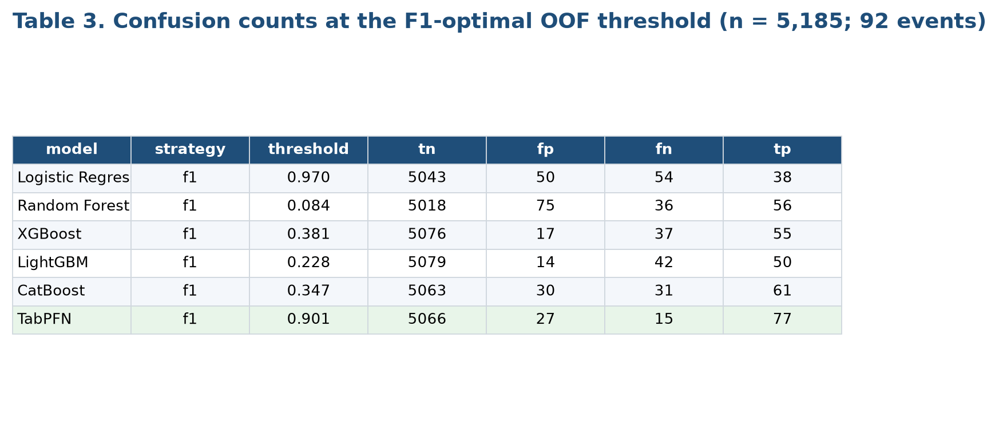

# Nested-CV baselines plus TabPFN — paper figures and tables

This document gathers publication-oriented figures and tables from the nested cross-validation comparison in [baseline_plus_tabpfn.ipynb](baseline_plus_tabpfn.ipynb).

**Cohort / protocol.** Full VLST cohort, n = 5,185 (92 events; prevalence = 0.0177). Target = `Stent thrombosis`. Identifiers (`NO.`, `Name`) and `Time since stent implantation` are dropped; the latter is treated as a time-at-risk / follow-up column, not a baseline predictor. Numeric columns are median-imputed and scaled; categoricals are most-frequent-imputed and one-hot encoded, with the preprocessor **cloned and fitted inside every CV split**. Evaluation is nested stratified CV: **5 outer folds / 4 inner folds** (outer `random_state=42`). Inner out-of-fold scores choose an F1 threshold that is then applied once to that outer fold’s unseen cases. Ranking metrics (PR-AUC, ROC-AUC, Brier) use pooled outer out-of-fold probabilities and are threshold-independent.

**Models.** Logistic regression, random forest, XGBoost, LightGBM, CatBoost, and TabPFN (client, `thinking_mode=True`, `thinking_effort="high"`, `thinking_metric="average_precision"`). Average precision (PR-AUC) is the common ranking metric.

**Asset root:** [paper_figures/](paper_figures/) (also at `data/result/modeling_results/paper_figures/`)

> The notebook’s comparison-table and threshold-sweep cells were not executed in the stored run. Ranking numbers below are taken from the PR/ROC legend and printed Brier scores; F1 operating-point counts are read from the confusion-matrix panel. Fold-wise mean ± SD and the best-model threshold-sweep figure are therefore not available from this notebook snapshot.

---

## Contents

1. [Models (Table 0)](#1-models)
2. [Ranking curves (Figure 1, Table 1)](#2-ranking-curves)
3. [Calibration (Figure 2)](#3-calibration)
4. [F1 operating point (Figure 3, Tables 2–3)](#4-f1-operating-point)
5. [File index](#5-file-index)

---

## 1. Models

### Table 0. Nested-CV models

**Table 0.** Six classifiers compared under the same nested-CV protocol. Tree boosters use average-precision / PR-AUC as their internal metric; TabPFN is the Prior Labs client with thinking mode aimed at average precision.

| Model | Family | GPU | Specification (notebook) |
| --- | --- | --- | --- |
| Logistic Regression | Linear | No | L2, class_weight=balanced, max_iter=1000 |
| Random Forest | Bagged trees | No | class_weight=balanced, random_state=42 |
| XGBoost | Boosting | Yes | eval_metric=aucpr; scale_pos_weight from train fold |
| LightGBM | Boosting | Yes | metric=average_precision; class_weight=balanced |
| CatBoost | Boosting | Yes | auto_class_weights=Balanced; eval_metric=PRAUC |
| TabPFN | Foundation (tabular) | Client GPU | thinking=True, effort=high, metric=average_precision |

**Source files:** [paper_figures/paper_table0_models.png](paper_figures/paper_table0_models.png), [paper_figures/paper_table0_models.csv](paper_figures/paper_table0_models.csv)

---

## 2. Ranking curves

### Figure 1. Nested-CV out-of-fold PR and ROC curves

**Figure 1.** Precision–recall (left) and ROC (right) curves from pooled nested-CV out-of-fold probabilities. The dotted line on the PR panel is the positive-class prevalence (0.018). TabPFN dominates ranking (AP = 0.852, AUC = 0.990). Among classic models, CatBoost is next (AP = 0.697, AUC = 0.970), then LightGBM and XGBoost; random forest and logistic regression trail on PR-AUC even though all ROC-AUCs remain above 0.92. On a 1.8% prevalence outcome, PR-AUC is the more informative ranking metric.

**Source file:** [paper_figures/paper_fig1_pr_roc_curves.png](paper_figures/paper_fig1_pr_roc_curves.png)

### Table 1. Pooled OOF ranking metrics

**Table 1.** Threshold-independent metrics reconstructed from Figure 1 legends (PR-AUC, ROC-AUC) and the calibration cell’s printed Brier scores (lower is better). TabPFN is first on both ranking scores. CatBoost has the lowest Brier score (0.0090); TabPFN’s Brier (0.0360) is worse than the tree ensembles, consistent with over-confident probabilities on Figure 2.

| Rank | Model | PR-AUC | ROC-AUC | Brier |
| ---: | --- | ---: | ---: | ---: |
| 1 | TabPFN | 0.852 | 0.990 | 0.0360 |
| 2 | CatBoost | 0.697 | 0.970 | 0.0090 |
| 3 | LightGBM | 0.677 | 0.961 | 0.0096 |
| 4 | XGBoost | 0.665 | 0.949 | 0.0093 |
| 5 | Random Forest | 0.456 | 0.931 | 0.0147 |
| 6 | Logistic Regression | 0.342 | 0.925 | 0.0543 |

**Source files:** [paper_figures/paper_table1_ranking.png](paper_figures/paper_table1_ranking.png), [paper_figures/paper_table1_ranking.csv](paper_figures/paper_table1_ranking.csv)

---

## 3. Calibration

### Figure 2. Reliability curves (quantile bins)

**Figure 2.** Calibration plots from nested-CV out-of-fold probabilities using quantile bins (appropriate because VLST is rare). The dashed diagonal is perfect calibration. CatBoost (Brier = 0.0090), XGBoost (0.0093), and LightGBM (0.0096) track the diagonal in the low-probability region where almost all mass sits. Random forest is also close to the diagonal but only up to predicted probabilities around 0.1. Logistic regression (Brier = 0.0543) and TabPFN (0.0360) overestimate event probability: predicted values extend toward 0.6 while observed frequencies stay much lower. Ranking skill (Figure 1) and probability calibration therefore come apart for TabPFN on this cohort — it orders cases well but is not a well-calibrated risk engine without extra calibration.

**Source file:** [paper_figures/paper_fig2_calibration_curves.png](paper_figures/paper_fig2_calibration_curves.png)

---

## 4. F1 operating point

Confusion matrices use each model’s **F1-optimal threshold on the pooled OOF scores** (a single operating point for the comparison table, not the nested inner-fold thresholds). Counts sum to n = 5,185 with 92 events.

### Figure 3. Confusion matrices at the F1-optimal OOF threshold

**Figure 3.** 2×2 counts at the F1-maximising pooled OOF threshold (`t_F1` in each panel title). TabPFN catches the most events (TP = 77, FN = 15) at t = 0.901. LightGBM and XGBoost are more conservative on false positives (FP = 14 and 17) at the cost of more missed events. Logistic regression needs a very high threshold (0.970) and still misses 54 events. Random forest’s F1 point sits at a low probability (0.084), producing the most false positives (75).

**Source file:** [paper_figures/paper_fig3_confusion_matrices.png](paper_figures/paper_fig3_confusion_matrices.png)

### Table 2. Metrics at the F1-optimal OOF threshold

**Table 2.** Accuracy, precision, recall, specificity, F1, and F2 computed from Figure 3 counts. Rows are ordered by F1. TabPFN has the highest F1 (0.786) and F2 (0.816) with recall 0.837 at precision 0.740. XGBoost is second on F1 (0.671) via higher precision (0.764) and lower recall (0.598). Accuracy is uniformly high because negatives dominate and is not a useful ranking criterion here.

| Model | t_F1 | Accuracy | Precision | Recall | Specificity | F1 | F2 | TN | FP | FN | TP |
| --- | ---: | ---: | ---: | ---: | ---: | ---: | ---: | ---: | ---: | ---: | ---: |
| TabPFN | 0.901 | 0.9919 | 0.7404 | 0.8370 | 0.9947 | 0.7857 | 0.8157 | 5066 | 27 | 15 | 77 |
| XGBoost | 0.381 | 0.9896 | 0.7639 | 0.5978 | 0.9967 | 0.6707 | 0.6250 | 5076 | 17 | 37 | 55 |
| CatBoost | 0.347 | 0.9882 | 0.6703 | 0.6630 | 0.9941 | 0.6667 | 0.6645 | 5063 | 30 | 31 | 61 |
| LightGBM | 0.228 | 0.9892 | 0.7812 | 0.5435 | 0.9973 | 0.6410 | 0.5787 | 5079 | 14 | 42 | 50 |
| Random Forest | 0.084 | 0.9786 | 0.4275 | 0.6087 | 0.9853 | 0.5022 | 0.5611 | 5018 | 75 | 36 | 56 |
| Logistic Regression | 0.970 | 0.9799 | 0.4318 | 0.4130 | 0.9902 | 0.4222 | 0.4167 | 5043 | 50 | 54 | 38 |

**Source files:** [paper_figures/paper_table2_f1_operating_point.png](paper_figures/paper_table2_f1_operating_point.png), [paper_figures/paper_table2_f1_operating_point.csv](paper_figures/paper_table2_f1_operating_point.csv)

### Table 3. Confusion counts

**Table 3.** The same F1 operating-point counts in compact form (strategy = `f1`).

| Model | Strategy | Threshold | TN | FP | FN | TP |
| --- | --- | ---: | ---: | ---: | ---: | ---: |
| Logistic Regression | f1 | 0.970 | 5043 | 50 | 54 | 38 |
| Random Forest | f1 | 0.084 | 5018 | 75 | 36 | 56 |
| XGBoost | f1 | 0.381 | 5076 | 17 | 37 | 55 |
| LightGBM | f1 | 0.228 | 5079 | 14 | 42 | 50 |
| CatBoost | f1 | 0.347 | 5063 | 30 | 31 | 61 |
| TabPFN | f1 | 0.901 | 5066 | 27 | 15 | 77 |

**Source files:** [paper_figures/paper_table3_confusion_counts.png](paper_figures/paper_table3_confusion_counts.png), [paper_figures/paper_table3_confusion_counts.csv](paper_figures/paper_table3_confusion_counts.csv)

---

## 5. File index

| ID | Type | File |
| --- | --- | --- |
| Table 0 | Table | [paper_table0_models.png](paper_figures/paper_table0_models.png) |
| Fig 1 | Figure | [paper_fig1_pr_roc_curves.png](paper_figures/paper_fig1_pr_roc_curves.png) |
| Table 1 | Table | [paper_table1_ranking.png](paper_figures/paper_table1_ranking.png) |
| Fig 2 | Figure | [paper_fig2_calibration_curves.png](paper_figures/paper_fig2_calibration_curves.png) |
| Fig 3 | Figure | [paper_fig3_confusion_matrices.png](paper_figures/paper_fig3_confusion_matrices.png) |
| Table 2 | Table | [paper_table2_f1_operating_point.png](paper_figures/paper_table2_f1_operating_point.png) |
| Table 3 | Table | [paper_table3_confusion_counts.png](paper_figures/paper_table3_confusion_counts.png) |

---

*Figures 1–3 are the executed outputs stored in `baseline_plus_tabpfn.ipynb` (Kaggle nested-CV run). Tables 1–3 are reconstructed from those panels and printed Brier scores. The notebook cells that would have written `model_comparison.csv`, fold-wise mean ± SD, nested inner-threshold operating points, and `best_model_threshold_fpfn_panel.png` were not run in this snapshot.*
