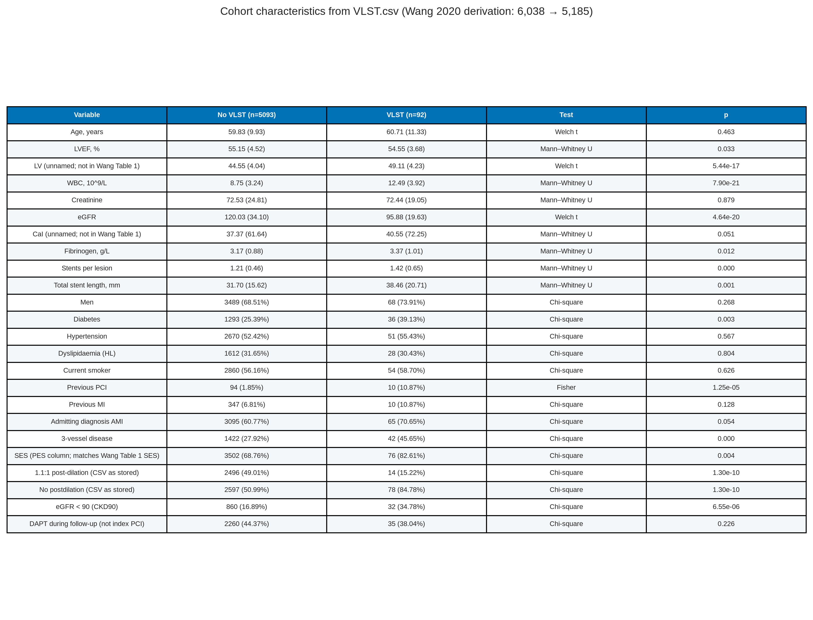

# Title, authors, abstract, keywords

Numerical source of truth: `paper/frozen_results.yaml`. Trace tags: `docs/paper_evidence_map.md` (W1–W5, B3, B11, §4.6, §5.8–5.9, §7.3). Live nested key: `nested_cv_v35_antileakage_on`. Do not quote excluded unlabeled nested PR-AUC 0.9771 / 0.9635, Version 4 0.8553 / 0.6742, or evidence-map §7.1 historical rows.

---

## Title

VLST after ACS-PCI — association, nested-CV prediction, and TabPFN attribution on the Wang 2020 derivation cohort


---


## Authors


---


## Structured abstract


### Background

Very late stent thrombosis (VLST) is Academic Research Consortium 2007 definite stent thrombosis more than one year after percutaneous coronary intervention (PCI). It is rare (92 events among 5,185 patients in this file; prevalence 0.0177) and analysed here as a binary label on Wang 2020’s derivation cohort. Wang published an 8-variable Cox integer score on these same rows (published derivation c-statistic 0.80 [0.75, 0.85]; Shantou external c-statistic 0.82 for **Wang’s score**, file not in this repository). Classic tabular classifiers on this file are easy to inflate if follow-up time remains in the matrix. Tabular prior-fitted networks (TabPFN) offer in-context learning on mixed-type tables without a per-dataset hyperparameter grid; this paper compares them with class-weighted library-default tree and linear models under a shared nested-CV protocol after anti-leakage drops. 

### Methods

Retrospective derivation-cohort analysis of `VLST.csv` (The First Hospital of Jilin University; ACS, age ≥18 years, PCI 1 January 2014 – 1 June 2015; n = 5185). Outcome = binary `Stent thrombosis`. Nested evaluation implements ALL LEAKS OFF: drop identifiers, TSSI (mixed time-to-event vs completed follow-up), and WBC (recording-precision / batch marker); quantize named labs (`Cre`/`CaI`/`Fiberinogen`/`Fast-Glu`) **before** splitting; fit the stent-brand codebook on the **train fold only**; no SMOTE; clone scaler/OHE inside splits. Prediction uses stratified nested 5 outer × 4 inner CV (seed 42); the inner loop tunes the F1 threshold only. Classics (logistic regression, random forest, XGBoost, LightGBM, CatBoost) use library defaults plus class weighting; GridSearchCV winners from 70/30 leakage twins (five flags inverted together) are **not** imported. Four TabPFN arms: local v3 / v3.5 (`tabpfn==9.0.0`) and hosted thinking-high v3 / v3.5 (`tabpfn-client==0.6.0`; effort high; metric average_precision). Primary ranking metric is PR-AUC at prevalence 0.0177. Uncertainty on pooled out-of-fold scores: stratified patient-level bootstrap (`n_boot=2000`, seed 42). Attribution uses two notebooks: 8-seed forward SFS, mutual information, and PDP on train; held-out SHAP / *k*-SII (same OFF cleaning). 

### Results

Among nine nested-CV arms (anti-leakage ON), TabPFN thinking v3.5 had PR-AUC 0.9212 [0.8785, 0.9613], ROC-AUC 0.9963, Brier 0.0047; nested recall (sensitivity) 0.8370, precision 0.8851, F1 0.8603 (5083/10/15/77). Local TabPFN v3.5 had PR-AUC 0.8957 [0.8446, 0.9426], Brier 0.0048; nested recall 0.7826, F1 0.8229. Highest classic PR-AUC was XGBoost 0.6322 [0.5331, 0.7247], then LightGBM 0.6271 [0.5313, 0.7202] (nested F1 0.5818 and 0.5902). Paired bootstrap Δ PR-AUC thinking v3.5 − LightGBM was 0.2941 (0.2071–0.3805), P(Δ ≤ 0) = 0/2000. The frozen Wang integer score on the same 5,185 rows had ROC-AUC 0.8013 and PR-AUC 0.1032 (weights not re-fit). Table 4b adjusted ORs (Wald 95% CI): `1.1:1Post dilation` 0.152 [0.081, 0.286]; Clopidogrel 0.480 [0.293, 0.787]; WBC 1.972 [1.667, 2.331] — associated with recorded VLST, not treatment effects. 

### Conclusions

On this derivation cohort, thinking v3.5 had the highest nested-CV PR-AUC among nine arms (0.9212); local TabPFN v3.5 (0.8957) also exceeded XGBoost (0.6322) and LightGBM (0.6271) under an unmatched tuning budget (classics: defaults + class weights). TSSI, WBC, raw lab decimals, a full-cohort stent codebook, and train SMOTE must not enter nested-CV binary classifiers as if they were baseline covariates. Association findings are not treatment effects. Nested-CV discrimination on the derivation file is not external validation; the ML models were not externally or temporally tested. 

---


## Keywords

very late stent thrombosis; TabPFN; nested cross-validation; data leakage; class imbalance; acute coronary syndrome; percutaneous coronary intervention; SHAP

Keywords are topical, not freeze scalars.


---


# Introduction


Very late stent thrombosis (VLST) is Academic Research Consortium 2007 *definite* stent thrombosis more than one year after implantation, angiographically confirmed. Probable and possible stent thrombosis are not counted. The clinical problem is late and rare: stent thrombosis accounts for a substantial share of new myocardial infarction after index PCI and, in Wang’s review, carries several-fold higher adjusted mortality than infarction unrelated to a previously stented site. The intended decision window is risk stratification **more than one year** after PCI, after the mandated dual-antiplatelet year. 

The analysed file **is** Wang 2020’s derivation cohort: consecutive ACS patients aged ≥18 years undergoing PCI at The First Hospital of Jilin University, 1 January 2014 – 1 June 2015; 6,038 eligible → 5,185 analysed (236 in-hospital deaths, 413 refused follow-up, 204 lost — **cited from Wang**, not reconstructed here); **92** definite VLST events (prevalence **0.0177** / 1.77%). Median follow-up is 1,502 days; median PCI → VLST among events is 697 days. This is not an empty prediction field. The Dangas late stent thrombosis score had c-statistic 0.66 in **Wang’s** comparison (not recomputed here). Wang derived an 8-variable Cox VLST score on these same 5,185 rows (diabetes, previous PCI, AMI as admitting diagnosis, eGFR < 90, 3-vessel disease, stents per lesion, SES, no post-dilation) with derivation c-statistic **0.80** [0.75, 0.85] and **Shantou** external c-statistic **0.82** (n = 2,058). That Shantou file is **not** in this repository (B11). Any claim that “no VLST score exists” is false. 

Three limitations of that prior score, and of naive tabular ML on the same file, motivate the present analysis. First, Wang modelled **time-to-event** with follow-up as the time axis. Recoded as a binary classifier, `Time since stent implantation` (TSSI) is time-to-event for the 92 cases (minimum 380 days) and completed event-free follow-up for the 5,093 non-events (minimum 1,241 days). A rule “time < 1,241 → event” has zero false positives among controls. TSSI is **leakage**, not a baseline covariate (W1). Second, the raw file is **sorted by outcome** and cases were transcribed at a different numeric precision, so recording precision is a case/control batch marker (`WBC`; lab decimals). A signature-only probe (243 grid indicators, no magnitudes) reaches AP 0.4270. Wang excluded WBC from the Cox score because infection could not be ruled out; an FDR screen still ranks WBC (dual-label). Third, 92 events among 81 candidate columns is extreme class imbalance and low events-per-variable (EPV ≈ 1.14 on the candidate list; ≈ 7.1 on the identified 13-covariate logit). ROC-AUC is dominated by true negatives; PR-AUC at prevalence 0.0177 is the informative ranking scale. 

Gradient-boosted trees and penalised logistic regression are the usual tabular baselines. On this file they are **easy to overstate**: a 70/30 GridSearch that keeps TSSI, WBC, unquantized labs, a full-cohort stent encoder, and train SMOTE inflates hold-out PR-AUC by 0.30–0.61 relative to the inverted flags (Results 4.1). Nested comparison therefore uses library defaults plus class weighting, an inner loop that tunes only the F1 **threshold**, and no imported GridSearch winners — so classics do not receive a hyperparameter search that TabPFN never received (W3.8). 

TabPFN (Prior-Fitted Networks) is a tabular foundation model: in-context learning on mixed-type tables, native categoricals, no per-dataset grid. VLST here is a small-*n*, mixed-type problem (92 events, 81 raw columns after IDs). Pins for this manuscript: `tabpfn==9.0.0` (local v3 and v3.5 checkpoints) and `tabpfn-client==0.6.0` (hosted thinking-high v3 / v3.5). v3 and v3.5 are different weights; thinking-high and local inference are different objects and are never collapsed (W3.4–W3.5). This pack does **not** claim that TabPFN is ready for clinical use, that nested CV is external validation, or that attributions are treatment effects (W5). 

**What this manuscript adds** on the same derivation cohort, beyond Wang’s integer score: (i) a five-flag anti-leakage protocol (drop TSSI+WBC; quantize named labs pre-split; stent codebook train-fold only; no SMOTE; train-only scaler/OHE) and a twin 70/30 demonstration that those flags **together** inflate classic GridSearch ranking; (ii) nested 5×4 stratified CV of five classics and four TabPFN arms under ALL LEAKS OFF; (iii) a frozen scoring of Wang’s published integer points on these 5,185 rows (historical comparator, not a nested arm); (iv) association screens (Table 4b) and TabPFN attribution (8-seed SFS, MI, PDP, held-out SHAP / *k*-SII) that **do not** feed the predictor. **What it does not add:** external or temporal testing of the ML models; a Cox linear-predictor re-fit; decision-curve analysis (B11). 

---


# Methods

Language follows pack terminology (**W5**): **association** for full-cohort univariate and multivariable screens; **prediction** only for nested-CV out-of-fold ranking; **interpretation / attribution** for selector catalogues and TabPFN explanations. Nested-CV discrimination on the derivation file is not external validation. Adjusted odds ratios and attribution maps are not treatment effects. Wang 2020 is a historical comparator on the same rows.


---


## 3.1 Study cohort and data preprocessing

This is a retrospective derivation-cohort analysis of `data/raw/VLST.csv` (Wang 2020 derivation file): consecutive ACS patients aged ≥18 years undergoing PCI at The First Hospital of Jilin University, 1 January 2014 – 1 June 2015. Wang reported 6,038 eligible and 5,185 analysed (236 in-hospital deaths, 413 refused follow-up, 204 lost). Those flow counts are cited from Wang 2020. Analysed n = **5,185**; **92** definite VLST events; 5,093 non-events; prevalence **0.0177**. Median follow-up 1,502 days; median PCI → VLST 697 days. Ethics NO. 2013-256, written informed consent, and NCT03491891 are cited from Wang. This repository analysis was not separately pre-registered. 

Outcome: binary **very late stent thrombosis** (column `Stent thrombosis`) — ARC 2007 definite stent thrombosis more than one year after implantation, angiographically confirmed. Probable and possible stent thrombosis are not counted. Wang analysed time-to-event; this pack uses the stored 0/1 label (limitation **W3.2**, not a result).

Exploratory data analysis (`code/analyzes/eda.ipynb`) found **no missing values**. Identifiers `NO.` and `Name` are dropped. All later parts use these 5,185 rows; **splits differ** (full-cohort association; inner 80/20 selectors; nested 5×4 prediction; 70/30 leakage twins and attribution).

**Quantization is file-level and pre-split.** Rounding is a cleaning rule on named labs, not a parameter fit on *y*, and is applied **before** any train/test or CV split. Incentive: recording precision in `VLST.csv` is a case/control batch marker (raw file sorted by outcome; cases transcribed at a different numeric convention). A signature-only probe (243 grid indicators, no magnitudes) reaches AP **0.4270** / ROC-AUC **0.9522**. Grid:

```text
CLINICAL_QUANTIZE_PLACES = {Cre: 0, CaI: 2, Fiberinogen: 1, Fast-Glu: 1}
```

`Fiberinogen` is the CSV spelling (`Cre` integer µmol/L; `CaI` 2 dp conventional TnI — do not round to 0; `Fiberinogen` / `Fast-Glu` 1 dp). This is not post-split leakage. 

---


## 3.2 Strict anti-leakage protocol

Operational definition = **five flags plus companion controls**, not “drop TSSI and WBC.” Nested CV, Part 2 selectors, and Part 5 attribution use the **ALL LEAKS OFF** state. Canonical pack copy: `paper_results/anti_leakage_protocol.md`. Freeze flow: drop `NO.` / `Name` / TSSI / WBC; quantize the four labs; stent codebook train-fold only; no SMOTE.


| Flag                       | OFF (prediction / attribution / selectors)     | ON (leakage demonstration only) | Incentive                                                                                                                                      |
| -------------------------- | ---------------------------------------------- | ------------------------------- | ---------------------------------------------------------------------------------------------------------------------------------------------- |
| `KEEP_TSSI`                | `False` — drop `Time since stent implantation` | `True`                          | Mixed time definitions (time-to-event vs completed follow-up). Rule “time < 1,241 → event” has zero control false positives.                   |
| `DROP_WBC`                 | `True` — drop `WBC`                            | `False`                         | Recording-precision / batch marker; Wang excluded WBC from the Cox score (infection). FDR still ranks it (dual-label).                         |
| `QUANTIZE_CLINICAL`        | `True` (pre-split, §3.1)                       | `False`                         | Spurious decimals fingerprint batch/source. After OFF cleaning, equalising leftover precision still drops TabPFN v3.5 nested AP by **0.0518**. |
| `STENT_ENCODER_TRAIN_ONLY` | `True` — `encode_stent_on_fold`                | `False` (full-cohort codebook)  | Rare brands must not define levels from held-out rows. Unseen → `Other`.                                                                       |
| `USE_SMOTE`                | `False`                                        | `True` in the ON twin only      | Unmatched train synthesis; nested CV never uses SMOTE.                                                                                         |


**TSSI** is time-at-risk / completed follow-up, not a baseline covariate (VLST=1: time to thrombosis, min 380 days; VLST=0: event-free follow-up, min 1,241, max 1,605 days). **WBC** is dropped from the ML matrix as a leaky post-event / recording-precision variable. Identifiers `NO.` and `Name` are dropped. Follow-up drugs (`Aspirin`, `Clopidogrel`, `Ticagrelor`, `DAPT`) **stay in** with a post-baseline caveat — they are not leak-flag drops. 

**Stent-brand encoding.** `STENT_BRAND_COL = "Stent type-SES"`; brands with count `< min_count=30` collapse to `"Other"` (106 raw strings → 9 levels). Nested CV uses `encode_stent_on_fold` on each outer-training fold (**not** a full-frame codebook before the split). Classic models then clone imputer / scaler / one-hot **inside each CV split**; TabPFN arms see the 9-level frame natively. EDA found no missing values, so imputers are inert.

**Selectors never touch a parked 70/30 test.** `baseline_feature_selections.ipynb` splits once: fit `1 - INNER_VAL_SIZE`, score `INNER_VAL_SIZE=0.2` (`RANDOM_STATE=42`) → 4,148 / 74 events vs 1,037 / 18 events. `USE_CACHE=False`. Selector catalogues do not feed nested-CV prediction. Twin GridSearch `best_params_` are **not** imported into nested CV.

The complementary **ALL LEAKS ON** twin exists only to demonstrate leakage on the same 70/30 GridSearch family. It is not a nested-CV arm, not TabPFN, and not “identical except TSSI.” Nested TabPFN ON vs OFF is **[RE-SOURCE]**. 

Where a hold-out is required (leakage twins; Part 5), one stratified `train_test_split` is used: `TEST_SIZE=0.30`, `RANDOM_STATE=42` → train **3,629 / 64 events**, held-out **1,556 / 28 events**. That split is **not** the prediction evaluation.

---


## 3.3 Model zoo


### Classic models — two non-interchangeable regimes

**(a) GridSearchCV (leakage twins only).** Seven families: logistic regression, decision tree, random forest, Gaussian naïve Bayes, CatBoost, XGBoost, LightGBM. Shared 3,629/1,556 split; `GRID_SCORING="average_precision"`; `StratifiedKFold(n_splits=5, shuffle=True, random_state=42)`. SMOTE on the ON-twin training set only. Executed `best_params_` are a leakage-axis supplement, **not** nested-CV hyperparameters.

**(b) Main benchmark (nested CV).** Five classics — LR, RF, XGB, LGBM, CatBoost — plus four TabPFN arms (nine `RUN_MODELS`). Constructors: library defaults plus class weighting (`class_weight="balanced"`; CatBoost `auto_class_weights="Balanced"`; XGBoost `scale_pos_weight` from the outer-train fold). DT and GNB are not nested-CV arms. **GridSearch winners from (a) are not imported.** No SMOTE. 

### TabPFN v3.5 (local) and API thinking mode

Pins (`run_manifest.json`, Tesla T4): `tabpfn==9.0.0`, `tabpfn-client==0.6.0`. `model_path="auto"` still resolves to v3 in `tabpfn` 9.0.0, so checkpoints are named explicitly.


| Arm                  | Runtime                | Checkpoint                             | Thinking                                                                              |
| -------------------- | ---------------------- | -------------------------------------- | ------------------------------------------------------------------------------------- |
| TabPFN v3            | local `tabpfn`         | `tabpfn-v3-classifier-v3_default.ckpt` | off (`n_estimators="auto"`)                                                           |
| TabPFN v3.5          | local `tabpfn`         | `tabpfn-v3.5-20260909.safetensors`     | off                                                                                   |
| TabPFN thinking v3   | hosted `tabpfn_client` | `v3_default`                           | `thinking_mode=True`, `thinking_effort="high"`, `thinking_metric="average_precision"` |
| TabPFN thinking v3.5 | hosted `tabpfn_client` | `v3.5_default`                         | same `THINKING_KWARGS`                                                                |


v3 versus v3.5 are different weights; thinking versus local are different objects. They are never collapsed. Thinking constructors are unchanged from the freeze rule. Client quota comments (as of 2026, free tier): **20 thinking fits**, **50 million prediction cells per day**. Interpretability keeps MI, SFS, and PDP on local v3.5 (`FS_THINKING_MODE=False`; 0 client fits) so quota is reserved for held-out SHAP. 

The published Wang 8-variable **integer score** is scored on all 5,185 rows with published Table 2 points **frozen** (weights not re-fit). It is not a nested-CV arm and not a Cox re-fit. 

---


## 3.4 Evaluation protocol (honest tuning budget)

**Primary ranking metric.** Average precision (**PR-AUC**) at prevalence 0.0177. ROC-AUC and Brier are reported alongside and are not collapsed across TabPFN arms.

**Nested cross-validation — the only prediction evaluation.** Stratified nested CV, **5 outer / 4 inner** folds, outer `shuffle=True`, `random_state=42`. Events per outer fold: 18, 18, 18, 19, 19 (**W4**). Inner CV tunes the **F1 decision threshold only** — not hyperparameters and not feature sets. **Single nested CV, not repeated nested CV.** “Repeated stratified splits” in this pack means: (i) four inner stratified folds per outer fold; (ii) eight shuffled seeds for stability SFS; (iii) 2,000 stratified bootstrap resamples of **stored** OOF scores (classifiers not re-fit). It does **not** mean repeated nested CV of the whole 5×4 scheme. 

**Honest nested operating point (quote Table 2).** Per-fold inner-CV F1 threshold applied once to the unseen outer fold. Precision, recall (sensitivity), F1, F2 (β = 2.0), and 2×2 counts in Results 4.2 use this cut. A single pooled F1 cut on concatenated OOF labels is **optimistically biased** and is not the headline.

**Bootstrap CIs.** Patient-level stratified bootstrap of pooled nested OOF (`n_boot=2000`, seed 42), keeping 92 events and 5,093 non-events. Paired Δ PR-AUC uses the same resamples. 

**Events per variable (W4).** 92/81 ≈ **1.14**; unidentified Table 4 92/17 ≈ **5.4** (not quoted as the association model); identified Table 4b 92/13 ≈ **7.1** (still below EPV ≥ 10). Association logits do not use `class_weight`. Firth on the same 13 covariates is **EDA-only** — not a nested-CV arm, never fused into GridSearch.

**Unequal tuning (stated).** TabPFN has no per-dataset grid. Classics in nested CV are defaults plus class weights. The comparison is unmatched on search effort (**W3.8**).

---


## 3.5 Interpretability: 8-seed SFS, MI, PDP, held-out SHAP / *k*-SII

A full interpretability run exceeds the Kaggle session limit. Parent `tabpfn_interpretability.ipynb` is archived; live split:

1. `tabpfn_interpretability_fs_pdp.ipynb` — `mutual_info_classif` on **train**; stability forward SFS (`STABILITY_N_SEEDS=8`; a 10-seed plan was abandoned under the session limit); PDP; consensus inputs. Local TabPFN v3.5; **0 client fits**. Rankings use the 3,629-row train. Not a nested-CV feature mask. Live dump: 8/8 seeds completed; 3/10 provisional tables are **archived**.
2. `tabpfn_interpretability_shap.ipynb` — held-out SHAP (shapiq SV) and native SHAP-IQ (*k*-SII / waterfall). Intended constructor: client thinking (`INTERP_THINKING_MODE=True`, effort high, metric average_precision, v3.5). SHAP on **all 1,556 held-out rows**. *k*-SII / waterfall: first held-out VLST=1 row (cohort index **5176**; budget 256) — one-row interaction view, not a cohort screen. Stored dump: HTTP 429 then local finish of remaining SHAP rows (execution note, not a change of intended constructor).

Both notebooks apply the same ALL LEAKS OFF cleaning as nested CV (IDs + TSSI + WBC dropped; `CLINICAL_QUANTIZE_PLACES`; stent codebook train-only; 80 columns; no SMOTE). PDP is a train empirical curve near prevalence (`PDP_USE_CLIENT=False`), not nested-CV risk. Consensus ranking is a Borda-style mean of normalized ranks across train MI, train SFS frequency, and held-out mean(|SHAP|). 

Numerical SoT remains `paper/frozen_results.yaml`. Notebooks and Kaggle dumps are provenance.

---


# Results

All prediction numbers below carry checkpoint / thinking / leak-status tags. Nested ranking is anti-leakage **ON** (ALL LEAKS OFF: IDs+TSSI+WBC dropped; labs quantized pre-split; stent codebook train-fold only; no SMOTE). Nested with vs without anti-leakage for TabPFN is **[RE-SOURCE]** — no matched 9-arm nested OFF dump. Do not quote excluded unlabeled nested PR-AUC 0.9771 / 0.9635. Language: association ≠ prediction ≠ attribution (**W5**).


---

The analysed file has **5,185** patients, **92** VLST events, **5,093** non-events, prevalence **0.0177**. Wang’s flow (cited): 6,038 eligible → 5,185 analysed. No missing values. Cohort contrasts (association, not prediction) are **Table 1**. Example: previous PCI 1.85% vs 10.87% (Fisher p = 1.25e-05); eGFR 120.03 (34.10) vs 95.88 (19.63) (Welch p = 4.64e-20); `1.1:1Post dilation` 49.01% vs 15.22% (χ² p = 1.30e-10). DAPT / Clopidogrel columns are follow-up persistence, not index-PCI prescriptions. `LV` and `CaI` remain unnamed. Identified multivariable screen (Table 4b, 13 covariates, EPV ≈ 7.1): `1.1:1Post dilation` adj. OR **0.152** [0.081, 0.286]; Clopidogrel **0.480** [0.293, 0.787]; WBC **1.972** [1.667, 2.331]; Previous PCI **6.710** [2.884, 15.610]; eGFR **0.568** [0.449, 0.717]; LV **1.832** [1.539, 2.181]. OR < 1 is lower modelled odds of recorded VLST, not a treatment benefit. Quote Table 4b, not unidentified Table 4 (EPV ≈ 5.4). 



---


## 4.1 Baseline and anti-leakage contrast

Same seven classic models, same stratified 70/30 (train 3,629 / test 1,556, seed 42), `GridSearchCV` (`GRID_SCORING=average_precision`). **Not nested CV. Not TabPFN.** Five flags flip together; SMOTE is ON only in the leaks-on arm. **Incentives:** TSSI = mixed time-to-event vs completed follow-up; WBC = recording-precision / batch marker; unquantized labs = decimal-grid fingerprint (signature probe AP 0.4270); full-cohort stent codebook = test-brand leak; train SMOTE = unmatched inflation. Full protocol: `paper_results/anti_leakage_protocol.md`. Full tables: **Table 2** and `leakage_contrast_paper_figures_and_tables.md`. 


| Tag               | Notebook                      | Flags                                                                                                             |
| ----------------- | ----------------------------- | ----------------------------------------------------------------------------------------------------------------- |
| **ALL LEAKS ON**  | `baseline_tssi_leakage.ipynb` | `KEEP_TSSI=True`, `DROP_WBC=False`, `QUANTIZE_CLINICAL=False`, `STENT_ENCODER_TRAIN_ONLY=False`, `USE_SMOTE=True` |
| **ALL LEAKS OFF** | `baseline_without_tssi.ipynb` | inverse flags, `USE_SMOTE=False`                                                                                  |


Hold-out PR-AUC (primary ranking metric at prevalence 0.0177); Δ = ON − OFF:


| Model               | ON     | OFF    | Δ PR-AUC    |
| ------------------- | ------ | ------ | ----------- |
| Logistic regression | 0.9134 | 0.3431 | **+0.5703** |
| Decision tree       | 0.7524 | 0.1378 | **+0.6146** |
| Random forest       | 0.9400 | 0.4874 | **+0.4526** |
| Gaussian NB         | 0.2728 | 0.0564 | **+0.2163** |
| CatBoost            | 0.9599 | 0.4942 | **+0.4656** |
| XGBoost             | 0.9547 | 0.5685 | **+0.3862** |
| LightGBM            | 0.9687 | 0.6675 | **+0.3011** |


Every model’s hold-out PR-AUC is higher on ALL LEAKS ON. Inflation ranges **+0.30 to +0.61**. LightGBM is the least inflated booster and still drops by 0.30.


ROC-AUC compression is smaller. **Dual-label:** Gaussian NB ROC-AUC is slightly *higher* OFF (0.7493 vs 0.7425) while PR-AUC still falls (0.2728 → 0.0564). Do not write “every metric falls.”

At the notebook operating point, random forest F1 on ALL LEAKS OFF is **0** (no predicted events) while ROC-AUC remains 0.9287. Boosters that look near-perfect on ON (F1 0.9231, precision 1.0) drop to F1 0.41–0.55 once leak flags are off. Accuracy stays high except GNB because 1,528/1,556 hold-out rows are non-events; accuracy is not the ranking metric.

**Reading.** A 70/30 GridSearch pipeline that retains TSSI (and WBC, unquantized labs, a full-cohort stent encoder, and train SMOTE) **overstates hold-out ranking on this derivation file**. Nested CV, Part 2, and Part 5 therefore implement the OFF flags. This subsection does not transfer to TabPFN. **ARCHIVED:** LR PR-AUC 0.9575 → 0.5077.

---


## 4.2 Benchmark of TabPFN v3.5 vs classic ML

Dump: `Kaggle_baseline_plus_tabpfn_results/baseline_plus_tabpfn_results/` (`tabpfn==9.0.0`, `tabpfn-client==0.6.0`, Tesla T4, 9 arms). Nested 5×4, seed 42, inner loop = F1 threshold only, classics = defaults + class weighting, GridSearch winners **not** imported, no SMOTE. Leak status for the entire table: anti-leakage **ON** (five-flag OFF: IDs+TSSI+WBC dropped; labs quantized pre-split; `encode_stent_on_fold`; no SMOTE). Full numbers: **Table 3**. Bootstrap 95% CIs: stratified resample of stored OOF, `n_boot=2000`, seed 42; models not re-fit. 

**Figure 1.** Nested-CV out-of-fold PR and ROC curves.


Pooled nested OOF ranking (threshold-independent):


| Rank | Model                | Checkpoint                               | Thinking      | PR-AUC (95% CI)             | ROC-AUC | Brier  |
| ---- | -------------------- | ---------------------------------------- | ------------- | --------------------------- | ------- | ------ |
| 1    | TabPFN thinking v3.5 | hosted `v3.5_default`                    | thinking-high | **0.9212** [0.8785, 0.9613] | 0.9963  | 0.0047 |
| 2    | TabPFN v3.5          | local `tabpfn-v3.5-20260909.safetensors` | local         | **0.8957** [0.8446, 0.9426] | 0.9916  | 0.0048 |
| 3    | TabPFN thinking v3   | hosted `v3_default`                      | thinking-high | 0.8319 [0.7626, 0.8945]     | 0.9834  | 0.0066 |
| 4    | TabPFN v3            | local v3 ckpt                            | local         | 0.7150 [0.6260, 0.8074]     | 0.9731  | 0.0099 |
| 5    | XGBoost              | n/a                                      | n/a           | 0.6322 [0.5331, 0.7247]     | 0.9374  | 0.0100 |
| 6    | LightGBM             | n/a                                      | n/a           | 0.6271 [0.5313, 0.7202]     | 0.9444  | 0.0106 |
| 7    | CatBoost             | n/a                                      | n/a           | 0.5707 [0.4750, 0.6729]     | 0.9404  | 0.0108 |
| 8    | Random forest        | n/a                                      | n/a           | 0.3506 [0.2660, 0.4633]     | 0.8883  | 0.0150 |
| 9    | Logistic regression  | n/a                                      | n/a           | 0.2596 [0.1834, 0.3588]     | 0.8651  | 0.0788 |


**Classics vs TabPFN.** Highest classic PR-AUC is XGBoost 0.6322, then LightGBM 0.6271. Paired bootstrap Δ PR-AUC: thinking v3.5 − LightGBM **0.2941** (0.2071–0.3805), P(Δ ≤ 0) = 0/2000; TabPFN v3.5 − LightGBM **0.2686** (0.1822–0.3559), P = 0/2000; thinking v3.5 − XGBoost **0.2891** (0.2038–0.3791), P = 0/2000.

**v3 vs v3.5 (same thinking status).** Local: 0.8957 vs 0.7150. Thinking: 0.9212 vs 0.8319.

**Thinking vs local (same checkpoint family).** v3.5: 0.9212 vs 0.8957. v3: 0.8319 vs 0.7150. Thinking v3.5 is **not** higher than local v3.5 in every fold (fold 1: local 0.9365 vs thinking 0.8802). Fold PR-AUC thinking v3.5: 0.8802, 0.9078, 0.9434, 0.9858, 0.8961.

**Honest nested operating points (inner-fold F1 thresholds — quote these, not pooled cuts).** Thinking v3.5: *t* 0.318 ± 0.059; 5083/10/15/77; sensitivity **0.8370**; precision **0.8851**; F1 **0.8603**. TabPFN v3.5: 5082/11/20/72; sensitivity **0.7826**; precision **0.8675**; F1 **0.8229**. XGBoost: sensitivity 0.5217; F1 0.5818. LightGBM: sensitivity **0.5870**; F1 **0.5902**. ROC-AUC CIs (thinking v3.5 **0.9963** [0.9932, 0.9986]; TabPFN v3.5 **0.9916** [0.9828, 0.9978]). Nested-CV discrimination on the derivation file is not external validation.


**Wang integer score (frozen comparator, not a nested arm).** Full-cohort ROC-AUC **0.8013**, PR-AUC **0.1032**. SES points use `PES`; four post-dilation points use `No postdilation` = 1. Flipped encoding ROC-AUC **0.5084** is rejected. 

---


## 4.3 Feature-selection stability across 8 seeds

Forward sequential feature selection (keep 10 of 80, 5-fold CV, average precision) repeated over **8/8 shuffled seeds** on the **train** split (n = 3,629), local TabPFN v3.5, `FS_THINKING_MODE=False`, ALL LEAKS OFF (same quantization + train-only stent codebook as nested CV). **Table 4.** Selected in **8/8**: `CaI`, `LV`, `eGFR`. Selected in 7/8: `Cre`, `HbA1c`. Selected in 6/8: `Age`. Selected in 5/8: `LVEF`. Selected in 4/8 (0.5 cutoff): `1.1:1Post dilation`. `WBC` is not a column. A 10-seed plan was not finished; **3/10 provisional** tables are archived and are not this result. 


Train mutual information (top 5 of 80): CaI 0.020536, LV 0.012818, eGFR 0.009424, LDL 0.009367, HbA1c 0.007328. `Cre` train MI is 0.000338 (rank 50 of 80). These catalogues are **attribution**, not a nested-CV feature mask.

Classic-selector overlap (Part 2/3, anti-leak 19-Sep dump, ML consensus n = 10 vs FDR-20): intersection `{Clopidogrel, HbA1c, LV, No postdilation, eGFR}`; Jaccard **5/25 = 0.20**. Dual-label: `WBC` is FDR-only. 

---


## 4.4 Feature attribution and interactions (SHAP, *k*-SII, PDP)

Fit on train; SHAP explains **all 1,556 held-out rows** (client thinking-high intended constructor). Mean(|SHAP|) top 4 of 80: **eGFR 1.2288**, **CaI 1.0867**, **Cre 0.8093**, **LV 0.4828**. `WBC` is absent. Do not call this 15+15 or global SHAP on 5,185. 


Borda consensus after merging held-out SHAP into the fs dump: **CaI, eGFR, LV** are 3/3 (also HbA1c and `1.1:1Post dilation` at the 0.5 SFS cutoff).

**PDP** (local TabPFN, empirical prior, **train** n = 3,629). Y-axis near prevalence (~0.018). **Not** nested-CV risk. Largest binary |Δ|: `Previous PCI` 0.017711 → 0.019006 (Δ **+0.001294**). `1.1:1Post dilation` Δ **−0.000094**. A negative Δ is a lower modelled probability of recorded VLST, not a treatment benefit.


***k*-SII / waterfall** use one held-out VLST=1 row (cohort **5176**, budget 256). They illustrate how TabPFN combines features **for that patient**; they are not a cohort interaction screen.


---


# Discussion

Numbers are only those frozen in `paper/frozen_results.yaml`. Association ≠ prediction ≠ attribution (**W5**). No causal, “risk factor,” or clinical-utility claims. Decision-curve analysis is absent (**B11**).


---


## 5.1 Principal findings — TabPFN under extreme imbalance without a per-dataset grid

The ranking result that survives anti-leakage handling is derivation-cohort nested CV, not a bedside rule. After the full OFF protocol (TSSI and WBC dropped; labs quantized pre-split because recording precision is a batch marker; stent codebook fit on each train fold; no SMOTE), TabPFN thinking v3.5 has the highest nested PR-AUC among nine arms (**0.9212** [0.8785, 0.9613]); local TabPFN v3.5 is second (**0.8957** [0.8446, 0.9426]). Both exceed XGBoost **0.6322** and LightGBM **0.6271** (paired Δ thinking v3.5 − LightGBM **0.2941** (0.2071–0.3805), P(Δ ≤ 0) = 0/2000). Nested F1 at inner-fold thresholds: thinking v3.5 **0.8603** (sensitivity 0.8370); local v3.5 **0.8229**; LightGBM **0.5902**. 

Why TabPFN can rank above untuned trees **on this file** is stated as a design fact, not a mechanistic proof: it is a tabular foundation model (in-context learning, native categoricals, no per-dataset hyperparameter grid) on a small-*n* mixed-type table (92 events). Classics in the nested zoo are library defaults plus class weighting; the inner loop tunes only the F1 threshold. That unmatched tuning budget is a **limitation** (W3.8), not hidden. v3 and v3.5 are different checkpoints; thinking-high (`tabpfn-client`, effort high) and local `tabpfn` are different objects. Thinking outranks local within each family on pooled PR-AUC, **but not in every fold** (fold 1: local v3.5 0.9365 vs thinking 0.8802). With 18–19 events per outer fold, fold-to-fold movement is expected. Ranking uses PR-AUC because prevalence is **0.0177**; ROC-AUC is high for every arm (0.865–0.996) and is the less informative scale. 

What does **not** survive is treating a leaks-on 70/30 scoreboard, or the excluded unlabeled nested dump (thinking **0.9771** / local **0.9635**), as the TabPFN result. **[RE-SOURCE]:** there is no matched 9-arm nested OFF dump, so a numeric “nested v3.5 ON minus nested v3.5 OFF” cannot be written.

---


## 5.2 Clinical context — stent characteristics and biomarkers (association / attribution)

Names that recur after anti-leakage, as **associations or attributions**, not treatment effects:

- Table 4b (identified logit): post-dilation and Clopidogrel have adjusted OR < 1; WBC, previous PCI, and `LV` have OR > 1. DAPT flags are follow-up persistence after the mandated year, not index-PCI prescriptions (W3.6).
- Part 5 stability SFS **8/8**: `{CaI, LV, eGFR}`. Held-out mean |SHAP|: eGFR 1.2288, CaI 1.0867, Cre 0.8093, LV 0.4828.
- Part 3 FDR ∩ ML three-way (n = 5): `Clopidogrel`, `HbA1c`, `LV`, `No postdilation`, `eGFR` (Jaccard 0.20).

`eGFR` and `LV` appear on both classic-selector and TabPFN sides. `CaI` is a TabPFN-train/SHAP name (means match Wang peak troponin I; still unnamed in the CSV). `WBC` is FDR-only because it was dropped from the ML matrix (Wang also excluded WBC from the Cox score). *k*-SII is one held-out VLST=1 row (cohort 5176). PDP is a train empirical prior near prevalence. None of this is a locked-in feature mask for nested CV, a causal stent-technique effect, or a monitoring rule. 

The frozen Wang integer score recovers derivation-cohort ROC-AUC **0.8013** (published c = 0.80) with PR-AUC **0.1032**. Nested thinking v3.5 PR-AUC 0.9212 versus that integer score is a same-file comparison of foundation-model OOF against an 8-variable Cox point scale — **not** external validation and not inheritance of Wang’s Shantou test (n = 2,058, c = 0.82, file absent). 

---


## 5.3 Methodological insight — subtle leakage in tabular cardiovascular ML

The first result that should change how this derivation file is modelled is not a TabPFN score. A published-style 70/30 GridSearch **overstates hold-out ranking** when follow-up time and related leak flags remain in the matrix (W1). ALL LEAKS ON versus OFF drops PR-AUC by **0.30–0.61** (LightGBM 0.9687 → 0.6675; logistic regression 0.9134 → 0.3431). Random forest F1 falls to **0**. Those arms are **not** “identical except TSSI”: five flags flip together, including SMOTE. Nested CV does not import those GridSearch winners and does not use SMOTE.

**Incentives, as implemented.** (1) TSSI as a covariate is binary-ified survival time (time-to-event vs completed follow-up). (2) WBC is a recording-precision / batch marker (and Wang excluded it from Cox). (3) Lab quantization is done **before** splitting so it is not a *y*-dependent encoder; a signature-only probe (243 indicators, AP 0.4270) shows how far decimal-grid membership alone can rank. Equalising leftover precision still drops TabPFN v3.5 nested AP by 0.0518. (4) Stent brands are encoded on the **train fold only** so rare strings cannot leak from the test distribution. (5) SMOTE is OFF except the leaks-on twin train set. Companion: identifiers dropped; scaler/OHE cloned inside splits; Part 2/5 catalogues do not mask nested CV. Follow-up drugs stay in with a post-baseline caveat. These are operational choices; they are not a claim that all possible leakage has been eliminated (brand-frequency leak on the ON arm is not separately quantified). 

---


## 5.4 Limitations

1. **No external or temporal test of the ML models** (W3.1, B11). Nested CV on 5,185 derivation rows is not Shantou. Single-centre file (The First Hospital of Jilin University).
2. **Binary label versus Wang’s Cox time-to-event analysis** (W3.2). Dropping TSSI is required for honest binary classification and is not a Cox re-fit.
3. **Rare-event statistics / EPV** (W4): 92/81 ≈ **1.14**; Table 4 ≈ **5.4**; Table 4b ≈ **7.1** (still below EPV ≥ 10); 18–19 events per outer fold.
4. **Retrospective derivation-cohort design**; analysis not separately pre-registered.
5. Four TabPFN calibrations and two APIs must not be collapsed (W3.4–W3.5). Lowest nested ECE is local v3.5 **0.0003**; thinking v3.5 ECE **0.0028**. No decision-curve (B11) — nested PPV at an F1 cut is not clinical utility.
6. DAPT columns are post-baseline persistence (W3.6). WBC dual-label (W3.7). Unequal tuning (W3.8). Bootstrap does not re-fit (W3.9). `LV` / `CaI` unnamed (W3.10). Part 5 ≠ Part 4 predictor; SHAP dump records HTTP 429 then local finish (W3.11).
7. Interpretability was split because a full run exceeds the Kaggle session limit. SFS used **8** seeds, not the abandoned 10-seed plan. Client quota (20 thinking fits, 50M cells/day) constrained thinking-high design.
8. SMOTE only in ALL LEAKS ON. Single nested CV, not repeated. Cox LP / Shantou remain absent (B11).

These constraints bound the numbers: association under low EPV, attribution on a 70/30 split, and nested-CV discrimination on one derivation file.

---


## 5.5 Conclusion

On Wang 2020’s derivation cohort, after the full ALL LEAKS OFF protocol, TabPFN thinking v3.5 had the highest nested-CV PR-AUC among nine arms (0.9212); local TabPFN v3.5 (0.8957) also exceeded class-weighted default XGBoost (0.6322) and LightGBM (0.6271). TSSI, WBC, raw lab decimals, a full-cohort stent codebook, and train SMOTE must not enter nested-CV binary classifiers as if they were baseline covariates. Recurring names in association and attribution (`eGFR`, `LV`, post-dilation flags, `CaI` on the TabPFN side) are not treatment effects. Nested-CV discrimination on this file is not external validation; the ML models were not externally or temporally tested.


---


# Tables and figures

Markdown tables and figures only. Raw LaTeX is not used here (it does not render in the Markdown paper). Numbers from `paper/frozen_results.yaml`. Optimistic pooled F1 is **excluded**. Evidence-map §7.1 historical 0.8553 is **not** used.

Paths are relative to `manuscript/` so they display in `main_paper.md`.


---


## Table 1. Cohort characteristics (association, not prediction)

Wang 2020 derivation file; n = 5,185 (no VLST 5,093; VLST 92). Continuous cells: mean (SD). Binary cells: n (%). Tests as in `eda.ipynb`. TSSI omitted (time-at-risk). DAPT is follow-up persistence. `LV` and `CaI` unnamed.


**Table 1.** Restyle of `paper_table_c_cohort_characteristics.png`. Numeric copy:


| Characteristic                  | No VLST (n = 5,093) | VLST (n = 92) | Test   | *p*      |
| ------------------------------- | ------------------- | ------------- | ------ | -------- |
| Age, years                      | 59.83 (9.93)        | 60.71 (11.33) | Welch  | 0.463    |
| Men                             | 3489 (68.51%)       | 68 (73.91%)   | χ²     | 0.268    |
| Diabetes                        | 1293 (25.39%)       | 36 (39.13%)   | χ²     | 0.003    |
| Hypertension                    | 2670 (52.42%)       | 51 (55.43%)   | χ²     | 0.567    |
| Previous PCI                    | 94 (1.85%)          | 10 (10.87%)   | Fisher | 1.25e-05 |
| Previous MI                     | 347 (6.81%)         | 10 (10.87%)   | χ²     | 0.128    |
| Admitting diagnosis AMI         | 3095 (60.77%)       | 65 (70.65%)   | χ²     | 0.054    |
| 3-vessel disease                | 1422 (27.92%)       | 42 (45.65%)   | χ²     | 0.000    |
| LVEF, %                         | 55.15 (4.52)        | 54.55 (3.68)  | MW     | 0.033    |
| LV (unnamed)                    | 44.55 (4.04)        | 49.11 (4.23)  | Welch  | 5.44e-17 |
| WBC, 10⁹/L                      | 8.75 (3.24)         | 12.49 (3.92)  | MW     | 7.90e-21 |
| Creatinine                      | 72.53 (24.81)       | 72.44 (19.05) | MW     | 0.879    |
| eGFR                            | 120.03 (34.10)      | 95.88 (19.63) | Welch  | 4.64e-20 |
| CaI (unnamed)                   | 37.37 (61.64)       | 40.55 (72.25) | MW     | 0.051    |
| Fibrinogen (`Fiberinogen`)      | 3.17 (0.88)         | 3.37 (1.01)   | MW     | 0.012    |
| Stents per lesion               | 1.21 (0.46)         | 1.42 (0.65)   | MW     | 0.000    |
| Total stent length, mm          | 31.70 (15.62)       | 38.46 (20.71) | MW     | 0.001    |
| SES (`PES` column)              | 3502 (68.76%)       | 76 (82.61%)   | χ²     | 0.004    |
| 1.1:1 post-dilation (as stored) | 2496 (49.01%)       | 14 (15.22%)   | χ²     | 1.30e-10 |
| No postdilation (complement)    | 2597 (50.99%)       | 78 (84.78%)   | χ²     | 1.30e-10 |
| eGFR < 90 (`CKD90`)             | 860 (16.89%)        | 32 (34.78%)   | χ²     | 6.55e-06 |
| DAPT during follow-up           | 2260 (44.37%)       | 35 (38.04%)   | χ²     | 0.226    |


---


## Table 2. Leakage contrast (ALL LEAKS ON vs ALL LEAKS OFF)

Stratified 70/30 hold-out (1,556 rows / 28 events). Seven classics, GridSearchCV. **Not nested CV. Not TabPFN.** Δ = ON − OFF. Gaussian NB ROC dual-labelled (higher OFF). RF F1 OFF = 0.


**Figure S-TSSI.** PR-AUC collapse on the 1,556-row hold-out. Dotted line = prevalence 0.0177.


**2a. PR-AUC**


| Model               | ON     | OFF    | Δ       |
| ------------------- | ------ | ------ | ------- |
| Logistic regression | 0.9134 | 0.3431 | +0.5703 |
| Decision tree       | 0.7524 | 0.1378 | +0.6146 |
| Random forest       | 0.9400 | 0.4874 | +0.4526 |
| Gaussian NB         | 0.2728 | 0.0564 | +0.2163 |
| CatBoost            | 0.9599 | 0.4942 | +0.4656 |
| XGBoost             | 0.9547 | 0.5685 | +0.3862 |
| LightGBM            | 0.9687 | 0.6675 | +0.3011 |


**2b. F1 at the notebook cut**


| Model               | F1 ON  | F1 OFF     |
| ------------------- | ------ | ---------- |
| Logistic regression | 0.6753 | 0.2093     |
| Decision tree       | 0.7059 | 0.2791     |
| Random forest       | 0.8333 | **0.0000** |
| Gaussian NB         | 0.0437 | 0.0370     |
| CatBoost            | 0.9231 | 0.4096     |
| XGBoost             | 0.9231 | 0.5500     |
| LightGBM            | 0.9231 | 0.4444     |


Dump ROC/PR curves:


---


## Table 3. Nested-CV benchmark (anti-leakage ON, 9 arms)

Pooled OOF ranking + honest nested operating point (inner-fold F1 thresholds). Anti-leakage ON = ALL LEAKS OFF (IDs+TSSI+WBC dropped; labs quantized pre-split; stent codebook train-fold only; no SMOTE). Bootstrap 95% CIs on PR-AUC (`n_boot=2000`, seed 42). Pins `tabpfn==9.0.0` / `tabpfn-client==0.6.0`. Do **not** quote pooled F1 cuts instead of nested Table 2.

**Figure 1.** Nested-CV out-of-fold PR (left) and ROC (right).


**Figure 2.** Nested-CV calibration (quantile bins).


| Model                | PR-AUC [95% CI]             | ROC-AUC | Brier  | Sensitivity | Precision | F1     |
| -------------------- | --------------------------- | ------- | ------ | ----------- | --------- | ------ |
| TabPFN thinking v3.5 | **0.9212** [0.8785, 0.9613] | 0.9963  | 0.0047 | 0.8370      | 0.8851    | 0.8603 |
| TabPFN v3.5          | 0.8957 [0.8446, 0.9426]     | 0.9916  | 0.0048 | 0.7826      | 0.8675    | 0.8229 |
| TabPFN thinking v3   | 0.8319 [0.7626, 0.8945]     | 0.9834  | 0.0066 | 0.6957      | 0.8767    | 0.7758 |
| TabPFN v3            | 0.7150 [0.6260, 0.8074]     | 0.9731  | 0.0099 | 0.6087      | 0.7089    | 0.6550 |
| XGBoost              | 0.6322 [0.5331, 0.7247]     | 0.9374  | 0.0100 | 0.5217      | 0.6575    | 0.5818 |
| LightGBM             | 0.6271 [0.5313, 0.7202]     | 0.9444  | 0.0106 | 0.5870      | 0.5934    | 0.5902 |
| CatBoost             | 0.5707 [0.4750, 0.6729]     | 0.9404  | 0.0108 | 0.5978      | 0.5093    | 0.5500 |
| Random forest        | 0.3506 [0.2660, 0.4633]     | 0.8883  | 0.0150 | 0.4565      | 0.4421    | 0.4492 |
| Logistic regression  | 0.2596 [0.1834, 0.3588]     | 0.8651  | 0.0788 | 0.3587      | 0.3028    | 0.3284 |


Thinking v3.5 nested 2×2: 5083/10/15/77. TabPFN v3.5: 5082/11/20/72. LightGBM: 5056/37/38/54. Frozen Wang integer score (not a nested arm): ROC-AUC 0.8013, PR-AUC 0.1032.

---


## Table 4. Eight-seed forward SFS rankings (train, local TabPFN v3.5)

Keep 10 of 80 columns; 5-fold CV; average precision; `STABILITY_N_SEEDS=8`. Train n = 3,629. `WBC` dropped. Not a nested-CV feature mask.


| Rank | Feature               | Selected | Frequency |
| ---- | --------------------- | -------- | --------- |
| 1    | CaI                   | 8/8      | 1.000     |
| 2    | LV                    | 8/8      | 1.000     |
| 3    | eGFR                  | 8/8      | 1.000     |
| 4    | Cre                   | 7/8      | 0.875     |
| 5    | HbA1c                 | 7/8      | 0.875     |
| 6    | Age                   | 6/8      | 0.750     |
| 7    | LVEF                  | 5/8      | 0.625     |
| 8    | 1.1:1Post dilation    | 4/8      | 0.500     |
| 9    | LDL                   | 2/8      | 0.250     |
| 10   | No postdilation       | 2/8      | 0.250     |
| 11   | TCL                   | 2/8      | 0.250     |
| 12   | Fiberinogen           | 1/8      | 0.125     |
| 13   | Initial diagnosis-AMI | 1/8      | 0.125     |
| 14   | Previous PCI          | 1/8      | 0.125     |
| 15   | Slow flow             | 1/8      | 0.125     |
| 16   | Stent type-SES        | 1/8      | 0.125     |


Held-out mean(|SHAP|) for the 8/8 names (1,556 rows): eGFR 1.2288, CaI 1.0867, LV 0.4828 (Cre 0.8093 is 7/8 SFS).

---


## Interpretability figures

**Mutual information (train).**


**Figure. Continuous PDP** (train; empirical prior; not nested-CV risk).


**Figure. Binary PDP.**


**Figure. SHAP summary** (1,556 held-out rows).


**Figure. Mean |SHAP| bar.** Leading: eGFR 1.2288, CaI 1.0867, Cre 0.8093, LV 0.4828.


**Figure. SHAP beeswarm.**


**Figure. One-row waterfall** (cohort row 5176).


**Figure. *k*-SII network** (same one VLST=1 row; not a cohort interaction screen).


**Figure. Consensus ranking** (train MI + train SFS + held-out SHAP).


Do not quote pooled confusion matrices (`paper_fig3_confusion_matrices.png`) as nested operating points.