# VLST paper results

Self-contained bundle of the three paper-style markdown reports (statistical EDA, classic-model feature selection, and stats-vs-ML comparison). All figures and tables live next to these files. Zip this `paper_results/` folder to send it elsewhere; keep the folder layout unchanged so image links keep working.

**How to view.** Open this file in a Markdown previewer (VS Code / Cursor: Markdown Preview). Individual parts also open on their own:

1. [Part 1 — Statistical EDA](01_eda/EDA_paper_figures_and_tables.md)
2. [Part 2 — Classic-model feature selection](02_ml_selectors/baseline_feature_selections_paper_figures_and_tables.md)
3. [Part 3 — Statistical vs ML feature extraction](03_stats_vs_ml/feature_extraction_comparison.md)

---

# Part 1. Statistical EDA — paper figures and tables

## VLST EDA — Paper Figures and Tables

This document gathers publication-oriented figures and tables from the exploratory data analysis of very late stent thrombosis (VLST) in `eda.ipynb`.

**Cohort context.** Analyses use the VLST dataset (n ≈ 5,185; VLST events ≈ 92). Univariate continuous tests use Welch t-test when abs(skew) ≤ 1 and excess kurtosis ≤ 3, otherwise Mann–Whitney U. Binary associations use recommended 2×2 tests (chi-square / Fisher / related). Multiplicity is controlled with Benjamini–Hochberg FDR unless noted. Multivariable models are exploratory and sparse given the limited number of events. `Time since stent implantation` is treated as a **time-at-risk / follow-up** variable and is **not** interpreted as a baseline clinical risk factor.

**Asset root:** [01_eda/paper_figures/](01_eda/paper_figures/)

> Preview note: large table images are linked (not inlined) so the Markdown preview stays responsive. Figure PNGs are inlined below.

---

## Contents

1. [Test selection](#1-test-selection)
2. [Univariate continuous associations](#2-univariate-continuous-associations)
3. [Univariate binary associations](#3-univariate-binary-associations)
4. [Categorical associations](#4-categorical-associations)
5. [Multivariable adjustment](#5-multivariable-adjustment)
6. [Medical-domain analysis (supplementary)](#6-medical-domain-analysis-supplementary)
7. [File index](#7-file-index)

---

### 1. Test selection

### Figure 1. Continuous test-selection map

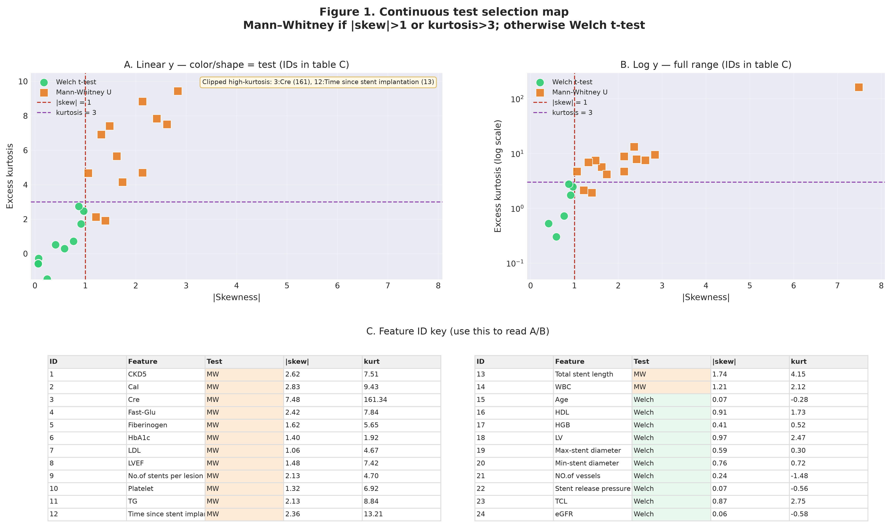

**Figure 1.** Map of continuous predictors in the abs(skewness)–excess-kurtosis plane used to choose the primary univariate test for association with VLST. Green markers indicate Welch t-test (abs(skew) ≤ 1 and excess kurtosis ≤ 3); orange markers indicate Mann–Whitney U. Panel A uses a linear kurtosis axis (high-kurtosis features annotated if clipped); panel B uses a log kurtosis scale to show the full range; panel C lists feature IDs, chosen test, and shape statistics. Dashed lines mark the selection thresholds.

**Source file:** [01_eda/paper_figures/paper_fig1_test_selection_map.png](01_eda/paper_figures/paper_fig1_test_selection_map.png)

### Table R. Continuous variables: chosen univariate test and rationale

Rendered table image (open separately if needed): [01_eda/paper_figures/paper_table_test_rationale.png](01_eda/paper_figures/paper_table_test_rationale.png)

**Table R.** For each continuous predictor, the selected univariate test, distributional rationale (skewness, excess kurtosis, variance ratio), raw p, FDR q, and significance code (`p<0.05` / `p<0.01` / `p<0.001`).

| ID | Feature | Chosen test | Skewness | Kurtosis | Var. ratio | Why this test | p (raw) | q (FDR) | Sig |
| --- | --- | --- | --- | --- | --- | --- | --- | --- | --- |
| 1 | CKD5 | Mann-Whitney U | 2.62 | 7.51 | 1.32 | Heavy skew/tails (/skew/>1 or kurt>3) -> MW | 1.19e-05 | 5.69e-05 | p<0.001 |
| 2 | CaI | Mann-Whitney U | 2.83 | 9.43 | 1.37 | Heavy skew/tails (/skew/>1 or kurt>3) -> MW | 0.0507 | 0.0869 | ns |
| 3 | Cre | Mann-Whitney U | 7.48 | 161.34 | 1.7 | Heavy skew/tails (/skew/>1 or kurt>3) -> MW | 0.878 | 0.938 | ns |
| 4 | Fast-Glu | Mann-Whitney U | 2.42 | 7.84 | 2.13 | Heavy skew/tails (/skew/>1 or kurt>3) -> MW | 0.0246 | 0.0536 | ns |
| 5 | Fiberinogen | Mann-Whitney U | 1.62 | 5.65 | 1.31 | Heavy skew/tails (/skew/>1 or kurt>3) -> MW | 0.0119 | 0.0286 | p<0.05 |
| 6 | HbA1c | Mann-Whitney U | 1.4 | 1.92 | 1.11 | Heavy skew/tails (/skew/>1 or kurt>3) -> MW | 2.00e-04 | 7.00e-04 | p<0.001 |
| 7 | LDL | Mann-Whitney U | 1.06 | 4.67 | 1.78 | Heavy skew/tails (/skew/>1 or kurt>3) -> MW | 0.327 | 0.491 | ns |
| 8 | LVEF | Mann-Whitney U | -1.48 | 7.42 | 1.51 | Heavy skew/tails (/skew/>1 or kurt>3) -> MW | 0.0333 | 0.0666 | ns |
| 9 | No.of stents per lesion | Mann-Whitney U | 2.13 | 4.7 | 2.03 | Heavy skew/tails (/skew/>1 or kurt>3) -> MW | 1.00e-04 | 6.00e-04 | p<0.001 |
| 10 | Platelet | Mann-Whitney U | 1.32 | 6.92 | 1.24 | Heavy skew/tails (/skew/>1 or kurt>3) -> MW | 0.816 | 0.938 | ns |
| 11 | TG | Mann-Whitney U | 2.13 | 8.84 | 1.52 | Heavy skew/tails (/skew/>1 or kurt>3) -> MW | 0.558 | 0.705 | ns |
| 12 | Time since stent implantation | Mann-Whitney U | -2.36 | 13.2 | 12.7 | Heavy skew/tails (/skew/>1 or kurt>3) -> MW | 1.70e-34 | 4.07e-33 | p<0.001 |
| 13 | Total stent length | Mann-Whitney U | 1.74 | 4.15 | 1.76 | Heavy skew/tails (/skew/>1 or kurt>3) -> MW | 0.0011 | 0.003 | p<0.01 |
| 14 | WBC | Mann-Whitney U | 1.21 | 2.12 | 1.47 | Heavy skew/tails (/skew/>1 or kurt>3) -> MW | 7.90e-21 | 9.48e-20 | p<0.001 |
| 15 | Age | Welch t-test | -0.07 | -0.28 | 1.3 | Approx. symmetric (/skew/≤1 & kurt≤3) -> Welch | 0.463 | 0.618 | ns |
| 16 | HDL | Welch t-test | 0.91 | 1.73 | 1.58 | Approx. symmetric (/skew/≤1 & kurt≤3) -> Welch | 0.899 | 0.938 | ns |
| 17 | HGB | Welch t-test | -0.41 | 0.52 | 1.54 | Approx. symmetric (/skew/≤1 & kurt≤3) -> Welch | 0.0388 | 0.0716 | ns |
| 18 | LV | Welch t-test | 0.97 | 2.47 | 1.1 | Approx. symmetric (/skew/≤1 & kurt≤3) -> Welch | 5.44e-17 | 3.26e-16 | p<0.001 |
| 19 | Max-stent diameter | Welch t-test | 0.59 | 0.3 | 1.17 | Approx. symmetric (/skew/≤1 & kurt≤3) -> Welch | 0.885 | 0.938 | ns |
| 20 | Min-stent diameter | Welch t-test | 0.76 | 0.72 | 1.09 | Approx. symmetric (/skew/≤1 & kurt≤3) -> Welch | 0.106 | 0.169 | ns |
| 21 | NO.of vessels | Welch t-test | 0.24 | -1.48 | 1.04 | Approx. symmetric (/skew/≤1 & kurt≤3) -> Welch | 5.00e-04 | 0.0014 | p<0.01 |
| 22 | Stent release pressure | Welch t-test | 0.07 | -0.56 | 1.13 | Approx. symmetric (/skew/≤1 & kurt≤3) -> Welch | 0.949 | 0.949 | ns |
| 23 | TCL | Welch t-test | 0.87 | 2.75 | 1.57 | Approx. symmetric (/skew/≤1 & kurt≤3) -> Welch | 0.381 | 0.537 | ns |
| 24 | eGFR | Welch t-test | 0.06 | -0.58 | 3.02 | Approx. symmetric (/skew/≤1 & kurt≤3) -> Welch | 4.64e-20 | 3.71e-19 | p<0.001 |

**Source files:** [01_eda/paper_figures/paper_table_test_rationale.png](01_eda/paper_figures/paper_table_test_rationale.png), [01_eda/paper_figures/paper_table_test_rationale.csv](01_eda/paper_figures/paper_table_test_rationale.csv)

---

### 2. Univariate continuous associations

### Figure 2. Univariate continuous significance overview

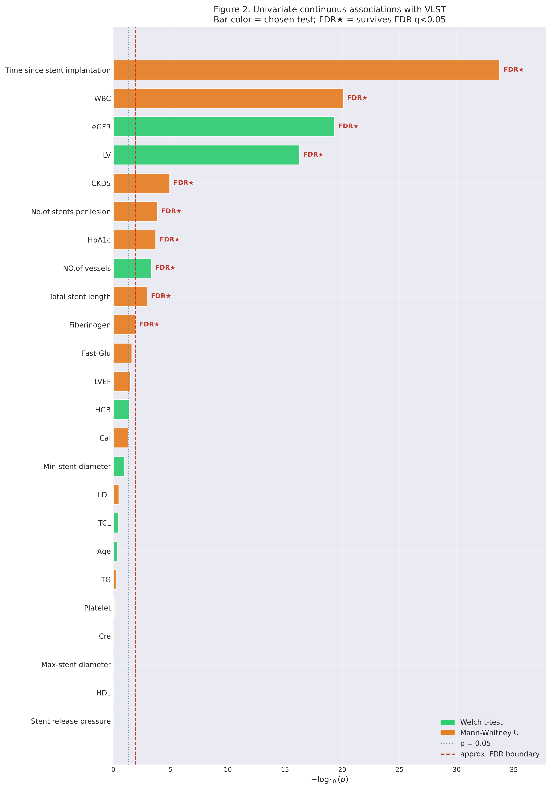

**Figure 2.** Horizontal ranking of continuous features by -log10(p) for association with VLST. Bar color denotes the chosen test (Welch vs Mann–Whitney). The dotted line marks nominal p = 0.05; the dashed line approximates the FDR discovery boundary among continuous tests. FDR marks label features with FDR q < 0.05.

**Source file:** [01_eda/paper_figures/paper_fig2_univariate_significance.png](01_eda/paper_figures/paper_fig2_univariate_significance.png)

### Table 1. Continuous features with FDR q < 0.05 (univariate)

Rendered table image: [01_eda/paper_figures/paper_table1_continuous_fdr.png](01_eda/paper_figures/paper_table1_continuous_fdr.png)

**Table 1.** FDR-significant continuous associations with VLST, including test type, effect-size metric (Cohen d or Mann–Whitney r), mean/median differences (VLST − no VLST), raw p, and FDR q. Features annotated as time-at-risk should not be interpreted as baseline risk factors.

| Feature | Test | Direction | Effect size | ES | Δ mean | Δ median | p | q (FDR) | Sig | Note |
| --- | --- | --- | --- | --- | --- | --- | --- | --- | --- | --- |
| Time since stent implantation | Mann-Whitney U | Negative | Mann-Whitney r | -0.17 | -572.05 | -683.00 | 1.70e-34 | 4.07e-33 | p<0.001 | Time-at-risk / structural |
| WBC | Mann-Whitney U | Positive | Mann-Whitney r | 0.13 | 3.75 | 3.82 | 7.90e-21 | 9.48e-20 | p<0.001 | — |
| eGFR | Welch t-test | Negative | Cohen's d | -0.712 | -24.1 | -17.6 | 4.64e-20 | 3.71e-19 | p<0.001 | — |
| LV | Welch t-test | Positive | Cohen's d | 1.13 | 4.56 | 4 | 5.44e-17 | 3.26e-16 | p<0.001 | — |
| CKD5 | Mann-Whitney U | Positive | Mann-Whitney r | 0.04 | 0.18 | 0 | 1.19e-05 | 5.69e-05 | p<0.001 | — |
| No.of stents per lesion | Mann-Whitney U | Positive | Mann-Whitney r | 0.037 | 0.21 | 0 | 1.00e-04 | 6.00e-04 | p<0.001 | — |
| HbA1c | Mann-Whitney U | Positive | Mann-Whitney r | 0.052 | 0.47 | 1.05 | 2.00e-04 | 7.00e-04 | p<0.001 | — |
| NO.of vessels | Welch t-test | Positive | Cohen's d | 0.388 | 0.32 | 0 | 5.00e-04 | 0.0014 | p<0.01 | — |
| Total stent length | Mann-Whitney U | Positive | Mann-Whitney r | 0.045 | 6.76 | 2 | 0.0011 | 0.003 | p<0.01 | — |
| Fiberinogen | Mann-Whitney U | Positive | Mann-Whitney r | 0.035 | 0.2 | 0.17 | 0.0119 | 0.0286 | p<0.05 | — |

**Source files:** [01_eda/paper_figures/paper_table1_continuous_fdr.png](01_eda/paper_figures/paper_table1_continuous_fdr.png), [01_eda/paper_figures/paper_table1_continuous_univariate.csv](01_eda/paper_figures/paper_table1_continuous_univariate.csv)

### Figure 3. Effect sizes for FDR-significant continuous features

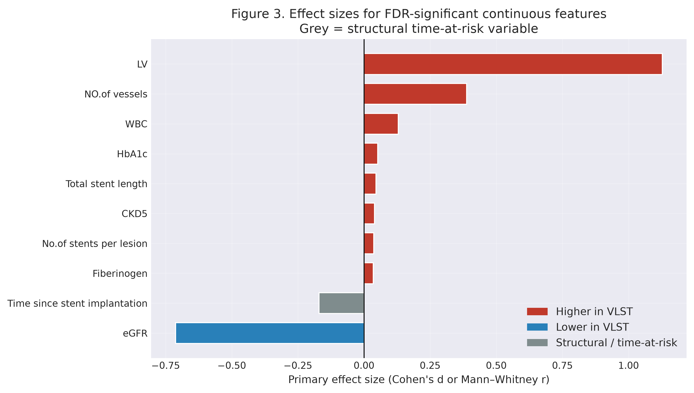

**Figure 3.** Primary effect sizes for continuous features with FDR q < 0.05. Grey highlighting (when present) marks the structural time-at-risk variable (`Time since stent implantation`).

**Source file:** [01_eda/paper_figures/paper_fig3_continuous_effect_sizes.png](01_eda/paper_figures/paper_fig3_continuous_effect_sizes.png)

---

### 3. Univariate binary associations

### Figure 4. Odds ratios for binary features (FDR q < 0.05)

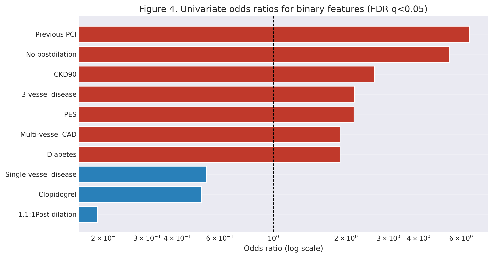

**Figure 4.** Univariate odds ratios (OR) for binary clinical/procedural indicators associated with VLST after FDR control. OR > 1 indicates higher odds of VLST when the feature is present.

**Source file:** [01_eda/paper_figures/paper_fig4_binary_odds_ratios.png](01_eda/paper_figures/paper_fig4_binary_odds_ratios.png)

### Table 2. Binary features associated with VLST

Rendered table image: [01_eda/paper_figures/paper_table2_binary_fdr.png](01_eda/paper_figures/paper_table2_binary_fdr.png)

**Table 2.** Binary predictors with FDR q < 0.05, showing OR, relative risk (RR), phi coefficient, VLST rates by feature level, raw p, and FDR q.

| Feature | Test | OR | RR | Phi | VLST% (1) | VLST% (0) | p | q (FDR) | Sig |
| --- | --- | --- | --- | --- | --- | --- | --- | --- | --- |
| 1.1:1Post dilation | Chi-square | 0.187 | 0.191 | -0.089 | 0.56 | 2.92 | 1.30e-10 | 3.69e-09 | p<0.001 |
| No postdilation | Chi-square | 5.36 | 5.23 | 0.089 | 2.92 | 0.56 | 1.30e-10 | 3.69e-09 | p<0.001 |
| CKD90 | Chi-square | 2.62 | 2.57 | 0.063 | 3.59 | 1.4 | 6.55e-06 | 1.00e-04 | p<0.001 |
| Previous PCI | Fisher exact | 6.49 | 5.96 | 0.085 | 9.62 | 1.61 | 1.25e-05 | 2.00e-04 | p<0.001 |
| 3-vessel disease | Chi-square | 2.17 | 2.13 | 0.052 | 2.87 | 1.34 | 2.00e-04 | 0.0021 | p<0.01 |
| Clopidogrel | Chi-square | 0.503 | 0.509 | -0.043 | 1.17 | 2.29 | 0.0022 | 0.0209 | p<0.05 |
| Diabetes | Chi-square | 1.89 | 1.86 | 0.042 | 2.71 | 1.45 | 0.0028 | 0.0226 | p<0.05 |
| PES | Chi-square | 2.16 | 2.13 | 0.04 | 2.12 | 1 | 0.0044 | 0.0315 | p<0.05 |
| Multi-vessel CAD | Chi-square | 1.89 | 1.87 | 0.038 | 2.19 | 1.17 | 0.0062 | 0.0351 | p<0.05 |
| Single-vessel disease | Chi-square | 0.529 | 0.535 | -0.038 | 1.17 | 2.19 | 0.0062 | 0.0351 | p<0.05 |

**Source files:** [01_eda/paper_figures/paper_table2_binary_fdr.png](01_eda/paper_figures/paper_table2_binary_fdr.png), [01_eda/paper_figures/paper_table2_binary_univariate.csv](01_eda/paper_figures/paper_table2_binary_univariate.csv)

---

### 4. Categorical associations

### Figure 5. VLST rate by stent type

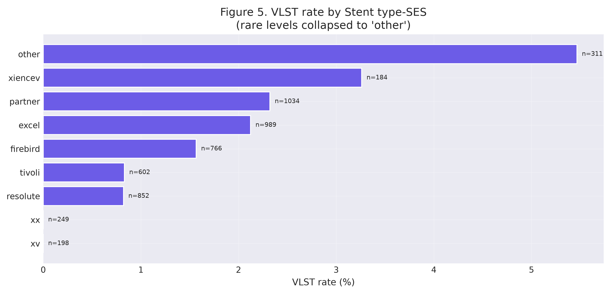

**Figure 5.** Observed VLST rate (%) across categories of `Stent type-SES` after collapsing rare levels (n < 30) to `other`. Rates are descriptive; formal association testing is summarized in Table 3.

**Source file:** [01_eda/paper_figures/paper_fig5_categorical_rates_Stent_type-SES.png](01_eda/paper_figures/paper_fig5_categorical_rates_Stent_type-SES.png)

### Table 3. Categorical feature association with VLST

Rendered table image: [01_eda/paper_figures/paper_table3_categorical.png](01_eda/paper_figures/paper_table3_categorical.png)

**Table 3.** Chi-square association between stent-type category and VLST, with degrees of freedom, Cramer V, raw p, and FDR q.

| Feature | Test | Levels used | Chi-square | df | Cramér's V | p | q (FDR) | Sig |
| --- | --- | --- | --- | --- | --- | --- | --- | --- |
| Stent type-SES | Chi-square | 9 | 44.9 | 8 | 0.093 | 3.85e-07 | 3.85e-07 | p<0.001 |

**Source files:** [01_eda/paper_figures/paper_table3_categorical.png](01_eda/paper_figures/paper_table3_categorical.png), [01_eda/paper_figures/paper_table3_categorical.csv](01_eda/paper_figures/paper_table3_categorical.csv)

---

### 5. Multivariable adjustment

### Table 4. Exploratory multivariable logistic model (adjusted ORs)

Rendered table image: [01_eda/paper_figures/paper_table4_multivariable_or.png](01_eda/paper_figures/paper_table4_multivariable_or.png)

**Table 4.** Exploratory multivariable logistic regression for VLST. Continuous predictors are scaled per 1 SD. `Time since stent implantation` is excluded. Odds ratios are shown with bootstrap 95% confidence intervals where available. Given ~92 events, the model is sparse and intended for screening/confounding context rather than definitive risk prediction.

| Feature | Type | Univariate OR | Adjusted OR | 95% CI |
| --- | --- | --- | --- | --- |
| WBC | continuous (per 1 SD) | 2.69 | 3 | [2.424, 4.225] |
| eGFR | continuous (per 1 SD) | 0.334 | 0.113 | [0.060, 0.158] |
| LV | continuous (per 1 SD) | 3.12 | 3.28 | [2.335, 5.254] |
| CKD5 | continuous (per 1 SD) | 1.39 | 0.156 | [0.023, 0.285] |
| No.of stents per lesion | continuous (per 1 SD) | 1.38 | 1.3 | [0.693, 2.177] |
| HbA1c | continuous (per 1 SD) | 1.37 | 0.87 | [0.569, 1.280] |
| NO.of vessels | continuous (per 1 SD) | 1.46 | 1.5 | [0.774, 3.392] |
| Total stent length | continuous (per 1 SD) | 1.39 | 1.13 | [0.658, 2.269] |
| Fiberinogen | continuous (per 1 SD) | 1.22 | 1.04 | [0.804, 1.348] |
| 1.1:1Post dilation | binary | 0.187 | 0.144 | [0.040, 0.245] |
| No postdilation | binary | 5.35 | 0.895 | [0.429, 1.358] |
| CKD90 | binary | 2.62 | 12.5 | [2.708, 639.506] |
| Previous PCI | binary | 6.46 | 8.98 | [3.226, 28.618] |
| 3-vessel disease | binary | 2.17 | 0.605 | [0.135, 2.936] |
| Clopidogrel | binary | 0.504 | 0.464 | [0.195, 0.817] |
| Diabetes | binary | 1.89 | 1.88 | [0.678, 4.331] |
| PES | binary | 2.16 | 1.24 | [0.585, 4.056] |

**Source files:** [01_eda/paper_figures/paper_table4_multivariable_or.png](01_eda/paper_figures/paper_table4_multivariable_or.png), [01_eda/paper_figures/paper_table4_multivariable_or.csv](01_eda/paper_figures/paper_table4_multivariable_or.csv)

### Figure 6. Univariate versus multivariable associations

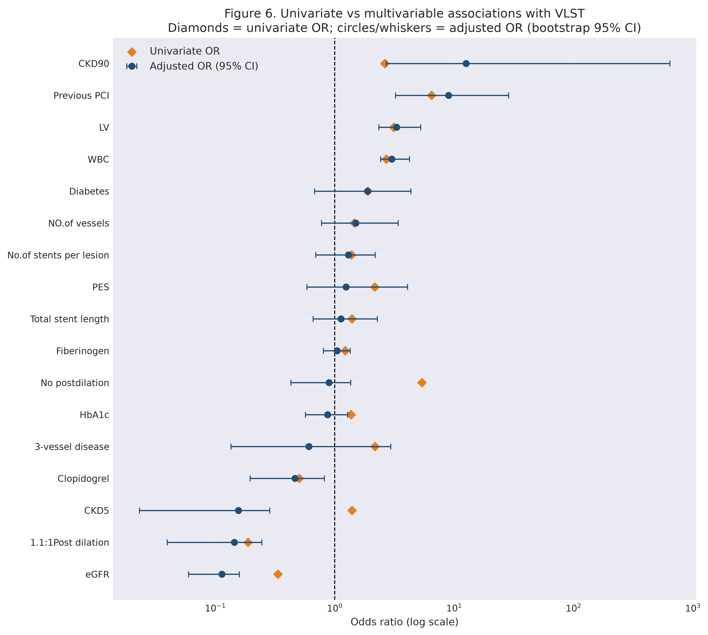

**Figure 6.** Comparison of univariate ORs (diamonds) with multivariable adjusted ORs and 95% CIs (circles/whiskers) for features entering the exploratory joint model. Attenuation toward the null suggests confounding or shared information; persistence of association after adjustment supports an independent signal within this sparse specification.

**Source file:** [01_eda/paper_figures/paper_fig6_uni_vs_multivariable_or.png](01_eda/paper_figures/paper_fig6_uni_vs_multivariable_or.png)

---

### 6. Medical-domain analysis (supplementary)

Clinical-block analysis (section 10g): predictors grouped by medical domain; correlation clustering used to drop redundant mates before sparse domain-wise and joint models.

### Supplementary Figure S1. Domain univariate top associations

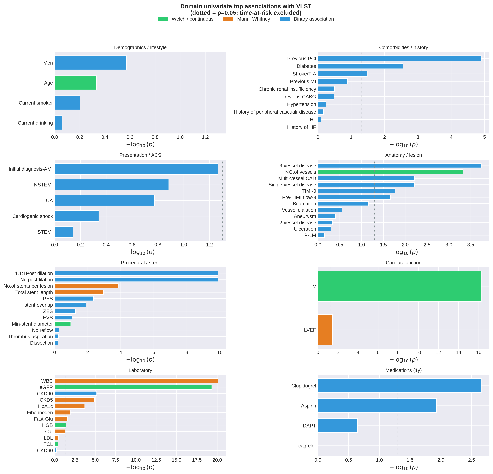

**Figure S1.** Within each clinical domain (demographics/lifestyle, comorbidities, presentation, anatomy/lesion, procedural/stent, cardiac function, laboratory, medications), the strongest univariate associations with VLST ranked by -log10(p). Time-at-risk is excluded from domain ranking. Color encodes test family (Welch / Mann–Whitney / binary).

### Supplementary Table S1. Domain strength summary

**Table S1.** Domain-level summary of univariate screening: number of features, count of raw p < 0.05, global FDR hits, within-domain FDR hits, minimum p, peak -log10(p), and top feature.

| Domain | n_features | n_raw_p05 | n_fdr_global | n_fdr_domain | min_p | max_neglog10p | top_feature |
| --- | --- | --- | --- | --- | --- | --- | --- |
| Laboratory | 16 | 8 | 6 | 6 | 7.90e-21 | 20.1 | WBC |
| Cardiac function | 2 | 2 | 1 | 2 | 5.44e-17 | 16.3 | LV |
| Procedural / stent | 16 | 6 | 5 | 6 | 1.30e-10 | 9.89 | 1.1:1Post dilation |
| Comorbidities / history | 10 | 3 | 2 | 2 | 1.25e-05 | 4.9 | Previous PCI |
| Anatomy / lesion | 23 | 6 | 4 | 4 | 1.81e-04 | 3.74 | 3-vessel disease |
| Medications (1y) | 4 | 2 | 1 | 2 | 0.0022 | 2.66 | Clopidogrel |
| Presentation / ACS | 5 | 0 | 0 | 0 | 0.0542 | 1.27 | Initial diagnosis-AMI |
| Demographics / lifestyle | 4 | 0 | 0 | 0 | 0.268 | 0.572 | Men |

**Source files:** [01_eda/paper_figures/domain_strength_summary.csv](01_eda/paper_figures/domain_strength_summary.csv), [01_eda/paper_figures/domain_univariate_summary.csv](01_eda/paper_figures/domain_univariate_summary.csv)

### Supplementary Figure S2. Feature correlation clustermaps

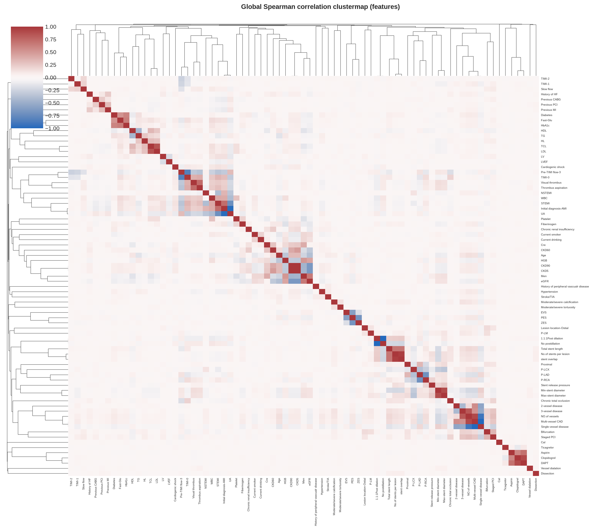

**Figure S2a.** Global Spearman correlation clustermap of numeric predictors (near-constant columns removed). Hierarchical clustering uses average linkage on distance 1 − abs(r).

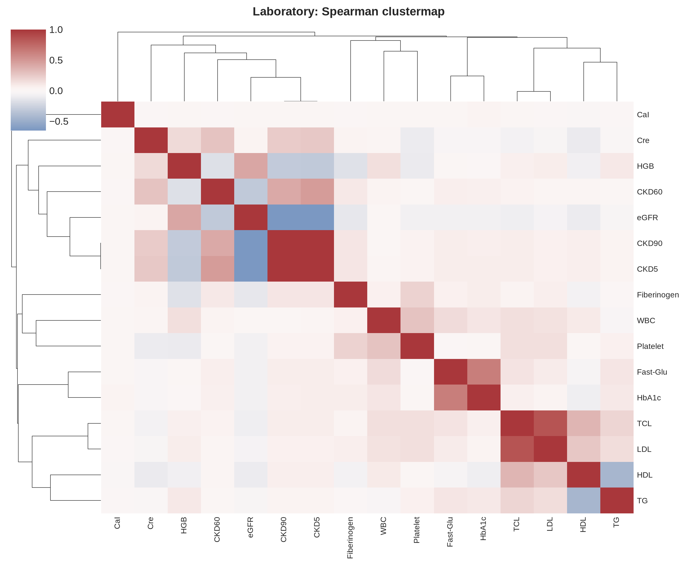

**Figure S2b.** Laboratory-domain Spearman clustermap.

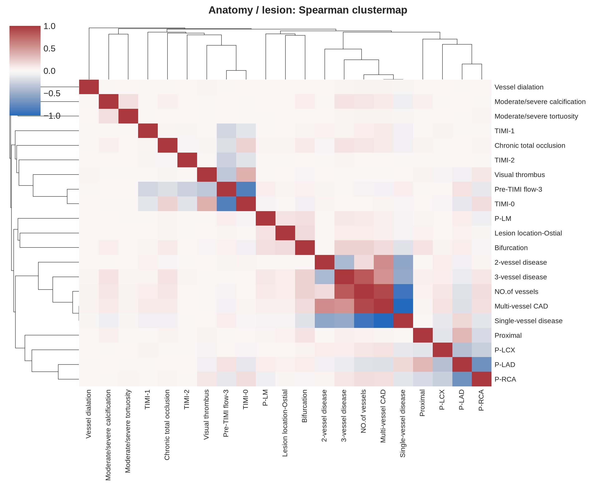

**Figure S2c.** Anatomy/lesion-domain Spearman clustermap.

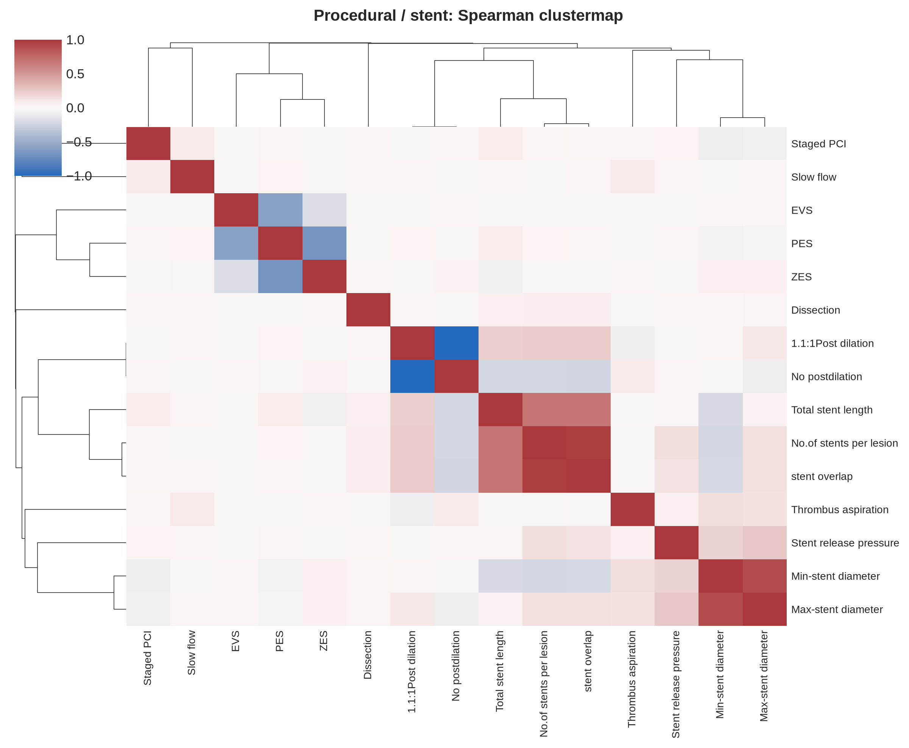

**Figure S2d.** Procedural/stent-domain Spearman clustermap.

**Source files:** `domain_clustermap_*.png`, `feature_correlation_clusters.csv`, `feature_correlation_cluster_reps.csv`

### Supplementary Figure S3. Per-domain multivariable odds ratios

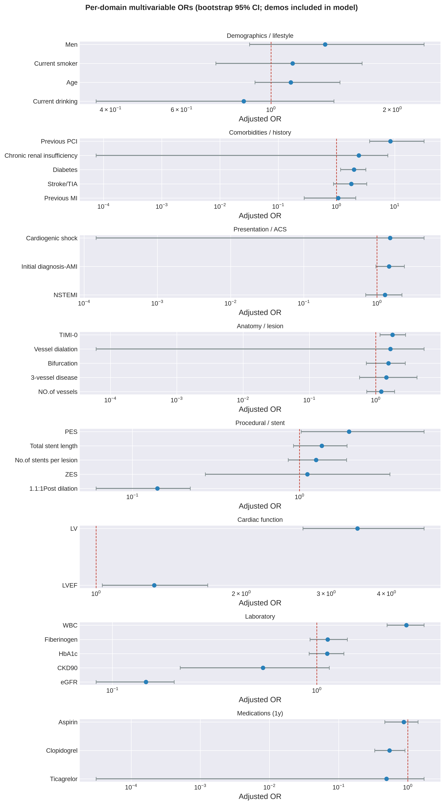

**Figure S3.** Domain-specific sparse logistic models (core demographics plus up to five non-redundant domain representatives). Points show adjusted ORs with bootstrap 95% CIs on a log scale; the dashed line marks OR = 1.

### Supplementary Figure S4. Joint cross-domain model (uni vs adjusted OR)

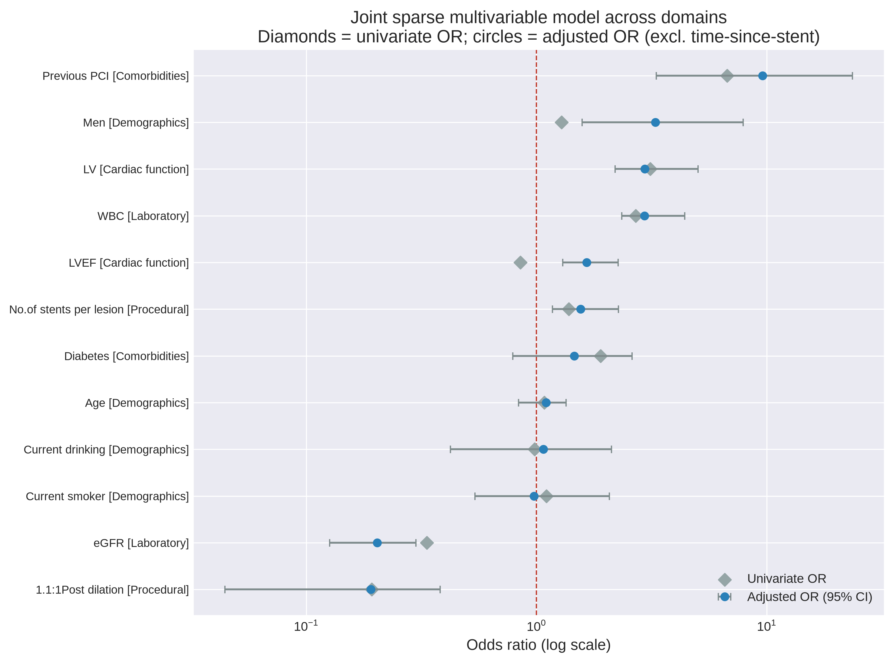

**Figure S4.** Joint sparse cross-domain logistic model comparing univariate ORs with adjusted ORs (bootstrap 95% CIs). Continuous covariates are per 1 SD; time-since-stent is excluded.

| Feature | Domain | Univariate OR | Adjusted OR | OR lower | OR upper |
| --- | --- | --- | --- | --- | --- |
| Age | Demographics / lifestyle | 1.08 | 1.1 | 0.836 | 1.34 |
| WBC | Laboratory | 2.69 | 2.94 | 2.34 | 4.4 |
| eGFR | Laboratory | 0.334 | 0.203 | 0.127 | 0.299 |
| LV | Cardiac function | 3.12 | 2.95 | 2.2 | 5.04 |
| LVEF | Cardiac function | 0.851 | 1.65 | 1.3 | 2.26 |
| No.of stents per lesion | Procedural / stent | 1.38 | 1.55 | 1.17 | 2.27 |
| Men | Demographics / lifestyle | 1.29 | 3.28 | 1.58 | 7.9 |
| Current smoker | Demographics / lifestyle | 1.11 | 0.976 | 0.541 | 2.07 |
| Current drinking | Demographics / lifestyle | 0.981 | 1.07 | 0.423 | 2.11 |
| 1.1:1Post dilation | Procedural / stent | 0.192 | 0.191 | 0.0444 | 0.382 |
| Previous PCI | Comorbidities / history | 6.73 | 9.58 | 3.31 | 23.6 |
| Diabetes | Comorbidities / history | 1.9 | 1.46 | 0.789 | 2.6 |

### Supplementary Table S2. Exploratory interaction screen

**Table S2.** Limited, clinically motivated pairwise interaction screen (likelihood-ratio test vs main-effects-only model). FDR q is computed among tested interactions only. With ~92 events, interactions are hypothesis-generating.

| Pair | LR statistic | Interaction p | Interaction OR | q (FDR) |
| --- | --- | --- | --- | --- |
| LV x eGFR | 9.81 | 0.00173 | 1.24 | 0.0277 |
| Men x eGFR | 8.53 | 0.0035 | 0.342 | 0.028 |
| WBC x eGFR | 2.65 | 0.104 | 1.13 | 0.553 |
| Current smoker x DAPT | 2.07 | 0.15 | 1.86 | 0.599 |
| Aspirin x Clopidogrel | 1.49 | 0.222 | 2.97 | 0.623 |
| Diabetes x HbA1c | 1.25 | 0.264 | 0.787 | 0.623 |
| Men x Previous PCI | 1.19 | 0.274 | 0.442 | 0.623 |
| LV x Previous PCI | 0.964 | 0.326 | 0.786 | 0.623 |

**Source file:** [01_eda/paper_figures/domain_interaction_screen.csv](01_eda/paper_figures/domain_interaction_screen.csv)

---

### 7. File index

| ID | Type | File |
| --- | --- | --- |
| Fig 1 | Figure | [paper_fig1_test_selection_map.png](01_eda/paper_figures/paper_fig1_test_selection_map.png) |
| Table R | Table | [paper_table_test_rationale.png](01_eda/paper_figures/paper_table_test_rationale.png) |
| Fig 2 | Figure | [paper_fig2_univariate_significance.png](01_eda/paper_figures/paper_fig2_univariate_significance.png) |
| Table 1 | Table | [paper_table1_continuous_fdr.png](01_eda/paper_figures/paper_table1_continuous_fdr.png) |
| Fig 3 | Figure | [paper_fig3_continuous_effect_sizes.png](01_eda/paper_figures/paper_fig3_continuous_effect_sizes.png) |
| Fig 4 | Figure | [paper_fig4_binary_odds_ratios.png](01_eda/paper_figures/paper_fig4_binary_odds_ratios.png) |
| Table 2 | Table | [paper_table2_binary_fdr.png](01_eda/paper_figures/paper_table2_binary_fdr.png) |
| Fig 5 | Figure | [paper_fig5_categorical_rates_Stent_type-SES.png](01_eda/paper_figures/paper_fig5_categorical_rates_Stent_type-SES.png) |
| Table 3 | Table | [paper_table3_categorical.png](01_eda/paper_figures/paper_table3_categorical.png) |
| Table 4 | Table | [paper_table4_multivariable_or.png](01_eda/paper_figures/paper_table4_multivariable_or.png) |
| Fig 6 | Figure | [paper_fig6_uni_vs_multivariable_or.png](01_eda/paper_figures/paper_fig6_uni_vs_multivariable_or.png) |
| Fig S1 | Supp. figure | [domain_univariate_top_hits.png](01_eda/paper_figures/domain_univariate_top_hits.png) |
| Table S1 | Supp. table | [domain_strength_summary.csv](01_eda/paper_figures/domain_strength_summary.csv) |
| Fig S2a | Supp. figure | [domain_clustermap_global.png](01_eda/paper_figures/domain_clustermap_global.png) |
| Fig S2b | Supp. figure | [domain_clustermap_lab.png](01_eda/paper_figures/domain_clustermap_lab.png) |
| Fig S2c | Supp. figure | [domain_clustermap_anatomy.png](01_eda/paper_figures/domain_clustermap_anatomy.png) |
| Fig S2d | Supp. figure | [domain_clustermap_procedural.png](01_eda/paper_figures/domain_clustermap_procedural.png) |
| Fig S3 | Supp. figure | [domain_multivariable_or_panels.png](01_eda/paper_figures/domain_multivariable_or_panels.png) |
| Fig S4 | Supp. figure | [domain_joint_uni_vs_multi_or.png](01_eda/paper_figures/domain_joint_uni_vs_multi_or.png) |
| Table S2 | Supp. table | [domain_interaction_screen.csv](01_eda/paper_figures/domain_interaction_screen.csv) |

---

*Generated from EDA notebook outputs. Close and reopen this file (or refresh Markdown preview) after updates.*

---

# Part 2. Classic-model feature selection — paper figures and tables

## Classic-model feature selection — paper figures and tables

This document gathers publication-oriented figures and tables from the multi-model feature selectors in `baseline_feature_selections.ipynb`.

**Cohort / protocol.** Same VLST records and split as the TabPFN playground: n = 5,185 (train 3,629 / test 1,556; train events 64, test events 28). Target = `Stent thrombosis`. `Time since stent implantation` is dropped as a time-at-risk / follow-up column. Models use the **scaled** view (185 columns after encoding). The stored notebook run is `RUN_MODE="smoke"` with **top-12** features per model × selector × metric. TabPFN was not available in that run.

**Selectors.** LOCO = drop-one and refit; coalition SHAP = metric Shapley values without refit; FFS = greedy forward add on hold-out. Objectives: `pr_auc`, `f1`, `f2`.

**Asset root:** [02_ml_selectors/paper_figures/](02_ml_selectors/paper_figures/)

---

## Contents

1. [Classic models (Table 0)](#1-classic-models)
2. [How much each selector keeps (Figure 1, Table 3, Figure 7)](#2-how-much-each-selector-keeps)
3. [Cross-model consensus (Table 1, Figure 6, Figure 2)](#3-cross-model-consensus)
4. [Within-model consensus, by classic model (Table 2, Figures 3–5)](#4-within-model-consensus-by-classic-model)
5. [Global intersection (Table 4)](#5-global-intersection)
6. [Priority-feature ranks (Table 5)](#6-priority-feature-ranks)
7. [Notebook compact plots (supplementary)](#7-notebook-compact-plots-supplementary)
8. [File index](#8-file-index)

---

### 1. Classic models

### Table 0. Models used in the selector notebook

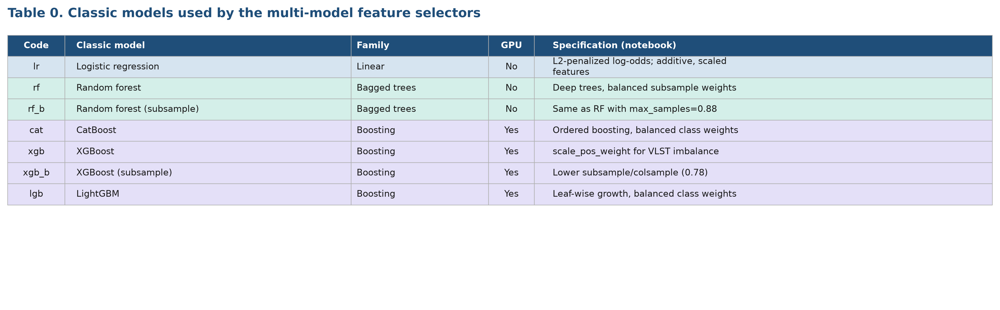

**Table 0.** Seven sklearn-style classifiers from the notebook `MODEL_SPECS` (TabPFN omitted). Row colour encodes family: linear (navy), bagged trees (teal), boosting (violet). All seven share the same scaled feature matrix; only the inductive bias changes.

| Code | Classic model | Family | GPU | Specification (notebook) |
| --- | --- | --- | --- | --- |
| lr | Logistic regression | Linear | No | L2-penalized log-odds (C=2, balanced); additive on scaled features |
| rf | Random forest | Bagged trees | No | 500 deep trees, class_weight=balanced_subsample |
| rf_b | Random forest (subsample) | Bagged trees | No | Same as RF with max_samples=0.88 |
| cat | CatBoost | Boosting | Yes | Ordered boosting, balanced class weights |
| xgb | XGBoost | Boosting | Yes | scale_pos_weight for VLST imbalance |
| xgb_b | XGBoost (subsample) | Boosting | Yes | Lower subsample / colsample_bytree (0.78) |
| lgb | LightGBM | Boosting | Yes | Leaf-wise growth, balanced class weights |

**How to read later tables through this lens.**

- **Logistic regression** can only use additive log-odds. LOCO/SHAP/FFS therefore highlight columns that still matter after linear sharing of credit (often one of a correlated pair, plus sex/lipids/renal labs).
- **Random forests** split on interactions and can keep both a lab and its clinical twin. Consensus tends to sit on cardiac function (`LV` / `LVEF`), inflammation (`WBC`), and renal filtration (`eGFR`).
- **Boosting** (CatBoost / XGBoost / LightGBM) is the same tree idea with sequential residual fitting. CatBoost and XGBoost agree most often on `LV`, `WBC`, and `eGFR`; LightGBM’s three-way intersection is more metric-specific.

**Source files:** [02_ml_selectors/paper_figures/paper_table0_classic_models.png](02_ml_selectors/paper_figures/paper_table0_classic_models.png), [02_ml_selectors/paper_figures/paper_table0_classic_models.csv](02_ml_selectors/paper_figures/paper_table0_classic_models.csv)

---

### 2. How much each selector keeps

LOCO is run on a capped pool (`LOCO_MAX_FEATURES=40` in smoke mode), so every model reports **40** unique LOCO features once all three metrics are pooled. SHAP and FFS are nested inside that pool (SHAP universe 24; FFS candidate pool 30; both take top-12 per metric), so they keep fewer unique names.

### Figure 1. Unique selected features by classic model and selector

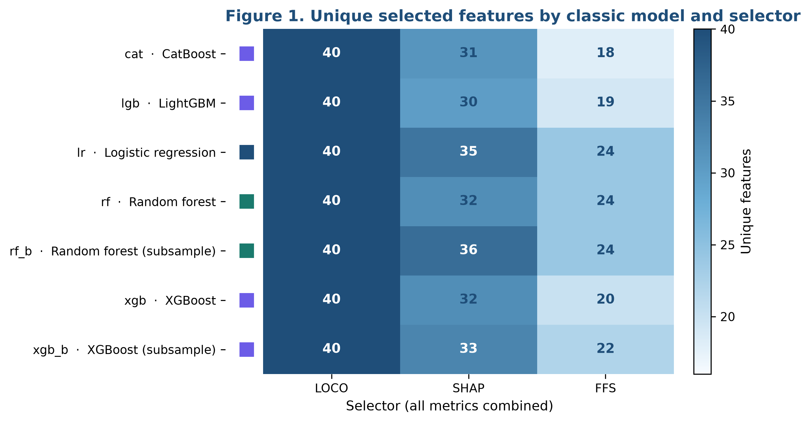

**Figure 1.** Unique feature counts after pooling `pr_auc`, `f1`, and `f2`. Squares on the left mark family (navy = linear, teal = bagged trees, violet = boosting). LOCO saturates the 40-feature cap for every model. FFS is the sparsest (18–24 unique names). SHAP sits in between (30–36). Linear and subsampled RF keep slightly larger SHAP/FFS unions than boosting.

| Model | Family | LOCO | SHAP | FFS |
| --- | --- | ---: | ---: | ---: |
| lr | Linear | 40 | 35 | 24 |
| rf | Bagged trees | 40 | 32 | 24 |
| rf_b | Bagged trees | 40 | 36 | 24 |
| cat | Boosting | 40 | 31 | 18 |
| xgb | Boosting | 40 | 32 | 20 |
| xgb_b | Boosting | 40 | 33 | 22 |
| lgb | Boosting | 40 | 30 | 19 |

**Source file:** [02_ml_selectors/paper_figures/paper_fig1_unique_counts.png](02_ml_selectors/paper_figures/paper_fig1_unique_counts.png)

### Table 3. Union size per classic model

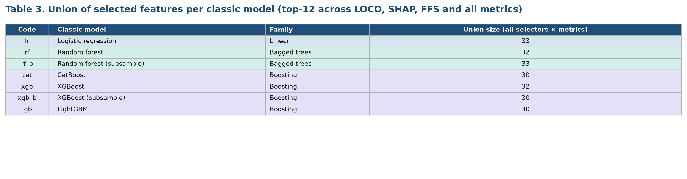

**Table 3.** Size of the union of top-12 sets across LOCO, SHAP, FFS and all three metrics. Logistic regression and subsampled RF have the largest unions (33); boosting models are slightly tighter (30–32).

| Code | Classic model | Family | Union size |
| --- | --- | --- | ---: |
| lr | Logistic regression | Linear | 33 |
| rf | Random forest | Bagged trees | 32 |
| rf_b | Random forest (subsample) | Bagged trees | 33 |
| cat | CatBoost | Boosting | 30 |
| xgb | XGBoost | Boosting | 32 |
| xgb_b | XGBoost (subsample) | Boosting | 30 |
| lgb | LightGBM | Boosting | 30 |

**Source files:** [02_ml_selectors/paper_figures/paper_table3_union_by_model.png](02_ml_selectors/paper_figures/paper_table3_union_by_model.png), [02_ml_selectors/paper_figures/paper_table3_union_by_model.csv](02_ml_selectors/paper_figures/paper_table3_union_by_model.csv)

### Figure 7. Union size (same numbers as Table 3)

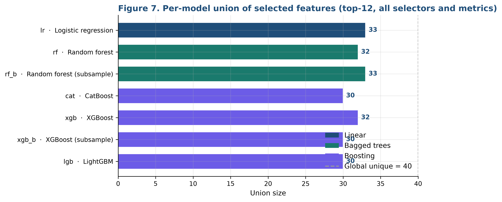

**Figure 7.** Per-model unions relative to the global unique count of 40 (dashed line). No classic model recovers the full 40-name union on its own.

**Source file:** [02_ml_selectors/paper_figures/paper_fig7_union_by_model.png](02_ml_selectors/paper_figures/paper_fig7_union_by_model.png)

---

### 3. Cross-model consensus

A feature is “shared by all 7 models” only if it appears in every classic model’s top-12 for that selector and metric.

### Table 1. Features shared by all classic models

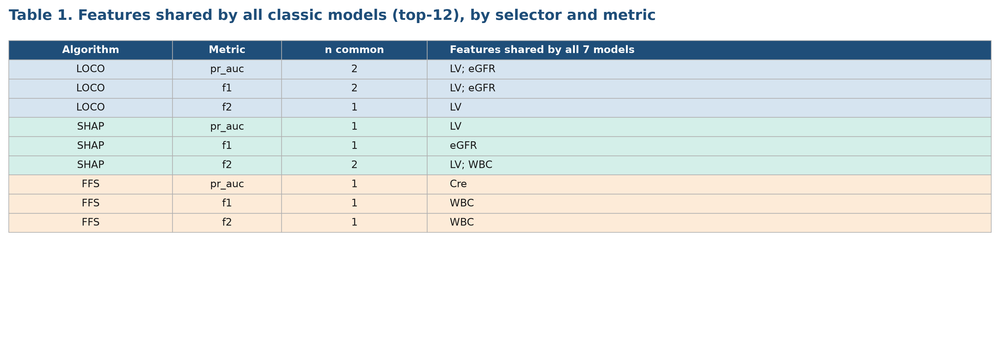

**Table 1.** Cross-model intersection (row colour = selector). At most two names survive. LOCO agrees on `LV` and `eGFR` for PR-AUC and F1; F2 keeps only `LV`. SHAP centres on `LV` / `eGFR` and adds `WBC` on F2. FFS shares only a single lab across all seven models: `Cre` on PR-AUC, `WBC` on F1/F2.

| Algorithm | Metric | n common | Features shared by all 7 models |
| --- | --- | ---: | --- |
| LOCO | pr_auc | 2 | LV; eGFR |
| LOCO | f1 | 2 | LV; eGFR |
| LOCO | f2 | 1 | LV |
| SHAP | pr_auc | 1 | LV |
| SHAP | f1 | 1 | eGFR |
| SHAP | f2 | 2 | LV; WBC |
| FFS | pr_auc | 1 | Cre |
| FFS | f1 | 1 | WBC |
| FFS | f2 | 1 | WBC |

**Source files:** [02_ml_selectors/paper_figures/paper_table1_common_by_algorithm.png](02_ml_selectors/paper_figures/paper_table1_common_by_algorithm.png), [02_ml_selectors/paper_figures/paper_table1_common_by_algorithm.csv](02_ml_selectors/paper_figures/paper_table1_common_by_algorithm.csv)

### Figure 6. Same intersection as bars

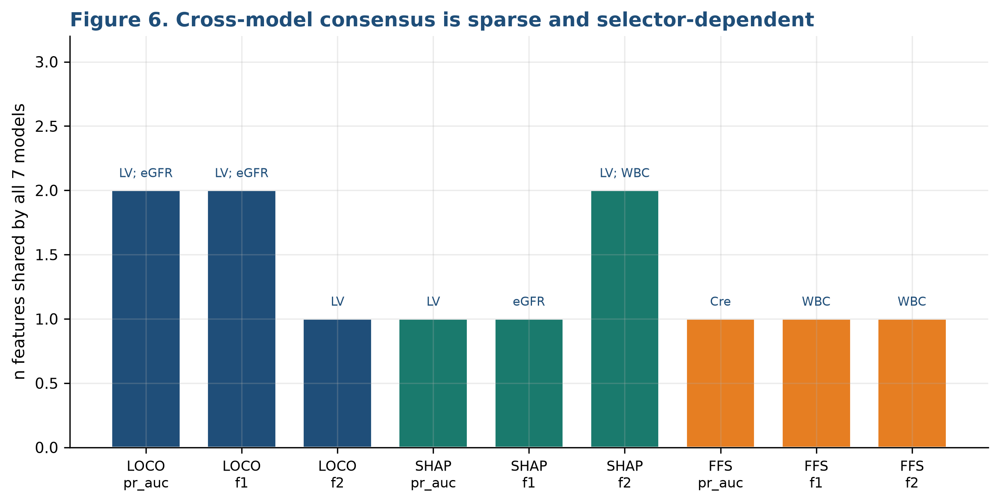

**Figure 6.** Bar height is `n common` from Table 1; labels are the shared names. LOCO/SHAP recover cardiac–renal structure; FFS recovers a single laboratory marker.

**Source file:** [02_ml_selectors/paper_figures/paper_fig6_cross_model_common.png](02_ml_selectors/paper_figures/paper_fig6_cross_model_common.png)

### Figure 2. Jaccard overlap of selector unions

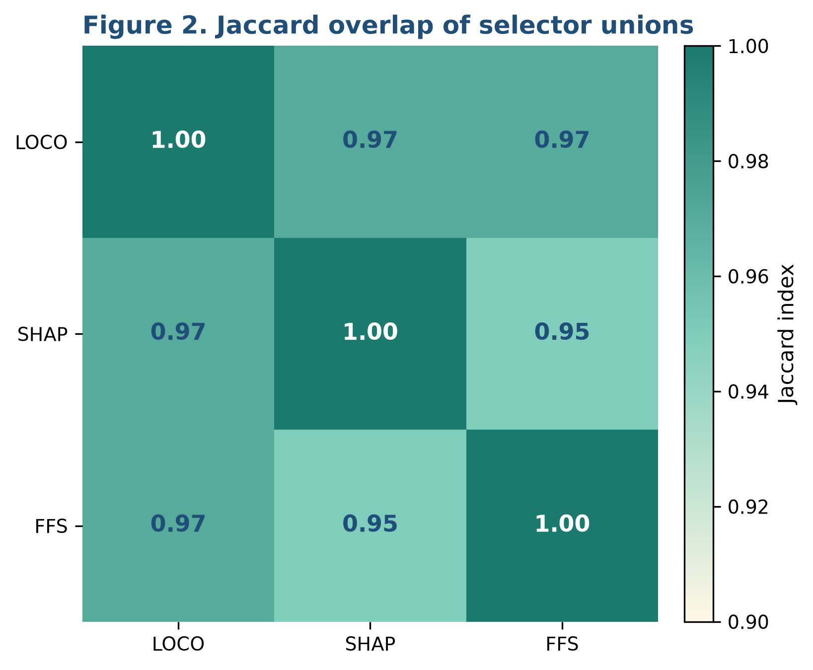

**Figure 2.** Jaccard index between the unions of top-12 sets (all models and metrics pooled). Overlap is high (0.95–0.97) because the three selectors are nested in the same LOCO-ranked pool. High union overlap does not imply a large cross-model intersection (Table 1).

**Source file:** [02_ml_selectors/paper_figures/paper_fig2_jaccard.png](02_ml_selectors/paper_figures/paper_fig2_jaccard.png)

---

### 4. Within-model consensus, by classic model

Here the intersection is inside one model: names that LOCO, SHAP, and FFS all put in that model’s top-12 for a given metric.

### Table 2. LOCO ∩ SHAP ∩ FFS per model and metric

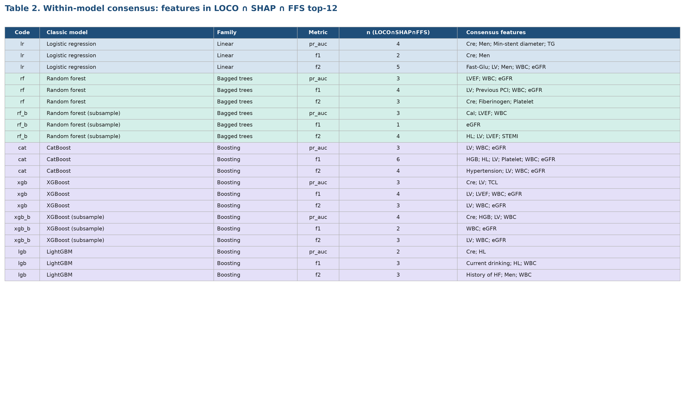

**Table 2.** Within-model three-selector consensus. Row colour = family. CatBoost has the largest F1 consensus (6 names); subsampled RF has the smallest (only `eGFR` on F1).

| Code | Classic model | Family | Metric | n (LOCO ∩ SHAP ∩ FFS) | Consensus features |
| --- | --- | --- | --- | ---: | --- |
| lr | Logistic regression | Linear | pr_auc | 4 | Cre; Men; Min-stent diameter; TG |
| lr | Logistic regression | Linear | f1 | 2 | Cre; Men |
| lr | Logistic regression | Linear | f2 | 5 | Fast-Glu; LV; Men; WBC; eGFR |
| rf | Random forest | Bagged trees | pr_auc | 3 | LVEF; WBC; eGFR |
| rf | Random forest | Bagged trees | f1 | 4 | LV; Previous PCI; WBC; eGFR |
| rf | Random forest | Bagged trees | f2 | 3 | Cre; Fiberinogen; Platelet |
| rf_b | Random forest (subsample) | Bagged trees | pr_auc | 3 | CaI; LVEF; WBC |
| rf_b | Random forest (subsample) | Bagged trees | f1 | 1 | eGFR |
| rf_b | Random forest (subsample) | Bagged trees | f2 | 4 | HL; LV; LVEF; STEMI |
| cat | CatBoost | Boosting | pr_auc | 3 | LV; WBC; eGFR |
| cat | CatBoost | Boosting | f1 | 6 | HGB; HL; LV; Platelet; WBC; eGFR |
| cat | CatBoost | Boosting | f2 | 4 | Hypertension; LV; WBC; eGFR |
| xgb | XGBoost | Boosting | pr_auc | 3 | Cre; LV; TCL |
| xgb | XGBoost | Boosting | f1 | 4 | LV; LVEF; WBC; eGFR |
| xgb | XGBoost | Boosting | f2 | 3 | LV; WBC; eGFR |
| xgb_b | XGBoost (subsample) | Boosting | pr_auc | 4 | Cre; HGB; LV; WBC |
| xgb_b | XGBoost (subsample) | Boosting | f1 | 2 | WBC; eGFR |
| xgb_b | XGBoost (subsample) | Boosting | f2 | 3 | LV; WBC; eGFR |
| lgb | LightGBM | Boosting | pr_auc | 2 | Cre; HL |
| lgb | LightGBM | Boosting | f1 | 3 | Current drinking; HL; WBC |
| lgb | LightGBM | Boosting | f2 | 3 | History of HF; Men; WBC |

**Source files:** [02_ml_selectors/paper_figures/paper_table2_consensus_by_model.png](02_ml_selectors/paper_figures/paper_table2_consensus_by_model.png), [02_ml_selectors/paper_figures/paper_table2_consensus_by_model.csv](02_ml_selectors/paper_figures/paper_table2_consensus_by_model.csv)

### Figure 3. Consensus-set size

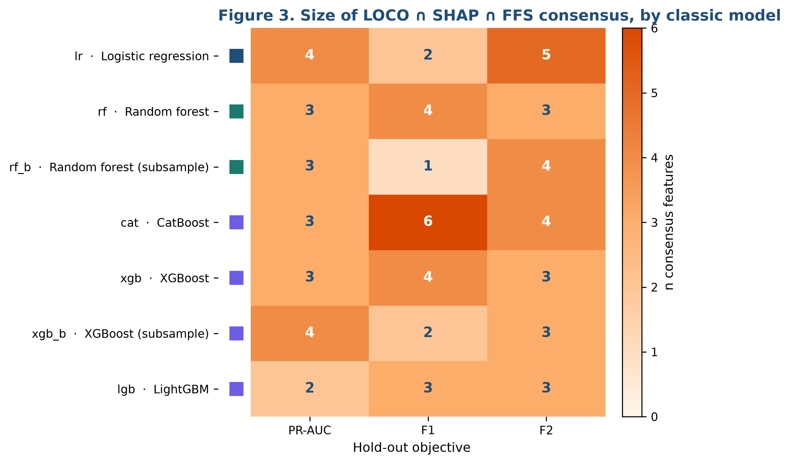

**Figure 3.** Heatmap of `n (LOCO ∩ SHAP ∩ FFS)` from Table 2. Darker orange = more names on which all three selectors agree for that classic model.

**Source file:** [02_ml_selectors/paper_figures/paper_fig3_consensus_size.png](02_ml_selectors/paper_figures/paper_fig3_consensus_size.png)

### Figure 4. Which features each classic model agrees on

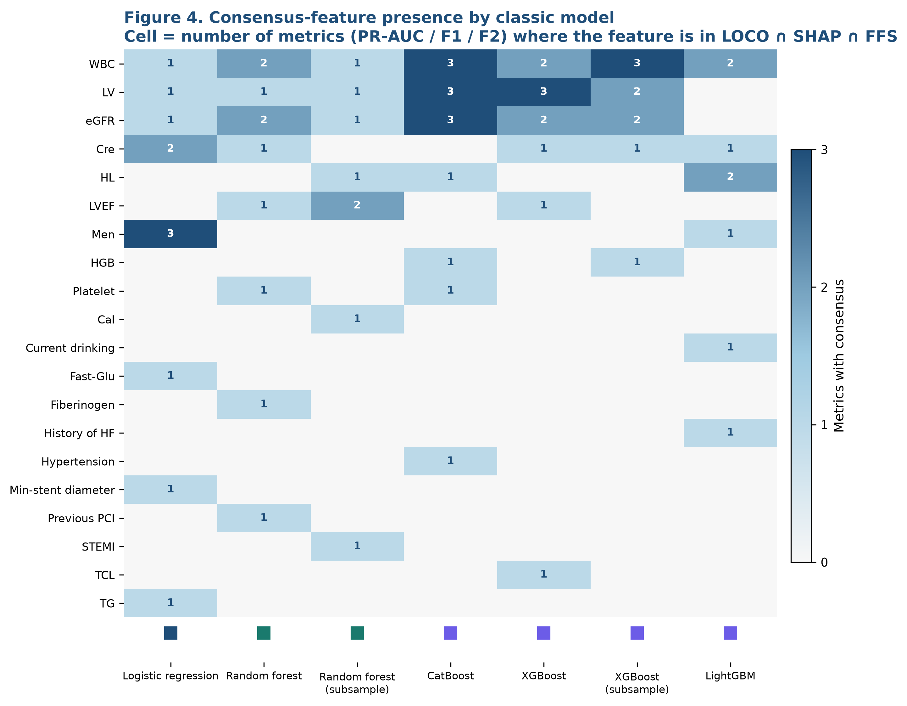

**Figure 4.** Cell = number of metrics (0–3) in which the feature is in that model’s LOCO ∩ SHAP ∩ FFS set. Squares under the x-axis mark family.

**Source file:** [02_ml_selectors/paper_figures/paper_fig4_feature_by_model.png](02_ml_selectors/paper_figures/paper_fig4_feature_by_model.png)

### Figure 5. Family stacked counts

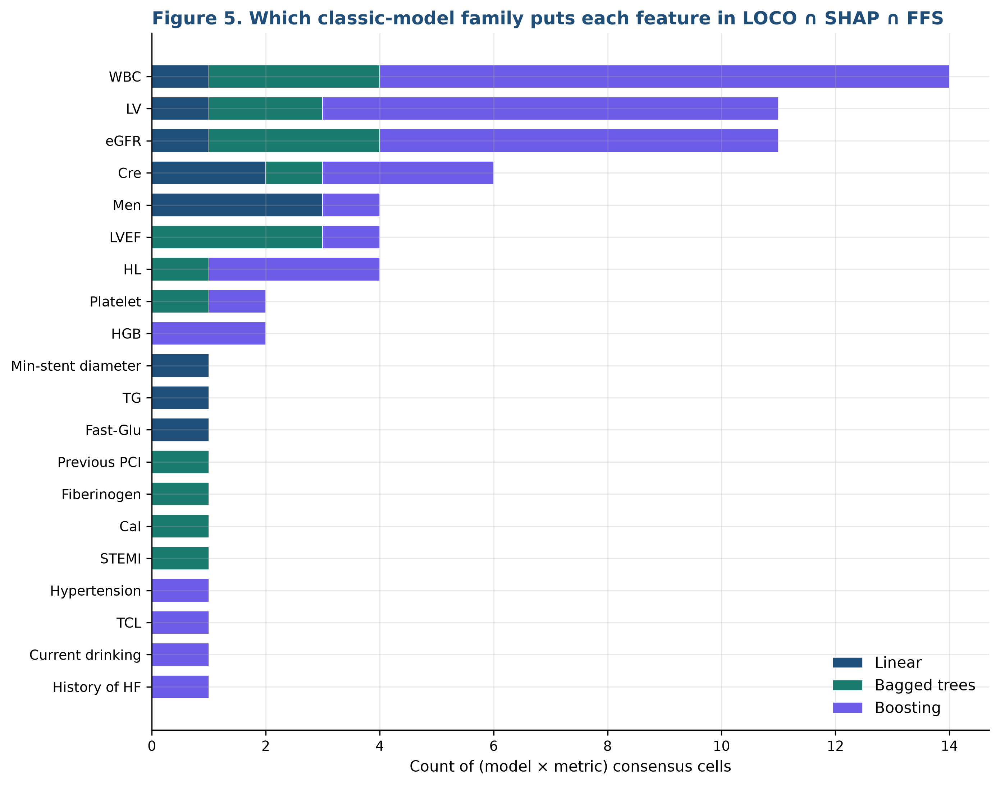

**Figure 5.** For each consensus feature, how many (model × metric) cells come from linear vs bagged trees vs boosting. `WBC`, `LV`, and `eGFR` have support in all three families. `Men` is linear-dominant. `LVEF` is bagged-tree-dominant.

**Source file:** [02_ml_selectors/paper_figures/paper_fig5_family_stacked.png](02_ml_selectors/paper_figures/paper_fig5_family_stacked.png)

### Reading Table 2 / Figures 3–5 by classic model

**Logistic regression (`lr`).** The linear three-selector core is creatinine + male sex on PR-AUC and F1, with stent diameter and triglycerides on PR-AUC. On F2 the consensus expands to `Fast-Glu`, `LV`, `Men`, `WBC`, `eGFR`. `Men` is almost unique to LR in Figure 4.

**Random forest (`rf`).** PR-AUC consensus is `LVEF`, `WBC`, `eGFR`. F1 adds `LV` and `Previous PCI`. F2 shifts toward haemostasis labs (`Cre`, `Fiberinogen`, `Platelet`).

**Random forest, subsampled (`rf_b`).** Less stable: F1 consensus shrinks to `eGFR` alone. Treat `rf_b` as a sensitivity check on `rf`.

**CatBoost (`cat`).** Most internally consistent booster: `LV`, `WBC`, and `eGFR` appear in all three metrics. F1 also agrees on `HGB`, `HL`, and `Platelet`; F2 adds `Hypertension`.

**XGBoost (`xgb` / `xgb_b`).** Both recover `LV` / `WBC` / `eGFR` on F1 and F2. PR-AUC consensus is more lipid/renal (`Cre`, `TCL` or `HGB`).

**LightGBM (`lgb`).** Does not put `LV` or `eGFR` in the three-way intersection. Consensus is `Cre; HL` (PR-AUC), `Current drinking; HL; WBC` (F1), and `History of HF; Men; WBC` (F2).

---

### 5. Global intersection

### Table 4. Strictest intersection vs global union

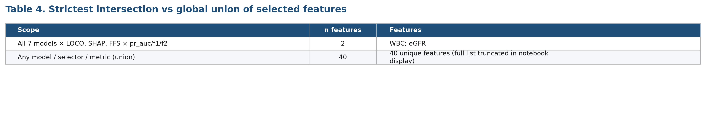

**Table 4.** Features that appear in every model × selector union (all metrics pooled) are only `WBC` and `eGFR`. The complementary union is 40 unique names.

| Scope | n features | Features |
| --- | ---: | --- |
| All 7 models × LOCO, SHAP, FFS × all metrics | 2 | WBC; eGFR |
| Any model / selector / metric (union) | 40 | 40 unique names (full string truncated in notebook HTML) |

**Source files:** [02_ml_selectors/paper_figures/paper_table4_global_common.png](02_ml_selectors/paper_figures/paper_table4_global_common.png), [02_ml_selectors/paper_figures/paper_table4_global_common.csv](02_ml_selectors/paper_figures/paper_table4_global_common.csv)

---

### 6. Priority-feature ranks

The notebook scores a hand-specified `PRIORITY_FEATURES` list against each model × selector ranking. The stored display is the first 20 rows: CatBoost × LOCO, `pr_auc` then `f1`.

### Table 5. Priority ranks (display excerpt)

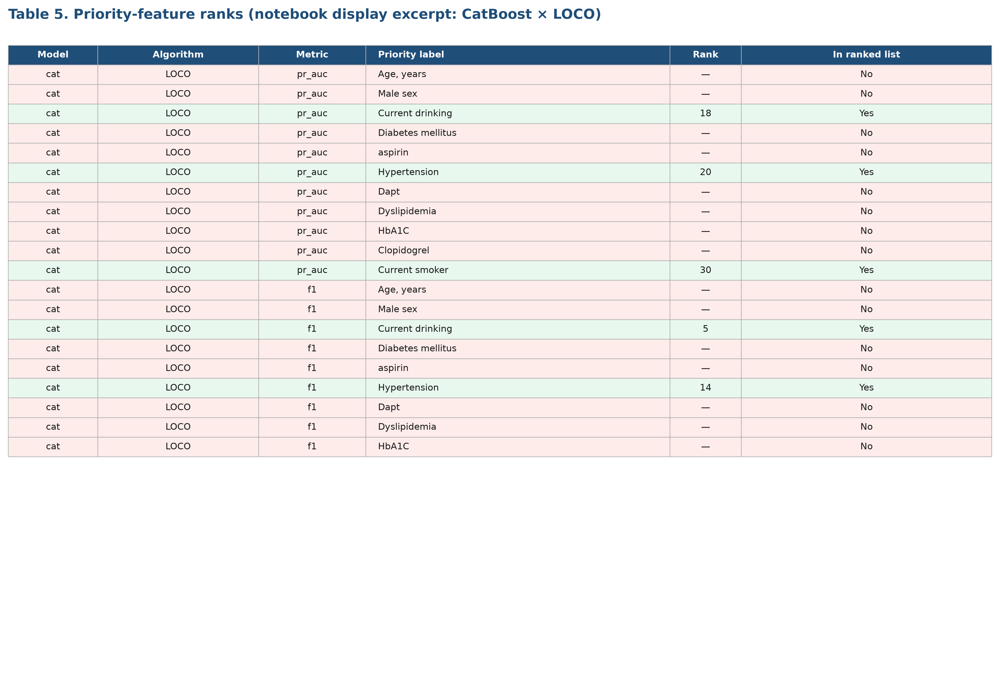

**Table 5.** Green = the priority label was found in CatBoost’s LOCO ranking; red = not found. Most labels miss because they do not match the scaled column names (`Age, years` vs `Age`, `Male sex` vs `Men`). Hits: Current drinking, Hypertension, Current smoker.

| Model | Algorithm | Metric | Priority label | Rank | In ranked list |
| --- | --- | --- | --- | --- | --- |
| cat | LOCO | pr_auc | Age, years | — | No |
| cat | LOCO | pr_auc | Male sex | — | No |
| cat | LOCO | pr_auc | Current drinking | 18 | Yes |
| cat | LOCO | pr_auc | Diabetes mellitus | — | No |
| cat | LOCO | pr_auc | aspirin | — | No |
| cat | LOCO | pr_auc | Hypertension | 20 | Yes |
| cat | LOCO | pr_auc | Dapt | — | No |
| cat | LOCO | pr_auc | Dyslipidemia | — | No |
| cat | LOCO | pr_auc | HbA1C | — | No |
| cat | LOCO | pr_auc | Clopidogrel | — | No |
| cat | LOCO | pr_auc | Current smoker | 30 | Yes |
| cat | LOCO | f1 | Age, years | — | No |
| cat | LOCO | f1 | Male sex | — | No |
| cat | LOCO | f1 | Current drinking | 5 | Yes |
| cat | LOCO | f1 | Diabetes mellitus | — | No |
| cat | LOCO | f1 | aspirin | — | No |
| cat | LOCO | f1 | Hypertension | 14 | Yes |
| cat | LOCO | f1 | Dapt | — | No |
| cat | LOCO | f1 | Dyslipidemia | — | No |
| cat | LOCO | f1 | HbA1C | — | No |

**Source files:** [02_ml_selectors/paper_figures/paper_table5_priority_ranks_excerpt.png](02_ml_selectors/paper_figures/paper_table5_priority_ranks_excerpt.png), [02_ml_selectors/paper_figures/paper_table5_priority_ranks_excerpt.csv](02_ml_selectors/paper_figures/paper_table5_priority_ranks_excerpt.csv)

---

### 7. Notebook compact plots (supplementary)

**Supplementary Figure S1.** Notebook heatmap of unique selected-feature counts (all metrics combined). Paper restyle: Figure 1.

**Source file:** [02_ml_selectors/paper_figures/selector_model_algorithm_counts.png](02_ml_selectors/paper_figures/selector_model_algorithm_counts.png)

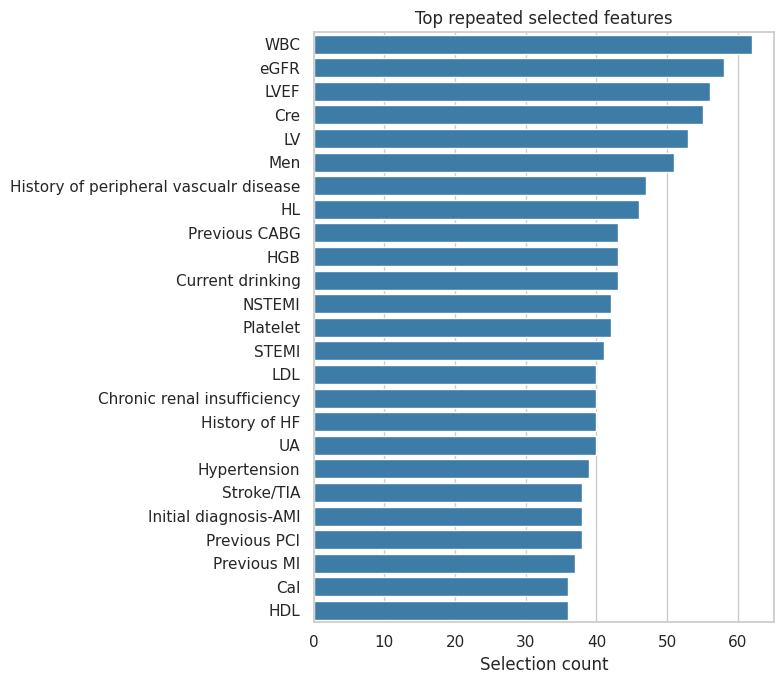

**Supplementary Figure S2.** Features most often written into `selector_summary_long`. `WBC`, `eGFR`, `LVEF`, `Cre`, `LV`, and `Men` dominate.

**Source file:** [02_ml_selectors/paper_figures/selector_top_repeated_features.png](02_ml_selectors/paper_figures/selector_top_repeated_features.png)

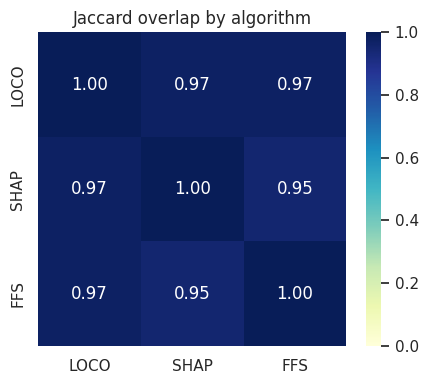

**Supplementary Figure S3.** Notebook Jaccard heatmap of selector unions. Paper restyle: Figure 2.

**Source file:** [02_ml_selectors/paper_figures/selector_overlap_heatmap.png](02_ml_selectors/paper_figures/selector_overlap_heatmap.png)

---

### 8. File index

| ID | Type | File |
| --- | --- | --- |
| Table 0 | Table | [paper_table0_classic_models.png](02_ml_selectors/paper_figures/paper_table0_classic_models.png) |
| Fig 1 | Figure | [paper_fig1_unique_counts.png](02_ml_selectors/paper_figures/paper_fig1_unique_counts.png) |
| Table 1 | Table | [paper_table1_common_by_algorithm.png](02_ml_selectors/paper_figures/paper_table1_common_by_algorithm.png) |
| Fig 2 | Figure | [paper_fig2_jaccard.png](02_ml_selectors/paper_figures/paper_fig2_jaccard.png) |
| Table 2 | Table | [paper_table2_consensus_by_model.png](02_ml_selectors/paper_figures/paper_table2_consensus_by_model.png) |
| Fig 3 | Figure | [paper_fig3_consensus_size.png](02_ml_selectors/paper_figures/paper_fig3_consensus_size.png) |
| Fig 4 | Figure | [paper_fig4_feature_by_model.png](02_ml_selectors/paper_figures/paper_fig4_feature_by_model.png) |
| Fig 5 | Figure | [paper_fig5_family_stacked.png](02_ml_selectors/paper_figures/paper_fig5_family_stacked.png) |
| Fig 6 | Figure | [paper_fig6_cross_model_common.png](02_ml_selectors/paper_figures/paper_fig6_cross_model_common.png) |
| Table 3 | Table | [paper_table3_union_by_model.png](02_ml_selectors/paper_figures/paper_table3_union_by_model.png) |
| Fig 7 | Figure | [paper_fig7_union_by_model.png](02_ml_selectors/paper_figures/paper_fig7_union_by_model.png) |
| Table 4 | Table | [paper_table4_global_common.png](02_ml_selectors/paper_figures/paper_table4_global_common.png) |
| Table 5 | Table | [paper_table5_priority_ranks_excerpt.png](02_ml_selectors/paper_figures/paper_table5_priority_ranks_excerpt.png) |
| Fig S1 | Supp. figure | [selector_model_algorithm_counts.png](02_ml_selectors/paper_figures/selector_model_algorithm_counts.png) |
| Fig S2 | Supp. figure | [selector_top_repeated_features.png](02_ml_selectors/paper_figures/selector_top_repeated_features.png) |
| Fig S3 | Supp. figure | [selector_overlap_heatmap.png](02_ml_selectors/paper_figures/selector_overlap_heatmap.png) |

---

*Numbers are taken from the executed outputs currently stored in `baseline_feature_selections.ipynb` (Kaggle smoke run, seven classic models, top-12).*

---

# Part 3. Statistical vs machine-learning feature extraction

## Statistical vs machine-learning feature extraction in VLST

This note compares **what was extracted** from the same VLST cohort by (i) classical statistical association tests and (ii) classic-model feature selectors, then explains **why the two catalogues only partly overlap**.

Sources: Part 1 (`eda.ipynb`) and Part 2 (`baseline_feature_selections.ipynb`).

**Asset root:** [03_stats_vs_ml/paper_figures/](03_stats_vs_ml/paper_figures/)

---

## Contents

1. [What each approach is asking](#1-what-each-approach-is-asking)
2. [How common are the extracted features?](#2-how-common-are-the-extracted-features)
3. [Features found by both approaches](#3-features-found-by-both-approaches)
4. [Statistical-only features](#4-statistical-only-features)
5. [Machine-learning-only features](#5-machine-learning-only-features)
6. [Domain pattern](#6-domain-pattern)
7. [Methodological reasons for disagreement](#7-methodological-reasons-for-disagreement)
8. [File index](#8-file-index)

---

### 1. What each approach is asking

The two pipelines are not two estimates of the same quantity. They optimize different questions on slightly different feature views.

| | Statistical EDA | Classic-model selectors |
| --- | --- | --- |
| **Question** | Does this column’s *marginal* distribution differ by VLST after multiplicity control? | If I train `lr` / `rf` / boosting, which columns does the *fitted model* need for hold-out PR-AUC / F1 / F2? |
| **Unit of evidence** | One test per feature (Welch, Mann–Whitney, χ² / Fisher) plus FDR | LOCO (refit without the column), coalition SHAP, greedy FFS |
| **Sample** | Full cohort, n ≈ 5,185, ~92 events | Same split protocol: train 3,629 / test 1,556 (64 / 28 events) |
| **Feature view** | Raw clinical columns | Scaled / encoded matrix (185 columns); `Time since stent implantation` dropped |
| **Discovery rule used here** | Univariate FDR q < 0.05 (plus a sparse multivariable logistic check) | Names in **LOCO ∩ SHAP ∩ FFS** top-12 for at least one model × metric |
| **Multiplicity** | Benjamini–Hochberg across the tested family | Implicit: top-12 of a 40-column LOCO pool (smoke run) |

**Statistical catalogue (n = 20, excluding time-at-risk).** Continuous FDR: `WBC`, `eGFR`, `LV`, `CKD5`, `No.of stents per lesion`, `HbA1c`, `NO.of vessels`, `Total stent length`, `Fiberinogen`. Binary FDR: `1.1:1Post dilation`, `No postdilation`, `CKD90`, `Previous PCI`, `3-vessel disease`, `Clopidogrel`, `Diabetes`, `PES`, `Multi-vessel CAD`, `Single-vessel disease`. Categorical: `Stent type-SES`. `Time since stent implantation` is the strongest univariate hit but is a follow-up / time-at-risk variable, not a baseline predictor, and is excluded from ML.

**ML consensus catalogue (n = 20).** Union of LOCO ∩ SHAP ∩ FFS names across logistic regression, random forests, CatBoost, XGBoost, and LightGBM: `WBC`, `eGFR`, `LV`, `Cre`, `Men`, `LVEF`, `Previous PCI`, `Fiberinogen`, `HGB`, `Platelet`, `HL`, `STEMI`, `Hypertension`, `Fast-Glu`, `TG`, `TCL`, `CaI`, `Min-stent diameter`, `Current drinking`, `History of HF`.

A looser ML set (**frequent selection**, top-repeated names in the selector log) additionally includes ACS presentation and history variables (`NSTEMI`, `UA`, `Previous MI`, `Previous CABG`, …) that are selected often but rarely survive the three-selector intersection.

---

### 2. How common are the extracted features?

Only **5 of 20** statistical FDR features also sit in the ML three-selector consensus. Conversely, **15 of 20** ML-consensus names fail univariate FDR. Jaccard overlap of the two 20-name sets is 5 / 35 ≈ **0.14**.

### Figure 1. Overlap of the two extraction catalogues

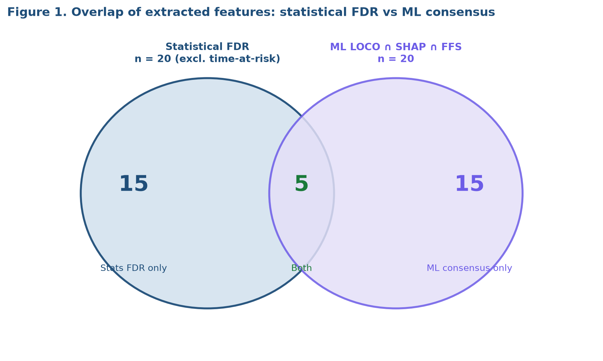

**Figure 1.** Left circle: univariate FDR q < 0.05 (time-since-stent excluded). Right circle: features in LOCO ∩ SHAP ∩ FFS top-12 for at least one classic model and metric. The intersection is `WBC`, `eGFR`, `LV`, `Fiberinogen`, `Previous PCI`.

**Source file:** [03_stats_vs_ml/paper_figures/fig1_venn_overlap.png](03_stats_vs_ml/paper_figures/fig1_venn_overlap.png)

### Figure 2. Presence by extractor

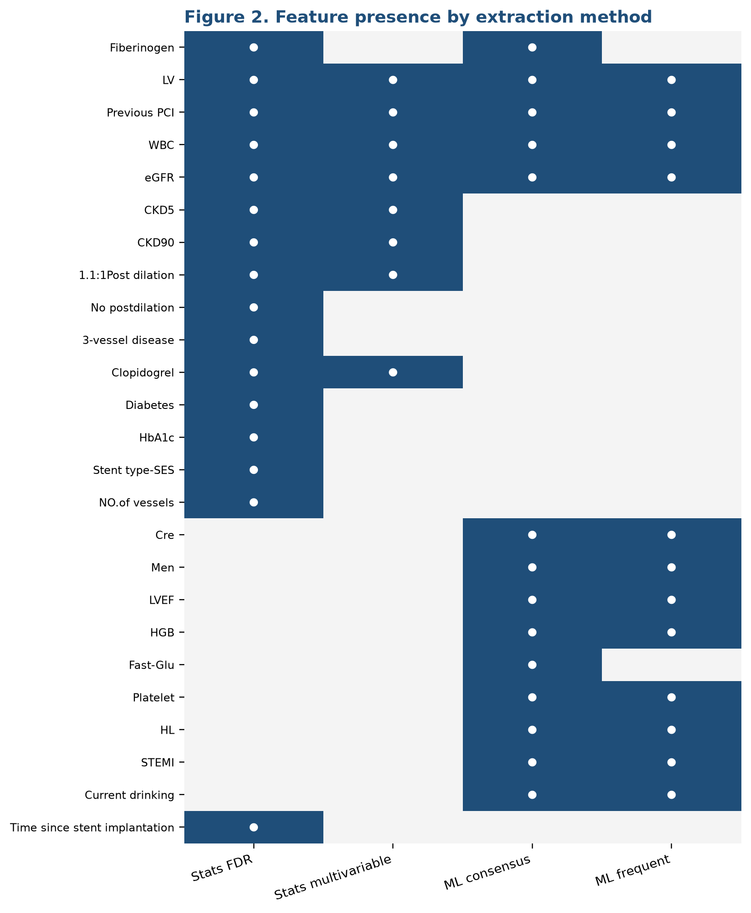

**Figure 2.** Navy cells mark membership. Columns: statistical FDR; statistical multivariable (bootstrap CI excluding 1 in the sparse logistic); ML consensus; ML frequent (top-repeated selector log). `Time since stent implantation` is statistical-only by construction (dropped before ML). `LVEF` and `Men` are ML-side even though they fail FDR.

**Source file:** [03_stats_vs_ml/paper_figures/fig2_presence_heatmap.png](03_stats_vs_ml/paper_figures/fig2_presence_heatmap.png)

### Table 1. Membership of every compared name

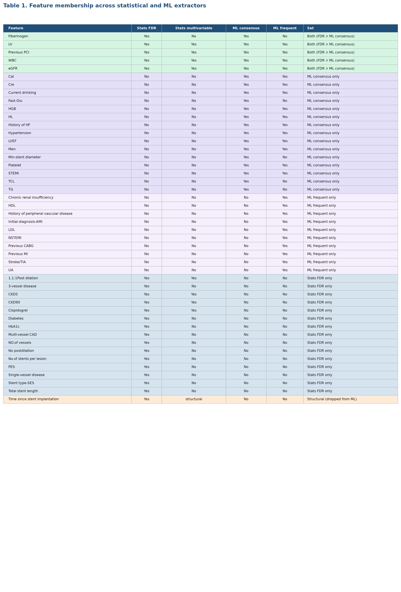

**Table 1.** Green = both catalogues; navy tint = stats FDR only; violet = ML consensus only; pale violet = ML frequent only; orange = structural time-at-risk.

**Source files:** [03_stats_vs_ml/paper_figures/table_feature_by_method.png](03_stats_vs_ml/paper_figures/table_feature_by_method.png), [03_stats_vs_ml/paper_figures/table_feature_by_method.csv](03_stats_vs_ml/paper_figures/table_feature_by_method.csv)

---

### 3. Features found by both approaches

These five names are the only ones that are both a **full-cohort association discovery** and a **predictive-model necessity**.

### Table 2. Shared features

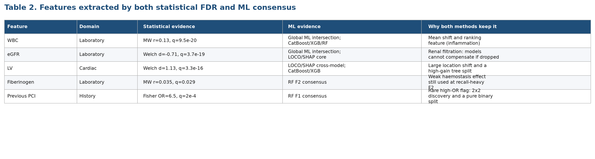

| Feature | Domain | Statistical evidence | ML evidence | Why both keep it |
| --- | --- | --- | --- | --- |
| WBC | Laboratory | MW r = 0.13, q = 9.5e-20 | In **every** model × selector union; CatBoost/XGB/RF consensus | Inflammation is a mean shift *and* a column models cannot replace |
| eGFR | Laboratory | Welch d = −0.71, q = 3.7e-19 | Global ML intersection; LOCO/SHAP core | Filtration: largest continuous effect; LOCO drop is costly |
| LV | Cardiac | Welch d = 1.13, q = 3.3e-16 | Cross-model LOCO/SHAP; CatBoost/XGB consensus | Large location shift and a high-gain tree split |
| Fiberinogen | Laboratory | MW r = 0.035, q = 0.029 | RF F2 consensus | Weak haemostasis signal; still used at a recall-heavy threshold |
| Previous PCI | History | Fisher OR = 6.5, q = 2e-4 | RF F1 consensus | Rare, high-OR binary: a 2×2 hit and a clean tree split |

**Source files:** [03_stats_vs_ml/paper_figures/table_shared_features.png](03_stats_vs_ml/paper_figures/table_shared_features.png), [03_stats_vs_ml/paper_figures/table_shared_features.csv](03_stats_vs_ml/paper_figures/table_shared_features.csv)

`WBC` and `eGFR` are the strictest ML global intersection (all seven models × all three selectors). That matches their position at the top of the FDR ranking. `Fiberinogen` and `Previous PCI` are weaker shared hits: they survive FDR but only some model families (mainly forests) put them in the three-way intersection.

---

### 4. Statistical-only features

Fifteen FDR discoveries never enter ML LOCO ∩ SHAP ∩ FFS. They are not “false”; they fail a *different* filter: a 12-column predictive shortlist on an encoded matrix, after a 40-column LOCO cap, on a 28-event test set.

### Table 3. FDR hits missing from ML consensus

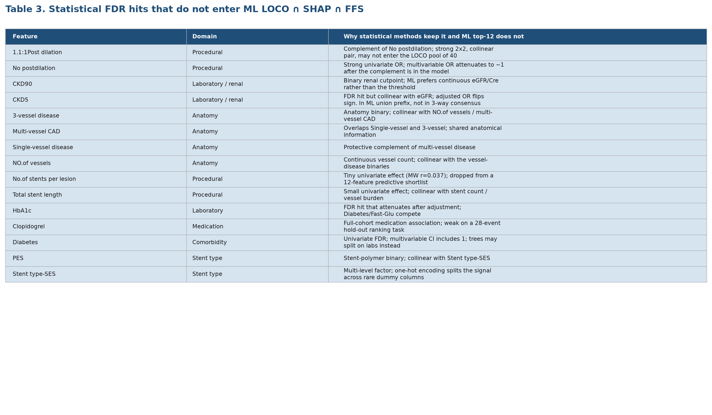

| Feature | Domain | Why statistics keeps it and ML top-12 does not |
| --- | --- | --- |
| 1.1:1Post dilation | Procedural | Strong 2×2 (OR 0.19); complement of `No postdilation`. Collinear pair; may never enter the LOCO pool of 40 |
| No postdilation | Procedural | Univariate OR 5.4; multivariable OR collapses toward 1 once the complement is modelled |
| CKD90 | Renal cutpoint | Binary threshold on the same axis as `eGFR`. ML keeps the continuous lab, not the cut |
| CKD5 | Renal cutpoint | FDR hit; adjusted OR *flips sign* (collinear with eGFR). In the ML union prefix, not in 3-way consensus |
| 3-vessel disease | Anatomy | χ² discovery; collinear with `NO.of vessels` / multi-vessel CAD |
| Multi-vessel CAD | Anatomy | Same information as single-vessel (complements) |
| Single-vessel disease | Anatomy | Protective complement of multi-vessel disease |
| NO.of vessels | Anatomy | Continuous count of the same anatomy cluster |
| No.of stents per lesion | Procedural | Tiny effect (MW r = 0.037); not competitive in a 12-feature predictive list |
| Total stent length | Procedural | Small effect; collinear with stent count / vessel burden |
| HbA1c | Laboratory | FDR hit that attenuates after adjustment (OR 0.87); Diabetes / Fast-Glu compete |
| Clopidogrel | Medication | Full-cohort drug association; weak for ranking 28 test events |
| Diabetes | Comorbidity | Univariate FDR; multivariable CI includes 1 |
| PES | Stent type | Polymer binary; collinear with `Stent type-SES` |
| Stent type-SES | Stent type | Multi-level factor; one-hot encoding *splits* the χ² signal across rare dummy columns |

**Source files:** [03_stats_vs_ml/paper_figures/table_stats_only.png](03_stats_vs_ml/paper_figures/table_stats_only.png), [03_stats_vs_ml/paper_figures/table_stats_only.csv](03_stats_vs_ml/paper_figures/table_stats_only.csv)

Three recurring mechanisms:

1. **Collinear families.** Univariate tests score *every* member of a redundant block (vessel-disease binaries, postdilation complements, CKD cutpoints vs eGFR, PES vs stent type). FDR can declare several of them significant. A fitted model only needs one representative, and greedy FFS / LOCO will keep the mate that helps hold-out metric, not every correlated twin.
2. **Encoding.** `Stent type-SES` is one χ² test on 9 levels. In the scaled ML view it becomes many sparse dummies; none of them ranks in a top-12 of 185 columns.
3. **Candidate-pool truncation.** Smoke-mode LOCO is capped at 40 columns. Procedural binaries that are not in that pool cannot appear in SHAP or FFS either, because those selectors are nested inside the LOCO-ranked universe.

---

### 5. Machine-learning-only features

Fifteen consensus names fail univariate FDR. ML is not “finding associations the tests missed” in the NHST sense; it is finding **columns that change a model’s hold-out score**, including surrogates, interactions, and weak splits.

### Table 4. ML consensus names that fail FDR

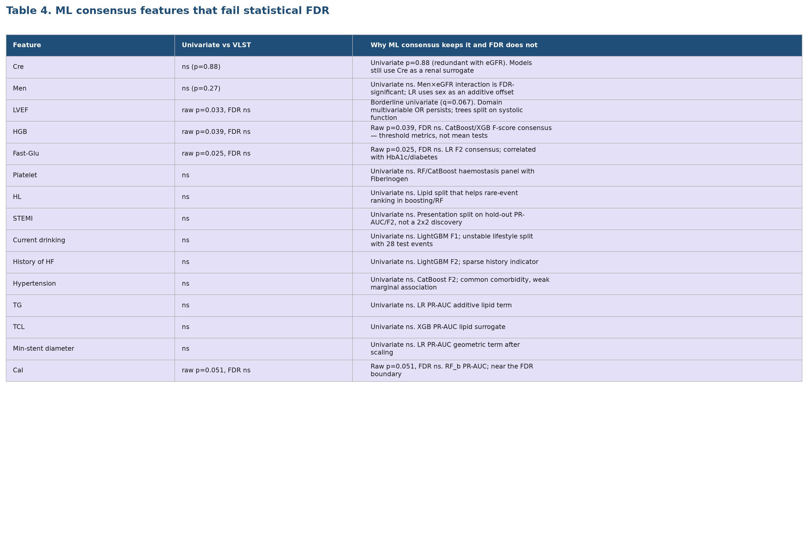

| Feature | Univariate vs VLST | Why ML consensus keeps it and FDR does not |
| --- | --- | --- |
| Cre | ns (p = 0.88) | Redundant with eGFR marginally; still a renal surrogate when eGFR is noisy or left out |
| Men | ns (p = 0.27) | `Men × eGFR` interaction is FDR-significant in the EDA screen; LR uses sex as an additive offset |
| LVEF | raw p = 0.033, FDR ns | Borderline mean test; domain multivariable OR persists; trees split on systolic function |
| HGB | raw p = 0.039, FDR ns | CatBoost/XGB F-score consensus: thresholded metrics, not a location test |
| Fast-Glu | raw p = 0.025, FDR ns | LR F2; correlated with HbA1c / diabetes (those *do* pass FDR) |
| Platelet | ns | RF/CatBoost haemostasis panel with Fiberinogen |
| HL | ns | Lipid split that helps rare-event ranking in boosting / RF |
| STEMI | ns | Presentation split on hold-out PR-AUC/F2, not a 2×2 discovery |
| Current drinking | ns | LightGBM F1; lifestyle split, unstable with 28 test events |
| History of HF | ns | LightGBM F2; sparse history indicator |
| Hypertension | ns | CatBoost F2; common comorbidity, weak marginal φ |
| TG | ns | LR PR-AUC additive lipid term |
| TCL | ns | XGB PR-AUC lipid surrogate |
| Min-stent diameter | ns | LR PR-AUC geometric term after scaling |
| CaI | raw p = 0.051, FDR ns | RF_b PR-AUC; sits on the FDR boundary |

**Source files:** [03_stats_vs_ml/paper_figures/table_ml_only.png](03_stats_vs_ml/paper_figures/table_ml_only.png), [03_stats_vs_ml/paper_figures/table_ml_only.csv](03_stats_vs_ml/paper_figures/table_ml_only.csv)

Three recurring mechanisms:

1. **Surrogates of a stronger FDR hit.** `Cre` carries almost no univariate VLST signal because `eGFR` already does. A linear or tree model that cannot use eGFR (or that splits on creatinine first) will still list Cre. That is predictive redundancy, not a new biological discovery.
2. **Interactions and offsets that univariate tests do not see.** `Men` is not associated with VLST on its own (p = 0.27), but `Men × eGFR` is an FDR-significant interaction in the EDA screen, and the domain joint logistic gives Men an adjusted OR of 3.3. Logistic regression’s consensus (`Cre`, `Men`, …) is that interaction/offset showing up as a main-effect column.
3. **Different error and sample.** FDR is a full-cohort mean/2×2 statement with ~92 events. LOCO/SHAP/FFS optimize PR-AUC or F2 on 28 test events. Weak ACS/history/lipid splits can move that metric without moving a χ² p-value across the FDR line. LightGBM’s consensus (`Current drinking`, `History of HF`, `HL`) is the clearest example of metric-and-hold-out artefacts.

---

### 6. Domain pattern

### Figure 4. Extracted counts by clinical domain

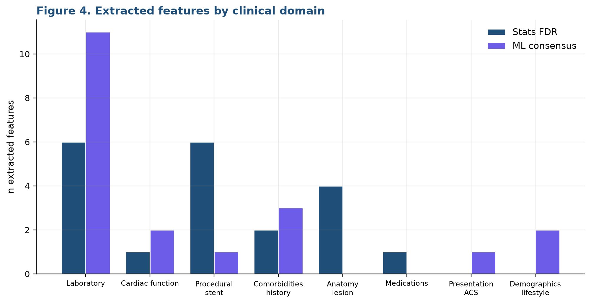

**Figure 4.** Statistical FDR is concentrated in laboratory, procedural/stent, and anatomy blocks (the EDA domain screen). ML consensus is heavier on laboratory *plus* cardiac function, demographics, and ACS presentation, and almost empty on anatomy binaries and medications. That is the collinear-family vs surrogate/interaction split from sections 4–5, drawn by domain.

**Source file:** [03_stats_vs_ml/paper_figures/fig4_domain_counts.png](03_stats_vs_ml/paper_figures/fig4_domain_counts.png)

Statistics therefore “owns” **stent technique and anatomy coding** (postdilation, vessel-disease labels, stent type). Machine learning “owns” **cardiac function twins** (`LVEF` next to `LV`), **sex**, and **labs that are collinear with FDR hits** (`Cre`, `HGB`, lipids). Both own **WBC, eGFR, LV**.

---

### 7. Methodological reasons for disagreement

### Figure 3. Buckets

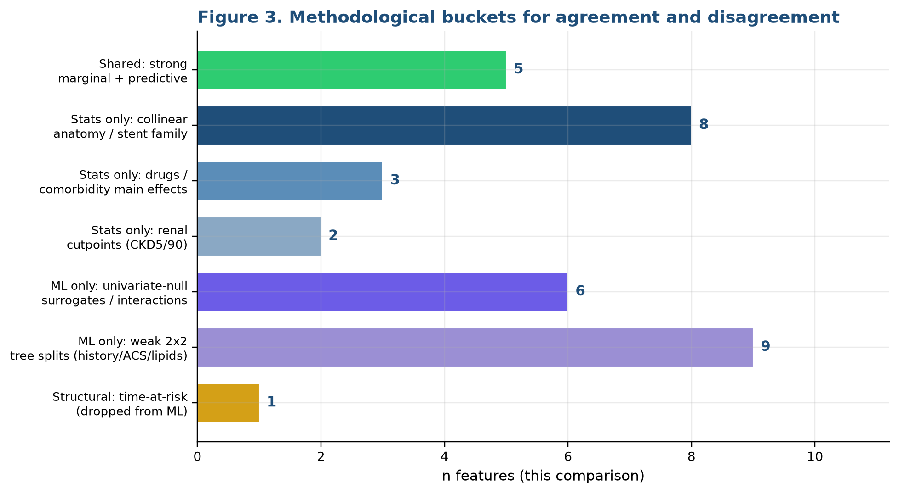

**Figure 3.** Counts of names in this comparison assigned to a primary methodological bucket (one bucket per feature; the anatomy/stent collinear family is grouped).

**Source file:** [03_stats_vs_ml/paper_figures/fig3_reason_buckets.png](03_stats_vs_ml/paper_figures/fig3_reason_buckets.png)

**Why a feature can appear in statistics and not in ML**

- Univariate tests do not penalize redundancy. FDR will list `3-vessel disease`, `Multi-vessel CAD`, `Single-vessel disease`, and `NO.of vessels` if each 2×2/t-test is small. A model only needs one of them.
- Complements are two encodings of one bit (`1.1:1Post dilation` vs `No postdilation`). χ² sees both; multivariable logistic already showed the pair is not independently identified.
- Categorical χ² on `Stent type-SES` does not survive one-hot fragmentation in 185 columns.
- The ML smoke run never scores the full 185-column matrix with LOCO (cap 40). Absence from consensus is sometimes “not in the pool,” not “the model disproved the association.”
- Hold-out PR-AUC with 28 events is under-powered for moderate ORs (Clopidogrel 0.50, Diabetes 1.89) that FDR can still detect on 92 events.

**Why a feature can appear in ML and not in statistics**

- Predictive importance is not a marginal p-value. LOCO asks whether the *rest of the model* can compensate after a refit. SHAP asks for coalition credit. FFS asks for greedy hold-out gain. None of these is a two-sample test.
- Correlated twins: the univariate test of `Cre` is null because `eGFR` already captures renal function; the model may still split on Cre.
- Interactions: `Men × eGFR` is an EDA FDR hit; univariate `Men` is not. LR consensus includes `Men`.
- Operating-point metrics (F1/F2) promote labs that shift a decision threshold (`HGB`, `Platelet`) even when the mean difference is FDR-small.
- LightGBM’s leaf-wise default disagrees with CatBoost/XGBoost (no `LV`/`eGFR` in its three-way intersection). Some ML-only names are **algorithm artefacts**, not cohort discoveries.

**Practical reading.** Treat the 5-name intersection (`WBC`, `eGFR`, `LV`, `Fiberinogen`, `Previous PCI`) as the robust extraction set: associated in the cohort *and* used by fitted classic models. Treat statistical-only anatomy/stent/drug names as **association findings that need a non-redundant representative** before they enter a predictor. Treat ML-only names as **hypothesis-generating predictive correlates** until they pass a pre-specified association or external-validation bar.

---

### 8. File index

| ID | Type | File |
| --- | --- | --- |
| Fig 1 | Figure | [fig1_venn_overlap.png](03_stats_vs_ml/paper_figures/fig1_venn_overlap.png) |
| Fig 2 | Figure | [fig2_presence_heatmap.png](03_stats_vs_ml/paper_figures/fig2_presence_heatmap.png) |
| Table 1 | Table | [table_feature_by_method.png](03_stats_vs_ml/paper_figures/table_feature_by_method.png) |
| Table 2 | Table | [table_shared_features.png](03_stats_vs_ml/paper_figures/table_shared_features.png) |
| Table 3 | Table | [table_stats_only.png](03_stats_vs_ml/paper_figures/table_stats_only.png) |
| Table 4 | Table | [table_ml_only.png](03_stats_vs_ml/paper_figures/table_ml_only.png) |
| Fig 3 | Figure | [fig3_reason_buckets.png](03_stats_vs_ml/paper_figures/fig3_reason_buckets.png) |
| Fig 4 | Figure | [fig4_domain_counts.png](03_stats_vs_ml/paper_figures/fig4_domain_counts.png) |

---

*Statistical names: univariate FDR q < 0.05 from `eda.ipynb` (time-since-stent excluded from the overlap count). ML names: LOCO ∩ SHAP ∩ FFS top-12 from the smoke run of `baseline_feature_selections.ipynb` (seven classic models). Re-run either notebook in full mode if the catalogues change, then refresh this comparison.*

---
