# Classic-model feature selection — paper figures and tables

This document gathers publication-oriented figures and tables from the multi-model feature selectors in `baseline_feature_selections.ipynb`.

**Cohort / protocol.** Same VLST records, n = 5,185, stratified 70/30 (`random_state=42`): train 3,629 (64 events) / test 1,556 (28 events). Target = `Stent thrombosis`. `Time since stent implantation` is dropped. This is **not** the TabPFN playground notebook (out of scope). Models use the **scaled** view: `ColumnTransformer` one-hots the **raw 106** `Stent type-SES` strings (EDA instead collapses to 9 levels) and then `StandardScaler` → **185 columns**. Median / most-frequent imputers sit in that transformer; the CSV has **no missing values**, so they are inert. The stored notebook run is `RUN_MODE="smoke"` with **top-12** features per model × selector × metric. TabPFN was configured but **unavailable** in that run. Selector hyperparameters are the notebook’s own factories (`C=2`, RF 500 trees, `lr=0.05`, 200/400 rounds) — **not** `GridSearchCV` winners from `baseline_without_tssi.ipynb`.

**Methods note — stored figures vs current code.** Figures and tables below are the **stored smoke run**. In that run, LOCO’s 40-column cap was the first 40 columns in **ColumnTransformer output order** (23 continuous, then the first 17 binaries); SHAP’s coalition metric used **all 28 test events plus 4 random controls** (87.5% prevalence). The notebook **code** has since been changed (not re-run): selectors score on an inner hold-out of train (`INNER_VAL_SIZE=0.2`, `y_test` unused); the LOCO cap is cheap **train** importance, not column order; SHAP draws a stratified inner-val sample at train prevalence. Do not read these figures as if they already used the new protocol.

**Selectors (intent of the current code; figures are the old run).** LOCO = drop-one and refit, scored on the inner hold-out. Coalition SHAP and FFS are nested in LOCO’s top pool as a **compute cap**, not because those models “read LOCO’s answer.” Objectives: `pr_auc`, `f1`, `f2` — **PR-AUC is the ranking metric aligned with Part 4**; F1/F2 are extra operating-point views, not inferential tests. Wald / GLM standard errors are not applicable to tree selectors. These catalogues do **not** feed Part 4 (nested-CV uses all 81 raw features, not this 185-column mask). SMOTE is not used.

**Asset root:** [paper_figures/](paper_figures/)

---

## Contents

1. [Classic models (Table 0)](#1-classic-models)
2. [How much each selector keeps (Figure 1, Table 3, Figure 7)](#2-how-much-each-selector-keeps)
3. [Cross-model consensus (Table 1, Figure 6, Figure 2)](#3-cross-model-consensus)
4. [Within-model consensus, by classic model (Table 2, Figures 3–5)](#4-within-model-consensus-by-classic-model)
5. [Global intersection (Table 4)](#5-global-intersection)
6. [Priority-feature ranks (Table 5)](#6-priority-feature-ranks)
7. [Notebook compact plots (supplementary)](#7-notebook-compact-plots-supplementary)
8. [File index](#8-file-index)

---

## 1. Classic models

### Table 0. Models used in the selector notebook

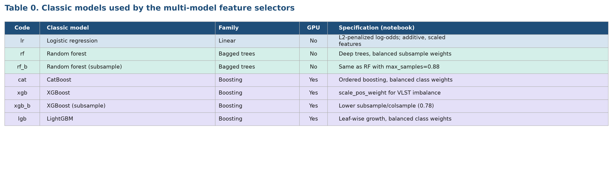

**Table 0.** Seven sklearn-style classifiers from the notebook `MODEL_SPECS` (TabPFN omitted). Row colour encodes family: linear (navy), bagged trees (teal), boosting (violet). All seven share the same scaled feature matrix; only the inductive bias changes.

| Code | Classic model | Family | GPU | Specification (notebook) |
| --- | --- | --- | --- | --- |
| lr | Logistic regression | Linear | No | L2-penalized log-odds (C=2, balanced); additive on scaled features |
| rf | Random forest | Bagged trees | No | 500 deep trees, class_weight=balanced_subsample |
| rf_b | Random forest (subsample) | Bagged trees | No | Same as RF with max_samples=0.88 |
| cat | CatBoost | Boosting | Yes | Ordered boosting, balanced class weights |
| xgb | XGBoost | Boosting | Yes | scale_pos_weight for VLST imbalance |
| xgb_b | XGBoost (subsample) | Boosting | Yes | Lower subsample / colsample_bytree (0.78) |
| lgb | LightGBM | Boosting | Yes | Leaf-wise growth, balanced class weights |

**How to read later tables through this lens.**

- **Logistic regression** can only use additive log-odds. LOCO/SHAP/FFS therefore highlight columns that still matter after linear sharing of credit (often one of a correlated pair, plus sex/lipids/renal labs).
- **Random forests** split on interactions and can keep both a lab and its clinical twin. Consensus tends to sit on cardiac function (`LV` / `LVEF`), inflammation (`WBC`), and renal filtration (`eGFR`).
- **Boosting** (CatBoost / XGBoost / LightGBM) is the same tree idea with sequential residual fitting. CatBoost and XGBoost agree most often on `LV`, `WBC`, and `eGFR`; LightGBM’s three-way intersection is more metric-specific.

**Source files:** [paper_figures/paper_table0_classic_models.png](paper_figures/paper_table0_classic_models.png), [paper_figures/paper_table0_classic_models.csv](paper_figures/paper_table0_classic_models.csv)

---

## 2. How much each selector keeps

LOCO is run on a capped pool (`LOCO_MAX_FEATURES=40` in smoke mode), so every model reports **40** unique LOCO features once all three metrics are pooled. SHAP and FFS are nested inside that pool (SHAP universe 24; FFS candidate pool 30; both take top-12 per metric), so they keep fewer unique names.

### Figure 1. Unique selected features by classic model and selector

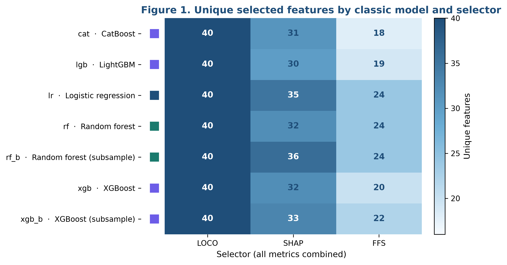

**Figure 1.** Unique feature counts after pooling `pr_auc`, `f1`, and `f2`. Squares on the left mark family (navy = linear, teal = bagged trees, violet = boosting). LOCO saturates the 40-feature cap for every model **because the stored run evaluated a 40-column prefix**, not because 40 features were independently important. FFS is the sparsest (18–24 unique names). SHAP sits in between (30–36). Linear and subsampled RF keep slightly larger SHAP/FFS unions than boosting.

| Model | Family | LOCO | SHAP | FFS |
| --- | --- | ---: | ---: | ---: |
| lr | Linear | 40 | 35 | 24 |
| rf | Bagged trees | 40 | 32 | 24 |
| rf_b | Bagged trees | 40 | 36 | 24 |
| cat | Boosting | 40 | 31 | 18 |
| xgb | Boosting | 40 | 32 | 20 |
| xgb_b | Boosting | 40 | 33 | 22 |
| lgb | Boosting | 40 | 30 | 19 |

**Source file:** [paper_figures/paper_fig1_unique_counts.png](paper_figures/paper_fig1_unique_counts.png)

### Table 3. Union size per classic model

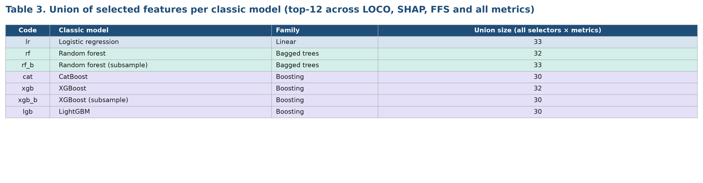

**Table 3.** Size of the union of top-12 sets across LOCO, SHAP, FFS and all three metrics. Logistic regression and subsampled RF have the largest unions (33); boosting models are slightly tighter (30–32).

| Code | Classic model | Family | Union size |
| --- | --- | --- | ---: |
| lr | Logistic regression | Linear | 33 |
| rf | Random forest | Bagged trees | 32 |
| rf_b | Random forest (subsample) | Bagged trees | 33 |
| cat | CatBoost | Boosting | 30 |
| xgb | XGBoost | Boosting | 32 |
| xgb_b | XGBoost (subsample) | Boosting | 30 |
| lgb | LightGBM | Boosting | 30 |

**Source files:** [paper_figures/paper_table3_union_by_model.png](paper_figures/paper_table3_union_by_model.png), [paper_figures/paper_table3_union_by_model.csv](paper_figures/paper_table3_union_by_model.csv)

### Figure 7. Union size (same numbers as Table 3)

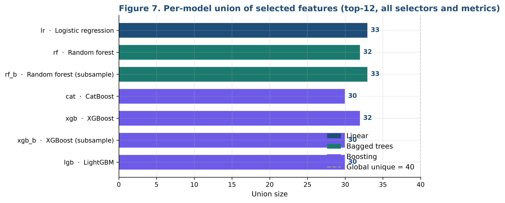

**Figure 7.** Per-model unions relative to the global unique count of 40 (dashed line). No classic model recovers the full 40-name union on its own.

**Source file:** [paper_figures/paper_fig7_union_by_model.png](paper_figures/paper_fig7_union_by_model.png)

---

## 3. Cross-model consensus

A feature is “shared by all 7 models” only if it appears in every classic model’s top-12 for that selector and metric.

### Table 1. Features shared by all classic models

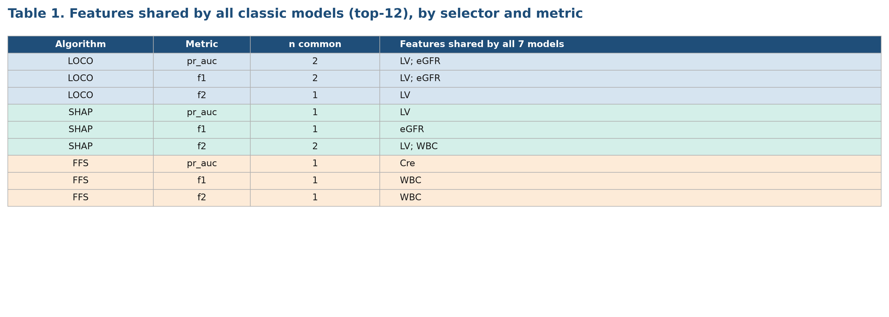

**Table 1.** Cross-model intersection (row colour = selector). At most two names survive. LOCO agrees on `LV` and `eGFR` for PR-AUC and F1; F2 keeps only `LV`. SHAP centres on `LV` / `eGFR` and adds `WBC` on F2. FFS shares only a single lab across all seven models: `Cre` on PR-AUC, `WBC` on F1/F2.

| Algorithm | Metric | n common | Features shared by all 7 models |
| --- | --- | ---: | --- |
| LOCO | pr_auc | 2 | LV; eGFR |
| LOCO | f1 | 2 | LV; eGFR |
| LOCO | f2 | 1 | LV |
| SHAP | pr_auc | 1 | LV |
| SHAP | f1 | 1 | eGFR |
| SHAP | f2 | 2 | LV; WBC |
| FFS | pr_auc | 1 | Cre |
| FFS | f1 | 1 | WBC |
| FFS | f2 | 1 | WBC |

**Source files:** [paper_figures/paper_table1_common_by_algorithm.png](paper_figures/paper_table1_common_by_algorithm.png), [paper_figures/paper_table1_common_by_algorithm.csv](paper_figures/paper_table1_common_by_algorithm.csv)

### Figure 6. Same intersection as bars

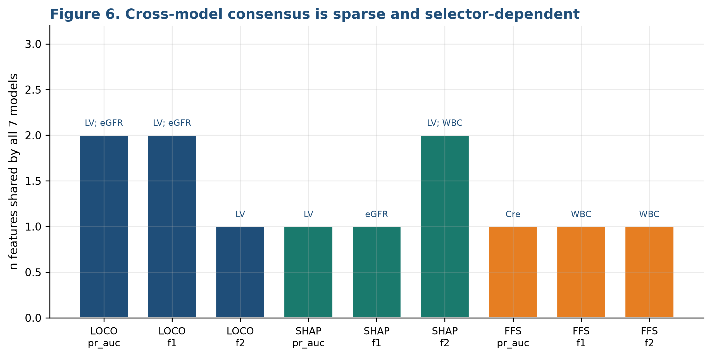

**Figure 6.** Bar height is `n common` from Table 1; labels are the shared names. LOCO/SHAP recover cardiac–renal structure; FFS recovers a single laboratory marker.

**Source file:** [paper_figures/paper_fig6_cross_model_common.png](paper_figures/paper_fig6_cross_model_common.png)

### Figure 2. Jaccard overlap of selector unions

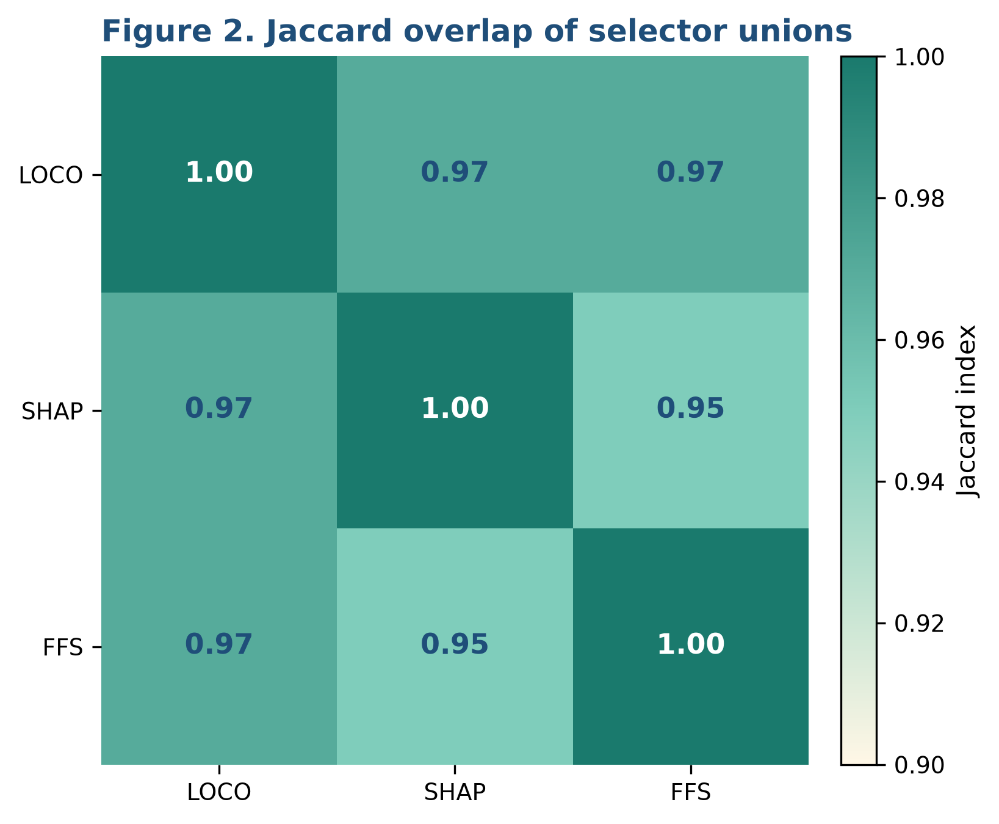

**Figure 2.** Jaccard index between the unions of top-12 sets (all models and metrics pooled). Overlap is high (0.95–0.97) because the three selectors are nested in the same LOCO-ranked pool. High union overlap does not imply a large cross-model intersection (Table 1).

**Source file:** [paper_figures/paper_fig2_jaccard.png](paper_figures/paper_fig2_jaccard.png)

---

## 4. Within-model consensus, by classic model

Here the intersection is inside one model: names that LOCO, SHAP, and FFS all put in that model’s top-12 for a given metric.

### Table 2. LOCO ∩ SHAP ∩ FFS per model and metric

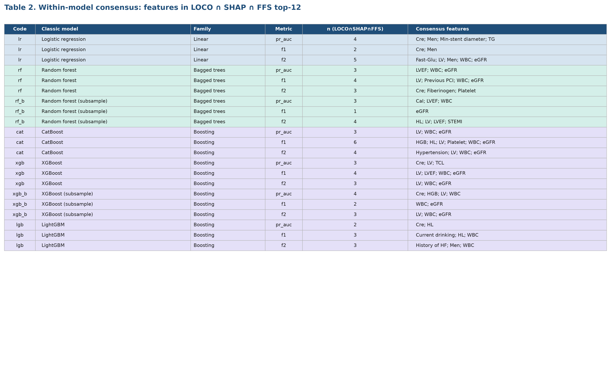

**Table 2.** Within-model three-selector consensus. Row colour = family. CatBoost has the largest F1 consensus (6 names); subsampled RF has the smallest (only `eGFR` on F1).

| Code | Classic model | Family | Metric | n (LOCO ∩ SHAP ∩ FFS) | Consensus features |
| --- | --- | --- | --- | ---: | --- |
| lr | Logistic regression | Linear | pr_auc | 4 | Cre; Men; Min-stent diameter; TG |
| lr | Logistic regression | Linear | f1 | 2 | Cre; Men |
| lr | Logistic regression | Linear | f2 | 5 | Fast-Glu; LV; Men; WBC; eGFR |
| rf | Random forest | Bagged trees | pr_auc | 3 | LVEF; WBC; eGFR |
| rf | Random forest | Bagged trees | f1 | 4 | LV; Previous PCI; WBC; eGFR |
| rf | Random forest | Bagged trees | f2 | 3 | Cre; Fiberinogen; Platelet |
| rf_b | Random forest (subsample) | Bagged trees | pr_auc | 3 | CaI; LVEF; WBC |
| rf_b | Random forest (subsample) | Bagged trees | f1 | 1 | eGFR |
| rf_b | Random forest (subsample) | Bagged trees | f2 | 4 | HL; LV; LVEF; STEMI |
| cat | CatBoost | Boosting | pr_auc | 3 | LV; WBC; eGFR |
| cat | CatBoost | Boosting | f1 | 6 | HGB; HL; LV; Platelet; WBC; eGFR |
| cat | CatBoost | Boosting | f2 | 4 | Hypertension; LV; WBC; eGFR |
| xgb | XGBoost | Boosting | pr_auc | 3 | Cre; LV; TCL |
| xgb | XGBoost | Boosting | f1 | 4 | LV; LVEF; WBC; eGFR |
| xgb | XGBoost | Boosting | f2 | 3 | LV; WBC; eGFR |
| xgb_b | XGBoost (subsample) | Boosting | pr_auc | 4 | Cre; HGB; LV; WBC |
| xgb_b | XGBoost (subsample) | Boosting | f1 | 2 | WBC; eGFR |
| xgb_b | XGBoost (subsample) | Boosting | f2 | 3 | LV; WBC; eGFR |
| lgb | LightGBM | Boosting | pr_auc | 2 | Cre; HL |
| lgb | LightGBM | Boosting | f1 | 3 | Current drinking; HL; WBC |
| lgb | LightGBM | Boosting | f2 | 3 | History of HF; Men; WBC |

**Source files:** [paper_figures/paper_table2_consensus_by_model.png](paper_figures/paper_table2_consensus_by_model.png), [paper_figures/paper_table2_consensus_by_model.csv](paper_figures/paper_table2_consensus_by_model.csv)

### Figure 3. Consensus-set size

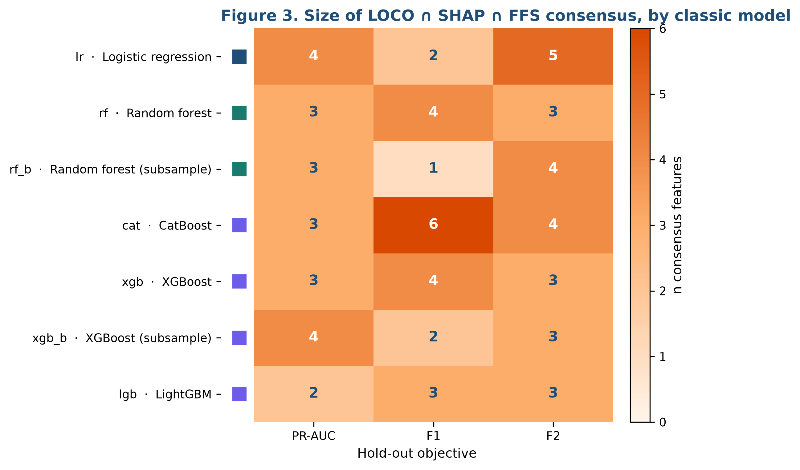

**Figure 3.** Heatmap of `n (LOCO ∩ SHAP ∩ FFS)` from Table 2. Darker orange = more names on which all three selectors agree for that classic model.

**Source file:** [paper_figures/paper_fig3_consensus_size.png](paper_figures/paper_fig3_consensus_size.png)

### Figure 4. Which features each classic model agrees on

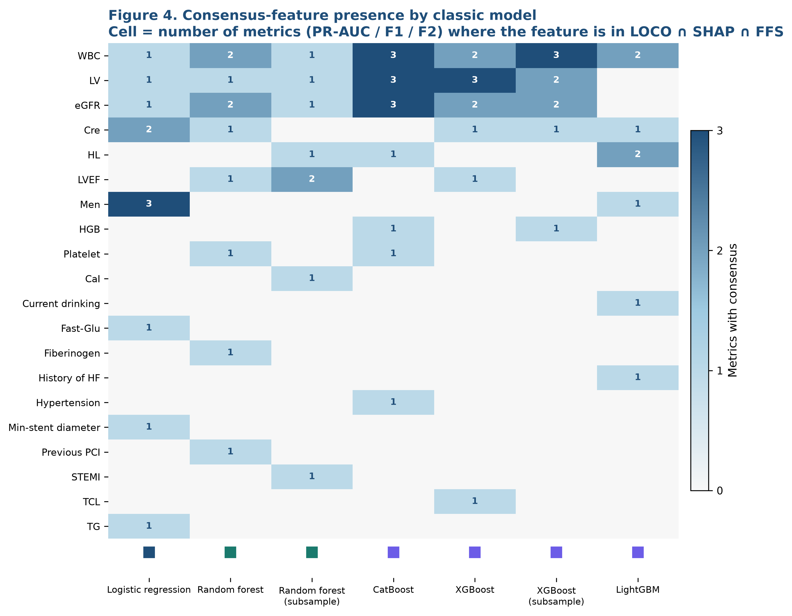

**Figure 4.** Cell = number of metrics (0–3) in which the feature is in that model’s LOCO ∩ SHAP ∩ FFS set. Squares under the x-axis mark family.

**Source file:** [paper_figures/paper_fig4_feature_by_model.png](paper_figures/paper_fig4_feature_by_model.png)

### Figure 5. Family stacked counts

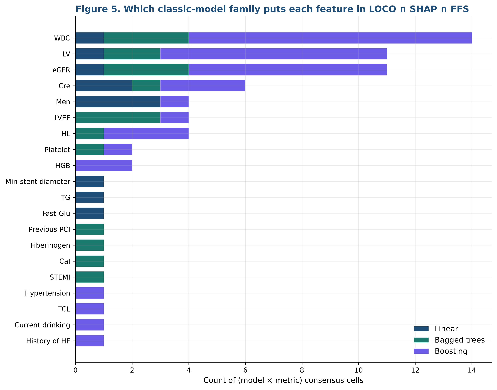

**Figure 5.** For each consensus feature, how many (model × metric) cells come from linear vs bagged trees vs boosting. `WBC`, `LV`, and `eGFR` have support in all three families. `Men` is linear-dominant. `LVEF` is bagged-tree-dominant.

**Source file:** [paper_figures/paper_fig5_family_stacked.png](paper_figures/paper_fig5_family_stacked.png)

### Reading Table 2 / Figures 3–5 by classic model

**Logistic regression (`lr`).** The linear three-selector core is creatinine + male sex on PR-AUC and F1, with stent diameter and triglycerides on PR-AUC. On F2 the consensus expands to `Fast-Glu`, `LV`, `Men`, `WBC`, `eGFR`. `Men` is almost unique to LR in Figure 4.

**Random forest (`rf`).** PR-AUC consensus is `LVEF`, `WBC`, `eGFR`. F1 adds `LV` and `Previous PCI`. F2 shifts toward haemostasis labs (`Cre`, `Fiberinogen`, `Platelet`).

**Random forest, subsampled (`rf_b`).** Less stable: F1 consensus shrinks to `eGFR` alone. Treat `rf_b` as a sensitivity check on `rf`.

**CatBoost (`cat`).** Most internally consistent booster: `LV`, `WBC`, and `eGFR` appear in all three metrics. F1 also agrees on `HGB`, `HL`, and `Platelet`; F2 adds `Hypertension`.

**XGBoost (`xgb` / `xgb_b`).** Both recover `LV` / `WBC` / `eGFR` on F1 and F2. PR-AUC consensus is more lipid/renal (`Cre`, `TCL` or `HGB`).

**LightGBM (`lgb`).** Does not put `LV` or `eGFR` in the three-way intersection. Consensus is `Cre; HL` (PR-AUC), `Current drinking; HL; WBC` (F1), and `History of HF; Men; WBC` (F2).

---

## 5. Global intersection

### Table 4. Strictest intersection vs global union

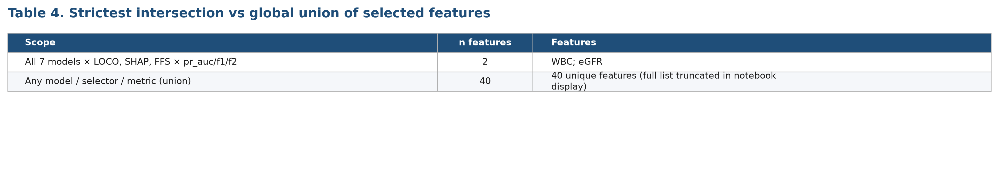

**Table 4.** Features that appear in every model × selector union (all metrics pooled) are only `WBC` and `eGFR`. The complementary union is 40 unique names.

| Scope | n features | Features |
| --- | ---: | --- |
| All 7 models × LOCO, SHAP, FFS × all metrics | 2 | WBC; eGFR |
| Any model / selector / metric (union) | 40 | 40 unique names (full string truncated in notebook HTML) |

**Source files:** [paper_figures/paper_table4_global_common.png](paper_figures/paper_table4_global_common.png), [paper_figures/paper_table4_global_common.csv](paper_figures/paper_table4_global_common.csv)

---

## 6. Priority-feature ranks

The notebook scores a hand-specified `PRIORITY_FEATURES` list against each model × selector ranking. The stored display is the first 20 rows: CatBoost × LOCO, `pr_auc` then `f1`.

### Table 5. Priority ranks (display excerpt)

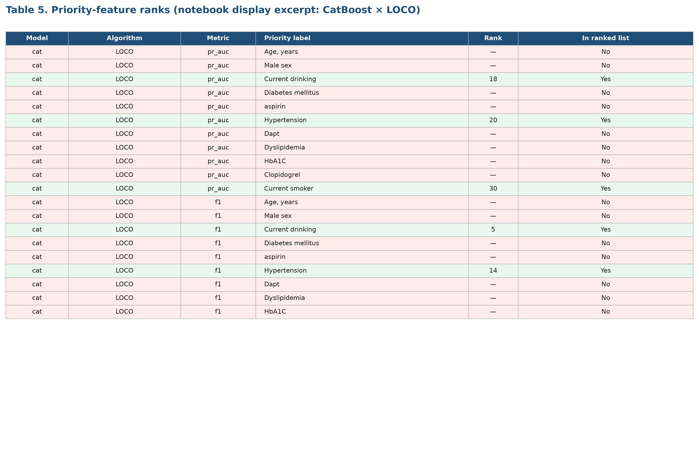

**Table 5.** Green = the priority label was found in CatBoost’s LOCO ranking; red = not found. Most labels miss because they do not match the scaled column names (`Age, years` vs `Age`, `Male sex` vs `Men`). Hits: Current drinking, Hypertension, Current smoker.

| Model | Algorithm | Metric | Priority label | Rank | In ranked list |
| --- | --- | --- | --- | --- | --- |
| cat | LOCO | pr_auc | Age, years | — | No |
| cat | LOCO | pr_auc | Male sex | — | No |
| cat | LOCO | pr_auc | Current drinking | 18 | Yes |
| cat | LOCO | pr_auc | Diabetes mellitus | — | No |
| cat | LOCO | pr_auc | aspirin | — | No |
| cat | LOCO | pr_auc | Hypertension | 20 | Yes |
| cat | LOCO | pr_auc | Dapt | — | No |
| cat | LOCO | pr_auc | Dyslipidemia | — | No |
| cat | LOCO | pr_auc | HbA1C | — | No |
| cat | LOCO | pr_auc | Clopidogrel | — | No |
| cat | LOCO | pr_auc | Current smoker | 30 | Yes |
| cat | LOCO | f1 | Age, years | — | No |
| cat | LOCO | f1 | Male sex | — | No |
| cat | LOCO | f1 | Current drinking | 5 | Yes |
| cat | LOCO | f1 | Diabetes mellitus | — | No |
| cat | LOCO | f1 | aspirin | — | No |
| cat | LOCO | f1 | Hypertension | 14 | Yes |
| cat | LOCO | f1 | Dapt | — | No |
| cat | LOCO | f1 | Dyslipidemia | — | No |
| cat | LOCO | f1 | HbA1C | — | No |

**Source files:** [paper_figures/paper_table5_priority_ranks_excerpt.png](paper_figures/paper_table5_priority_ranks_excerpt.png), [paper_figures/paper_table5_priority_ranks_excerpt.csv](paper_figures/paper_table5_priority_ranks_excerpt.csv)

---

## 7. Notebook compact plots (supplementary)

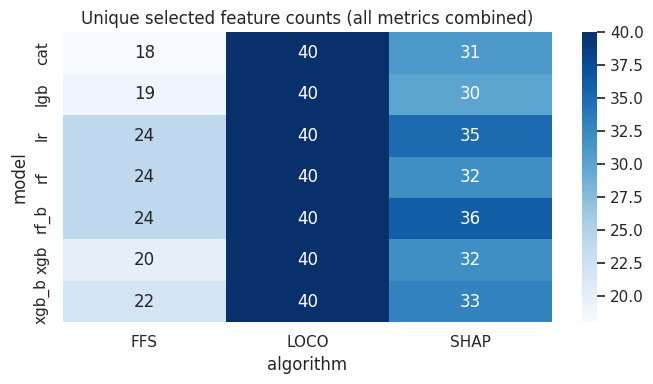

**Supplementary Figure S1.** Notebook heatmap of unique selected-feature counts (all metrics combined). Paper restyle: Figure 1.

**Source file:** [paper_figures/selector_model_algorithm_counts.png](paper_figures/selector_model_algorithm_counts.png)

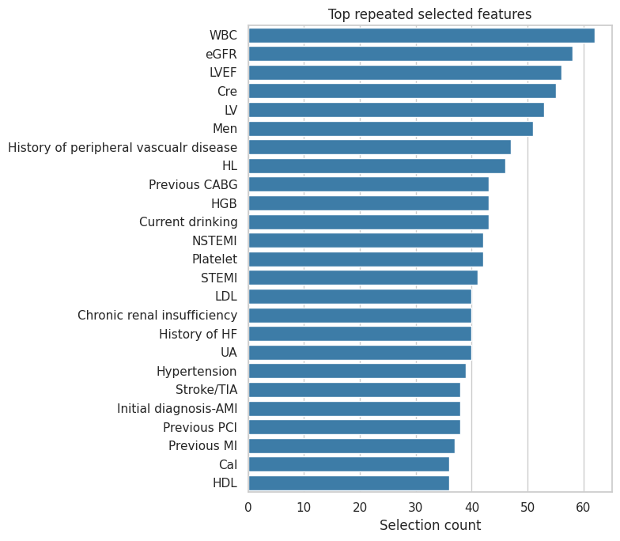

**Supplementary Figure S2.** Features most often written into `selector_summary_long`. `WBC`, `eGFR`, `LVEF`, `Cre`, `LV`, and `Men` dominate.

**Source file:** [paper_figures/selector_top_repeated_features.png](paper_figures/selector_top_repeated_features.png)

**Supplementary Figure S3.** Notebook Jaccard heatmap of selector unions. Paper restyle: Figure 2.

**Source file:** [paper_figures/selector_overlap_heatmap.png](paper_figures/selector_overlap_heatmap.png)

---

## 8. File index

| ID | Type | File |
| --- | --- | --- |
| Table 0 | Table | [paper_table0_classic_models.png](paper_figures/paper_table0_classic_models.png) |
| Fig 1 | Figure | [paper_fig1_unique_counts.png](paper_figures/paper_fig1_unique_counts.png) |
| Table 1 | Table | [paper_table1_common_by_algorithm.png](paper_figures/paper_table1_common_by_algorithm.png) |
| Fig 2 | Figure | [paper_fig2_jaccard.png](paper_figures/paper_fig2_jaccard.png) |
| Table 2 | Table | [paper_table2_consensus_by_model.png](paper_figures/paper_table2_consensus_by_model.png) |
| Fig 3 | Figure | [paper_fig3_consensus_size.png](paper_figures/paper_fig3_consensus_size.png) |
| Fig 4 | Figure | [paper_fig4_feature_by_model.png](paper_figures/paper_fig4_feature_by_model.png) |
| Fig 5 | Figure | [paper_fig5_family_stacked.png](paper_figures/paper_fig5_family_stacked.png) |
| Fig 6 | Figure | [paper_fig6_cross_model_common.png](paper_figures/paper_fig6_cross_model_common.png) |
| Table 3 | Table | [paper_table3_union_by_model.png](paper_figures/paper_table3_union_by_model.png) |
| Fig 7 | Figure | [paper_fig7_union_by_model.png](paper_figures/paper_fig7_union_by_model.png) |
| Table 4 | Table | [paper_table4_global_common.png](paper_figures/paper_table4_global_common.png) |
| Table 5 | Table | [paper_table5_priority_ranks_excerpt.png](paper_figures/paper_table5_priority_ranks_excerpt.png) |
| Fig S1 | Supp. figure | [selector_model_algorithm_counts.png](paper_figures/selector_model_algorithm_counts.png) |
| Fig S2 | Supp. figure | [selector_top_repeated_features.png](paper_figures/selector_top_repeated_features.png) |
| Fig S3 | Supp. figure | [selector_overlap_heatmap.png](paper_figures/selector_overlap_heatmap.png) |

---

*Numbers are taken from the executed outputs currently stored in `baseline_feature_selections.ipynb` (Kaggle smoke run, seven classic models, top-12).*
