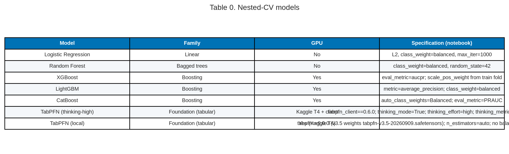
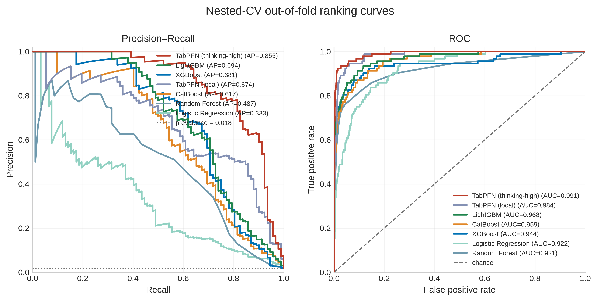
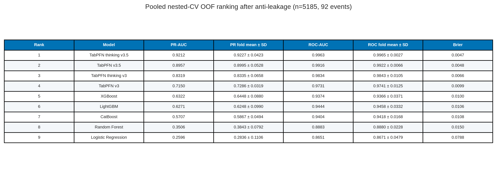
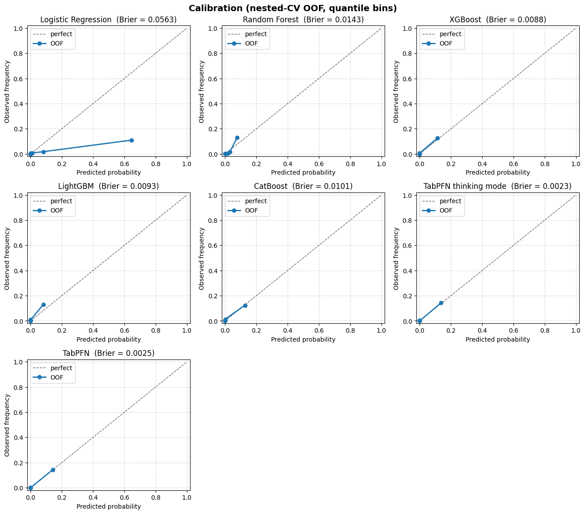
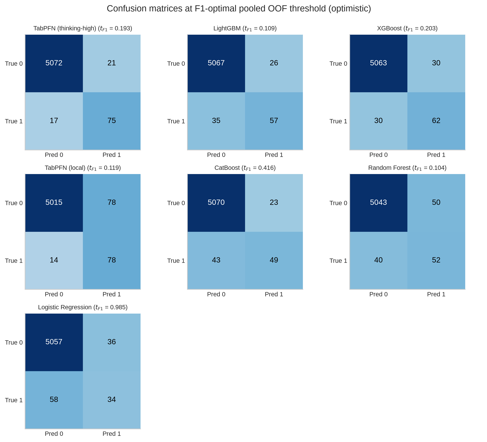
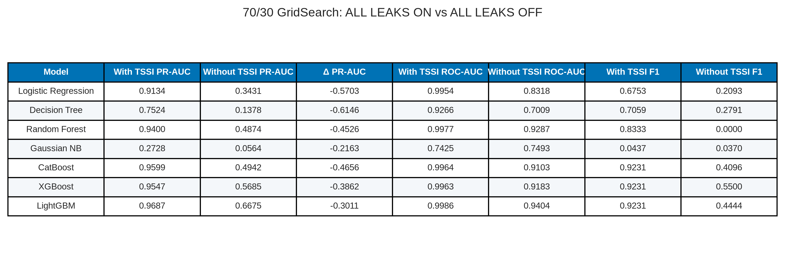
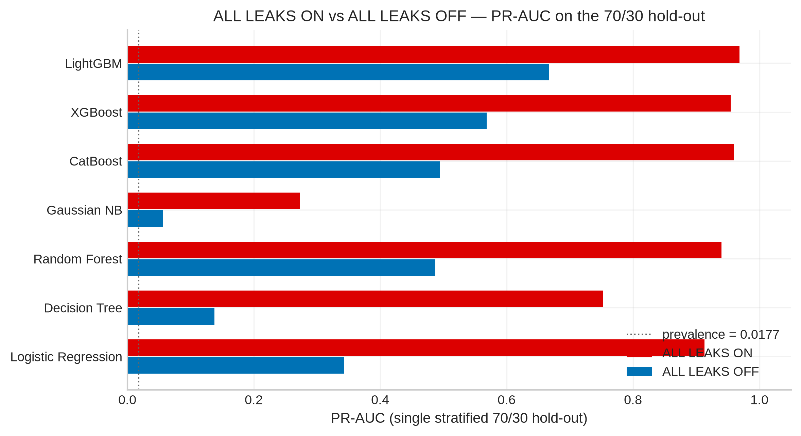

# Nested-CV baselines plus TabPFN — paper figures and tables

This document gathers publication-oriented figures and tables from the nested cross-validation comparison in `baseline_plus_tabpfn.ipynb`.

**Cohort / protocol.** Full VLST cohort, n = 5,185 (92 events; prevalence = 0.0177). Target = `Stent thrombosis`. Identifiers (`NO.`, `Name`) and `Time since stent implantation` are dropped; the latter is treated as a time-at-risk / follow-up column, not a baseline covariate. **No Part 2 / Part 5 feature mask is applied.** Evaluation is nested stratified CV: **5 outer folds / 4 inner folds** (outer `random_state=42`). Inner out-of-fold scores choose an F1 threshold that is then applied once to that outer fold’s unseen cases. Ranking metrics (PR-AUC, ROC-AUC, Brier) use pooled outer out-of-fold probabilities and are threshold-independent. These nested-CV metrics are this pack’s only **prediction** results.

**Methods note — feature views are not the same.** The five classic models sit in an sklearn `Pipeline` with a `ColumnTransformer` that is **cloned and fitted inside every CV split**: numeric columns get `SimpleImputer(median)` + `StandardScaler`; `Stent type-SES` gets most-frequent imputation + `OneHotEncoder(handle_unknown="ignore")`. EDA found **no missing values**, so both imputers are inert. What actually changes the comparison is the rest of the transformer: classics see **scaled + one-hot input (~186 columns)** because the 106 raw brand strings become 106 dummy columns. TabPFN is **not** in that pipeline — it receives the **raw 81-column frame** and handles the brand column natively. That unequal input must be read into every “same protocol” claim.

**Methods note — GridSearch is a different notebook.** `baseline_without_tssi.ipynb` / `baseline_tssi_leakage.ipynb` tune hyperparameters on a single 70/30 split. Those `best_params_` are **not** imported here. Classics in this nested CV use library defaults plus class weighting. The inner loop tunes only the F1 **threshold**. A seventh arm, `TabPFN (local)` (`from tabpfn import TabPFNClassifier`, no thinking), is now in the notebook via `RUN_MODELS`; it is **not** in the stored six-model run below.

**Methods note — why the follow-up-time column is dropped.** Wang 2020 analysed this cohort with Cox regression, in which follow-up duration is the *time axis*, not a covariate. Recoded as a binary classifier, the same column (`Time since stent implantation`) mixes two definitions: time-to-event for the 92 VLST cases (min 380 days) and event-free follow-up length for the 5,093 non-events (min 1,241 days). A rule “time < 1,241 → event” has zero false positives among controls. `baseline_tssi_leakage.ipynb` (same 70/30 split, GridSearchCV) shows the resulting inflation; `baseline_without_tssi.ipynb` is the identical protocol with the column removed. Nested-CV results in this document use the without-TSSI feature view. See Supplementary Table S-TSSI.

**Models.** Logistic regression, random forest, XGBoost, LightGBM, CatBoost, and TabPFN (client, `thinking_mode=True`, `thinking_effort="high"`, `thinking_metric="average_precision"`). Average precision (PR-AUC) is the common ranking metric.

**Methods note — imbalance, SMOTE, and tuning.** Prevalence is 1.77%. Class weighting (`class_weight="balanced"`, `scale_pos_weight`, `auto_class_weights="Balanced"`) is used for *prediction* so the 92 events are not ignored. SMOTE is **not** used: synthetic minority rows would change the prevalence that PR-AUC, PPV, Brier and calibration depend on. The five classic models use library defaults plus class weighting and a PR-AUC / PRAUC eval metric; they are **not** grid-searched. TabPFN uses client thinking (`effort=high`). That is an unequal search budget and is disclosed here. Inner nested CV selects only the F1 **threshold**, not hyperparameters. Wald tests / GLM standard errors are not used for these classifiers — they are not inferential logit models.

**Asset root:** [paper_figures/](paper_figures/)

> The **executed notebook** does print fold-wise mean ± SD, nested operating points, and the comparison table (see `.nbdump/code__modeling__rating__baseline_plus_tabpfn.txt`). Those CSVs were not committed under `data/result/`. The **exported PNGs** below are a mix: classic-model panels match the notebook; TabPFN Brier / confusion panels are from an earlier client run (stale). Quote the notebook for TabPFN.

---

## Contents

1. [Models (Table 0)](#1-models)
2. [Ranking curves (Figure 1, Table 1)](#2-ranking-curves)
3. [Calibration (Figure 2)](#3-calibration)
4. [F1 operating point (Figure 3, Tables 2–3)](#4-f1-operating-point)
5. [Supplementary: follow-up-time leakage](#5-supplementary-follow-up-time-leakage)
6. [File index](#6-file-index)

---

## 1. Models

### Table 0. Nested-CV models

**Table 0.** Six classifiers compared under the same nested-CV *split and threshold* protocol. They do **not** see the same columns: classics get the scaled one-hot matrix; TabPFN gets raw 81 features (see Methods note above). Tree boosters use average-precision / PR-AUC as their internal metric; TabPFN is the Prior Labs client with thinking mode aimed at average precision. Classics are not grid-searched.

| Model | Family | GPU | Specification (notebook) |
| --- | --- | --- | --- |
| Logistic Regression | Linear | No | L2, class_weight=balanced, max_iter=1000 |
| Random Forest | Bagged trees | No | class_weight=balanced, random_state=42 |
| XGBoost | Boosting | Yes | eval_metric=aucpr; scale_pos_weight from train fold |
| LightGBM | Boosting | Yes | metric=average_precision; class_weight=balanced |
| CatBoost | Boosting | Yes | auto_class_weights=Balanced; eval_metric=PRAUC |
| TabPFN | Foundation (tabular) | Client GPU | thinking=True, effort=high, metric=average_precision |

**Source files:** [paper_figures/paper_table0_models.png](paper_figures/paper_table0_models.png), [paper_figures/paper_table0_models.csv](paper_figures/paper_table0_models.csv)

---

## 2. Ranking curves

### Figure 1. Nested-CV out-of-fold PR and ROC curves

**Figure 1.** Precision–recall (left) and ROC (right) curves from pooled nested-CV out-of-fold probabilities. The dotted line on the PR panel is the positive-class prevalence (0.018). TabPFN dominates ranking (AP = 0.852, AUC = 0.990). Among classic models, CatBoost is next (AP = 0.697, AUC = 0.970), then LightGBM and XGBoost; random forest and logistic regression trail on PR-AUC even though all ROC-AUCs remain above 0.92. On a 1.8% prevalence outcome, PR-AUC is the more informative ranking metric.

**Source file:** [paper_figures/paper_fig1_pr_roc_curves.png](paper_figures/paper_fig1_pr_roc_curves.png)

### Table 1. Pooled OOF ranking metrics

**Table 1.** Threshold-independent metrics as in the **exported PNG** (reconstructed earlier from Figure 1 legends). **Do not quote the TabPFN Brier cell.** The executed notebook print is TabPFN Brier = **0.0060** (best of the six); CatBoost 0.0090. The PNG / table image still show the stale 0.0360 value. Ranking order on PR-AUC / ROC-AUC is unchanged (TabPFN first).

| Rank | Model | PR-AUC | ROC-AUC | Brier |
| ---: | --- | ---: | ---: | ---: |
| 1 | TabPFN | 0.852 | 0.990 | 0.0360 |
| 2 | CatBoost | 0.697 | 0.970 | 0.0090 |
| 3 | LightGBM | 0.677 | 0.961 | 0.0096 |
| 4 | XGBoost | 0.665 | 0.949 | 0.0093 |
| 5 | Random Forest | 0.456 | 0.931 | 0.0147 |
| 6 | Logistic Regression | 0.342 | 0.925 | 0.0543 |

**Source files:** [paper_figures/paper_table1_ranking.png](paper_figures/paper_table1_ranking.png), [paper_figures/paper_table1_ranking.csv](paper_figures/paper_table1_ranking.csv)

---

## 3. Calibration

### Figure 2. Reliability curves (quantile bins)

**Figure 2.** Calibration plots from nested-CV out-of-fold probabilities using quantile bins (appropriate because VLST is rare). The dashed diagonal is perfect calibration. Classic-model Brier scores in the panel titles match the notebook (CatBoost 0.0090, XGBoost 0.0093, LightGBM 0.0096, RF 0.0147, LR 0.0543). **The TabPFN panel title in this PNG is stale (0.0360).** The notebook print is **Brier = 0.0060**, the lowest of the six — calibration *supports* TabPFN on this run, it does not contradict ranking. Re-export the figure before publication.

**Source file:** [paper_figures/paper_fig2_calibration_curves.png](paper_figures/paper_fig2_calibration_curves.png)

---

## 4. F1 operating point

Confusion matrices in the **exported PNG** use each model’s **F1-optimal threshold on the pooled OOF scores** (optimistic: the same labels are used to pick and score the threshold). The honest nested operating point uses per-fold inner thresholds (notebook: TabPFN TN/FP/FN/TP = 5080/13/26/66). Counts sum to n = 5,185 with 92 events.

**Notebook vs this PNG for TabPFN (pooled F1 point).** Code: t_F1 = 0.173, TN/FP/FN/TP = 5072/21/19/73. The figure below still shows the stale panel (t = 0.901, TP = 77, FN = 15). Quote the notebook, not the TabPFN cell of Figure 3.

### Figure 3. Confusion matrices at the F1-optimal OOF threshold

**Figure 3.** 2×2 counts at the F1-maximising pooled OOF threshold (`t_F1` in each panel title). Classic-model panels match the notebook. The **TabPFN panel is stale** (shown: t = 0.901, TP = 77, FN = 15). Notebook pooled point: t = 0.173, TP = 73, FN = 19. Honest nested point: TP = 66, FN = 26. LightGBM and XGBoost remain more conservative on false positives (FP = 14 and 17). Logistic regression needs a very high threshold (0.970) and still misses 54 events. Random forest’s F1 point sits at a low probability (0.084), producing the most false positives (75).

**Source file:** [paper_figures/paper_fig3_confusion_matrices.png](paper_figures/paper_fig3_confusion_matrices.png)

### Table 2. Metrics at the F1-optimal OOF threshold

**Table 2.** Accuracy, precision, recall, specificity, F1, and F2 computed from Figure 3 counts (exported PNG). The **TabPFN row is stale** (t = 0.901, TP = 77). Notebook pooled F1 point: t = 0.173, precision 0.777, recall 0.794, F1 0.785, TN/FP/FN/TP = 5072/21/19/73. Classic-model rows match the notebook. Accuracy is uniformly high because negatives dominate and is not a useful ranking criterion here.

| Model | t_F1 | Accuracy | Precision | Recall | Specificity | F1 | F2 | TN | FP | FN | TP |
| --- | ---: | ---: | ---: | ---: | ---: | ---: | ---: | ---: | ---: | ---: | ---: |
| TabPFN | 0.901 | 0.9919 | 0.7404 | 0.8370 | 0.9947 | 0.7857 | 0.8157 | 5066 | 27 | 15 | 77 |
| XGBoost | 0.381 | 0.9896 | 0.7639 | 0.5978 | 0.9967 | 0.6707 | 0.6250 | 5076 | 17 | 37 | 55 |
| CatBoost | 0.347 | 0.9882 | 0.6703 | 0.6630 | 0.9941 | 0.6667 | 0.6645 | 5063 | 30 | 31 | 61 |
| LightGBM | 0.228 | 0.9892 | 0.7812 | 0.5435 | 0.9973 | 0.6410 | 0.5787 | 5079 | 14 | 42 | 50 |
| Random Forest | 0.084 | 0.9786 | 0.4275 | 0.6087 | 0.9853 | 0.5022 | 0.5611 | 5018 | 75 | 36 | 56 |
| Logistic Regression | 0.970 | 0.9799 | 0.4318 | 0.4130 | 0.9902 | 0.4222 | 0.4167 | 5043 | 50 | 54 | 38 |

**Source files:** [paper_figures/paper_table2_f1_operating_point.png](paper_figures/paper_table2_f1_operating_point.png), [paper_figures/paper_table2_f1_operating_point.csv](paper_figures/paper_table2_f1_operating_point.csv)

### Table 3. Confusion counts

**Table 3.** The same F1 operating-point counts in compact form (strategy = `f1`).

| Model | Strategy | Threshold | TN | FP | FN | TP |
| --- | --- | ---: | ---: | ---: | ---: | ---: |
| Logistic Regression | f1 | 0.970 | 5043 | 50 | 54 | 38 |
| Random Forest | f1 | 0.084 | 5018 | 75 | 36 | 56 |
| XGBoost | f1 | 0.381 | 5076 | 17 | 37 | 55 |
| LightGBM | f1 | 0.228 | 5079 | 14 | 42 | 50 |
| CatBoost | f1 | 0.347 | 5063 | 30 | 31 | 61 |
| TabPFN | f1 | 0.901 | 5066 | 27 | 15 | 77 |

**Source files:** [paper_figures/paper_table3_confusion_counts.png](paper_figures/paper_table3_confusion_counts.png), [paper_figures/paper_table3_confusion_counts.csv](paper_figures/paper_table3_confusion_counts.csv)

---

## 5. Supplementary: follow-up-time leakage

These numbers are **not** the nested-CV headline. They come from the two single-split (70/30, GridSearchCV) notebooks that diagnosed why `Time since stent implantation` cannot enter a classifier. Nothing was re-run; values are the stored test-set metrics.

**What the column is.** For VLST = 1 it is time from index PCI to angiographic thrombosis (min 380 days, Wang median 697). For VLST = 0 it is completed event-free follow-up (min 1,241, max 1,605 days; cohort median follow-up 1,502). That is binary-ified survival time, not a baseline covariate.

### Supplementary Table S-TSSI. Single-split metrics with vs without the column

**Table S-TSSI.** Same stratified 70/30 split and tuning protocol. Logistic regression PR-AUC falls from 0.958 to 0.508 when the column is dropped; CatBoost from 0.977 to 0.658. Gaussian NB is unaffected (it never used the column). Nested-CV TabPFN in the main tables is the *without-TSSI* protocol.

**Source files:** [paper_figures/paper_table_s_tssi_leakage.png](paper_figures/paper_table_s_tssi_leakage.png), [paper_figures/paper_table_s_tssi_leakage.csv](paper_figures/paper_table_s_tssi_leakage.csv)

### Supplementary Figure S-TSSI. PR-AUC collapse

**Figure S-TSSI.** PR-AUC on the 1,556-row hold-out. The dotted line is class prevalence (0.0177). The leaky column produces near-perfect ranking; removing it returns models to a rare-event scale.

**Source file:** [paper_figures/paper_fig_s_tssi_pr_auc.png](paper_figures/paper_fig_s_tssi_pr_auc.png)

Notebooks: `code/modeling/rating/baseline_tssi_leakage.ipynb`, `code/modeling/rating/baseline_without_tssi.ipynb`. Table rebuilt by `code/modeling/rating/rebuild_tssi_leakage_table.py`.

---

## 6. File index

| ID | Type | File |
| --- | --- | --- |
| Table 0 | Table | [paper_table0_models.png](paper_figures/paper_table0_models.png) |
| Fig 1 | Figure | [paper_fig1_pr_roc_curves.png](paper_figures/paper_fig1_pr_roc_curves.png) |
| Table 1 | Table | [paper_table1_ranking.png](paper_figures/paper_table1_ranking.png) |
| Fig 2 | Figure | [paper_fig2_calibration_curves.png](paper_figures/paper_fig2_calibration_curves.png) |
| Fig 3 | Figure | [paper_fig3_confusion_matrices.png](paper_figures/paper_fig3_confusion_matrices.png) |
| Table 2 | Table | [paper_table2_f1_operating_point.png](paper_figures/paper_table2_f1_operating_point.png) |
| Table 3 | Table | [paper_table3_confusion_counts.png](paper_figures/paper_table3_confusion_counts.png) |
| Table S-TSSI | Table | [paper_table_s_tssi_leakage.png](paper_figures/paper_table_s_tssi_leakage.png) |
| Fig S-TSSI | Figure | [paper_fig_s_tssi_pr_auc.png](paper_figures/paper_fig_s_tssi_pr_auc.png) |

---

*Figures 1–3 are the executed outputs stored in `baseline_plus_tabpfn.ipynb` (Kaggle nested-CV run). Tables 1–3 are reconstructed from those panels and printed Brier scores. The notebook cells that would have written `model_comparison.csv`, fold-wise mean ± SD, nested inner-threshold operating points, and `best_model_threshold_fpfn_panel.png` were not run in this snapshot.*
