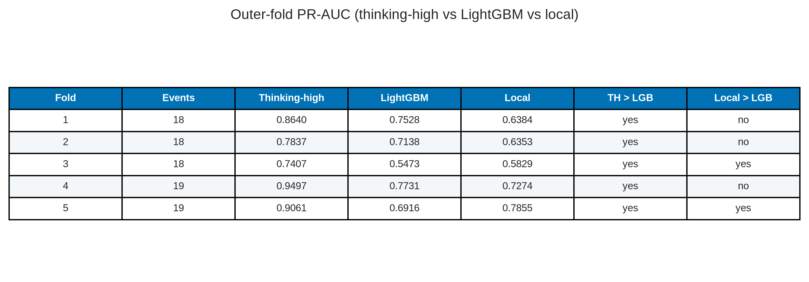
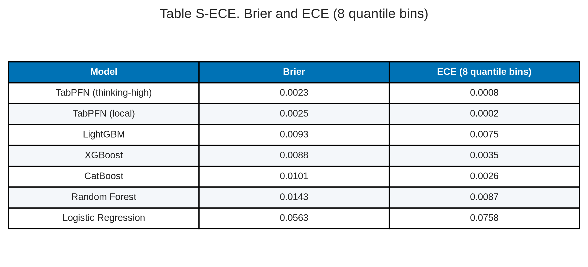

# Nested-CV baselines plus TabPFN — paper figures and tables

This document gathers publication-oriented figures and tables from the nested cross-validation comparison in `baseline_plus_tabpfn.ipynb`.

**Cohort / protocol.** Full VLST cohort, n = 5,185 (92 events; prevalence = 0.0177). Target = `Stent thrombosis`. Identifiers (`NO.`, `Name`) and `Time since stent implantation` are dropped; the latter is treated as a time-at-risk / follow-up column, not a baseline covariate. **No Part 2 / Part 5 feature mask is applied.** Evaluation is nested stratified CV: **5 outer folds / 4 inner folds** (outer `random_state=42`). Ranking metrics (PR-AUC, ROC-AUC, Brier) use pooled outer out-of-fold probabilities and are threshold-independent. For precision / recall / F1 / F2, **quote the nested inner-fold thresholds** (Table 2): each outer fold’s cut is chosen on inner OOF scores and applied once to that fold’s unseen cases. Figure 3 / Table 3 additionally show a single pooled F1 cut; that cut is **optimistically biased** (methods note below). These nested-CV metrics are this pack’s only **prediction** results.

**This run (D4).** Kaggle nested CV, Tesla T4, papermill **2026-09-17T21:58Z**. Pip prints **`tabpfn==9.0.0`**, **`tabpfn_client==0.6.0`** (user label: TabPFN **3.5**; local weights download `tabpfn-v3.5-20260909.safetensors`). Other prints: sklearn=1.6.1, numpy=2.0.2, pandas=2.3.3, xgboost=3.2.0, lightgbm=4.6.0, catboost=1.2.10, torch=2.10.0+cu128. **Both TabPFN arms finished.** `RUN_MODELS` keys are `"TabPFN thinking mode"` (client) and `"TabPFN"` (local). The thinking-high constructor is unchanged (`tabpfn_client.TabPFNClassifier`, `thinking_mode=True`, `thinking_effort="high"`, `thinking_metric="average_precision"`). Local is `n_estimators="auto"` on CUDA with **no** `balance_probabilities` (print: `balance_probabilities=False`). `restore_tabpfn_empirical_prior` is called and **did not print** a mapping (skip path). Shared **9-level** stent encoder (106 raw strings → 9 levels, min_count=30) is applied before the split. Classics then scale + one-hot that 9-level column inside each CV split (~89 columns). Both TabPFN arms see the same 9-level frame natively. Kaggle OOF is in `code/modeling/rating/baseline_plus_tabpfn_results/modeling_results/` (copied to `data/result/modeling_results/{oof,tables}/`). Table S-CI / Table S-Δ are stratified bootstrap on those arrays (`n_boot=2000`, seed 42).

**Methods note — feature views.** Classics sit in an sklearn `Pipeline` with a `ColumnTransformer` **cloned and fitted inside every CV split**: numeric columns get `SimpleImputer(median)` + `StandardScaler`; the encoded `Stent type-SES` gets most-frequent imputation + `OneHotEncoder(handle_unknown="ignore")`. EDA found **no missing values**, so both imputers are inert. Neither TabPFN arm is in that pipeline.

**Methods note — GridSearch is a different notebook.** `baseline_without_tssi.ipynb` / `baseline_tssi_leakage.ipynb` tune hyperparameters on a single 70/30 split. Those `best_params_` are **not** imported here. Classics use library defaults plus class weighting. The inner loop tunes only the F1 **threshold**.

**Methods note — why the follow-up-time column is dropped.** Wang 2020 analysed this cohort with Cox regression, in which follow-up duration is the *time axis*, not a covariate. Recoded as a binary classifier, the same column (`Time since stent implantation`) mixes two definitions: time-to-event for the 92 VLST cases (min 380 days) and event-free follow-up length for the 5,093 non-events (min 1,241 days). A rule “time < 1,241 → event” has zero false positives among controls. `baseline_tssi_leakage.ipynb` (same 70/30 split, GridSearchCV) shows the resulting inflation; `baseline_without_tssi.ipynb` is the identical protocol with the column removed. Nested-CV results in this document use the without-TSSI feature view. See Supplementary Table S-TSSI.

**Models.** Logistic regression, random forest, XGBoost, LightGBM, CatBoost, **TabPFN (thinking-high)**, and **TabPFN (local)**. Average precision (PR-AUC) is the common ranking metric. On this run **TabPFN (thinking-high) is first** (PR-AUC **0.9771**, ROC-AUC **0.9991**, Brier **0.0023**). **TabPFN (local) is second** (PR-AUC **0.9635**, ROC-AUC **0.9983**, Brier **0.0025**). LightGBM is third on PR-AUC (**0.6935**). Quote PR-AUC at 1.77% prevalence. Name the two TabPFN Briers separately; do not collapse the arms. Version 4 numbers (thinking-high PR-AUC 0.8553 / local 0.6742 / Brier 0.0064 vs 0.0102) and the older local Brier 0.0673 are other runs.

**Methods note — published clinical baseline.** Wang 2020’s 8-variable integer score is scored as a **frozen** comparator in `code/modeling/rating/wang_vlst_score.ipynb` (published Table 2 points; weights not re-fit). It is not an eighth nested-CV arm. See Supplementary Table S-Wang.

**Methods note — two F1 operating points.** Ranking metrics do not use a threshold. Precision, recall, F1, and F2 do. The executed notebook prints both. **Honest nested** (Table 2): inner-CV OOF F1 threshold applied once to the unseen outer fold. **Optimistic pooled** (Figure 3, Table 3): one F1-maximising cut on the concatenated OOF labels that are then scored. Reusing the evaluation labels to pick the cut **optimistically biases** precision, recall, F1, and F2. Quote Table 2. Thinking-high nested recall **0.9239** vs pooled **0.9022**. LightGBM nested **0.6522** vs pooled **0.6739**. TabPFN (local) nested **0.9348** vs pooled **0.9130**. F2 is `sklearn.metrics.fbeta_score(..., beta=2.0)`.

**Methods note — imbalance, SMOTE, and tuning.** Prevalence is 1.77%. Class weighting (`class_weight="balanced"`, `scale_pos_weight`, `auto_class_weights="Balanced"`) is used for *prediction* so the 92 events are not ignored. SMOTE is **not** used. The five classic models use library defaults plus class weighting. TabPFN (local) is not thinking-high; the client arm is thinking-high. Inner nested CV selects only the F1 **threshold**, not hyperparameters. The comparison is unmatched on tuning effort.

**Asset root:** [paper_figures](paper_figures/)

> Figures 1–3, the sweep panel, and Tables 0–3 are from this executed 7-arm notebook (Kaggle). Quote the notebook print if a PNG title ever disagrees.

---

## Contents

1. [Models (Table 0)](#1-models)
2. [Ranking curves (Figure 1, Table 1)](#2-ranking-curves)
3. [Uncertainty (Table S-CI, Table S-Δ, Table S-folds)](#3-uncertainty)
4. [Calibration (Figure 2, Table S-ECE)](#4-calibration)
5. [F1 operating point (Table 2 nested; Figure 3 / Table 3 pooled)](#5-f1-operating-point)
6. [Supplementary: follow-up-time leakage](#6-supplementary-follow-up-time-leakage)
7. [Supplementary: Wang 2020 integer score](#7-supplementary-wang-2020-integer-score)
8. [File index](#8-file-index)

---

## 1. Models

### Table 0. Nested-CV models

**Table 0.** Seven classifiers compared under the same nested-CV *split and threshold* protocol. Classics get scaled one-hot input after the 9-level stent encoder; both TabPFN arms get that frame natively. Tree boosters use average-precision / PR-AUC as their internal metric. Classics are not grid-searched.

| Model | Family | GPU | Specification (notebook) |
| --- | --- | --- | --- |
| Logistic Regression | Linear | No | L2, class_weight=balanced, max_iter=1000 |
| Random Forest | Bagged trees | No | class_weight=balanced, random_state=42 |
| XGBoost | Boosting | Yes | eval_metric=aucpr; scale_pos_weight from train fold |
| LightGBM | Boosting | Yes | metric=average_precision; class_weight=balanced |
| CatBoost | Boosting | Yes | auto_class_weights=Balanced; eval_metric=PRAUC |
| TabPFN (thinking-high) | Foundation (tabular) | Kaggle T4 + client | tabpfn_client==0.6.0; thinking_mode=True; thinking_effort=high; thinking_metric=average_precision |
| TabPFN (local) | Foundation (tabular) | Kaggle T4 | tabpfn==9.0.0; v3.5 weights `tabpfn-v3.5-20260909.safetensors`; n_estimators=auto; no balance_probabilities; restore skipped |

**Source files:** [paper_figures/paper_table0_models.png](paper_figures/paper_table0_models.png), [paper_figures/paper_table0_models.csv](paper_figures/paper_table0_models.csv)

---

## 2. Ranking curves

### Figure 1. Nested-CV out-of-fold PR and ROC curves

**Figure 1.** Precision–recall (left) and ROC (right) from pooled nested-CV OOF probabilities (this notebook PNG). The dotted line on the PR panel is prevalence (0.0177). Notebook legends use `"TabPFN thinking mode"` (client) and `"TabPFN"` (local). **TabPFN (thinking-high) ranks first on PR-AUC (0.9771)** and ROC-AUC (0.9991). **TabPFN (local) is second** (PR-AUC 0.9635; ROC-AUC 0.9983). LightGBM is third on PR-AUC (0.6935); XGBoost 0.6815. On a 1.8% prevalence outcome, PR-AUC is the informative ranking metric. CatBoost is fifth on PR-AUC (0.6172).

**Source file:** [paper_figures/paper_fig1_pr_roc_curves.png](paper_figures/paper_fig1_pr_roc_curves.png)

### Table 1. Pooled OOF ranking metrics

**Table 1.** Threshold-independent metrics from the executed notebook (`tabpfn==9.0.0` / v3.5). Fold mean ± SD uses `ddof=1` across the five outer folds.

| Rank | Model | PR-AUC | PR fold mean ± SD | ROC-AUC | ROC fold mean ± SD | Brier |
| ---: | --- | ---: | ---: | ---: | ---: | ---: |
| 1 | TabPFN (thinking-high) | **0.9771** | 0.9776 ± 0.0266 | **0.9991** | 0.9991 ± 0.0012 | **0.0023** |
| 2 | TabPFN (local) | 0.9635 | 0.9638 ± 0.0272 | 0.9983 | 0.9985 ± 0.0014 | 0.0025 |
| 3 | LightGBM | 0.6935 | 0.6942 ± 0.0920 | 0.9681 | 0.9695 ± 0.0165 | 0.0093 |
| 4 | XGBoost | 0.6815 | 0.6928 ± 0.1288 | 0.9439 | 0.9431 ± 0.0418 | 0.0088 |
| 5 | CatBoost | 0.6172 | 0.6353 ± 0.0540 | 0.9594 | 0.9612 ± 0.0137 | 0.0101 |
| 6 | Random Forest | 0.4865 | 0.5034 ± 0.0793 | 0.9209 | 0.9206 ± 0.0423 | 0.0143 |
| 7 | Logistic Regression | 0.3326 | 0.3451 ± 0.1213 | 0.9224 | 0.9235 ± 0.0251 | 0.0563 |

**Source files:** [paper_figures/paper_table1_ranking.png](paper_figures/paper_table1_ranking.png), [paper_figures/paper_table1_ranking.csv](paper_figures/paper_table1_ranking.csv)

Thinking-high PR-AUC by outer fold: 0.9879, 0.9397, 0.9604, 1.0000, 1.0000. LightGBM: 0.7527, 0.7136, 0.5399, 0.7732, 0.6916. Thinking-high is higher in **5 of 5** folds. TabPFN (local): 0.9881, 0.9382, 0.9334, 0.9917, 0.9678 — higher than LightGBM in **5 of 5**. Interval estimates and the paired test are Table S-CI / Table S-Δ.

---

## 3. Uncertainty

Patient-level **stratified** bootstrap of the pooled this-run OOF rows (keep 92 events and 5,093 non-events; `n_boot = 2000`, seed 42). Classifiers are **not** re-fit; the interval is the sampling variability of the pooled OOF metric given the stored scores. Fold mean ± SD in Table 1 remains the split-to-split summary. Outer-fold PR-AUC is Table S-folds. OOF source: `code/modeling/rating/baseline_plus_tabpfn_results/modeling_results/oof/oof_predictions.csv` (also copied to `data/result/modeling_results/oof/`).

### Table S-CI. Stratified bootstrap 95% CIs on pooled OOF metrics

**Table S-CI.** Percentile 95% CIs on this-run OOF (`tabpfn==9.0.0` / v3.5). Thinking-high PR-AUC **0.9771 (0.9538–0.9942)**; local **0.9635 (0.9339–0.9883)**; LightGBM **0.6935 (0.6060–0.7779)**. Thinking-high Brier **0.0023 (0.0016–0.0032)** vs local **0.0025 (0.0018–0.0034)**. Same protocol as `run_b3()` (`n_boot=2000`, seed 42).

| Model | PR-AUC | ROC-AUC | Brier |
| --- | --- | --- | --- |
| TabPFN (thinking-high) | 0.9771 [0.9538, 0.9942] | 0.9991 [0.9979, 0.9999] | 0.0023 [0.0016, 0.0032] |
| TabPFN (local) | 0.9635 [0.9339, 0.9883] | 0.9983 [0.9964, 0.9997] | 0.0025 [0.0018, 0.0034] |
| LightGBM | 0.6935 [0.6060, 0.7779] | 0.9681 [0.9490, 0.9831] | 0.0093 [0.0076, 0.0110] |
| XGBoost | 0.6815 [0.5881, 0.7703] | 0.9439 [0.9100, 0.9742] | 0.0088 [0.0071, 0.0106] |
| CatBoost | 0.6172 [0.5250, 0.7148] | 0.9594 [0.9398, 0.9765] | 0.0101 [0.0084, 0.0119] |
| Random Forest | 0.4865 [0.3860, 0.6034] | 0.9209 [0.8824, 0.9555] | 0.0143 [0.0137, 0.0148] |
| Logistic Regression | 0.3326 [0.2486, 0.4345] | 0.9224 [0.8966, 0.9449] | 0.0563 [0.0511, 0.0611] |

**Source files:** [paper_figures/paper_table_s_bootstrap_ci.png](paper_figures/paper_table_s_bootstrap_ci.png), [paper_figures/paper_table_s_bootstrap_ci.csv](paper_figures/paper_table_s_bootstrap_ci.csv)

### Table S-Δ. Paired bootstrap Δ PR-AUC vs LightGBM

**Table S-Δ.** Same resampled OOF rows. Thinking-high − LightGBM Δ PR-AUC **0.2836 (0.2052–0.3650)**, P(Δ ≤ 0) = 0/2000. Local − LightGBM **0.2700 (0.1939–0.3513)**, P(Δ ≤ 0) = 0/2000.

**Source files:** [paper_figures/paper_table_s_paired_delta.png](paper_figures/paper_table_s_paired_delta.png), [paper_figures/paper_table_s_paired_delta.csv](paper_figures/paper_table_s_paired_delta.csv)

### Table S-folds. Outer-fold PR-AUC (this run)

**Table S-folds.** Thinking-high is higher than LightGBM in **5/5** folds. Local is higher in **5/5**.

**Source files:** [paper_figures/paper_table_s_fold_pr_wins.png](paper_figures/paper_table_s_fold_pr_wins.png), [paper_figures/paper_table_s_fold_pr_wins.csv](paper_figures/paper_table_s_fold_pr_wins.csv)

---

## 4. Calibration

### Figure 2. Reliability curves (quantile bins)

**Figure 2.** Calibration plots from this nested-CV OOF (quantile bins). Dashed diagonal = perfect calibration. Brier scores match Table 1: TabPFN (thinking-high) **0.0023**, TabPFN (local) **0.0025**, XGBoost 0.0088, LightGBM 0.0093, CatBoost 0.0101, RF 0.0143, LR 0.0563. Both TabPFN arms are best-calibrated on Brier. Do not write “TabPFN is poorly calibrated” without naming the arm. Version 4 local Brier 0.0102 / thinking-high 0.0064 are other runs.

**Source file:** [paper_figures/paper_fig2_calibration_curves.png](paper_figures/paper_fig2_calibration_curves.png)

### Table S-ECE. Expected calibration error (8 quantile bins)

**Table S-ECE.** Notebook print, same OOF as Figure 2. Local ECE **0.0002**; thinking-high **0.0008**; CatBoost 0.0026; XGBoost 0.0035; LightGBM 0.0075; RF 0.0087; LR 0.0758.

| Model | Brier | ECE (8 quantile bins) |
| --- | ---: | ---: |
| TabPFN (thinking-high) | 0.0023 | 0.0008 |
| TabPFN (local) | 0.0025 | 0.0002 |
| LightGBM | 0.0093 | 0.0075 |
| XGBoost | 0.0088 | 0.0035 |
| CatBoost | 0.0101 | 0.0026 |
| Random Forest | 0.0143 | 0.0087 |
| Logistic Regression | 0.0563 | 0.0758 |

**Source files:** [paper_figures/paper_table_s_ece.png](paper_figures/paper_table_s_ece.png), [paper_figures/paper_table_s_ece.csv](paper_figures/paper_table_s_ece.csv)

---

## 5. F1 operating point

Two cuts exist in the executed notebook. **Quote Table 2 (honest nested).** Figure 3 and Table 3 are the pooled F1 cut: the same concatenated OOF labels are used to *pick* and *score* the threshold, so precision, recall, F1, and F2 are **optimistically biased**. Counts sum to n = 5,185 with 92 events.

### Table 2. Honest nested-CV operating point (quote this)

**Table 2.** Per-fold inner-CV F1 thresholds applied once to the unseen outer fold. NPV = TN/(TN+FN), printed in the notebook. TabPFN (thinking-high): mean threshold 0.367 ± 0.106, precision 0.9444, recall **0.9239**, NPV **0.9986** (5088/5095), F1 **0.9341**, TN/FP/FN/TP = **5088/5/7/85**. TabPFN (local): 0.393 ± 0.107, precision 0.9149, recall **0.9348**, NPV **0.9988** (5085/5091), F1 0.9247, **5085/8/6/86**. LightGBM: 0.122 ± 0.084, precision 0.6667, recall **0.6522**, NPV **0.9937**, F1 0.6593, **5063/30/32/60**.

| Model | Threshold (mean ± SD) | Accuracy | Precision | Recall | Specificity | NPV | F1 | F2 | TN | FP | FN | TP |
| --- | --- | ---: | ---: | ---: | ---: | ---: | ---: | ---: | ---: | ---: | ---: | ---: |
| TabPFN (thinking-high) | 0.367 ± 0.106 | 0.9977 | 0.9444 | 0.9239 | 0.9990 | 0.9986 | 0.9341 | 0.9279 | 5088 | 5 | 7 | 85 |
| TabPFN (local) | 0.393 ± 0.107 | 0.9973 | 0.9149 | 0.9348 | 0.9984 | 0.9988 | 0.9247 | 0.9307 | 5085 | 8 | 6 | 86 |
| LightGBM | 0.122 ± 0.084 | 0.9880 | 0.6667 | 0.6522 | 0.9941 | 0.9937 | 0.6593 | 0.6550 | 5063 | 30 | 32 | 60 |
| XGBoost | 0.225 ± 0.060 | 0.9875 | 0.6452 | 0.6522 | 0.9935 | 0.9937 | 0.6486 | 0.6508 | 5060 | 33 | 32 | 60 |
| CatBoost | 0.167 ± 0.040 | 0.9815 | 0.4836 | 0.6413 | 0.9876 | 0.9935 | 0.5514 | 0.6020 | 5030 | 63 | 33 | 59 |
| Random Forest | 0.118 ± 0.013 | 0.9840 | 0.5517 | 0.5217 | 0.9923 | 0.9914 | 0.5363 | 0.5275 | 5054 | 39 | 44 | 48 |
| Logistic Regression | 0.947 ± 0.035 | 0.9769 | 0.3654 | 0.4130 | 0.9870 | 0.9894 | 0.3878 | 0.4025 | 5027 | 66 | 54 | 38 |

**Source files:** [paper_figures/paper_table2_nested_operating_point.png](paper_figures/paper_table2_nested_operating_point.png), [paper_figures/paper_table2_nested_operating_point.csv](paper_figures/paper_table2_nested_operating_point.csv). Notebook cell 15.

### Figure 3. Confusion matrices at the pooled F1 threshold (optimistic)

**Figure 3.** 2×2 counts at the F1-maximising **pooled** OOF threshold (`t_F1` in each panel title). This is **not** Table 2. TabPFN (thinking-high) pooled recall **0.9022** (TP = 83, FN = 9, t = 0.485) vs nested **0.9239** (TP = 85, FN = 7). TabPFN (local) pooled recall **0.9130** (TP = 84, FN = 8, t = 0.465) vs nested **0.9348** (TP = 86, FN = 6). Do not quote either pooled TabPFN recall as the nested result. Accuracy is uniformly high because negatives dominate. The sweep panel (`best_model_threshold_fpfn_panel.png`) is for the best-by-PR-AUC model, which is **TabPFN (thinking-high)** (0.9771).

**Source file:** [paper_figures/paper_fig3_confusion_matrices.png](paper_figures/paper_fig3_confusion_matrices.png)

### Table 3. Optimistic pooled F1 metrics (do not quote instead of Table 2)

**Table 3.** Same pooled F1 cut as Figure 3. Precision / recall / F1 / F2 here are **optimistically biased** versus Table 2.

| Model | t_F1 | Accuracy | Precision | Recall | Specificity | F1 | F2 | TN | FP | FN | TP |
| --- | ---: | ---: | ---: | ---: | ---: | ---: | ---: | ---: | ---: | ---: | ---: |
| TabPFN (thinking-high) | 0.485 | 0.9979 | 0.9765 | 0.9022 | 0.9996 | 0.9379 | 0.9161 | 5091 | 2 | 9 | 83 |
| TabPFN (local) | 0.465 | 0.9975 | 0.9438 | 0.9130 | 0.9990 | 0.9282 | 0.9190 | 5088 | 5 | 8 | 84 |
| LightGBM | 0.064 | 0.9871 | 0.6263 | 0.6739 | 0.9927 | 0.6492 | 0.6638 | 5056 | 37 | 30 | 62 |
| XGBoost | 0.203 | 0.9884 | 0.6739 | 0.6739 | 0.9941 | 0.6739 | 0.6739 | 5063 | 30 | 30 | 62 |
| CatBoost | 0.416 | 0.9873 | 0.6806 | 0.5326 | 0.9955 | 0.5976 | 0.5568 | 5070 | 23 | 43 | 49 |
| Random Forest | 0.104 | 0.9826 | 0.5098 | 0.5652 | 0.9902 | 0.5361 | 0.5532 | 5043 | 50 | 40 | 52 |
| Logistic Regression | 0.985 | 0.9819 | 0.4857 | 0.3696 | 0.9929 | 0.4198 | 0.3881 | 5057 | 36 | 58 | 34 |

**Source files:** [paper_figures/paper_table3_pooled_f1.png](paper_figures/paper_table3_pooled_f1.png), [paper_figures/paper_table3_pooled_f1.csv](paper_figures/paper_table3_pooled_f1.csv)

---

## 6. Supplementary: follow-up-time leakage

These numbers are **not** the nested-CV headline. They come from the two single-split (70/30, GridSearchCV) notebooks that diagnosed why `Time since stent implantation` cannot enter a classifier. Nothing was re-run; values are the stored test-set metrics.

**What the column is.** For VLST = 1 it is time from index PCI to angiographic thrombosis (min 380 days, Wang median 697). For VLST = 0 it is completed event-free follow-up (min 1,241, max 1,605 days; cohort median follow-up 1,502). That is binary-ified survival time, not a baseline covariate.

### Supplementary Table S-TSSI. Single-split metrics with vs without the column

**Table S-TSSI.** Same stratified 70/30 split and GridSearch family. The with-TSSI notebook applied SMOTE on the training set (`USE_SMOTE=True`); the without-TSSI notebook did not (`USE_SMOTE=False`). Quote the table as a leakage demonstration, not as a ceteris-paribus SMOTE-matched experiment. Nested-CV Part 4 does not use SMOTE and drops TSSI. Logistic regression PR-AUC falls from 0.9575 to 0.5077 when the column is dropped; CatBoost from 0.9773 to 0.6582. Gaussian NB is unchanged (it never used the column).

**Source files:** [paper_figures/paper_table_s_tssi_leakage.png](paper_figures/paper_table_s_tssi_leakage.png), [paper_figures/paper_table_s_tssi_leakage.csv](paper_figures/paper_table_s_tssi_leakage.csv)

### Supplementary Figure S-TSSI. PR-AUC collapse

**Figure S-TSSI.** PR-AUC on the 1,556-row hold-out. The dotted line is class prevalence (0.0177). The leaky column produces near-perfect ranking; removing it returns models to a rare-event scale.

**Source file:** [paper_figures/paper_fig_s_tssi_pr_auc.png](paper_figures/paper_fig_s_tssi_pr_auc.png)

Notebooks: `code/modeling/rating/baseline_tssi_leakage.ipynb`, `code/modeling/rating/baseline_without_tssi.ipynb` (the 70/30 GridSearch fits). Table S-TSSI is **not** inside those notebooks; it is rebuilt from their stored metrics by `code/modeling/rating/rebuild_tssi_leakage_table.py`.

---

## 7. Supplementary: Wang 2020 integer score

These numbers are **not** a nested-CV fit. They come from `code/modeling/rating/wang_vlst_score.ipynb`, which scores Wang 2020 Table 2 **integer points** on all 5,185 rows with the published weights frozen. The same five outer folds as Part 4 (`StratifiedKFold(5, shuffle=True, random_state=42)`) are used only to evaluate that frozen score.

**Headline.** Full-cohort ROC-AUC **0.8013** (Wang published derivation c-statistic 0.80) and PR-AUC **0.1032**. Fold-mean ROC-AUC **0.8005 ± 0.0607**, PR-AUC **0.1134 ± 0.0518**. Nested-CV TabPFN (thinking-high) is PR-AUC **0.9771** / ROC-AUC **0.9991**; TabPFN (local) **0.9635** / **0.9983**; LightGBM **0.6935** / **0.9681**. The ML models still beat the published integer score on PR-AUC. It is **not** external validation (Wang’s c = 0.82 was Shantou).

**Encoding (do not photocopy Wang Table 1).** The SES point is on **`PES`**. The 4 post-dilation points go to **`No postdilation` = 1**. Using Wang Table 1’s 14 VLST “No post-dilation” cases as the 4-point group yields ROC-AUC **0.5084**.

**Risk bins.** Low ≤7: n = 3,135 (60.5%), rate 0.51%. Intermediate 8–9: n = 1,577 (30.4%), rate 2.22%. High ≥10: n = 473 (9.1%), rate 8.67%. Wang’s published n’s 3,135 / 1,837 / 473 sum to 5,445 ≠ 5,185; low and high n match this file.

The Cox linear predictor, Dangas decision-curve analysis, and Shantou scoring are **not** in this notebook.

### Supplementary Table S-Wang-bins. Observed VLST rate by published risk category

**Table S-Wang-bins.** Frozen integer score, cut at Wang’s published thresholds (≤7 / 8–9 / ≥10). Observed rates match Wang’s 0.5% / 2.2% / 8.7%. The intermediate *count* does not: Wang printed n = 1,837 for that bin.

**Source files:** [paper_figures/paper_table_s_wang_score_bins.png](paper_figures/paper_table_s_wang_score_bins.png), [paper_figures/paper_table_s_wang_score_bins.csv](paper_figures/paper_table_s_wang_score_bins.csv)

| Risk category | n | % of cohort | VLST events | Observed rate | Wang published n | Wang published rate |
| --- | ---: | ---: | ---: | ---: | ---: | ---: |
| low (≤7) | 3135 | 60.5 | 16 | 0.0051 | 3135 | 0.005 |
| intermediate (8–9) | 1577 | 30.4 | 35 | 0.0222 | 1837 | 0.022 |
| high (≥10) | 473 | 9.1 | 41 | 0.0867 | 473 | 0.087 |

### Supplementary Table S-Wang. Frozen score vs nested-CV models

**Table S-Wang.** Wang integer score: full-cohort ranking plus the same five outer folds, score not refit. TabPFN (thinking-high) / LightGBM / TabPFN (local) / logistic regression: this Part 4 nested 5×4 CV (D4). PR-AUC is the informative metric at 1.77% prevalence.

**Source files:** [paper_figures/paper_table_s_wang_vs_ml.png](paper_figures/paper_table_s_wang_vs_ml.png), [paper_figures/paper_table_s_wang_vs_ml.csv](paper_figures/paper_table_s_wang_vs_ml.csv)

| Model | ROC-AUC | PR-AUC | ROC fold mean ± SD | PR fold mean ± SD | Protocol |
| --- | ---: | ---: | --- | --- | --- |
| Wang 2020 integer score (frozen) | 0.8013 | 0.1032 | 0.8005 ± 0.0607 | 0.1134 ± 0.0518 | Published points; folds evaluate only |
| TabPFN (thinking-high) | **0.9991** | **0.9771** | 0.9991 ± 0.0012 | 0.9776 ± 0.0266 | Part 4 nested 5×4 CV OOF (`tabpfn==9.0.0` / v3.5) |
| TabPFN (local) | 0.9983 | 0.9635 | 0.9985 ± 0.0014 | 0.9638 ± 0.0272 | Part 4 nested 5×4 CV OOF (`tabpfn==9.0.0` / v3.5) |
| LightGBM (untuned nested CV) | 0.9681 | 0.6935 | 0.9695 ± 0.0165 | 0.6942 ± 0.0920 | Part 4 nested 5×4 CV OOF |
| Logistic regression (untuned nested CV) | 0.9224 | 0.3326 | 0.9235 ± 0.0251 | 0.3451 ± 0.1213 | Part 4 nested 5×4 CV OOF |

Fold-level frozen-score metrics: [paper_table_s_wang_score_folds.csv](paper_figures/paper_table_s_wang_score_folds.csv).

### Supplementary Figure S-Wang. Observed VLST rate by integer score

**Figure S-Wang.** Observed VLST rate at each integer total. Bar labels are cell n (shown when n ≥ 20). The dashed line is cohort prevalence (0.0177). The score is a ranker, not a calibrated probability.

**Source file:** [paper_figures/paper_fig_s_wang_score_rate.png](paper_figures/paper_fig_s_wang_score_rate.png)

Notebook: `code/modeling/rating/wang_vlst_score.ipynb`.

---

## 8. File index

| ID | Type | File |
| --- | --- | --- |
| Table 0 | Table | [paper_table0_models.png](paper_figures/paper_table0_models.png) |
| Fig 1 | Figure | [paper_fig1_pr_roc_curves.png](paper_figures/paper_fig1_pr_roc_curves.png) |
| Table 1 | Table | [paper_table1_ranking.png](paper_figures/paper_table1_ranking.png) |
| Table S-CI | Table | [paper_table_s_bootstrap_ci.png](paper_figures/paper_table_s_bootstrap_ci.png) |
| Table S-Δ | Table | [paper_table_s_paired_delta.png](paper_figures/paper_table_s_paired_delta.png) |
| Table S-folds | Table | [paper_table_s_fold_pr_wins.png](paper_figures/paper_table_s_fold_pr_wins.png) |
| Fig 2 | Figure | [paper_fig2_calibration_curves.png](paper_figures/paper_fig2_calibration_curves.png) |
| Table S-ECE | Table | [paper_table_s_ece.png](paper_figures/paper_table_s_ece.png) |
| Fig 3 | Figure | [paper_fig3_confusion_matrices.png](paper_figures/paper_fig3_confusion_matrices.png) |
| Table 2 | Table | [paper_table2_nested_operating_point.png](paper_figures/paper_table2_nested_operating_point.png) |
| Table 3 | Table | [paper_table3_pooled_f1.png](paper_figures/paper_table3_pooled_f1.png) |
| Sweep | Figure | [best_model_threshold_fpfn_panel.png](paper_figures/best_model_threshold_fpfn_panel.png) |
| Table S-TSSI | Table | [paper_table_s_tssi_leakage.png](paper_figures/paper_table_s_tssi_leakage.png) |
| Fig S-TSSI | Figure | [paper_fig_s_tssi_pr_auc.png](paper_figures/paper_fig_s_tssi_pr_auc.png) |
| Table S-Wang-bins | Table | [paper_table_s_wang_score_bins.png](paper_figures/paper_table_s_wang_score_bins.png) |
| Table S-Wang | Table | [paper_table_s_wang_vs_ml.png](paper_figures/paper_table_s_wang_vs_ml.png) |
| Fig S-Wang | Figure | [paper_fig_s_wang_score_rate.png](paper_figures/paper_fig_s_wang_score_rate.png) |

---

*Figures 1–3, the sweep panel, and Tables 0–3 are exported from the executed Kaggle run of `baseline_plus_tabpfn.ipynb` (papermill 2026-09-17; `tabpfn==9.0.0` / `tabpfn_client==0.6.0`; v3.5 weights). OOF + bootstrap CIs are this dump (`baseline_plus_tabpfn_results`). Name the two TabPFN Briers separately (thinking-high 0.0023 vs local 0.0025). Notebook display names: `"TabPFN thinking mode"` / `"TabPFN"`.*
