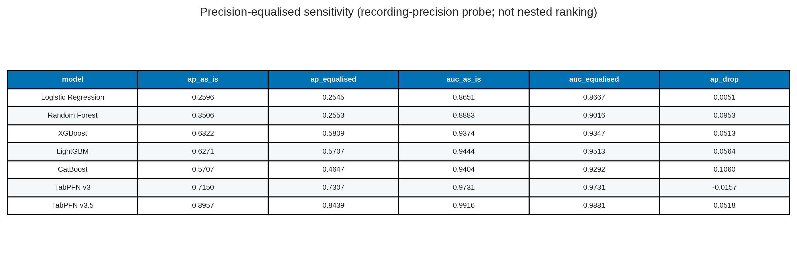

# Nested-CV baselines plus TabPFN — paper figures and tables

This document gathers publication-oriented figures and tables from the nested cross-validation comparison in `baseline_plus_tabpfn.ipynb`.

**Live nested CV (anti-leakage ON).** Dump: `code/modeling/rating/Kaggle_baseline_plus_tabpfn_results/baseline_plus_tabpfn_results/modeling_results/`. Nine arms. Freeze key **`nested_cv_v35_antileakage_on`**. Headline ranking: TabPFN thinking v3.5 PR-AUC **0.9212**; TabPFN v3.5 **0.8957**. The unlabeled two-arm dump PR-AUC **0.9771 / 0.9635** is a different (pre-anti-leakage) scoreboard and is **excluded**.

**Cohort / protocol.** Full VLST cohort, n = 5,185 (92 events; prevalence = 0.0177). Target = `Stent thrombosis`. **Anti-leakage ON = ALL LEAKS OFF** (see [`../anti_leakage_protocol.md`](../anti_leakage_protocol.md)): drop identifiers (`NO.`, `Name`), `Time since stent implantation` (mixed time-to-event vs completed follow-up; a “time < 1,241 → event” rule has zero control false positives), and `WBC` (recording-precision / batch marker; Wang also excluded it from Cox). Quantize `Cre` 0 / `CaI` 2 / `Fiberinogen` 1 / `Fast-Glu` 1 dp **before split** (spurious decimals fingerprint source; signature-only probe: 243 indicators, AP **0.4270**, ROC-AUC **0.9522**). Stent codebook (`Stent type-SES`, `min_count=30`) via `encode_stent_on_fold` on **each outer-train fold** (not a full-frame codebook). **No SMOTE.** Follow-up drugs stay in (post-baseline caveat). **No Part 2 / Part 5 feature mask.** Scaler / OHE cloned inside CV splits. Evaluation is nested stratified CV: **5 outer folds / 4 inner folds** (outer `random_state=42`). Ranking metrics (PR-AUC, ROC-AUC, Brier) use pooled outer out-of-fold probabilities and are threshold-independent. For precision / recall / F1 / F2, **quote the nested inner-fold thresholds** (Table 2). Figure 3 / Table 3 additionally show a single pooled F1 cut; that cut is **optimistically biased**. These nested-CV metrics are this pack’s only **prediction** results.

**Version pins.** Kaggle nested CV, Tesla T4, `run_manifest.json`: **`tabpfn==9.0.0`**, **`tabpfn-client==0.6.0`**. Local checkpoints: `tabpfn-v3-classifier-v3_default.ckpt` and `tabpfn-v3.5-20260909.safetensors`. Hosted thinking models: `v3_default` / `v3.5_default`. Thinking settings: `thinking_mode=True`, effort high, metric `average_precision`. OOF is 5,185 × 20 with named columns `tabpfn_thinking_v3_5_prob`, `tabpfn_v3_5_prob`, `tabpfn_thinking_v3_prob`, `tabpfn_v3_prob`.

**Four comparison axes (this notebook scores 1–3; axis 4 is a different dump).**

| Axis | What is compared | Where | Leak status |
| --- | --- | --- | --- |
| 1. TabPFN vs library-default panel | Four TabPFN arms vs LR / RF / XGB / LGB / CatBoost **defaults** (not nested GridSearch) | Table 1 nested OOF | Anti-leakage **ON** |
| 2. v3 vs v3.5 | Same thinking status, different checkpoint | Table 1: thinking 0.8319 vs 0.9212; local 0.7150 vs 0.8957 | ON |
| 3. Thinking vs local | Same checkpoint family, thinking-high vs no-thinking | Table 1: v3.5 0.9212 vs 0.8957; v3 0.8319 vs 0.7150 | ON |
| 4. With vs without anti-leakage | Nested TabPFN ON vs OFF | **[RE-SOURCE]** — no matched 9-arm nested OFF dump. Classics: 70/30 twins | Nested = ON only. Classics = [leakage_contrast_paper_figures_and_tables.md](leakage_contrast_paper_figures_and_tables.md) |

Do not collapse v3 with v3.5, or thinking with local. Do not quote unlabeled nested PR-AUC **0.9771 / 0.9635** as axis 4.

**Protocol — classics are an untuned reference panel; no imported GridSearch winners.** Nested-CV LR / RF / XGB / LGB / CatBoost use library defaults plus class weighting (`class_weight="balanced"`, `scale_pos_weight`, `auto_class_weights="Balanced"`). The inner loop tunes only the F1 **threshold**. `GridSearchCV` `best_params_` from `baseline_tssi_leakage.ipynb` / `baseline_without_tssi.ipynb` (Table S-TSSI-HP; leakage sub-report) are **not** imported. Table 1 ranks these fitted objects versus four TabPFN arms; it is not a hyperparameter-matched contest. No SMOTE.

**Methods note — feature views.** Classics sit in an sklearn `Pipeline` with a `ColumnTransformer` **cloned and fitted inside every CV split**: numeric columns get `SimpleImputer(median)` + `StandardScaler`; the encoded `Stent type-SES` gets most-frequent imputation + `OneHotEncoder(handle_unknown="ignore")`. EDA found **no missing values**, so both imputers are inert. TabPFN arms are not in that pipeline.

**Methods note — GridSearch is a different notebook.** `baseline_without_tssi.ipynb` / `baseline_tssi_leakage.ipynb` tune hyperparameters on a single 70/30 split (ALL LEAKS OFF / ALL LEAKS ON). Those `best_params_` are in Table S-TSSI-HP and are **not** imported here. Classics in nested CV use library defaults plus class weighting. The inner loop tunes only the F1 **threshold**.

**Methods note — why the anti-leakage protocol (five flags, not TSSI alone).** Wang 2020 analysed this cohort with Cox regression, in which follow-up duration is the *time axis*, not a covariate. Recoded as a binary classifier, `Time since stent implantation` mixes two definitions: time-to-event for the 92 VLST cases (min 380 days) and event-free follow-up for the 5,093 non-events (min 1,241 days). Independently, the file is sorted by outcome and cases were transcribed at a different numeric precision, so recording precision is a batch marker (`WBC` dropped; named labs quantized pre-split). A full-cohort stent codebook would leak rare brands into the test fold; SMOTE on a leaks-on train set inflates hold-out ranking and is unmatched vs nested CV. The leakage-contrast twins invert **all five** flags (`KEEP_TSSI`, `DROP_WBC`, `QUANTIZE_CLINICAL`, `STENT_ENCODER_TRAIN_ONLY`, `USE_SMOTE`) together (Table S-TSSI). Nested CV uses the OFF state. Twin GridSearch winners are **not** imported here.

**Models.** Logistic regression, random forest, XGBoost, LightGBM, CatBoost, TabPFN thinking v3, TabPFN thinking v3.5, TabPFN v3, TabPFN v3.5. Average precision (PR-AUC) is the common ranking metric. Quote PR-AUC at 1.77% prevalence. Name TabPFN Briers separately. Version 4 numbers (thinking-high PR-AUC 0.8553 / local 0.6742) and the unlabeled 0.9771 / 0.9635 dump remain excluded runs.

**Methods note — published clinical baseline.** Wang 2020’s 8-variable integer score is scored as a **frozen** comparator in `code/modeling/rating/wang_vlst_score.ipynb` (published Table 2 points; weights not re-fit). It is not a nested-CV arm. See Supplementary Table S-Wang.

**Methods note — two F1 operating points.** Ranking metrics do not use a threshold. Precision, recall, F1, and F2 do. **Honest nested** (Table 2): inner-CV OOF F1 threshold applied once to the unseen outer fold. **Optimistic pooled** (Figure 3, Table 3): one F1-maximising cut on the concatenated OOF labels that are then scored. Reusing the evaluation labels to pick the cut **optimistically biases** precision, recall, F1, and F2. Quote Table 2. Thinking v3.5 nested recall **0.8370** vs pooled **0.8478**. TabPFN v3.5 nested **0.7826** vs pooled **0.8804**. LightGBM nested **0.5870** vs pooled **0.5761**. F2 is `sklearn.metrics.fbeta_score(..., beta=2.0)`.

**Methods note — imbalance, SMOTE, and tuning.** Prevalence is 1.77%. Class weighting (`class_weight="balanced"`, `scale_pos_weight`, `auto_class_weights="Balanced"`) is used for *prediction* so the 92 events are not ignored. SMOTE is **not** used. The five classic models use library defaults plus class weighting. Local TabPFN arms are not thinking; client arms are thinking-high. Inner nested CV selects only the F1 **threshold**, not hyperparameters. The comparison is unmatched on tuning effort.

**Asset root:** [paper_figures](paper_figures/)

---

## Contents

1. [Models (Table 0)](#1-models)
2. [Ranking curves (Figure 1, Table 1)](#2-ranking-curves)
3. [Uncertainty (Table S-CI, Table S-Δ, Table S-folds)](#3-uncertainty)
4. [Calibration (Figure 2, Table S-ECE)](#4-calibration)
5. [F1 operating point (Table 2 nested; Figure 3 / Table 3 pooled)](#5-f1-operating-point)
6. [Supplementary: follow-up-time leakage (pointer)](#6-supplementary-follow-up-time-leakage)
7. [Supplementary: Wang 2020 integer score](#7-supplementary-wang-2020-integer-score)
8. [Supplementary: recording-precision probes](#8-supplementary-recording-precision-probes)
9. [File index](#9-file-index)

---

## 1. Models

### Table 0. Nested-CV models

**Table 0.** Nine classifiers compared under the same nested-CV *split and threshold* protocol after anti-leakage. Classics get scaled one-hot input after the 9-level stent encoder; TabPFN arms get that frame natively. Tree boosters use average-precision / PR-AUC as their internal metric. Classics are not grid-searched.

| Model | Family | GPU | Specification (notebook / dump) |
| --- | --- | --- | --- |
| Logistic Regression | Linear | No | L2, class_weight=balanced, max_iter=1000 |
| Random Forest | Bagged trees | No | class_weight=balanced, random_state=42 |
| XGBoost | Boosting | Yes | eval_metric=aucpr; scale_pos_weight from train fold |
| LightGBM | Boosting | Yes | metric=average_precision; class_weight=balanced |
| CatBoost | Boosting | Yes | auto_class_weights=Balanced; eval_metric=PRAUC |
| TabPFN thinking v3 | Foundation (tabular) | Kaggle T4 + client | tabpfn-client==0.6.0; model v3_default; thinking_mode=True; effort=high; metric=average_precision |
| TabPFN thinking v3.5 | Foundation (tabular) | Kaggle T4 + client | tabpfn-client==0.6.0; model v3.5_default; thinking_mode=True; effort=high; metric=average_precision |
| TabPFN v3 | Foundation (tabular) | Kaggle T4 | tabpfn==9.0.0; checkpoint tabpfn-v3-classifier-v3_default.ckpt; n_estimators=auto; no balance_probabilities |
| TabPFN v3.5 | Foundation (tabular) | Kaggle T4 | tabpfn==9.0.0; checkpoint tabpfn-v3.5-20260909.safetensors; n_estimators=auto; no balance_probabilities |

**Source files:** [paper_figures/paper_table0_models.png](paper_figures/paper_table0_models.png), [paper_figures/paper_table0_models.csv](paper_figures/paper_table0_models.csv)

---

## 2. Ranking curves

### Figure 1. Nested-CV out-of-fold PR and ROC curves

**Figure 1.** Precision–recall (left) and ROC (right) from pooled nested-CV OOF probabilities after anti-leakage (n = 5,185, 92 events). Dump `figures/pr_roc_curves.png`.

**Source file:** [paper_figures/paper_fig1_pr_roc_curves.png](paper_figures/paper_fig1_pr_roc_curves.png)

### Table 1. Pooled OOF ranking metrics

**Table 1.** Threshold-independent metrics from `model_comparison.csv` (anti-leakage ON). Primary ranking metric is PR-AUC at 1.77% prevalence.

| Rank | Model | PR-AUC | PR fold mean ± SD | ROC-AUC | ROC fold mean ± SD | Brier |
| ---: | --- | ---: | ---: | ---: | ---: | ---: |
| 1 | TabPFN thinking v3.5 | **0.9212** | 0.9227 ± 0.0423 | **0.9963** | 0.9965 ± 0.0027 | **0.0047** |
| 2 | TabPFN v3.5 | 0.8957 | 0.8995 ± 0.0528 | 0.9916 | 0.9922 ± 0.0066 | 0.0048 |
| 3 | TabPFN thinking v3 | 0.8319 | 0.8335 ± 0.0658 | 0.9834 | 0.9843 ± 0.0105 | 0.0066 |
| 4 | TabPFN v3 | 0.7150 | 0.7286 ± 0.0319 | 0.9731 | 0.9741 ± 0.0125 | 0.0099 |
| 5 | XGBoost | 0.6322 | 0.6448 ± 0.0880 | 0.9374 | 0.9366 ± 0.0371 | 0.0100 |
| 6 | LightGBM | 0.6271 | 0.6248 ± 0.0990 | 0.9444 | 0.9458 ± 0.0332 | 0.0106 |
| 7 | CatBoost | 0.5707 | 0.5867 ± 0.0494 | 0.9404 | 0.9418 ± 0.0168 | 0.0108 |
| 8 | Random Forest | 0.3506 | 0.3843 ± 0.0792 | 0.8883 | 0.8880 ± 0.0228 | 0.0150 |
| 9 | Logistic Regression | 0.2596 | 0.2836 ± 0.1106 | 0.8651 | 0.8671 ± 0.0479 | 0.0788 |

**Source files:** [paper_figures/paper_table1_ranking.png](paper_figures/paper_table1_ranking.png), [paper_figures/paper_table1_ranking.csv](paper_figures/paper_table1_ranking.csv)

TabPFN thinking v3.5 PR-AUC by outer fold: 0.8802, 0.9078, 0.9434, 0.9858, 0.8961. TabPFN v3.5: 0.9365, 0.8996, 0.8237, 0.9595, 0.8783. LightGBM: 0.7249, 0.6407, 0.5759, 0.7014, 0.4811. XGBoost: 0.6706, 0.7038, 0.6118, 0.7294, 0.5085. Thinking v3.5 is higher than LightGBM and XGBoost in **5 of 5** folds. TabPFN v3.5 is higher than LightGBM in **5 of 5**. Thinking v3.5 is not higher than local v3.5 in every fold (fold 1 local 0.9365 vs thinking 0.8802). Interval estimates and the paired test are Table S-CI / Table S-Δ.

---

## 3. Uncertainty

Patient-level **stratified** bootstrap of the pooled OOF rows (keep 92 events and 5,093 non-events; `n_boot = 2000`, seed 42). Classifiers are **not** re-fit; the interval is the sampling variability of the pooled OOF metric given the stored scores. Fold mean ± SD in Table 1 remains the split-to-split summary. Outer-fold PR-AUC is Table S-folds. OOF source: `Kaggle_baseline_plus_tabpfn_results/baseline_plus_tabpfn_results/modeling_results/oof/oof_predictions.csv`. Rebuild: `rebuild_part4_from_kaggle_dump.py`.

### Table S-CI. Stratified bootstrap 95% CIs on pooled OOF metrics

**Table S-CI.** Percentile 95% CIs on the anti-leakage nested OOF (`n_boot=2000`, seed 42).

| Model | PR-AUC | ROC-AUC | Brier |
| --- | --- | --- | --- |
| TabPFN thinking v3.5 | 0.9212 [0.8785, 0.9613] | 0.9963 [0.9932, 0.9986] | 0.0047 [0.0037, 0.0058] |
| TabPFN v3.5 | 0.8957 [0.8446, 0.9426] | 0.9916 [0.9828, 0.9978] | 0.0048 [0.0038, 0.0060] |
| TabPFN thinking v3 | 0.8319 [0.7626, 0.8945] | 0.9834 [0.9709, 0.9939] | 0.0066 [0.0053, 0.0080] |
| TabPFN v3 | 0.7150 [0.6260, 0.8074] | 0.9731 [0.9551, 0.9883] | 0.0099 [0.0089, 0.0111] |
| XGBoost | 0.6322 [0.5331, 0.7247] | 0.9374 [0.8967, 0.9699] | 0.0100 [0.0084, 0.0116] |
| LightGBM | 0.6271 [0.5313, 0.7202] | 0.9444 [0.9135, 0.9698] | 0.0106 [0.0090, 0.0123] |
| CatBoost | 0.5707 [0.4750, 0.6729] | 0.9404 [0.9142, 0.9632] | 0.0108 [0.0091, 0.0125] |
| Random Forest | 0.3506 [0.2660, 0.4633] | 0.8883 [0.8413, 0.9296] | 0.0150 [0.0144, 0.0155] |
| Logistic Regression | 0.2596 [0.1834, 0.3588] | 0.8651 [0.8220, 0.9044] | 0.0788 [0.0730, 0.0844] |

**Source files:** [paper_figures/paper_table_s_bootstrap_ci.png](paper_figures/paper_table_s_bootstrap_ci.png), [paper_figures/paper_table_s_bootstrap_ci.csv](paper_figures/paper_table_s_bootstrap_ci.csv)

### Table S-Δ. Paired bootstrap Δ PR-AUC

**Table S-Δ.** Same resampled OOF rows. Thinking v3.5 − LightGBM Δ PR-AUC **0.2941 (0.2071–0.3805)**, P(Δ ≤ 0) = 0/2000. TabPFN v3.5 − LightGBM **0.2686 (0.1822–0.3559)**, P(Δ ≤ 0) = 0/2000. Thinking v3.5 − XGBoost **0.2891 (0.2038–0.3791)**, P(Δ ≤ 0) = 0/2000.

**Source files:** [paper_figures/paper_table_s_paired_delta.png](paper_figures/paper_table_s_paired_delta.png), [paper_figures/paper_table_s_paired_delta.csv](paper_figures/paper_table_s_paired_delta.csv)

### Table S-folds. Outer-fold PR-AUC

**Table S-folds.** Thinking v3.5 vs LightGBM **5/5**. TabPFN v3.5 vs LightGBM **5/5**. Thinking v3 vs LightGBM **5/5**. TabPFN v3 vs LightGBM **5/5**. Thinking v3.5 vs XGBoost **5/5**.

**Source files:** [paper_figures/paper_table_s_fold_pr_wins.png](paper_figures/paper_table_s_fold_pr_wins.png), [paper_figures/paper_table_s_fold_pr_wins.csv](paper_figures/paper_table_s_fold_pr_wins.csv)

---

## 4. Calibration

### Figure 2. Reliability curves (quantile bins)

**Figure 2.** Calibration plots from this nested-CV OOF (quantile bins). Dashed diagonal = perfect calibration. Brier scores match Table 1. Best Brier: thinking v3.5 **0.0047**; TabPFN v3.5 **0.0048**. Do not write “TabPFN is poorly calibrated” without naming the arm. Excluded-dump Briers 0.0023 / 0.0025 and Version 4 0.0064 / 0.0102 / 0.0673 are other runs.

**Source file:** [paper_figures/paper_fig2_calibration_curves.png](paper_figures/paper_fig2_calibration_curves.png)

### Table S-ECE. Expected calibration error (8 quantile bins)

**Table S-ECE.** Dump `calibration_ece.csv`, same OOF as Figure 2. Lowest ECE: TabPFN v3.5 **0.0003**. Thinking v3.5 ECE **0.0028**.

| Model | Brier | ECE (8 quantile bins) |
| --- | ---: | ---: |
| TabPFN thinking v3.5 | 0.0047 | 0.0028 |
| TabPFN v3.5 | 0.0048 | 0.0003 |
| TabPFN thinking v3 | 0.0066 | 0.0036 |
| TabPFN v3 | 0.0099 | 0.0059 |
| XGBoost | 0.0100 | 0.0066 |
| LightGBM | 0.0106 | 0.0090 |
| CatBoost | 0.0108 | 0.0031 |
| Random Forest | 0.0150 | 0.0090 |
| Logistic Regression | 0.0788 | 0.1156 |

**Source files:** [paper_figures/paper_table_s_ece.png](paper_figures/paper_table_s_ece.png), [paper_figures/paper_table_s_ece.csv](paper_figures/paper_table_s_ece.csv)

---

## 5. F1 operating point

Two cuts exist in the dump. **Quote Table 2 (honest nested).** Figure 3 and Table 3 are the pooled F1 cut: the same concatenated OOF labels are used to *pick* and *score* the threshold, so precision, recall, F1, and F2 are **optimistically biased**. Counts sum to n = 5,185 with 92 events.

### Table 2. Honest nested-CV operating point (quote this)

**Table 2.** Per-fold inner-CV F1 thresholds applied once to the unseen outer fold. NPV = TN/(TN+FN). TabPFN thinking v3.5: mean threshold 0.318 ± 0.059, precision 0.8851, recall **0.8370**, NPV **0.9971** (5083/5098), F1 **0.8603**, TN/FP/FN/TP = **5083/10/15/77**. TabPFN v3.5: 0.386 ± 0.061, precision 0.8675, recall **0.7826**, NPV **0.9961** (5082/5102), F1 0.8229, **5082/11/20/72**. LightGBM: 0.076 ± 0.037, precision 0.5934, recall **0.5870**, NPV **0.9925**, F1 0.5902, **5056/37/38/54**. XGBoost: 0.238 ± 0.104, recall **0.5217**, **5068/25/44/48**.

| Model | Threshold (mean ± SD) | Accuracy | Precision | Recall | Specificity | NPV | F1 | F2 | TN | FP | FN | TP |
| --- | --- | ---: | ---: | ---: | ---: | ---: | ---: | ---: | ---: | ---: | ---: | ---: |
| TabPFN thinking v3.5 | 0.318 ± 0.059 | 0.9952 | 0.8851 | 0.8370 | 0.9980 | 0.9971 | 0.8603 | 0.8462 | 5083 | 10 | 15 | 77 |
| TabPFN v3.5 | 0.386 ± 0.061 | 0.9940 | 0.8675 | 0.7826 | 0.9978 | 0.9961 | 0.8229 | 0.7982 | 5082 | 11 | 20 | 72 |
| TabPFN thinking v3 | 0.271 ± 0.055 | 0.9929 | 0.8767 | 0.6957 | 0.9982 | 0.9945 | 0.7758 | 0.7256 | 5084 | 9 | 28 | 64 |
| TabPFN v3 | 0.183 ± 0.036 | 0.9886 | 0.7089 | 0.6087 | 0.9955 | 0.9929 | 0.6550 | 0.6264 | 5070 | 23 | 36 | 56 |
| XGBoost | 0.238 ± 0.104 | 0.9867 | 0.6575 | 0.5217 | 0.9951 | 0.9914 | 0.5818 | 0.5442 | 5068 | 25 | 44 | 48 |
| LightGBM | 0.076 ± 0.037 | 0.9855 | 0.5934 | 0.5870 | 0.9927 | 0.9925 | 0.5902 | 0.5882 | 5056 | 37 | 38 | 54 |
| CatBoost | 0.170 ± 0.064 | 0.9826 | 0.5093 | 0.5978 | 0.9896 | 0.9927 | 0.5500 | 0.5777 | 5040 | 53 | 37 | 55 |
| Random Forest | 0.112 ± 0.016 | 0.9801 | 0.4421 | 0.4565 | 0.9896 | 0.9902 | 0.4492 | 0.4536 | 5040 | 53 | 50 | 42 |
| Logistic Regression | 0.964 ± 0.013 | 0.9740 | 0.3028 | 0.3587 | 0.9851 | 0.9884 | 0.3284 | 0.3459 | 5017 | 76 | 59 | 33 |

**Source files:** [paper_figures/paper_table2_nested_operating_point.png](paper_figures/paper_table2_nested_operating_point.png), [paper_figures/paper_table2_nested_operating_point.csv](paper_figures/paper_table2_nested_operating_point.csv). Dump `nested_cv_operating_point.csv`.

### Figure 3. Confusion matrices at the pooled F1 threshold (optimistic)

**Figure 3.** 2×2 counts at the F1-maximising **pooled** OOF threshold (`t_F1` in each panel title). This is **not** Table 2. TabPFN thinking v3.5 pooled recall **0.8478** (TP = 78, FN = 14, t = 0.302) vs nested **0.8370** (TP = 77, FN = 15). TabPFN v3.5 pooled recall **0.8804** (TP = 81, FN = 11, t = 0.257) vs nested **0.7826** (TP = 72, FN = 20). Do not quote pooled TabPFN recall as the nested result. Accuracy is uniformly high because negatives dominate. The sweep panel (`best_model_threshold_fpfn_panel.png`) is for the best-by-PR-AUC model, **TabPFN thinking v3.5** (0.9212).

**Source file:** [paper_figures/paper_fig3_confusion_matrices.png](paper_figures/paper_fig3_confusion_matrices.png)

### Table 3. Optimistic pooled F1 metrics (do not quote instead of Table 2)

**Table 3.** Same pooled F1 cut as Figure 3. Precision / recall / F1 / F2 here are **optimistically biased** versus Table 2.

| Model | t_F1 | Accuracy | Precision | Recall | Specificity | F1 | F2 | TN | FP | FN | TP |
| --- | ---: | ---: | ---: | ---: | ---: | ---: | ---: | ---: | ---: | ---: | ---: |
| TabPFN thinking v3.5 | 0.302 | 0.9958 | 0.9070 | 0.8478 | 0.9984 | 0.8764 | 0.8590 | 5085 | 8 | 14 | 78 |
| TabPFN v3.5 | 0.257 | 0.9944 | 0.8182 | 0.8804 | 0.9965 | 0.8482 | 0.8672 | 5075 | 18 | 11 | 81 |
| TabPFN thinking v3 | 0.223 | 0.9927 | 0.8375 | 0.7283 | 0.9974 | 0.7791 | 0.7478 | 5080 | 13 | 25 | 67 |
| TabPFN v3 | 0.238 | 0.9907 | 0.8548 | 0.5761 | 0.9982 | 0.6883 | 0.6163 | 5084 | 9 | 39 | 53 |
| XGBoost | 0.168 | 0.9873 | 0.6667 | 0.5652 | 0.9949 | 0.6118 | 0.5830 | 5067 | 26 | 40 | 52 |
| LightGBM | 0.119 | 0.9882 | 0.7067 | 0.5761 | 0.9957 | 0.6347 | 0.5982 | 5071 | 22 | 39 | 53 |
| CatBoost | 0.356 | 0.9873 | 0.6912 | 0.5109 | 0.9959 | 0.5875 | 0.5390 | 5072 | 21 | 45 | 47 |
| Random Forest | 0.104 | 0.9801 | 0.4444 | 0.4783 | 0.9892 | 0.4607 | 0.4711 | 5038 | 55 | 48 | 44 |
| Logistic Regression | 0.965 | 0.9743 | 0.3153 | 0.3804 | 0.9851 | 0.3448 | 0.3653 | 5017 | 76 | 57 | 35 |

**Source files:** [paper_figures/paper_table3_pooled_f1.png](paper_figures/paper_table3_pooled_f1.png), [paper_figures/paper_table3_pooled_f1.csv](paper_figures/paper_table3_pooled_f1.csv)

---

## 6. Supplementary: follow-up-time leakage

**Full tables live in the sibling sub-report** [leakage_contrast_paper_figures_and_tables.md](leakage_contrast_paper_figures_and_tables.md) (ALL LEAKS ON vs ALL LEAKS OFF; same `test_metrics.csv` dumps). Headline only here: these numbers are **not** the nested-CV ranking and **not** TabPFN.

These numbers come from the 2026-09-19 Kaggle dumps of the leakage-contrast twins (stratified 70/30, GridSearchCV). GridSearch winners are **not** imported into nested CV.

**ALL LEAKS ON** (`baseline_tssi_leakage.ipynb`): `KEEP_TSSI=True`, `DROP_WBC=False`, `QUANTIZE_CLINICAL=False`, `STENT_ENCODER_TRAIN_ONLY=False`, `USE_SMOTE=True`. Artifacts: `modeling_tssi_leakage/`.

**ALL LEAKS OFF** (`baseline_without_tssi.ipynb`): `KEEP_TSSI=False`, `DROP_WBC=True`, `QUANTIZE_CLINICAL=True`, `STENT_ENCODER_TRAIN_ONLY=True`, `USE_SMOTE=False`. Artifacts: `modeling_without_tssi/`.

**What the TSSI column is.** For VLST = 1 it is time from index PCI to angiographic thrombosis (min 380 days, Wang median 697). For VLST = 0 it is completed event-free follow-up (min 1,241, max 1,605 days; cohort median follow-up 1,502). That is binary-ified survival time, not a baseline covariate. TSSI is leakage-only, not a baseline.

### Supplementary Table S-TSSI. Single-split metrics, ALL LEAKS ON vs ALL LEAKS OFF

**Table S-TSSI.** Same stratified 70/30 split and GridSearch family. Quote as a leakage demonstration, not as a SMOTE-matched experiment and **not** as nested CV. Nested-CV Part 4 does not use SMOTE. Logistic regression PR-AUC falls from **0.9134** to **0.3431**; CatBoost **0.9599 → 0.4942**; LightGBM **0.9687 → 0.6675**; Gaussian NB **0.2728 → 0.0564**. Random Forest F1 on ALL LEAKS OFF is **0.0000** (no predicted events at the default cut).

**Source files:** [paper_figures/paper_table_s_tssi_leakage.png](paper_figures/paper_table_s_tssi_leakage.png), [paper_figures/paper_table_s_tssi_leakage.csv](paper_figures/paper_table_s_tssi_leakage.csv)

### Supplementary Table S-TSSI-HP. GridSearch `best_params_` from the executed notebooks

**Table S-TSSI-HP.** `GridSearchCV` winners **printed in the stored notebook outputs** (`scoring="f1"`, 5-fold stratified, `random_state=42`, papermill 2026-09-19). The Kaggle working folders originally omitted `best_params.csv`; the prints were always in the notebooks. They are now also written to `modeling_tssi_leakage/best_params.csv` and `modeling_without_tssi/best_params.csv`. **Not** Part 4 nested-CV hyperparameters and **not** imported into `baseline_plus_tabpfn.ipynb`. Older `.nbdump` winners (e.g. LR C=1.0 l1 / C=10.0 l1) are superseded by these prints.

| Model | ALL LEAKS ON | ALL LEAKS OFF |
| --- | --- | --- |
| Logistic Regression | C=0.1, max_iter=2000, penalty=l2, solver=lbfgs | C=100.0, max_iter=2000, penalty=l1, solver=liblinear |
| Decision Tree | criterion=entropy, max_depth=10, max_features=None, min_samples_leaf=2, min_samples_split=5 | criterion=entropy, max_depth=15, max_features=None, min_samples_leaf=5, min_samples_split=2 |
| Random Forest | max_depth=20, max_features=sqrt, min_samples_leaf=1, n_estimators=800 | max_depth=20, max_features=sqrt, min_samples_leaf=5, n_estimators=400 |
| Gaussian NB | var_smoothing=1e-06 | var_smoothing=1e-06 |
| CatBoost | depth=4, iterations=200, l2_leaf_reg=1, learning_rate=0.03 | depth=4, iterations=200, l2_leaf_reg=1, learning_rate=0.03 |
| XGBoost | learning_rate=0.1, max_depth=5, min_child_weight=1, n_estimators=200, subsample=0.8 | learning_rate=0.1, max_depth=3, min_child_weight=3, n_estimators=400, subsample=1.0 |
| LightGBM | learning_rate=0.03, max_depth=5, min_child_samples=10, n_estimators=400, num_leaves=15 | learning_rate=0.1, max_depth=5, min_child_samples=40, n_estimators=400, num_leaves=15 |

**Source files:** [paper_figures/paper_table_s_tssi_best_params.png](paper_figures/paper_table_s_tssi_best_params.png), [paper_figures/paper_table_s_tssi_best_params.csv](paper_figures/paper_table_s_tssi_best_params.csv)

### Supplementary Figure S-TSSI. PR-AUC collapse

**Figure S-TSSI.** PR-AUC on the 1,556-row hold-out. The dotted line is class prevalence (0.0177). ALL LEAKS ON produces inflated ranking; ALL LEAKS OFF returns models to a rare-event scale.

**Source file:** [paper_figures/paper_fig_s_tssi_pr_auc.png](paper_figures/paper_fig_s_tssi_pr_auc.png)

Notebooks: `code/modeling/rating/baseline_tssi_leakage.ipynb`, `code/modeling/rating/baseline_without_tssi.ipynb`. Metrics: `test_metrics.csv` (papermill 2026-09-19). `best_params_` from notebook prints → dump `best_params.csv`. Rebuild: `code/modeling/rating/rebuild_tssi_leakage_table.py`.

---

## 7. Supplementary: Wang 2020 integer score

These numbers are **not** a nested-CV fit. They come from `code/modeling/rating/wang_vlst_score.ipynb`, which scores Wang 2020 Table 2 **integer points** on all 5,185 rows with the published weights frozen. The same five outer folds as Part 4 (`StratifiedKFold(5, shuffle=True, random_state=42)`) are used only to evaluate that frozen score.

**Headline.** Full-cohort ROC-AUC **0.8013** (Wang published derivation c-statistic 0.80) and PR-AUC **0.1032**. Fold-mean ROC-AUC **0.8005 ± 0.0607**, PR-AUC **0.1134 ± 0.0518**. Nested-CV thinking v3.5 PR-AUC **0.9212** / ROC **0.9963** vs this frozen score is derivation-cohort nested CV, not external validation (Wang’s c = 0.82 was Shantou).

**Encoding (do not photocopy Wang Table 1).** The SES point is on **`PES`**. The 4 post-dilation points go to **`No postdilation` = 1**. Using Wang Table 1’s 14 VLST “No post-dilation” cases as the 4-point group yields ROC-AUC **0.5084**.

**Risk bins.** Low ≤7: n = 3,135 (60.5%), rate 0.51%. Intermediate 8–9: n = 1,577 (30.4%), rate 2.22%. High ≥10: n = 473 (9.1%), rate 8.67%. Wang’s published n’s 3,135 / 1,837 / 473 sum to 5,445 ≠ 5,185; low and high n match this file.

The Cox linear predictor, Dangas decision-curve analysis, and Shantou scoring are **not** in this notebook.

### Supplementary Table S-Wang-bins. Observed VLST rate by published risk category

**Table S-Wang-bins.** Frozen integer score, cut at Wang’s published thresholds (≤7 / 8–9 / ≥10). Observed rates match Wang’s 0.5% / 2.2% / 8.7%. The intermediate *count* does not: Wang printed n = 1,837 for that bin.

**Source files:** [paper_figures/paper_table_s_wang_score_bins.png](paper_figures/paper_table_s_wang_score_bins.png), [paper_figures/paper_table_s_wang_score_bins.csv](paper_figures/paper_table_s_wang_score_bins.csv)

| Risk category | n | % of cohort | VLST events | Observed rate | Wang published n | Wang published rate |
| --- | ---: | ---: | ---: | ---: | ---: | ---: |
| low (≤7) | 3135 | 60.5 | 16 | 0.0051 | 3135 | 0.005 |
| intermediate (8–9) | 1577 | 30.4 | 35 | 0.0222 | 1837 | 0.022 |
| high (≥10) | 473 | 9.1 | 41 | 0.0867 | 473 | 0.087 |

### Supplementary Table S-Wang. Frozen score vs nested-CV models

**Table S-Wang.** Wang integer score: full-cohort ranking plus the same five outer folds, score not refit. Nested TabPFN / booster rows are the **anti-leakage ON** dump. PR-AUC is the informative metric at 1.77% prevalence.

**Source files:** [paper_figures/paper_table_s_wang_vs_ml.png](paper_figures/paper_table_s_wang_vs_ml.png), [paper_figures/paper_table_s_wang_vs_ml.csv](paper_figures/paper_table_s_wang_vs_ml.csv)

| Model | ROC-AUC | PR-AUC | ROC fold mean ± SD | PR fold mean ± SD | Protocol |
| --- | ---: | ---: | --- | --- | --- |
| Wang 2020 integer score (frozen) | 0.8013 | 0.1032 | 0.8005 ± 0.0607 | 0.1134 ± 0.0518 | Published points; folds evaluate only |
| TabPFN thinking v3.5 | 0.9963 | 0.9212 | 0.9965 ± 0.0027 | 0.9227 ± 0.0423 | Part 4 nested 5×4 CV OOF; anti-leakage ON |
| TabPFN v3.5 | 0.9916 | 0.8957 | 0.9922 ± 0.0066 | 0.8995 ± 0.0528 | Part 4 nested 5×4 CV OOF; anti-leakage ON |
| TabPFN thinking v3 | 0.9834 | 0.8319 | 0.9843 ± 0.0105 | 0.8335 ± 0.0658 | Part 4 nested 5×4 CV OOF; anti-leakage ON |
| TabPFN v3 | 0.9731 | 0.7150 | 0.9741 ± 0.0125 | 0.7286 ± 0.0319 | Part 4 nested 5×4 CV OOF; anti-leakage ON |
| XGBoost | 0.9374 | 0.6322 | 0.9366 ± 0.0371 | 0.6448 ± 0.0880 | Part 4 nested 5×4 CV OOF; anti-leakage ON |
| LightGBM | 0.9444 | 0.6271 | 0.9458 ± 0.0332 | 0.6248 ± 0.0990 | Part 4 nested 5×4 CV OOF; anti-leakage ON |

Fold-level frozen-score metrics: [paper_table_s_wang_score_folds.csv](paper_figures/paper_table_s_wang_score_folds.csv).

### Supplementary Figure S-Wang. Observed VLST rate by integer score

**Figure S-Wang.** Observed VLST rate at each integer total. Bar labels are cell n (shown when n ≥ 20). The dashed line is cohort prevalence (0.0177). The score is a ranker, not a calibrated probability.

**Source file:** [paper_figures/paper_fig_s_wang_score_rate.png](paper_figures/paper_fig_s_wang_score_rate.png)

Notebook: `code/modeling/rating/wang_vlst_score.ipynb`.

---

## 8. Supplementary: recording-precision probes

Dump-only tables. Not nested ranking. **Incentive for `QUANTIZE_CLINICAL` and `DROP_WBC`**, not a reason to restore TSSI.

The probe cell reads **raw** `VLST.csv` (including WBC) so it documents the artefact that was in the file. Nested models never see WBC; they already quantize `Cre` / `CaI` / `Fiberinogen` / `Fast-Glu`.

### Table S-precision-eq. Precision-equalised sensitivity

**Table S-precision-eq.** Dump `precision_equalised_sensitivity.csv`. TabPFN v3.5 AP drop **0.0518** (0.8957 → 0.8439). Thinking arms are not in this dump table.

| Model | AP as-is | AP equalised | AUC as-is | AUC equalised | AP drop |
| --- | ---: | ---: | ---: | ---: | ---: |
| Logistic Regression | 0.2596 | 0.2545 | 0.8651 | 0.8667 | 0.0051 |
| Random Forest | 0.3506 | 0.2553 | 0.8883 | 0.9016 | 0.0953 |
| XGBoost | 0.6322 | 0.5809 | 0.9374 | 0.9347 | 0.0513 |
| LightGBM | 0.6271 | 0.5707 | 0.9444 | 0.9513 | 0.0564 |
| CatBoost | 0.5707 | 0.4647 | 0.9404 | 0.9292 | 0.1060 |
| TabPFN v3 | 0.7150 | 0.7307 | 0.9731 | 0.9731 | −0.0157 |
| TabPFN v3.5 | 0.8957 | 0.8439 | 0.9916 | 0.9881 | 0.0518 |

**Source files:** [paper_figures/paper_table_s_precision_equalised.png](paper_figures/paper_table_s_precision_equalised.png), [paper_figures/paper_table_s_precision_equalised.csv](paper_figures/paper_table_s_precision_equalised.csv)

### Table S-precision-probe. Signature-only leakage probe

Dump `leakage_precision_probe.csv`: probe `precision_signature_only`, n_features = **243**, AP **0.4270**, ROC-AUC **0.9522**, prevalence 0.0177. This is the **artefact floor** reachable from decimal-grid membership alone (no clinical magnitudes): recording precision partly identifies outcome because cases were transcribed under a different convention and the file is sorted by label.

**Source file:** [paper_figures/paper_table_s_leakage_precision_probe.csv](paper_figures/paper_table_s_leakage_precision_probe.csv)

---

## 9. File index

| ID | Type | File |
| --- | --- | --- |
| Table 0 | Table | [paper_table0_models.png](paper_figures/paper_table0_models.png) |
| Fig 1 | Figure | [paper_fig1_pr_roc_curves.png](paper_figures/paper_fig1_pr_roc_curves.png) |
| Table 1 | Table | [paper_table1_ranking.png](paper_figures/paper_table1_ranking.png) |
| Table S-CI | Table | [paper_table_s_bootstrap_ci.png](paper_figures/paper_table_s_bootstrap_ci.png) |
| Table S-Δ | Table | [paper_table_s_paired_delta.png](paper_figures/paper_table_s_paired_delta.png) |
| Table S-folds | Table | [paper_table_s_fold_pr_wins.png](paper_figures/paper_table_s_fold_pr_wins.png) |
| Fig 2 | Figure | [paper_fig2_calibration_curves.png](paper_figures/paper_fig2_calibration_curves.png) |
| Table S-ECE | Table | [paper_table_s_ece.png](paper_figures/paper_table_s_ece.png) |
| Fig 3 | Figure | [paper_fig3_confusion_matrices.png](paper_figures/paper_fig3_confusion_matrices.png) |
| Table 2 | Table | [paper_table2_nested_operating_point.png](paper_figures/paper_table2_nested_operating_point.png) |
| Table 3 | Table | [paper_table3_pooled_f1.png](paper_figures/paper_table3_pooled_f1.png) |
| Sweep | Figure | [best_model_threshold_fpfn_panel.png](paper_figures/best_model_threshold_fpfn_panel.png) |
| Table S-TSSI | Table | [paper_table_s_tssi_leakage.png](paper_figures/paper_table_s_tssi_leakage.png) |
| Table S-TSSI-HP | Table | [paper_table_s_tssi_best_params.png](paper_figures/paper_table_s_tssi_best_params.png) |
| Fig S-TSSI | Figure | [paper_fig_s_tssi_pr_auc.png](paper_figures/paper_fig_s_tssi_pr_auc.png) |
| Table S-Wang-bins | Table | [paper_table_s_wang_score_bins.png](paper_figures/paper_table_s_wang_score_bins.png) |
| Table S-Wang | Table | [paper_table_s_wang_vs_ml.png](paper_figures/paper_table_s_wang_vs_ml.png) |
| Fig S-Wang | Figure | [paper_fig_s_wang_score_rate.png](paper_figures/paper_fig_s_wang_score_rate.png) |
| Table S-precision-eq | Table | [paper_table_s_precision_equalised.png](paper_figures/paper_table_s_precision_equalised.png) |

---

*Figures 1–3, the sweep panel, and Tables 0–3 are from `Kaggle_baseline_plus_tabpfn_results/baseline_plus_tabpfn_results/` (`tabpfn==9.0.0` / `tabpfn-client==0.6.0`; nine nested arms; anti-leakage ON). OOF n = 5,185, y-sum = 92. Name TabPFN Briers separately (thinking v3.5 0.0047 vs TabPFN v3.5 0.0048). Unlabeled dump 0.9771 / 0.9635 is excluded.*
