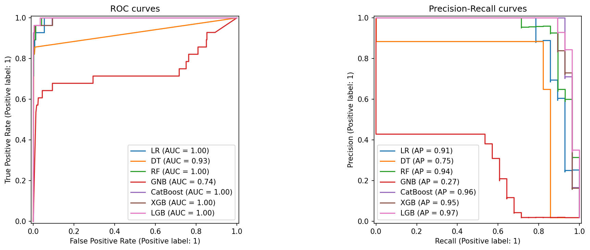
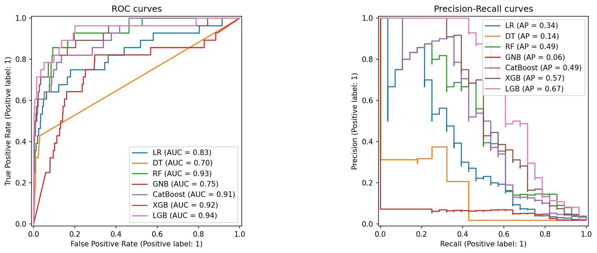
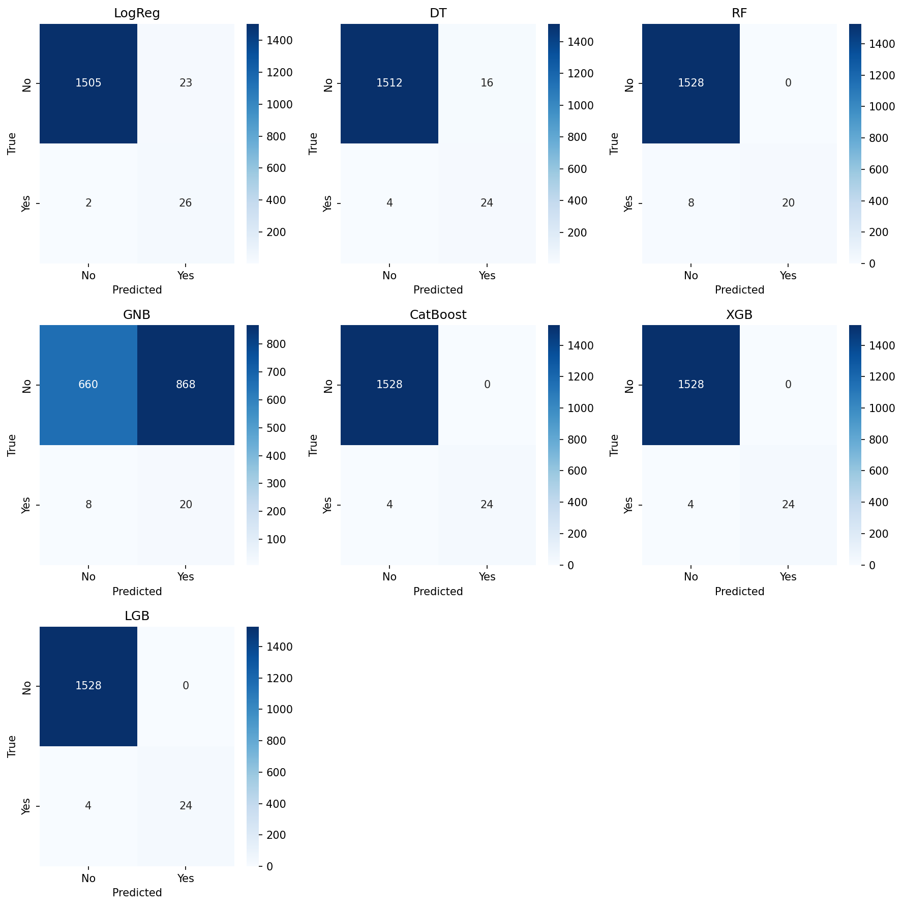
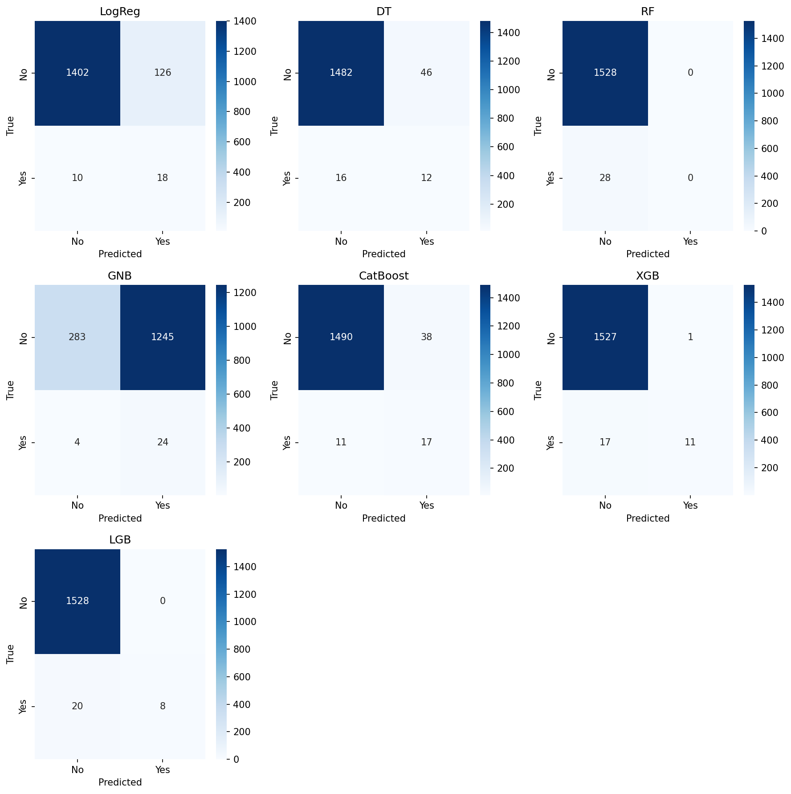
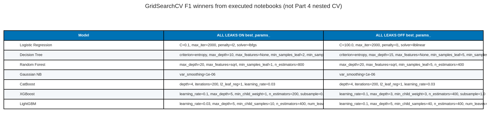

# Leakage contrast — ALL LEAKS ON vs ALL LEAKS OFF

Standalone sub-report for the 70/30 GridSearch twins. **Not nested CV. Not TabPFN. Not a baseline.** TSSI is leakage-only.

**Sibling nested-CV ranking:** [baseline_plus_tabpfn_paper_figures_and_tables.md](baseline_plus_tabpfn_paper_figures_and_tables.md) (anti-leakage ON, 9 arms). GridSearch `best_params_` below are **not** imported into that notebook.

**Rebuild.** `code/modeling/rating/rebuild_tssi_leakage_table.py` from dump `test_metrics.csv` (papermill 2026-09-19). Freeze keys: `kaggle_tssi_leakage` / `kaggle_without_tssi`. Display rounding matches `paper/results.md` §4 (four decimals).

**Asset root:** [paper_figures](paper_figures/)

---

## Contents

1. [Protocol](#1-protocol)
2. [PR-AUC (primary ranking metric)](#2-pr-auc-primary-ranking-metric)
3. [ROC-AUC](#3-roc-auc)
4. [F1, recall, precision, accuracy](#4-f1-recall-precision-accuracy)
5. [Combined metrics table](#5-combined-metrics-table)
6. [Figures](#6-figures)
7. [GridSearch winners (not imported)](#7-gridsearch-winners-not-imported)
8. [File index](#8-file-index)

---

## 1. Protocol

Same seven classic models, same stratified 70/30 (`train_test_split(test_size=0.3, random_state=42)`): train **3,629 / 64 events**, hold-out **1,556 / 28 events**. `GridSearchCV` (`GRID_SCORING=average_precision` in Results; notebook scoring for `best_params_` prints is F1). **Five flags flip together**; SMOTE is ON only in the leaks-on arm. Do not write “identical except TSSI.” Full incentives: [`../anti_leakage_protocol.md`](../anti_leakage_protocol.md).

| Tag | Notebook | Flags | What that arm is testing |
| --- | --- | --- | --- |
| **ALL LEAKS ON** | `code/modeling/rating/baseline_tssi_leakage.ipynb` | `KEEP_TSSI=True`, `DROP_WBC=False`, `QUANTIZE_CLINICAL=False`, `STENT_ENCODER_TRAIN_ONLY=False`, `USE_SMOTE=True` | Keep mixed-definition follow-up time; keep WBC batch/precision marker; keep raw lab decimals; fit stent codebook on the **full** cohort before split; SMOTE the train set. |
| **ALL LEAKS OFF** | `code/modeling/rating/baseline_without_tssi.ipynb` | `KEEP_TSSI=False`, `DROP_WBC=True`, `QUANTIZE_CLINICAL=True`, `STENT_ENCODER_TRAIN_ONLY=True`, `USE_SMOTE=False` | Inverse of every ON flag — same state as nested CV / Part 2 / Part 5. |

**Why these five, not TSSI alone.**

1. **TSSI** — binary-ified survival: VLST=1 time-to-thrombosis (min 380 d); VLST=0 completed follow-up (min 1,241, max 1,605). “time < 1,241 → event” has zero control false positives.
2. **WBC** — recording-precision / case-control batch marker; Wang excluded it from Cox (infection). FDR still ranks it (dual-label).
3. **Quantize** — spurious decimals fingerprint source (`Cre`/`CaI`/`Fiberinogen`/`Fast-Glu` grid, **pre-split**, not a *y*-fit). Signature-only probe on raw file: 243 indicators, AP **0.4270**.
4. **Stent train-only** — rare `Stent type-SES` strings must not define levels from the 1,556-row hold-out (`min_count=30`).
5. **SMOTE** — ON-twin train synthesis inflates hold-out PR-AUC; unmatched vs nested CV (never SMOTE).

Identifiers `NO.` / `Name` are dropped in both twins. Follow-up drugs stay in. Twin `best_params_` are **not** imported into nested CV.

**Dump paths.**

- ON: `code/modeling/rating/Kaggle_baseline_tssi_leakage_results/baseline_leakge_results/modeling_tssi_leakage/test_metrics.csv`
- OFF: `code/modeling/rating/Kaggle_baseline_without_tssi_results/baseline_without_leakage/modeling_without_tssi/test_metrics.csv`

**What the TSSI column is.** For VLST = 1 it is time from index PCI to angiographic thrombosis (min 380 days, Wang median 697). For VLST = 0 it is completed event-free follow-up (min 1,241, max 1,605 days; cohort median follow-up 1,502). That is binary-ified survival time, not a baseline covariate.

Δ = ON − OFF. Positive Δ is optimistic bias of the **five-flag** leaks-on pipeline on this 1,556-row hold-out. Quote as a leakage demonstration, not as a SMOTE-matched experiment and **not** as nested CV. Nested CV, Part 2, and Part 5 implement OFF.

**ARCHIVED — do not insert:** LR PR-AUC 0.9575 → 0.5077; CatBoost 0.9773 → 0.6582.

---

## 2. PR-AUC (primary ranking metric)

Prevalence on the analysed file is **0.0177**. Quote PR-AUC at that prevalence.

**Figure S-TSSI.** PR-AUC on the 1,556-row hold-out. Dotted line = class prevalence (0.0177). ALL LEAKS ON produces inflated ranking; ALL LEAKS OFF returns models to a rare-event scale.

| Model | ON | OFF | Δ PR-AUC |
| --- | ---: | ---: | ---: |
| Logistic regression | 0.9134 | 0.3431 | **+0.5703** |
| Decision tree | 0.7524 | 0.1378 | **+0.6146** |
| Random forest | 0.9400 | 0.4874 | **+0.4526** |
| Gaussian NB | 0.2728 | 0.0564 | **+0.2163** |
| CatBoost | 0.9599 | 0.4942 | **+0.4656** |
| XGBoost | 0.9547 | 0.5685 | **+0.3862** |
| LightGBM | 0.9687 | 0.6675 | **+0.3011** |

Every model’s hold-out PR-AUC is higher on ALL LEAKS ON. Inflation ranges **+0.30 to +0.61**. LightGBM is the least inflated booster and still drops by 0.30.

**Source files:** [paper_fig_s_tssi_pr_auc.png](paper_figures/paper_fig_s_tssi_pr_auc.png), [paper_table_s_tssi_leakage.csv](paper_figures/paper_table_s_tssi_leakage.csv)

---

## 3. ROC-AUC

| Model | ON | OFF | Δ ROC-AUC |
| --- | ---: | ---: | ---: |
| Logistic regression | 0.9954 | 0.8318 | **+0.1635** |
| Decision tree | 0.9266 | 0.7009 | **+0.2257** |
| Random forest | 0.9977 | 0.9287 | **+0.0690** |
| Gaussian NB | 0.7425 | 0.7493 | **−0.0068** |
| CatBoost | 0.9964 | 0.9103 | **+0.0862** |
| XGBoost | 0.9963 | 0.9183 | **+0.0779** |
| LightGBM | 0.9986 | 0.9404 | **+0.0582** |

**Dual-label.** Gaussian NB ROC-AUC is slightly **higher** on ALL LEAKS OFF (0.7493 vs 0.7425). Its PR-AUC still collapses (0.2728 → 0.0564). Do not write “every metric falls.”

---

## 4. F1, recall, precision, accuracy

| Model | F1 ON→OFF (Δ) | Recall ON→OFF | Precision ON→OFF | Acc ON→OFF |
| --- | --- | --- | --- | --- |
| LR | 0.6753 → 0.2093 (**+0.4660**) | 0.9286 → 0.6429 | 0.5306 → 0.1250 | 0.9839 → 0.9126 |
| DT | 0.7059 → 0.2791 (**+0.4268**) | 0.8571 → 0.4286 | 0.6000 → 0.2069 | 0.9871 → 0.9602 |
| RF | 0.8333 → **0.0000** (**+0.8333**) | 0.7143 → **0.0000** | 1.0000 → 0.0000 | 0.9949 → 0.9820 |
| GNB | 0.0437 → 0.0370 (+0.0067) | 0.7143 → 0.8571 | 0.0225 → 0.0189 | 0.4370 → 0.1973 |
| CatBoost | 0.9231 → 0.4096 (**+0.5134**) | 0.8571 → 0.6071 | 1.0000 → 0.3091 | 0.9974 → 0.9685 |
| XGBoost | 0.9231 → 0.5500 (**+0.3731**) | 0.8571 → 0.3929 | 1.0000 → 0.9167 | 0.9974 → 0.9884 |
| LightGBM | 0.9231 → 0.4444 (**+0.4786**) | 0.8571 → 0.2857 | 1.0000 → 1.0000 | 0.9974 → 0.9871 |

Random forest F1 on ALL LEAKS OFF is **0** (no predicted events at the notebook cut) while ROC-AUC remains 0.9287. Boosters that look near-perfect on ON (F1 0.9231, precision 1.0) drop to F1 0.41–0.55 once the leak flags are off. Accuracy stays high on both arms except GNB because the hold-out is 1,528/1,556 non-events; accuracy is not the ranking metric.

---

## 5. Combined metrics table

**Table S-TSSI.** Same stratified 70/30 split and GridSearch family. Logistic regression PR-AUC falls from **0.9134** to **0.3431**; CatBoost **0.9599 → 0.4942**; LightGBM **0.9687 → 0.6675**; Gaussian NB **0.2728 → 0.0564**. Random Forest F1 on ALL LEAKS OFF is **0.0000**.

**Source files:** [paper_table_s_tssi_leakage.png](paper_figures/paper_table_s_tssi_leakage.png), [paper_table_s_tssi_leakage.csv](paper_figures/paper_table_s_tssi_leakage.csv)

---

## 6. Figures

### Dump ROC / PR curves

**Figure S-LEAK-ON.** `roc_pr_curves.png` from the ALL LEAKS ON dump (`modeling_tssi_leakage/`).

**Figure S-LEAK-OFF.** `roc_pr_curves.png` from the ALL LEAKS OFF dump (`modeling_without_tssi/`).

### Dump confusion matrices

**Figure S-CM-ON.** Confusion matrices, ALL LEAKS ON.

**Figure S-CM-OFF.** Confusion matrices, ALL LEAKS OFF. Random forest predicts no events at the stored cut (F1 = 0).

---

## 7. GridSearch winners (not imported)

**Table S-TSSI-HP.** `GridSearchCV` winners printed in the stored notebook outputs (`scoring="f1"`, 5-fold stratified, `random_state=42`, papermill 2026-09-19). **Not** Part 4 nested-CV hyperparameters. Nested-CV classics use library defaults plus class weighting; the inner loop tunes only the F1 threshold.

| Model | ALL LEAKS ON | ALL LEAKS OFF |
| --- | --- | --- |
| Logistic Regression | C=0.1, max_iter=2000, penalty=l2, solver=lbfgs | C=100.0, max_iter=2000, penalty=l1, solver=liblinear |
| Decision Tree | criterion=entropy, max_depth=10, max_features=None, min_samples_leaf=2, min_samples_split=5 | criterion=entropy, max_depth=15, max_features=None, min_samples_leaf=5, min_samples_split=2 |
| Random Forest | max_depth=20, max_features=sqrt, min_samples_leaf=1, n_estimators=800 | max_depth=20, max_features=sqrt, min_samples_leaf=5, n_estimators=400 |
| Gaussian NB | var_smoothing=1e-06 | var_smoothing=1e-06 |
| CatBoost | depth=4, iterations=200, l2_leaf_reg=1, learning_rate=0.03 | depth=4, iterations=200, l2_leaf_reg=1, learning_rate=0.03 |
| XGBoost | learning_rate=0.1, max_depth=5, min_child_weight=1, n_estimators=200, subsample=0.8 | learning_rate=0.1, max_depth=3, min_child_weight=3, n_estimators=400, subsample=1.0 |
| LightGBM | learning_rate=0.03, max_depth=5, min_child_samples=10, n_estimators=400, num_leaves=15 | learning_rate=0.1, max_depth=5, min_child_samples=40, n_estimators=400, num_leaves=15 |

**Source files:** [paper_table_s_tssi_best_params.png](paper_figures/paper_table_s_tssi_best_params.png), [paper_table_s_tssi_best_params.csv](paper_figures/paper_table_s_tssi_best_params.csv)

---

## 8. File index

| ID | Type | File |
| --- | --- | --- |
| Table S-TSSI | Table | [paper_table_s_tssi_leakage.png](paper_figures/paper_table_s_tssi_leakage.png) |
| Table S-TSSI-HP | Table | [paper_table_s_tssi_best_params.png](paper_figures/paper_table_s_tssi_best_params.png) |
| Fig S-TSSI | Figure | [paper_fig_s_tssi_pr_auc.png](paper_figures/paper_fig_s_tssi_pr_auc.png) |
| Fig S-LEAK-ON | Figure | [paper_fig_s_leakage_roc_pr_on.png](paper_figures/paper_fig_s_leakage_roc_pr_on.png) |
| Fig S-LEAK-OFF | Figure | [paper_fig_s_leakage_roc_pr_off.png](paper_figures/paper_fig_s_leakage_roc_pr_off.png) |
| Fig S-CM-ON | Figure | [paper_fig_s_leakage_confusion_on.png](paper_figures/paper_fig_s_leakage_confusion_on.png) |
| Fig S-CM-OFF | Figure | [paper_fig_s_leakage_confusion_off.png](paper_figures/paper_fig_s_leakage_confusion_off.png) |

---

*Numbers from 2026-09-19 Kaggle `test_metrics.csv` (ALL LEAKS ON vs ALL LEAKS OFF). Nested-CV TabPFN ranking is a different dump (`nested_cv_v35_antileakage_on`). Do not import these GridSearch winners into `baseline_plus_tabpfn.ipynb`.*
