# VLST paper results

Self-contained bundle of the paper-style markdown reports (front matter, statistical EDA, classic-model feature selection, stats-vs-ML comparison, nested-CV TabPFN rating, and TabPFN interpretability). All figures and tables live next to these files. Zip this `paper_results/` folder to send it elsewhere; keep the folder layout unchanged so image links keep working.

**How to view.** Open this file in a Markdown previewer (VS Code / Cursor: Markdown Preview). Individual parts also open on their own:

0. [Part 0 — Scope, motivation, terminology, limitations](00_front_matter.md)
1. [Part 1 — Statistical EDA](01_eda/EDA_paper_figures_and_tables.md)
2. [Part 2 — Classic-model feature selection](02_ml_selectors/baseline_feature_selections_paper_figures_and_tables.md)
3. [Part 3 — Statistical vs ML feature extraction](03_stats_vs_ml/feature_extraction_comparison.md)
4. [Part 4 — Nested-CV baselines plus TabPFN](04_tabpfn_rating/baseline_plus_tabpfn_paper_figures_and_tables.md)
5. [Part 5 — TabPFN interpretability](05_tabpfn_interpretability/tabpfn_interpretability_paper_figures_and_tables.md)

Notebooks are not included in this pack.

---

# Part 0. Scope, motivation, terminology, and limitations

This note is the manuscript front matter that Parts 1–5 previously lacked. It is written so it does **not** clash with the three scope decisions: `code/failed_hypothesis/` is unused (D1); TabPFN numbers come only from `baseline_plus_tabpfn.ipynb` and `tabpfn_interpretability.ipynb` (D2); where a report and a notebook disagree, the notebook is authoritative (D4).

**W1 (leakage)** is already in Part 4 (Table S-TSSI / Figure S-TSSI and the follow-up-time methods paragraph). This file covers **W2–W5**.

---

## Terminology (W5)

| Term | Use for |
| --- | --- |
| **Association** | Part 1 univariate and multivariable results; Part 5 mutual information. Full-cohort, no held-out evaluation. |
| **Prediction** | Part 4 nested-CV out-of-fold results **only**. That is the only out-of-sample evaluation in this pack. |
| **Interpretation / attribution** | Part 2 selectors; Part 5 SHAP, k-SII, PDP, stability. Model-explanatory, not evidence about patients. |

Do **not** use: “risk factor”, “causal”, “protective”, “independent predictor”, “clinically useful”, or “validated” for any result in this pack. Wang’s 8-variable Cox score *was* externally tested on Shantou data; that word is reserved for **their** score. Nested-CV discrimination on the derivation cohort is not external validation, and it does not transfer to TabPFN by contagion.

An adjusted OR < 1 (`1.1:1Post dilation` 0.144; `Clopidogrel` 0.464) or a negative PDP shift is a lower modelled odds / probability of recorded VLST, not a treatment benefit (confounding by indication).

---

## Clinical motivation and what this analysis adds (W2)

**Outcome.** Very late stent thrombosis (VLST) is Academic Research Consortium 2007 *definite* stent thrombosis more than one year after implantation, angiographically confirmed (Wang et al., *Sci Rep* 2020;10:6378; hereafter **Wang 2020**). Probable and possible stent thrombosis are not counted. The file `data/raw/VLST.csv` **is** Wang 2020’s derivation cohort: consecutive ACS patients ≥ 18 years undergoing PCI at The First Hospital of Jilin University, 1 January 2014 – 1 June 2015; 6,038 eligible → 5,185 analysed (236 in-hospital deaths, 413 refused follow-up, 204 lost); **92** definite VLST events (**1.77%**). Median follow-up 1,502 days; median PCI → VLST 697 days. Ethics NO. 2013-256; written informed consent; registered NCT03491891.

**Why it matters (clinical, via Wang).** VLST is rare and late. Wang reviews that stent thrombosis accounts for a substantial share of new myocardial infarction after index PCI and carries several-fold higher adjusted mortality than infarction unrelated to a previously stented site. The intended decision is risk-stratification **more than one year** after PCI (monitoring and therapy after the mandated DAPT year).

**A score already exists.** This is not an empty clinical-prediction field. The Dangas late stent thrombosis score (also used for VLST) had c-statistic 0.66 in Wang’s comparison. Wang derived an **8-variable Cox** VLST score on these same 5,185 rows (diabetes, previous PCI, AMI as admitting diagnosis, eGFR < 90, 3-vessel disease, stents per lesion, SES, no post-dilation) with derivation c-statistic **0.80** and **Shantou** external c-statistic **0.82** (n = 2,058; that file is **not** in this repository). Any claim that “no VLST score exists” is false. This pack scores the published **integer points** as a frozen comparator on the same 5,185 rows (Part 4 Table S-Wang): ROC-AUC **0.8013**, PR-AUC **0.1032**. The Cox linear predictor, decision-curve analysis vs Dangas, and the Shantou file are still absent (B11).

**What “personalised” does *not* mean.** The repository README says “Personalized Risk prediction.” Nothing here is an individual-level model, a patient-specific fine-tune, or a decision-curve analysis. The artefact is a **single global classifier** (or a single global logit for association). Nested-CV probabilities are not portable personalised risks: prevalence, calibration, and PPV are properties of this derivation cohort. We do not use “personalised” as a result claim.

**Why TabPFN is in the comparison.** VLST here is a small-n, mixed-type tabular problem (92 events, 81 raw columns). TabPFN is a tabular foundation model that does in-context learning, handles categoricals natively, and does not run a per-dataset hyperparameter grid. Part 4 now reports **both** arms from the same nested CV (Kaggle Tesla T4, `de46f92`): **TabPFN (thinking-high)** (`tabpfn_client.TabPFNClassifier`, constructor unchanged) and **TabPFN (local)** (`from tabpfn import TabPFNClassifier`, `n_estimators="auto"`, `balance_probabilities=True`, no thinking; checkpoint `tabpfn-v3-classifier-v3_default.ckpt`). Classics in the same nested CV use **library defaults** plus class weighting. On this run thinking-high is first on PR-AUC (**0.8553**), ROC-AUC (**0.9905**), and Brier (**0.0064**). LightGBM is second on PR-AUC (**0.6926**). TabPFN (local) is fourth on PR-AUC (**0.6754**), second on ROC-AUC (**0.9845**), and worst on Brier (**0.0673**). Name the two TabPFN Briers separately.

**What this pack adds on the *same* derivation cohort, beyond Wang’s score:**

1. **Association catalogue** (Part 1) — FDR-controlled univariate tests, clinical Table C from `VLST.csv`, and an identified 13-covariate logit (Table 4b; the stored 17-covariate Table 4 is not identified). Not a Cox model; not Wang’s eight variables.
2. **Interpretation catalogues** (Parts 2–3, 5) — classic-model LOCO / SHAP / FFS versus FDR names; TabPFN attributions. These do not feed the predictor.
3. **Prediction comparison** (Part 4) — nested 5×4 stratified CV of five classic classifiers and **both** TabPFN arms after dropping the leaky follow-up-time column (W1), plus the frozen Wang integer score on the same rows (Table S-Wang).
4. **Leakage control** (Part 4 supplement) — with-TSSI vs without-TSSI on a 70/30 split, showing why binary-ified survival time must not be a covariate.

It does **not** add: external or temporal testing of the ML models; a re-fit of Wang’s Cox linear predictor or a Dangas decision curve; a statement that TabPFN is ready for clinical use.

**Data, ethics, consent.** Cite Wang 2020 for NCT03491891, ethics 2013-256, written consent, and their data-availability statement. This repository’s analysis of the derivation file was not separately pre-registered.

---

## Events per variable (W4)

| Comparison | Value | Consequence |
| --- | --- | --- |
| Events / candidate features (81) | 92 / 81 ≈ **1.14** | Far below any conventional EPV rule |
| Events / multivariable logit covariates (17, Table 4) | 92 / 17 ≈ **5.4** | Unidentified spec; do not publish |
| Events / reduced logit covariates (13, Table 4b) | 92 / 13 ≈ **7.1** | One name per collinear block; still below EPV ≥ 10 |
| Events per Part 4 outer fold | 18, 18, 18, 19, 19 | Nested-CV scoreboard is thin |
| Events on the Part 2 val slice | 18 of 1,037 | Selector catalogues are not prediction |

Every **adjusted odds ratio** quoted as the identified screen is from Part 1 **Table 4b** (13 covariates, unweighted logit, **EPV ≈ 7.1**). Table 4 is the stored 17-covariate unidentified fit (**EPV ≈ 5.4**; VIF = ∞ on the post-dilation pair). Both are screening / confounding context, not prediction.

---

## Limitations (W3)

1. **No external or temporal test of the ML models.** Every Part 4 number is nested CV on the 5,185 derivation rows. Wang’s Cox score **was** tested on Shantou (n = 2,058, 1.70% VLST); those rows are not here and **cannot be obtained this cycle** (B11 blocked). Nested CV is not a substitute. The Cox linear predictor and Dangas decision-curve comparison are likewise absent.

2. **Binary classification vs published Cox analysis.** Wang used time-to-event on the follow-up axis. This pack uses a 0/1 label and drops `Time since stent implantation` because, as a covariate, it leaks (Part 4 S-TSSI). The frozen integer score on that binary label recovers Wang’s derivation c-statistic (ROC-AUC 0.8013 vs published 0.80; Part 4 S-Wang). That is not a re-fit of the Cox linear predictor, and it is not Shantou. Nested-CV TabPFN (thinking-high) PR-AUC **0.8553** (LightGBM **0.6926**; TabPFN local **0.6754**) vs the frozen score **0.1032** is a derivation-cohort ranking comparison only.

3. **EPV ≈ 7.1** on the identified 13-covariate logit (Table 4b); **EPV ≈ 5.4** on the stored 17-covariate Table 4, which is unidentified (`1.1:1Post dilation` beside `No postdilation`; `eGFR` beside `CKD5` / `CKD90`; `CKD90` Wald interval 2.71–639.5). Quote Table 4b. Still below EPV ≥ 10.

4. **Two TabPFN calibrations.** Nested-CV TabPFN (thinking-high) Brier is **0.0064**, the **best** of the seven. TabPFN (local) Brier is **0.0673**, the **worst**. Client thinking-high is non-deterministic across dumps (historical Brier 0.0060 / 0.0360 vs this dump 0.0064). Do not collapse the arms.

5. **Unequal TabPFN objects.** Thinking-high is the client API; local is `tabpfn` on Kaggle T4 (`tabpfn-v3-classifier-v3_default.ckpt`). Client and server-side versions remain unrecorded. Classics are untuned defaults.

6. **DAPT columns are post-baseline.** All patients had DAPT for ≥ 1 year; continuation after year 1 was at the treating physician’s discretion. Wang Table 1 “DAPT” is persistence during follow-up, not a discharge prescription. `Aspirin`, `Clopidogrel`, `Ticagrelor`, `DAPT` must not be described as index-PCI covariates without that caveat.

7. **WBC was excluded by the original investigators.** Wang dropped WBC from the Cox score because infection could not be ruled out. Our FDR screen and several selectors rank `WBC` at the top. That is a discrepancy to report, not a new “validated” inflammatory marker.

8. **Unequal tuning (Part 4).** A shared 9-level stent encoder is applied before the split. Classics then scale + one-hot that column inside each CV split (~89 columns). Both TabPFN arms see the same 9-level frame natively. Classics are untuned defaults; local TabPFN is not thinking-high; the client arm is thinking-high. Part 2/5 catalogues are discovery / attribution, not a mask for Part 4.

9. **PR-AUC CIs and paired test (B3).** Stratified bootstrap of pooled OOF (`n_boot = 2000`): thinking-high PR-AUC **0.8553 (0.7957–0.9131)** vs LightGBM **0.6926 (0.6049–0.7772)**; Δ **0.1627 (0.1000–0.2301)**, P(Δ ≤ 0) = 0/2000. Local vs LightGBM Δ **−0.0172 (−0.0951–0.0588)** is compatible with no difference. Thinking-high remains higher in **5 of 5** outer folds; local in **2 of 5**. OOF CSVs are committed (B2).

10. **`LV` (and `CaI`) are not named in the CSV.** Until the columns are named, timed, and unit-defined, do not treat `LV` as a novel echo marker. `CaI` means match Wang Table 1 peak troponin I but the file still does not expand the name. Clinical Table C is rebuilt from `VLST.csv` (B7), including both, and does not photocopy Wang’s post-dilation label.

11. **Part 5 is not the Part 4 predictor.** Ranking / SHAP / stability use `balance_probabilities=True` (stretched 1.8% prior so shapes are visible). PDP uses `False` (empirical prior, labeled not Part 4 risk; binary P(y=1) ≈ 0.017–0.023). Do not mix those scales on one axis. SHAP is **15 VLST=1 + 15 VLST=0** with client thinking; k-SII is one VLST=1 row (5099). Do not treat k-SII as cohort interactions.

---

## Sources for this note

Wang X, et al. A novel risk model for predicting very late stent thrombosis after percutaneous coronary intervention: a derivation and validation study. *Sci Rep*. 2020;10:6378. doi:10.1038/s41598-020-63455-0.

TabPFN configuration actually used: `code/modeling/rating/baseline_plus_tabpfn.ipynb` (performance) and `code/modeling/interpretability/tabpfn_interpretability.ipynb` (attribution). No other TabPFN notebook is in scope.

---
# Part 1. Statistical EDA

### VLST EDA — Paper Figures and Tables

This document gathers publication-oriented figures and tables from the exploratory data analysis of very late stent thrombosis (VLST) in `eda.ipynb`.

**Cohort context.** Analyses use the VLST dataset (n = 5,185; 92 VLST events; prevalence 0.0177). The notebook printed **no missing values** in any column — univariate screens do not impute. Univariate continuous tests use Welch t-test when abs(skew) ≤ 1 and excess kurtosis ≤ 3, otherwise Mann–Whitney U. Binary associations use recommended 2×2 tests (chi-square / Fisher / related). Multiplicity is controlled with Benjamini–Hochberg FDR unless noted. Multivariable models are exploratory and sparse given the limited number of events. `Stent type-SES` is collapsed to levels with n ≥ 30 plus `other` (**9 levels**) for the χ² screen via the shared encoder (`code/modeling/tools/stent_encoding.py`). Part 2 now uses that same 9-level column and one-hots it (drop-first → **88** scaled columns). Part 4 nested CV uses the same encoder, then one-hots without drop-first (~89 columns); TabPFN (local) sees the 9-level frame natively. `Time since stent implantation` is treated as a **time-at-risk / follow-up** variable and is **not** interpreted as a baseline clinical association.

**Asset root:** [paper_figures/](01_eda/paper_figures/)

> Preview note: large table images are linked (not inlined) so the Markdown preview stays responsive. Figure PNGs are inlined below.

---

## Contents

0. [Cohort characteristics](#0-cohort-characteristics-clinical-table-1)
1. [Test selection](#1-test-selection)
2. [Univariate continuous associations](#2-univariate-continuous-associations)
3. [Univariate binary associations](#3-univariate-binary-associations)
4. [Categorical associations](#4-categorical-associations)
5. [Multivariable adjustment](#5-multivariable-adjustment)
6. [Pairwise / bivariate structure](#6-pairwise--bivariate-structure)
7. [Medical-domain analysis (supplementary)](#7-medical-domain-analysis-supplementary)
8. [File index](#8-file-index)

---

## 0. Cohort characteristics (clinical Table 1)

### Table C. Derivation-cohort characteristics from `VLST.csv`

Rendered table image: [paper_figures/paper_table_c_cohort_characteristics.png](01_eda/paper_figures/paper_table_c_cohort_characteristics.png)

**Table C.** Case–control characteristics rebuilt from `data/raw/VLST.csv` (n = 5,185; 92 VLST). This is the conventional clinical Table 1 for the manuscript. It is **association**, not prediction. Cite Wang 2020 for the recruitment flow (**6,038 eligible → 5,185 analysed**: 236 in-hospital deaths, 413 refused follow-up, 204 lost). Continuous cells are mean (SD); binary cells are n (%). Tests follow the Part 1 rule (Welch if abs(skew) ≤ 1 and excess kurtosis ≤ 3, otherwise Mann–Whitney U; chi-square unless any expected cell < 5, then Fisher). `Time since stent implantation` is omitted: it is time-at-risk / follow-up, not a baseline covariate.

**Do not photocopy Wang Table 1’s post-dilation row.** Wang reports “No post-dilation” in 14/92 VLST (15.22%) vs 2,496/5,093 controls (49.01%). In this CSV those 14 events sit on `1.1:1Post dilation` = 1, and `No postdilation` is the exact complement (78/92). Both columns are shown as stored. `Aspirin` / `Clopidogrel` / `Ticagrelor` / `DAPT` are **follow-up persistence** after the mandated year, not index-PCI prescriptions (Wang DAPT 44.37% vs 38.04%, p = 0.226 — recovered here). `LV` is still unnamed (A1/A4). `CaI` is still unnamed in the file; its means **match** Wang Table 1 peak troponin I (37.37 ± 61.64 vs 40.55 ± 72.25) and are not treated as a new marker. `PES` recovers Wang Table 1 SES (68.76% vs 82.61%). The full column list is in the CSV.

| Variable | No VLST (n = 5,093) | VLST (n = 92) | Test | p |
| --- | --- | --- | --- | --- |
| Age, years | 59.83 (9.93) | 60.71 (11.33) | Welch t | 0.463 |
| Men | 3489 (68.51%) | 68 (73.91%) | Chi-square | 0.268 |
| Diabetes | 1293 (25.39%) | 36 (39.13%) | Chi-square | 0.003 |
| Hypertension | 2670 (52.42%) | 51 (55.43%) | Chi-square | 0.567 |
| Dyslipidaemia (HL) | 1612 (31.65%) | 28 (30.43%) | Chi-square | 0.804 |
| Current smoker | 2860 (56.16%) | 54 (58.70%) | Chi-square | 0.626 |
| Previous PCI | 94 (1.85%) | 10 (10.87%) | Fisher | 1.25e-05 |
| Previous MI | 347 (6.81%) | 10 (10.87%) | Chi-square | 0.128 |
| Admitting diagnosis AMI | 3095 (60.77%) | 65 (70.65%) | Chi-square | 0.054 |
| 3-vessel disease | 1422 (27.92%) | 42 (45.65%) | Chi-square | 0.000 |
| LVEF, % | 55.15 (4.52) | 54.55 (3.68) | Mann–Whitney U | 0.033 |
| LV (unnamed; not in Wang Table 1) | 44.55 (4.04) | 49.11 (4.23) | Welch t | 5.44e-17 |
| WBC, 10^9/L | 8.75 (3.24) | 12.49 (3.92) | Mann–Whitney U | 7.90e-21 |
| Creatinine | 72.53 (24.81) | 72.44 (19.05) | Mann–Whitney U | 0.879 |
| eGFR | 120.03 (34.10) | 95.88 (19.63) | Welch t | 4.64e-20 |
| eGFR < 90 (CKD90) | 860 (16.89%) | 32 (34.78%) | Chi-square | 6.55e-06 |
| CaI (unnamed; not in Wang Table 1) | 37.37 (61.64) | 40.55 (72.25) | Mann–Whitney U | 0.051 |
| Fibrinogen, g/L | 3.17 (0.88) | 3.37 (1.01) | Mann–Whitney U | 0.012 |
| Stents per lesion | 1.21 (0.46) | 1.42 (0.65) | Mann–Whitney U | 0.000 |
| Total stent length, mm | 31.70 (15.62) | 38.46 (20.71) | Mann–Whitney U | 0.001 |
| SES (`PES` column) | 3502 (68.76%) | 76 (82.61%) | Chi-square | 0.004 |
| 1.1:1 post-dilation (CSV as stored) | 2496 (49.01%) | 14 (15.22%) | Chi-square | 1.30e-10 |
| No postdilation (CSV as stored) | 2597 (50.99%) | 78 (84.78%) | Chi-square | 1.30e-10 |
| DAPT during follow-up (not index PCI) | 2260 (44.37%) | 35 (38.04%) | Chi-square | 0.226 |

**Source files:** [paper_figures/paper_table_c_cohort_characteristics.png](01_eda/paper_figures/paper_table_c_cohort_characteristics.png), [paper_figures/paper_table_c_cohort_characteristics.csv](01_eda/paper_figures/paper_table_c_cohort_characteristics.csv)

---

## 1. Test selection

### Figure 1. Continuous test-selection map

**Figure 1.** Map of continuous predictors in the abs(skewness)–excess-kurtosis plane used to choose the primary univariate test for association with VLST. Green markers indicate Welch t-test (abs(skew) ≤ 1 and excess kurtosis ≤ 3); orange markers indicate Mann–Whitney U. Panel A uses a linear kurtosis axis (high-kurtosis features annotated if clipped); panel B uses a log kurtosis scale to show the full range; panel C lists feature IDs, chosen test, and shape statistics. Dashed lines mark the selection thresholds.

**Source file:** [paper_figures/paper_fig1_test_selection_map.png](01_eda/paper_figures/paper_fig1_test_selection_map.png)

### Table R. Continuous variables: chosen univariate test and rationale

Rendered table image (open separately if needed): [paper_figures/paper_table_test_rationale.png](01_eda/paper_figures/paper_table_test_rationale.png)

**Table R.** For each continuous predictor, the selected univariate test, distributional rationale (skewness, excess kurtosis, variance ratio), raw p, FDR q, and significance code (`p<0.05` / `p<0.01` / `p<0.001`).

| ID | Feature | Chosen test | Skewness | Kurtosis | Var. ratio | Why this test | p (raw) | q (FDR) | Sig |
| --- | --- | --- | --- | --- | --- | --- | --- | --- | --- |
| 1 | CKD5 | Mann-Whitney U | 2.62 | 7.51 | 1.32 | Heavy skew/tails (/skew/>1 or kurt>3) -> MW | 1.19e-05 | 5.69e-05 | p<0.001 |
| 2 | CaI | Mann-Whitney U | 2.83 | 9.43 | 1.37 | Heavy skew/tails (/skew/>1 or kurt>3) -> MW | 0.0507 | 0.0869 | ns |
| 3 | Cre | Mann-Whitney U | 7.48 | 161.34 | 1.7 | Heavy skew/tails (/skew/>1 or kurt>3) -> MW | 0.878 | 0.938 | ns |
| 4 | Fast-Glu | Mann-Whitney U | 2.42 | 7.84 | 2.13 | Heavy skew/tails (/skew/>1 or kurt>3) -> MW | 0.0246 | 0.0536 | ns |
| 5 | Fiberinogen | Mann-Whitney U | 1.62 | 5.65 | 1.31 | Heavy skew/tails (/skew/>1 or kurt>3) -> MW | 0.0119 | 0.0286 | p<0.05 |
| 6 | HbA1c | Mann-Whitney U | 1.4 | 1.92 | 1.11 | Heavy skew/tails (/skew/>1 or kurt>3) -> MW | 2.00e-04 | 7.00e-04 | p<0.001 |
| 7 | LDL | Mann-Whitney U | 1.06 | 4.67 | 1.78 | Heavy skew/tails (/skew/>1 or kurt>3) -> MW | 0.327 | 0.491 | ns |
| 8 | LVEF | Mann-Whitney U | -1.48 | 7.42 | 1.51 | Heavy skew/tails (/skew/>1 or kurt>3) -> MW | 0.0333 | 0.0666 | ns |
| 9 | No.of stents per lesion | Mann-Whitney U | 2.13 | 4.7 | 2.03 | Heavy skew/tails (/skew/>1 or kurt>3) -> MW | 1.00e-04 | 6.00e-04 | p<0.001 |
| 10 | Platelet | Mann-Whitney U | 1.32 | 6.92 | 1.24 | Heavy skew/tails (/skew/>1 or kurt>3) -> MW | 0.816 | 0.938 | ns |
| 11 | TG | Mann-Whitney U | 2.13 | 8.84 | 1.52 | Heavy skew/tails (/skew/>1 or kurt>3) -> MW | 0.558 | 0.705 | ns |
| 12 | Time since stent implantation | Mann-Whitney U | -2.36 | 13.2 | 12.7 | Heavy skew/tails (/skew/>1 or kurt>3) -> MW | 1.70e-34 | 4.07e-33 | p<0.001 |
| 13 | Total stent length | Mann-Whitney U | 1.74 | 4.15 | 1.76 | Heavy skew/tails (/skew/>1 or kurt>3) -> MW | 0.0011 | 0.003 | p<0.01 |
| 14 | WBC | Mann-Whitney U | 1.21 | 2.12 | 1.47 | Heavy skew/tails (/skew/>1 or kurt>3) -> MW | 7.90e-21 | 9.48e-20 | p<0.001 |
| 15 | Age | Welch t-test | -0.07 | -0.28 | 1.3 | Approx. symmetric (/skew/≤1 & kurt≤3) -> Welch | 0.463 | 0.618 | ns |
| 16 | HDL | Welch t-test | 0.91 | 1.73 | 1.58 | Approx. symmetric (/skew/≤1 & kurt≤3) -> Welch | 0.899 | 0.938 | ns |
| 17 | HGB | Welch t-test | -0.41 | 0.52 | 1.54 | Approx. symmetric (/skew/≤1 & kurt≤3) -> Welch | 0.0388 | 0.0716 | ns |
| 18 | LV | Welch t-test | 0.97 | 2.47 | 1.1 | Approx. symmetric (/skew/≤1 & kurt≤3) -> Welch | 5.44e-17 | 3.26e-16 | p<0.001 |
| 19 | Max-stent diameter | Welch t-test | 0.59 | 0.3 | 1.17 | Approx. symmetric (/skew/≤1 & kurt≤3) -> Welch | 0.885 | 0.938 | ns |
| 20 | Min-stent diameter | Welch t-test | 0.76 | 0.72 | 1.09 | Approx. symmetric (/skew/≤1 & kurt≤3) -> Welch | 0.106 | 0.169 | ns |
| 21 | NO.of vessels | Welch t-test | 0.24 | -1.48 | 1.04 | Approx. symmetric (/skew/≤1 & kurt≤3) -> Welch | 5.00e-04 | 0.0014 | p<0.01 |
| 22 | Stent release pressure | Welch t-test | 0.07 | -0.56 | 1.13 | Approx. symmetric (/skew/≤1 & kurt≤3) -> Welch | 0.949 | 0.949 | ns |
| 23 | TCL | Welch t-test | 0.87 | 2.75 | 1.57 | Approx. symmetric (/skew/≤1 & kurt≤3) -> Welch | 0.381 | 0.537 | ns |
| 24 | eGFR | Welch t-test | 0.06 | -0.58 | 3.02 | Approx. symmetric (/skew/≤1 & kurt≤3) -> Welch | 4.64e-20 | 3.71e-19 | p<0.001 |

**Source files:** [paper_figures/paper_table_test_rationale.png](01_eda/paper_figures/paper_table_test_rationale.png), [paper_figures/paper_table_test_rationale.csv](01_eda/paper_figures/paper_table_test_rationale.csv)

---

## 2. Univariate continuous associations

### Figure 2. Univariate continuous significance overview

**Figure 2.** Horizontal ranking of continuous features by -log10(p) for association with VLST. Bar color denotes the chosen test (Welch vs Mann–Whitney). The dotted line marks nominal p = 0.05; the dashed line approximates the FDR discovery boundary among continuous tests. FDR marks label features with FDR q < 0.05.

**Source file:** [paper_figures/paper_fig2_univariate_significance.png](01_eda/paper_figures/paper_fig2_univariate_significance.png)

### Table 1. Continuous features with FDR q < 0.05 (univariate)

Rendered table image: [paper_figures/paper_table1_continuous_fdr.png](01_eda/paper_figures/paper_table1_continuous_fdr.png)

**Table 1.** FDR-significant continuous associations with VLST, including test type, effect-size metric (Cohen d or Mann–Whitney r), mean/median differences (VLST − no VLST), raw p, and FDR q. Features annotated as time-at-risk should not be interpreted as baseline clinical associations.

| Feature | Test | Direction | Effect size | ES | Δ mean | Δ median | p | q (FDR) | Sig | Note |
| --- | --- | --- | --- | --- | --- | --- | --- | --- | --- | --- |
| Time since stent implantation | Mann-Whitney U | Negative | Mann-Whitney r | -0.17 | -572.05 | -683.00 | 1.70e-34 | 4.07e-33 | p<0.001 | Time-at-risk / structural |
| WBC | Mann-Whitney U | Positive | Mann-Whitney r | 0.13 | 3.75 | 3.82 | 7.90e-21 | 9.48e-20 | p<0.001 | — |
| eGFR | Welch t-test | Negative | Cohen's d | -0.712 | -24.1 | -17.6 | 4.64e-20 | 3.71e-19 | p<0.001 | — |
| LV | Welch t-test | Positive | Cohen's d | 1.13 | 4.56 | 4 | 5.44e-17 | 3.26e-16 | p<0.001 | — |
| CKD5 | Mann-Whitney U | Positive | Mann-Whitney r | 0.04 | 0.18 | 0 | 1.19e-05 | 5.69e-05 | p<0.001 | — |
| No.of stents per lesion | Mann-Whitney U | Positive | Mann-Whitney r | 0.037 | 0.21 | 0 | 1.00e-04 | 6.00e-04 | p<0.001 | — |
| HbA1c | Mann-Whitney U | Positive | Mann-Whitney r | 0.052 | 0.47 | 1.05 | 2.00e-04 | 7.00e-04 | p<0.001 | — |
| NO.of vessels | Welch t-test | Positive | Cohen's d | 0.388 | 0.32 | 0 | 5.00e-04 | 0.0014 | p<0.01 | — |
| Total stent length | Mann-Whitney U | Positive | Mann-Whitney r | 0.045 | 6.76 | 2 | 0.0011 | 0.003 | p<0.01 | — |
| Fiberinogen | Mann-Whitney U | Positive | Mann-Whitney r | 0.035 | 0.2 | 0.17 | 0.0119 | 0.0286 | p<0.05 | — |

**Source files:** [paper_figures/paper_table1_continuous_fdr.png](01_eda/paper_figures/paper_table1_continuous_fdr.png), [paper_figures/paper_table1_continuous_univariate.csv](01_eda/paper_figures/paper_table1_continuous_univariate.csv)

### Figure 3. Effect sizes for FDR-significant continuous features

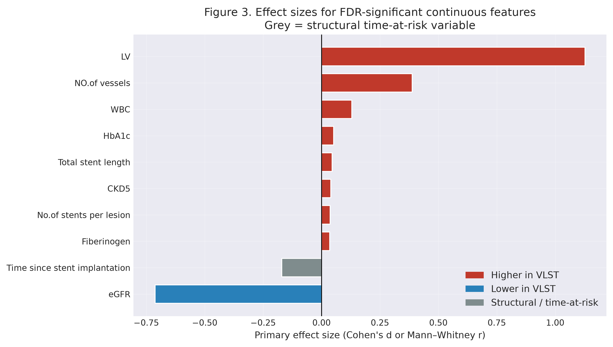

**Figure 3.** Primary effect sizes for continuous features with FDR q < 0.05. **Cohen's d (Welch) and Mann–Whitney r are different metrics and are not on one scale** — `WBC` r = 0.13 is not “smaller than” `LV` d = 1.13. The stored PNG plots them on one axis; read the `Effect size` column in Table 1, not bar length across tests. Grey highlighting (when present) marks the structural time-at-risk variable (`Time since stent implantation`).

**Source file:** [paper_figures/paper_fig3_continuous_effect_sizes.png](01_eda/paper_figures/paper_fig3_continuous_effect_sizes.png)

---

## 3. Univariate binary associations

### Figure 4. Odds ratios for binary features (FDR q < 0.05)

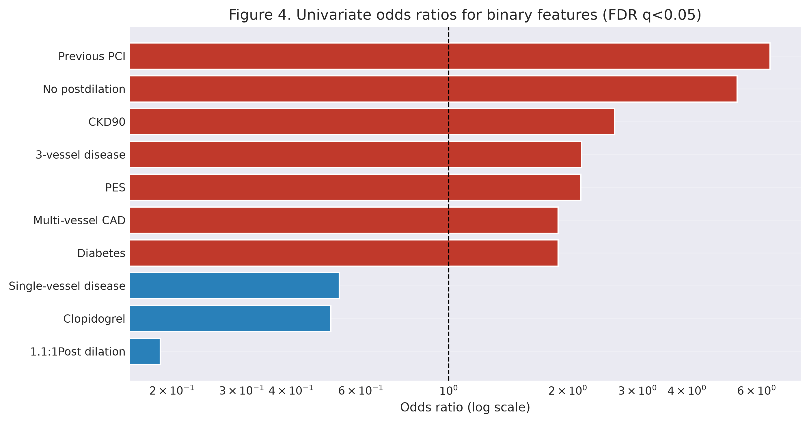

**Figure 4.** Univariate 2×2 odds ratios for binary indicators with FDR q < 0.05. OR > 1: higher odds of VLST when the flag is present. OR < 1: lower odds in this table, **not** a treatment benefit (confounding by indication).

**Source file:** [paper_figures/paper_fig4_binary_odds_ratios.png](01_eda/paper_figures/paper_fig4_binary_odds_ratios.png)

### Table 2. Binary features associated with VLST

Rendered table image: [paper_figures/paper_table2_binary_fdr.png](01_eda/paper_figures/paper_table2_binary_fdr.png)

**Table 2.** Binary associations with FDR q < 0.05. **OR is the 2×2 cross-product** (Fisher exact when the notebook chose Fisher; chi-square otherwise) — for `Previous PCI` this is **6.49**. This is not the univariate logistic OR in Table 4 (6.46) or the joint-domain univariate OR in Table S4 (6.73). Rates, RR, and phi use the same 2×2. OR < 1 is a **lower odds of recorded VLST** when the flag is 1, not a treatment benefit (confounding by indication).

| Feature | Test | OR | RR | Phi | VLST% (1) | VLST% (0) | p | q (FDR) | Sig |
| --- | --- | --- | --- | --- | --- | --- | --- | --- | --- |
| 1.1:1Post dilation | Chi-square | 0.187 | 0.191 | -0.089 | 0.56 | 2.92 | 1.30e-10 | 3.69e-09 | p<0.001 |
| No postdilation | Chi-square | 5.36 | 5.23 | 0.089 | 2.92 | 0.56 | 1.30e-10 | 3.69e-09 | p<0.001 |
| CKD90 | Chi-square | 2.62 | 2.57 | 0.063 | 3.59 | 1.4 | 6.55e-06 | 1.00e-04 | p<0.001 |
| Previous PCI | Fisher exact | 6.49 | 5.96 | 0.085 | 9.62 | 1.61 | 1.25e-05 | 2.00e-04 | p<0.001 |
| 3-vessel disease | Chi-square | 2.17 | 2.13 | 0.052 | 2.87 | 1.34 | 2.00e-04 | 0.0021 | p<0.01 |
| Clopidogrel | Chi-square | 0.503 | 0.509 | -0.043 | 1.17 | 2.29 | 0.0022 | 0.0209 | p<0.05 |
| Diabetes | Chi-square | 1.89 | 1.86 | 0.042 | 2.71 | 1.45 | 0.0028 | 0.0226 | p<0.05 |
| PES | Chi-square | 2.16 | 2.13 | 0.04 | 2.12 | 1 | 0.0044 | 0.0315 | p<0.05 |
| Multi-vessel CAD | Chi-square | 1.89 | 1.87 | 0.038 | 2.19 | 1.17 | 0.0062 | 0.0351 | p<0.05 |
| Single-vessel disease | Chi-square | 0.529 | 0.535 | -0.038 | 1.17 | 2.19 | 0.0062 | 0.0351 | p<0.05 |

**Source files:** [paper_figures/paper_table2_binary_fdr.png](01_eda/paper_figures/paper_table2_binary_fdr.png), [paper_figures/paper_table2_binary_univariate.csv](01_eda/paper_figures/paper_table2_binary_univariate.csv)

---

## 4. Categorical associations

### Figure 5. VLST rate by stent type

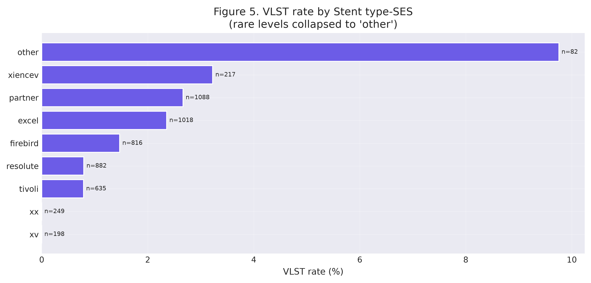

**Figure 5.** Observed VLST rate (%) across categories of `Stent type-SES` after the shared encoder (canonicalize aliases, collapse n < 30 → `other`, **9 levels**). Raw distinct strings in this run: **99**. Rates: `other` 5.5%, `xiencev` 3.3%, `partner` 2.3%, `excel` 2.1%, `firebird` 1.6%, `tivoli` 0.83%, `resolute` 0.82%, `xv` 0%, `xx` 0%. Part 2 one-hots these 9 levels. Wang 2020 used a **binary SES class flag**. Rates are descriptive; formal association testing is summarized in Table 3.

**Source file:** [paper_figures/paper_fig5_categorical_rates_Stent_type-SES.png](01_eda/paper_figures/paper_fig5_categorical_rates_Stent_type-SES.png)

### Table 3. Categorical feature association with VLST

Rendered table image: [paper_figures/paper_table3_categorical.png](01_eda/paper_figures/paper_table3_categorical.png)

**Table 3.** Chi-square association between stent-type category and VLST, with degrees of freedom, Cramer V, raw p, and FDR q.

| Feature | Test | Levels used | Chi-square | df | Cramér's V | p | q (FDR) | Sig |
| --- | --- | --- | --- | --- | --- | --- | --- | --- |
| Stent type-SES | Chi-square | 9 | 44.9 | 8 | 0.093 | 3.85e-07 | 3.85e-07 | p<0.001 |

**Source files:** [paper_figures/paper_table3_categorical.png](01_eda/paper_figures/paper_table3_categorical.png), [paper_figures/paper_table3_categorical.csv](01_eda/paper_figures/paper_table3_categorical.csv)

**Methods note — 20 FDR names ≈ 12 constructs.** Pooling Tables 1–3 (and excluding `Time since stent implantation`) gives **20** FDR q < 0.05 names. At least 8 are redundant re-encodings: post-dilation complements (2 slots for 1 bit), the vessel-disease family (`3-vessel`, `Multi-vessel`, `Single-vessel`, `NO.of vessels` — 4 slots for 1 construct), and the renal family (`CKD5`, `CKD90` with continuous `eGFR` — 3 slots for 1 construct). Report the headline as roughly **12 distinct clinical constructs**, not 20 independent discoveries.

---

## 5. Multivariable adjustment

### Table 4. Exploratory multivariable logistic model (adjusted ORs)

Rendered table image: [paper_figures/paper_table4_multivariable_or.png](01_eda/paper_figures/paper_table4_multivariable_or.png)

**Table 4.** Exploratory multivariable logistic regression for VLST as stored from `eda.ipynb` (17 covariates). Continuous predictors are scaled per 1 SD. `Time since stent implantation` is excluded. **This specification is not identified:** `1.1:1Post dilation` sits beside its exact complement `No postdilation` (VIF = ∞), and `eGFR` sits beside `CKD5` / `CKD90`. `CKD90`’s Wald interval is 2.708–639.506. **EPV = 92 / 17 ≈ 5.4**. Do **not** publish Table 4 as the clinical multivariable model. Quote **Table 4b**. Adjusted ORs are for screening/confounding context, **not prediction**. `class_weight="balanced"` is **not** used here.

**OR estimators (do not mix).** Table 4 “Univariate OR” is from this unweighted logit (one covariate at a time, same scaling). Table 2 OR is the **2×2 / Fisher** estimator. Supplementary Figure S4 “Univariate OR” is from the joint-domain specification. For `Previous PCI` those three numbers are **6.46 / 6.49 / 6.73**. OR < 1 for `1.1:1Post dilation` or `Clopidogrel` is not a treatment benefit.

| Feature | Type | Univariate OR | Adjusted OR | 95% CI |
| --- | --- | --- | --- | --- |
| WBC | continuous (per 1 SD) | 2.69 | 3 | [2.424, 4.225] |
| eGFR | continuous (per 1 SD) | 0.334 | 0.113 | [0.060, 0.158] |
| LV | continuous (per 1 SD) | 3.12 | 3.28 | [2.335, 5.254] |
| CKD5 | continuous (per 1 SD) | 1.39 | 0.156 | [0.023, 0.285] |
| No.of stents per lesion | continuous (per 1 SD) | 1.38 | 1.3 | [0.693, 2.177] |
| HbA1c | continuous (per 1 SD) | 1.37 | 0.87 | [0.569, 1.280] |
| NO.of vessels | continuous (per 1 SD) | 1.46 | 1.5 | [0.774, 3.392] |
| Total stent length | continuous (per 1 SD) | 1.39 | 1.13 | [0.658, 2.269] |
| Fiberinogen | continuous (per 1 SD) | 1.22 | 1.04 | [0.804, 1.348] |
| 1.1:1Post dilation | binary | 0.187 | 0.144 | [0.040, 0.245] |
| No postdilation | binary | 5.35 | 0.895 | [0.429, 1.358] |
| CKD90 | binary | 2.62 | 12.5 | [2.708, 639.506] |
| Previous PCI | binary | 6.46 | 8.98 | [3.226, 28.618] |
| 3-vessel disease | binary | 2.17 | 0.605 | [0.135, 2.936] |
| Clopidogrel | binary | 0.504 | 0.464 | [0.195, 0.817] |
| Diabetes | binary | 1.89 | 1.88 | [0.678, 4.331] |
| PES | binary | 2.16 | 1.24 | [0.585, 4.056] |

**Source files:** [paper_figures/paper_table4_multivariable_or.png](01_eda/paper_figures/paper_table4_multivariable_or.png), [paper_figures/paper_table4_multivariable_or.csv](01_eda/paper_figures/paper_table4_multivariable_or.csv)

### Table 4b. Reduced specification (one representative per collinear block)

Rendered table image: [paper_figures/paper_table4b_reduced_or.png](01_eda/paper_figures/paper_table4b_reduced_or.png)

**Table 4b.** Same unweighted Bernoulli logit, **13 covariates**, one name per collinear block. Dropped: `No postdilation` (exact complement of `1.1:1Post dilation`); `CKD5` and `CKD90` (deterministic encodings of `eGFR`); `3-vessel disease` (vessel-count family; `NO.of vessels` kept). Continuous covariates per 1 SD (population SD). Primary interval is the **Wald 95% CI**; a stratified 2,000-replicate percentile bootstrap of the same fit is in the CSV. **EPV = 92 / 13 ≈ 7.1** (still below EPV ≥ 10). All Table 4b VIFs are finite (max 4.02, `Total stent length`; post-dilation VIF 1.07 vs ∞ in Table 4). Univariate OR here is the same unweighted 1-SD logit as the adjusted column — not Table 2’s 2×2 estimator and not Table 4’s stored univariate column. OR < 1 is not a treatment benefit.

| Feature | Type | VIF | Univariate OR | Adjusted OR | Wald 95% CI |
| --- | --- | ---: | ---: | ---: | --- |
| WBC | continuous (per 1 SD) | 1.05 | 2.090 | 1.972 | [1.667, 2.331] |
| eGFR | continuous (per 1 SD) | 1.04 | 0.469 | 0.568 | [0.449, 0.717] |
| LV | continuous (per 1 SD) | 1.03 | 2.098 | 1.832 | [1.539, 2.181] |
| No.of stents per lesion | continuous (per 1 SD) | 3.96 | 1.383 | 1.421 | [0.970, 2.080] |
| HbA1c | continuous (per 1 SD) | 1.79 | 1.282 | 0.960 | [0.724, 1.272] |
| NO.of vessels | continuous (per 1 SD) | 1.06 | 1.469 | 1.212 | [0.954, 1.539] |
| Total stent length | continuous (per 1 SD) | 4.02 | 1.378 | 1.160 | [0.777, 1.731] |
| Fiberinogen | continuous (per 1 SD) | 1.03 | 1.206 | 1.024 | [0.845, 1.240] |
| 1.1:1Post dilation | binary | 1.07 | 0.187 | 0.152 | [0.081, 0.286] |
| Previous PCI | binary | 1.01 | 6.485 | 6.710 | [2.884, 15.610] |
| Clopidogrel | binary | 1.00 | 0.503 | 0.480 | [0.293, 0.787] |
| Diabetes | binary | 1.77 | 1.889 | 1.452 | [0.795, 2.652] |
| PES | binary | 1.03 | 2.158 | 1.734 | [0.953, 3.154] |

VIF comparison (Table 4 vs 4b): [paper_figures/paper_table4b_vif_comparison.png](01_eda/paper_figures/paper_table4b_vif_comparison.png). Script: `code/modeling/tools/paper_hygiene_b3_b4_b7.py`.

**Source files:** [paper_figures/paper_table4b_reduced_or.png](01_eda/paper_figures/paper_table4b_reduced_or.png), [paper_figures/paper_table4b_reduced_or.csv](01_eda/paper_figures/paper_table4b_reduced_or.csv), [paper_figures/paper_table4b_vif_comparison.png](01_eda/paper_figures/paper_table4b_vif_comparison.png), [paper_figures/paper_table4b_vif_comparison.csv](01_eda/paper_figures/paper_table4b_vif_comparison.csv)

### Figure 6. Univariate versus multivariable associations

**Figure 6.** Comparison of univariate ORs (diamonds) with multivariable adjusted ORs and 95% CIs (circles/whiskers) for features entering the exploratory joint model. Attenuation toward the null suggests confounding or shared information; persistence of association after adjustment means the name still moves log-odds in this sparse specification, not a causal or standalone clinical claim.

**Source file:** [paper_figures/paper_fig6_uni_vs_multivariable_or.png](01_eda/paper_figures/paper_fig6_uni_vs_multivariable_or.png)

---

## 6. Pairwise / bivariate structure

A separate “bivariate feature extraction” step is **not** required. The correlation heatmap *is* the feature–feature bivariate analysis; predictor-versus-outcome bivariate work is already the FDR screens in sections 2–4 (the notebook calls those tests “univariate” because each model has one predictor). The three layers already in `eda.ipynb` answer different questions:

| Layer | What is paired | Role in the paper | Where |
| --- | --- | --- | --- |
| Predictor × VLST | Each column vs the outcome | Discovery catalogue (FDR q < 0.05) | Sections 2–4 |
| Feature × feature | Numeric columns vs each other | Multicollinearity / clustering before sparse models | Heatmaps below; Supplementary Figure S2 |
| Pair × VLST | Chosen interactions vs the outcome | Hypothesis-generating likelihood-ratio tests | Supplementary Table S2 |

Heatmaps that include `Stent thrombosis` also show predictor–outcome Pearson/Spearman *r*. That is a linear association measure and is **not** a substitute for the Welch / Mann–Whitney / Fisher screens, which allow non-Gaussian, rank, and 2×2 associations and apply FDR. The heatmap does not produce a second “bivariate FDR set.”

### Supplementary Figure S5. Pearson and Spearman heatmaps (top-42 vs next-41, with target)

**Figure S5a.** Pearson correlation among the 42 numeric columns with strongest |r| versus the outcome, against the next 41, including `Stent thrombosis`. Produced by the 2026-08-31 `eda.ipynb` re-run. Off-diagonal blocks are feature–feature structure; the target row/column is the linear predictor–outcome slice.

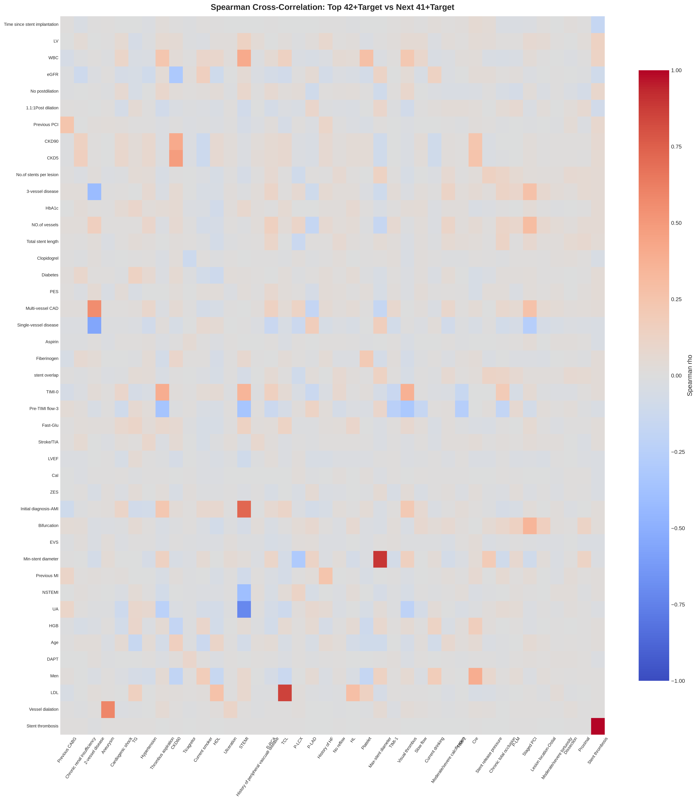

**Figure S5b.** Spearman rank correlation for the same layout. Prefer this panel when tails or monotonic-but-nonlinear associations matter.

Publication clustering of the same numeric block is Supplementary Figure S2 (global and per-domain Spearman clustermaps). Pairwise *with outcome* beyond linear *r* is Table S2.

**Source files:** [paper_figures/03_correlation_heatmap_top42_vs_next41_with_target.png](01_eda/paper_figures/03_correlation_heatmap_top42_vs_next41_with_target.png), [paper_figures/03b_spearman_correlation_heatmap_top42_vs_next41_with_target.png](01_eda/paper_figures/03b_spearman_correlation_heatmap_top42_vs_next41_with_target.png)

---

## 7. Medical-domain analysis (supplementary)

Clinical-block analysis (section 10g): predictors grouped by medical domain; correlation clustering used to drop redundant mates before sparse domain-wise and joint models.

### Supplementary Figure S1. Domain univariate top associations

**Figure S1.** Within each clinical domain (demographics/lifestyle, comorbidities, presentation, anatomy/lesion, procedural/stent, cardiac function, laboratory, medications), the strongest univariate associations with VLST ranked by -log10(p). Time-at-risk is excluded from domain ranking. Color encodes test family (Welch / Mann–Whitney / binary).

### Supplementary Table S1. Domain strength summary

**Table S1.** Domain-level summary of univariate screening: number of features, count of raw p < 0.05, global FDR hits, within-domain FDR hits, minimum p, peak -log10(p), and top feature.

| Domain | n_features | n_raw_p05 | n_fdr_global | n_fdr_domain | min_p | max_neglog10p | top_feature |
| --- | --- | --- | --- | --- | --- | --- | --- |
| Laboratory | 16 | 8 | 6 | 6 | 7.90e-21 | 20.1 | WBC |
| Cardiac function | 2 | 2 | 1 | 2 | 5.44e-17 | 16.3 | LV |
| Procedural / stent | 16 | 6 | 5 | 6 | 1.30e-10 | 9.89 | 1.1:1Post dilation |
| Comorbidities / history | 10 | 3 | 2 | 2 | 1.25e-05 | 4.9 | Previous PCI |
| Anatomy / lesion | 23 | 6 | 4 | 4 | 1.81e-04 | 3.74 | 3-vessel disease |
| Medications (1y) | 4 | 2 | 1 | 2 | 0.0022 | 2.66 | Clopidogrel |
| Presentation / ACS | 5 | 0 | 0 | 0 | 0.0542 | 1.27 | Initial diagnosis-AMI |
| Demographics / lifestyle | 4 | 0 | 0 | 0 | 0.268 | 0.572 | Men |

**Source files:** [paper_figures/domain_strength_summary.csv](01_eda/paper_figures/domain_strength_summary.csv), [paper_figures/domain_univariate_summary.csv](01_eda/paper_figures/domain_univariate_summary.csv)

### Supplementary Figure S2. Feature correlation clustermaps

**Figure S2a.** Global Spearman correlation clustermap of numeric predictors (near-constant columns removed). Hierarchical clustering uses average linkage on distance 1 − abs(r).

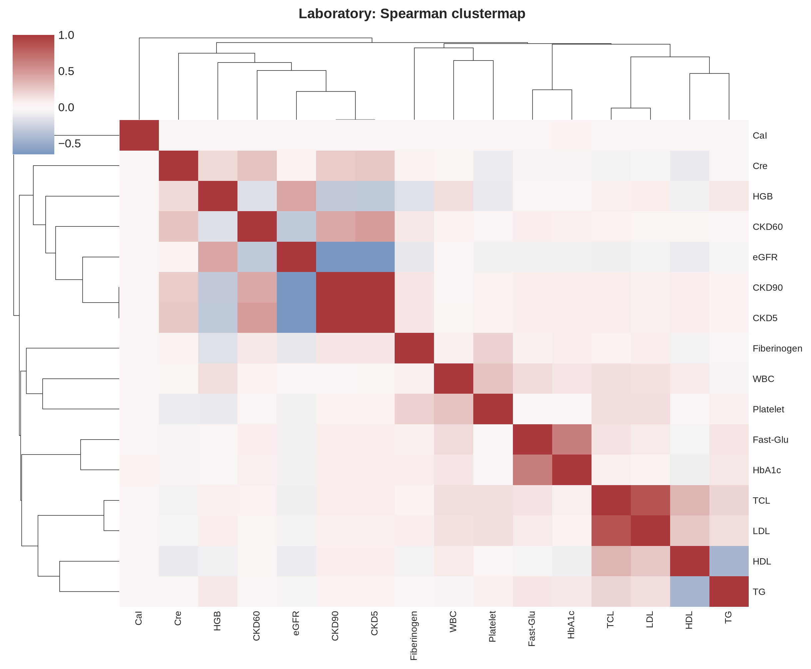

**Figure S2b.** Laboratory-domain Spearman clustermap.

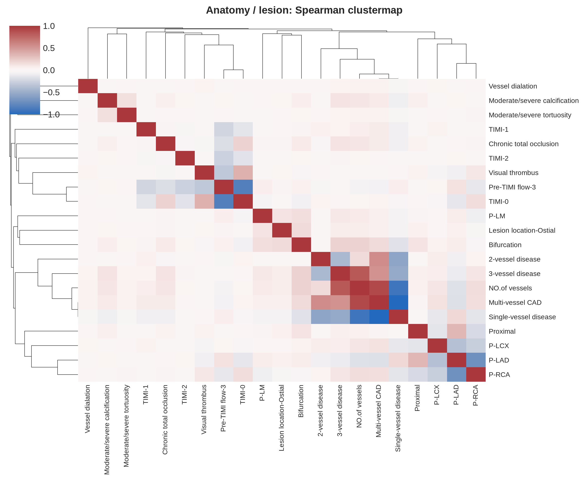

**Figure S2c.** Anatomy/lesion-domain Spearman clustermap.

**Figure S2d.** Procedural/stent-domain Spearman clustermap.

**Source files:** `domain_clustermap_*.png`, `feature_correlation_clusters.csv`, `feature_correlation_cluster_reps.csv`

### Supplementary Figure S3. Per-domain multivariable odds ratios

**Figure S3.** Domain-specific sparse logistic models (core demographics plus up to five non-redundant domain representatives). Primary interval is the unweighted Wald 95% CI from `statsmodels.Logit` (2,000-replicate percentile bootstrap stored as robustness). The dashed line marks OR = 1.

### Supplementary Figure S4. Joint cross-domain model (uni vs adjusted OR)

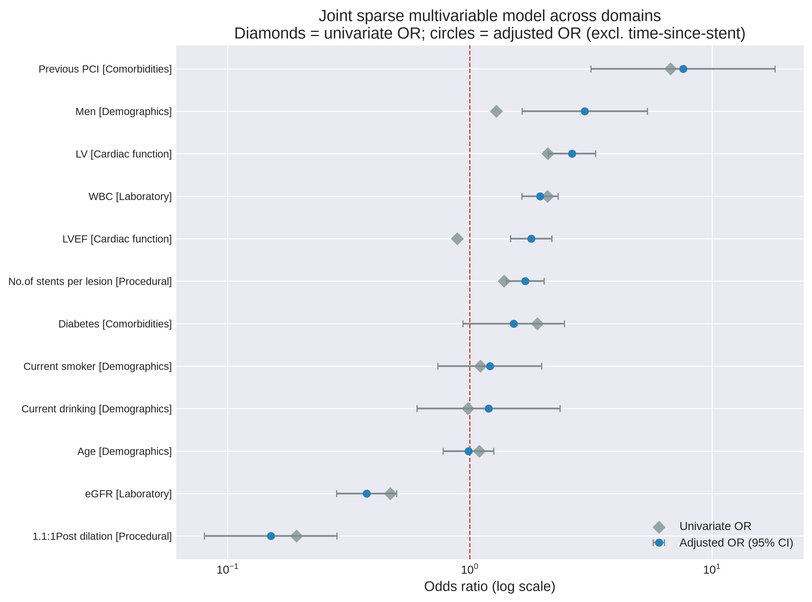

**Figure S4.** Joint sparse cross-domain logistic model comparing univariate ORs with adjusted ORs (**EPV = 92 / 17 ≈ 5.4** on the parent 17-covariate screen; this joint-domain fit is a separate specification). Continuous covariates are per 1 SD; time-since-stent is excluded. Unweighted Wald 95% CIs are primary. `LVEF`’s adjusted OR **reverses sign** versus its univariate OR when `LV` is in the model. The “Univariate OR” column below is from **this joint-domain specification** (`Previous PCI` 6.73), not Table 2’s 2×2 OR (6.49) or Table 4’s univariate logit (6.46).

| Feature | Domain | Univariate OR | Adjusted OR | OR lower | OR upper |
| --- | --- | --- | --- | --- | --- |
| Age | Demographics / lifestyle | 1.08 | 1.1 | 0.836 | 1.34 |
| WBC | Laboratory | 2.69 | 2.94 | 2.34 | 4.4 |
| eGFR | Laboratory | 0.334 | 0.203 | 0.127 | 0.299 |
| LV | Cardiac function | 3.12 | 2.95 | 2.2 | 5.04 |
| LVEF | Cardiac function | 0.851 | 1.65 | 1.3 | 2.26 |
| No.of stents per lesion | Procedural / stent | 1.38 | 1.55 | 1.17 | 2.27 |
| Men | Demographics / lifestyle | 1.29 | 3.28 | 1.58 | 7.9 |
| Current smoker | Demographics / lifestyle | 1.11 | 0.976 | 0.541 | 2.07 |
| Current drinking | Demographics / lifestyle | 0.981 | 1.07 | 0.423 | 2.11 |
| 1.1:1Post dilation | Procedural / stent | 0.192 | 0.191 | 0.0444 | 0.382 |
| Previous PCI | Comorbidities / history | 6.73 | 9.58 | 3.31 | 23.6 |
| Diabetes | Comorbidities / history | 1.9 | 1.46 | 0.789 | 2.6 |

### Supplementary Table S2. Exploratory interaction screen

**Table S2.** All **16** pairs from `domain_interaction_screen.csv` (likelihood-ratio test vs main-effects-only). FDR q is among these 16 tests only. With ~92 events, interactions are hypothesis-generating. Two pairs (LV × eGFR, Men × eGFR) have q < 0.05.

| Pair | LR statistic | Interaction p | Interaction OR | q (FDR) |
| --- | --- | --- | --- | --- |
| LV x eGFR | 9.81 | 0.00173 | 1.24 | 0.0277 |
| Men x eGFR | 8.53 | 0.0035 | 0.342 | 0.028 |
| WBC x eGFR | 2.65 | 0.104 | 1.13 | 0.553 |
| Current smoker x DAPT | 2.07 | 0.15 | 1.86 | 0.599 |
| Aspirin x Clopidogrel | 1.49 | 0.222 | 2.97 | 0.623 |
| Diabetes x HbA1c | 1.25 | 0.264 | 0.787 | 0.623 |
| Men x Previous PCI | 1.19 | 0.274 | 0.442 | 0.623 |
| LV x Previous PCI | 0.964 | 0.326 | 0.786 | 0.623 |
| LV x Men | 0.873 | 0.350 | 1.17 | 0.623 |
| DAPT x Diabetes | 0.428 | 0.513 | 1.49 | 0.821 |
| No.of stents per lesion x Total stent length | 0.297 | 0.586 | 0.977 | 0.823 |
| Previous PCI x eGFR | 0.186 | 0.667 | 1.19 | 0.823 |
| 1.1:1Post dilation x Men | 0.131 | 0.718 | 0.786 | 0.823 |
| 1.1:1Post dilation x Previous PCI | 0.129 | 0.720 | 1.46 | 0.823 |
| 1.1:1Post dilation x LV | 0.020 | 0.888 | 0.974 | 0.912 |
| 1.1:1Post dilation x eGFR | 0.012 | 0.912 | 0.979 | 0.912 |

**Source file:** [paper_figures/domain_interaction_screen.csv](01_eda/paper_figures/domain_interaction_screen.csv)

---

## 8. File index

| ID | Type | File |
| --- | --- | --- |
| Fig 1 | Figure | [paper_fig1_test_selection_map.png](01_eda/paper_figures/paper_fig1_test_selection_map.png) |
| Table R | Table | [paper_table_test_rationale.png](01_eda/paper_figures/paper_table_test_rationale.png) |
| Fig 2 | Figure | [paper_fig2_univariate_significance.png](01_eda/paper_figures/paper_fig2_univariate_significance.png) |
| Table C | Table | [paper_table_c_cohort_characteristics.png](01_eda/paper_figures/paper_table_c_cohort_characteristics.png) |
| Table 1 | Table | [paper_table1_continuous_fdr.png](01_eda/paper_figures/paper_table1_continuous_fdr.png) |
| Fig 3 | Figure | [paper_fig3_continuous_effect_sizes.png](01_eda/paper_figures/paper_fig3_continuous_effect_sizes.png) |
| Fig 4 | Figure | [paper_fig4_binary_odds_ratios.png](01_eda/paper_figures/paper_fig4_binary_odds_ratios.png) |
| Table 2 | Table | [paper_table2_binary_fdr.png](01_eda/paper_figures/paper_table2_binary_fdr.png) |
| Fig 5 | Figure | [paper_fig5_categorical_rates_Stent_type-SES.png](01_eda/paper_figures/paper_fig5_categorical_rates_Stent_type-SES.png) |
| Table 3 | Table | [paper_table3_categorical.png](01_eda/paper_figures/paper_table3_categorical.png) |
| Table 4 | Table | [paper_table4_multivariable_or.png](01_eda/paper_figures/paper_table4_multivariable_or.png) |
| Table 4b | Table | [paper_table4b_reduced_or.png](01_eda/paper_figures/paper_table4b_reduced_or.png) |
| Table 4b VIF | Table | [paper_table4b_vif_comparison.png](01_eda/paper_figures/paper_table4b_vif_comparison.png) |
| Fig 6 | Figure | [paper_fig6_uni_vs_multivariable_or.png](01_eda/paper_figures/paper_fig6_uni_vs_multivariable_or.png) |
| Fig S5a | Supp. figure | [03_correlation_heatmap_top42_vs_next41_with_target.png](01_eda/paper_figures/03_correlation_heatmap_top42_vs_next41_with_target.png) |
| Fig S5b | Supp. figure | [03b_spearman_correlation_heatmap_top42_vs_next41_with_target.png](01_eda/paper_figures/03b_spearman_correlation_heatmap_top42_vs_next41_with_target.png) |
| Fig S1 | Supp. figure | [domain_univariate_top_hits.png](01_eda/paper_figures/domain_univariate_top_hits.png)
| Table S1 | Supp. table | [domain_strength_summary.csv](01_eda/paper_figures/domain_strength_summary.csv) |
| Fig S2a | Supp. figure | [domain_clustermap_global.png](01_eda/paper_figures/domain_clustermap_global.png) |
| Fig S2b | Supp. figure | [domain_clustermap_lab.png](01_eda/paper_figures/domain_clustermap_lab.png) |
| Fig S2c | Supp. figure | [domain_clustermap_anatomy.png](01_eda/paper_figures/domain_clustermap_anatomy.png) |
| Fig S2d | Supp. figure | [domain_clustermap_procedural.png](01_eda/paper_figures/domain_clustermap_procedural.png) |
| Fig S3 | Supp. figure | [domain_multivariable_or_panels.png](01_eda/paper_figures/domain_multivariable_or_panels.png) |
| Fig S4 | Supp. figure | [domain_joint_uni_vs_multi_or.png](01_eda/paper_figures/domain_joint_uni_vs_multi_or.png) |
| Table S2 | Supp. table | [domain_interaction_screen.csv](01_eda/paper_figures/domain_interaction_screen.csv) |

---

*Generated from EDA notebook outputs. Close and reopen this file (or refresh Markdown preview) after updates.*

---
# Part 2. Classic-model feature selection

### Classic-model feature selection — paper figures and tables

This document gathers publication-oriented figures and tables from the multi-model feature selectors in `baseline_feature_selections.ipynb`.

**Cohort / protocol (2026-08-31 Kaggle run).** Full VLST cohort, n = 5,185. Target = `Stent thrombosis`. `Time since stent implantation` is dropped. This is **not** the TabPFN playground notebook (out of scope). **Paper protocol:** no parked 70/30 test — every row is split once into fit / val (`INNER_VAL_SIZE=0.2`, `random_state=42`): **fit = 4,148 rows (74 events)** / **val = 1,037 rows (18 events)**. **PR-AUC only.** LOCO / SHAP / FFS are **independent** (each takes its own cheap fit-slice importance pool). Budget: top-20; SHAP universe 40; LOCO cap 60; FFS pool 24 × 12 steps with early stop (`FFS_MIN_GAIN=0`); boosting 400 rounds. `USE_CACHE=False`. GPU: Tesla T4. Models use the **scaled** view: shared 9-level stent-brand encoder, then `ColumnTransformer` one-hot (drop-first) + `StandardScaler` → **88 columns** (81 raw − 1 brand + 8 dummies). Median / most-frequent imputers sit in that transformer; the CSV has **no missing values**, so they are inert. Selector hyperparameters are the notebook’s own factories (`C=2`, RF 500 trees, `lr=0.05`) — **not** `GridSearchCV` winners from `baseline_without_tssi.ipynb`.

**Kaggle note.** Per-selector CSVs (`selector_summary_long.csv`, `loco_*.csv`, …) were written to `/kaggle/working/model_feature_selectors` and are **not** in this repo. Tables below are reconstructed from the notebook’s displayed frames and the three compact PNGs embedded in the report cell. XGBoost’s 7-name three-way list was truncated in HTML as `… LV; WB…`; the alphabetically sorted completion is `WBC; eGFR`.

**Selectors.** LOCO = drop-one and refit on the val slice (cheap-importance prefix of 60). Coalition SHAP = permutation coalitions on a cheap-importance universe of 40 (not LOCO’s names). FFS = greedy forward search on its own 24-name pool, stop at 12 steps or when PR-AUC stops rising. Objective: **`pr_auc` only**. These catalogues are **interpretation / attribution**, not prediction, and do **not** feed Part 4. SMOTE is not used.

**Asset root:** [02_ml_selectors/paper_figures/](02_ml_selectors/paper_figures/)

---

## Contents

1. [Classic models (Table 0)](#1-classic-models)
2. [How much each selector keeps (Figure 1, Table 3, Figure 7)](#2-how-much-each-selector-keeps)
3. [Cross-model consensus (Table 1, Figure 6, Figure 2)](#3-cross-model-consensus)
4. [Within-model consensus, by classic model (Table 2, Figures 3–5)](#4-within-model-consensus-by-classic-model)
5. [Global intersection (Table 4)](#5-global-intersection)
6. [Priority-feature ranks (Table 5)](#6-priority-feature-ranks)
7. [Notebook compact plots (supplementary)](#7-notebook-compact-plots-supplementary)
8. [File index](#8-file-index)

---

## 1. Classic models

### Table 0. Models used in the selector notebook

**Table 0.** Seven sklearn-style classifiers from the notebook `MODEL_SPECS` (TabPFN omitted). Row colour encodes family: linear (navy), bagged trees (teal), boosting (violet). All seven share the same 88-column scaled matrix; only the inductive bias changes.

| Code | Classic model | Family | GPU | Specification (notebook) |
| --- | --- | --- | --- | --- |
| lr | Logistic regression | Linear | No | L2-penalized log-odds (C=2, balanced); additive on scaled features |
| rf | Random forest | Bagged trees | No | 500 deep trees, class_weight=balanced_subsample |
| rf_b | Random forest (subsample) | Bagged trees | No | Same as RF with max_samples=0.88 |
| cat | CatBoost | Boosting | Yes | GPU **Plain** boosting (`task_type=GPU`; Ordered is CPU-only); `eval_metric=PRAUC`; balanced class weights |
| xgb | XGBoost | Boosting | Yes | scale_pos_weight for VLST imbalance |
| xgb_b | XGBoost (subsample) | Boosting | Yes | Lower subsample / colsample_bytree (0.78) |
| lgb | LightGBM | Boosting | Yes | Leaf-wise growth, balanced class weights |

**How to read later tables through this lens.**

- **Logistic regression** can only use additive log-odds. Consensus sits on renal labs (`Cre`, `eGFR`), inflammation (`WBC`), sex (`Men`), ACS presentation (`UA`), and `LV`.
- **Random forests** split on interactions and keep both a lab and its clinical twin (`LVEF` beside `LV`).
- **Boosting** recovers post-dilation and `WBC` most often; LightGBM’s three-way set is `HbA1c; LV` only.

**Source files:** [paper_figures/paper_table0_classic_models.png](02_ml_selectors/paper_figures/paper_table0_classic_models.png), [paper_figures/paper_table0_classic_models.csv](02_ml_selectors/paper_figures/paper_table0_classic_models.csv)

---

## 2. How much each selector keeps

LOCO scores a 60-name cheap-importance prefix, so every model reports **60** unique LOCO names in `selector_summary_long`. SHAP’s universe is **40** by construction. FFS is the path length after early stop (4–12). These are **not** top-20 counts; the consensus tables below use top-20.

### Figure 1. Unique selected features by classic model and selector

**Figure 1.** Unique feature counts in the selector log (PR-AUC). LOCO saturates the 60-feature cap for every model because 60 columns were scored, not because 60 were independently important. FFS is sparse because it stops when PR-AUC stops rising.

| Model | Family | LOCO | SHAP | FFS |
| --- | --- | ---: | ---: | ---: |
| lr | Linear | 60 | 40 | 12 |
| rf | Bagged trees | 60 | 40 | 12 |
| rf_b | Bagged trees | 60 | 40 | 8 |
| cat | Boosting | 60 | 40 | 4 |
| xgb | Boosting | 60 | 40 | 12 |
| xgb_b | Boosting | 60 | 40 | 11 |
| lgb | Boosting | 60 | 40 | 5 |

**Source file:** [paper_figures/paper_fig1_unique_counts.png](02_ml_selectors/paper_figures/paper_fig1_unique_counts.png)

### Table 3. Union size per classic model

**Table 3.** Size of the union of **top-20** sets across LOCO, SHAP, and FFS (PR-AUC only). Feature-name lists were truncated in the notebook HTML and are not reconstructed here.

| Code | Classic model | Family | Union size |
| --- | --- | --- | ---: |
| lr | Logistic regression | Linear | 32 |
| rf | Random forest | Bagged trees | 35 |
| rf_b | Random forest (subsample) | Bagged trees | 34 |
| cat | CatBoost | Boosting | 32 |
| xgb | XGBoost | Boosting | 31 |
| xgb_b | XGBoost (subsample) | Boosting | 30 |
| lgb | LightGBM | Boosting | 30 |

**Source files:** [paper_figures/paper_table3_union_by_model.png](02_ml_selectors/paper_figures/paper_table3_union_by_model.png), [paper_figures/paper_table3_union_by_model.csv](02_ml_selectors/paper_figures/paper_table3_union_by_model.csv)

### Figure 7. Union size (same numbers as Table 3)

**Figure 7.** Per-model top-20 unions relative to the global unique count of **86** scored names (dashed line). No classic model recovers the full 86-name union on its own.

**Source file:** [paper_figures/paper_fig7_union_by_model.png](02_ml_selectors/paper_figures/paper_fig7_union_by_model.png)

---

## 3. Cross-model consensus

A feature is “shared by all 7 models” only if it appears in every classic model’s **top-20** for that selector (PR-AUC).

### Table 1. Features shared by all classic models

**Table 1.** Cross-model intersection (row colour = selector). LOCO agrees on five labs/cardiac names. SHAP agrees only on `HGB` and `WBC`. FFS agrees on **nothing** — greedy paths diverge once each model’s own 24-name pool is searched independently.

| Algorithm | Metric | n common | Features shared by all 7 models |
| --- | --- | ---: | --- |
| LOCO | pr_auc | 5 | Cre; LV; LVEF; WBC; eGFR |
| SHAP | pr_auc | 2 | HGB; WBC |
| FFS | pr_auc | 0 | — |

**Source files:** [paper_figures/paper_table1_common_by_algorithm.png](02_ml_selectors/paper_figures/paper_table1_common_by_algorithm.png), [paper_figures/paper_table1_common_by_algorithm.csv](02_ml_selectors/paper_figures/paper_table1_common_by_algorithm.csv)

### Figure 6. Same intersection as bars

**Figure 6.** Bar height is `n common` from Table 1; labels are the shared names.

**Source file:** [paper_figures/paper_fig6_cross_model_common.png](02_ml_selectors/paper_figures/paper_fig6_cross_model_common.png)

### Figure 2. Jaccard overlap of selector unions

**Figure 2.** Jaccard index between the unions of **top-20** sets (all seven models pooled). LOCO vs SHAP = **0.62**; SHAP vs FFS = **0.48**; LOCO vs FFS = **0.43**. These are moderate because the three selectors are **independent**. The previous 0.95–0.97 figure was an artefact of nesting SHAP/FFS inside one LOCO pool.

**Source file:** [paper_figures/paper_fig2_jaccard.png](02_ml_selectors/paper_figures/paper_fig2_jaccard.png)

---

## 4. Within-model consensus, by classic model

Here the intersection is inside one model: names that LOCO, SHAP, and FFS all put in that model’s top-20 for PR-AUC.

### Table 2. LOCO ∩ SHAP ∩ FFS per model (PR-AUC)

**Table 2.** Within-model three-selector consensus. Row colour = family. XGBoost has the largest set (7 names); LightGBM the smallest (2).

| Code | Classic model | Family | Metric | n (LOCO ∩ SHAP ∩ FFS) | Consensus features |
| --- | --- | --- | --- | ---: | --- |
| lr | Logistic regression | Linear | pr_auc | 6 | Cre; LV; Men; UA; WBC; eGFR |
| rf | Random forest | Bagged trees | pr_auc | 6 | HGB; LDL; LVEF; Men; WBC; eGFR |
| rf_b | Random forest (subsample) | Bagged trees | pr_auc | 4 | CaI; HGB; LVEF; WBC |
| cat | CatBoost | Boosting | pr_auc | 3 | 1.1:1Post dilation; HGB; WBC |
| xgb | XGBoost | Boosting | pr_auc | 7 | 1.1:1Post dilation; Aneurysm; Cre; HGB; LV; WBC; eGFR |
| xgb_b | XGBoost (subsample) | Boosting | pr_auc | 5 | 1.1:1Post dilation; LV; LVEF; WBC; eGFR |
| lgb | LightGBM | Boosting | pr_auc | 2 | HbA1c; LV |

**Source files:** [paper_figures/paper_table2_consensus_by_model.png](02_ml_selectors/paper_figures/paper_table2_consensus_by_model.png), [paper_figures/paper_table2_consensus_by_model.csv](02_ml_selectors/paper_figures/paper_table2_consensus_by_model.csv)

**ML consensus catalogue (union of Table 2, n = 13):** `1.1:1Post dilation`, `Aneurysm`, `CaI`, `Cre`, `HGB`, `HbA1c`, `LDL`, `LV`, `LVEF`, `Men`, `UA`, `WBC`, `eGFR`. This is the set compared with statistical FDR in Part 3.

### Figure 3. Consensus-set size

**Figure 3.** Bar height is `n (LOCO ∩ SHAP ∩ FFS)` from Table 2. Colour = model family.

**Source file:** [paper_figures/paper_fig3_consensus_size.png](02_ml_selectors/paper_figures/paper_fig3_consensus_size.png)

### Figure 4. Which features each classic model agrees on

**Figure 4.** Cell = 1 if the feature is in that model’s LOCO ∩ SHAP ∩ FFS set (PR-AUC). `WBC` appears in six of seven models; `eGFR` and `LV` in four; `1.1:1Post dilation` in the three boosting variants except LightGBM.

**Source file:** [paper_figures/paper_fig4_feature_by_model.png](02_ml_selectors/paper_figures/paper_fig4_feature_by_model.png)

### Figure 5. Family stacked counts

**Figure 5.** For each consensus feature, how many models in each family include it. `WBC` has support in all three families. `Men` is linear + bagged. `1.1:1Post dilation` is boosting-only. `Aneurysm` is XGBoost-only.

**Source file:** [paper_figures/paper_fig5_family_stacked.png](02_ml_selectors/paper_figures/paper_fig5_family_stacked.png)

### Reading Table 2 / Figures 3–5 by classic model

**Logistic regression (`lr`).** Linear three-way: `Cre`, `LV`, `Men`, `UA`, `WBC`, `eGFR`. Sex and unstable-angina are almost unique to LR among the consensus names.

**Random forest (`rf`).** `HGB`, `LDL`, `LVEF`, `Men`, `WBC`, `eGFR`. Keeps haemoglobin and LDL that the linear model does not.

**Random forest, subsampled (`rf_b`).** `CaI`, `HGB`, `LVEF`, `WBC`. Treat `rf_b` as a sensitivity check on `rf`; `CaI` is unique to this variant.

**CatBoost (`cat`).** `1.1:1Post dilation`, `HGB`, `WBC`. Does not put `eGFR` or `LV` in the three-way set on this run.

**XGBoost (`xgb` / `xgb_b`).** Both recover `1.1:1Post dilation`, `LV`, `WBC`; the full XGB run also keeps `Aneurysm`, `Cre`, `HGB`, `eGFR`.

**LightGBM (`lgb`).** Smallest three-way: `HbA1c; LV`. This is the only model that puts `HbA1c` in the intersection — and that is enough to put `HbA1c` in the Part 3 consensus union.

---

## 5. Global intersection

### Table 4. Strictest intersection vs global union

**Table 4.** Features that appear in **every** model × selector top-20: **none**. The complementary union of all scored names is **86**.

| Scope | n features | Features |
| --- | ---: | --- |
| All 7 models × LOCO, SHAP, FFS (PR-AUC top-20) | 0 | — |
| Any model / selector (union of scored names) | 86 | 86 unique names (full string not downloaded from Kaggle) |

**Source files:** [paper_figures/paper_table4_global_common.png](02_ml_selectors/paper_figures/paper_table4_global_common.png), [paper_figures/paper_table4_global_common.csv](02_ml_selectors/paper_figures/paper_table4_global_common.csv)

---

## 6. Priority-feature ranks

The notebook scores a hand-specified `PRIORITY_FEATURES` list (Wang Table 1 English labels) against each model × selector ranking. Most labels **do not match** the dataset column names (`Age, years` vs `Age`, `Male sex` vs `Men`, `aspirin` vs `Aspirin`). The display is the first 20 rows: CatBoost × LOCO then SHAP, PR-AUC only.

### Table 5. Priority ranks (display excerpt)

**Table 5.** Hits under CatBoost LOCO: Current smoker (rank 24), Clopidogrel (50), Current drinking (51), Hypertension (55). SHAP hit: Hypertension (35). The rest miss because of the alias mismatch, not because the clinical variables were unscored.

**Source files:** [paper_figures/paper_table5_priority_ranks_excerpt.png](02_ml_selectors/paper_figures/paper_table5_priority_ranks_excerpt.png), [paper_figures/paper_table5_priority_ranks_excerpt.csv](02_ml_selectors/paper_figures/paper_table5_priority_ranks_excerpt.csv)

---

## 7. Notebook compact plots (supplementary)

**Supplementary Figure S1.** Notebook heatmap of unique selected-feature counts. Paper restyle: Figure 1.

**Source file:** [paper_figures/selector_model_algorithm_counts.png](02_ml_selectors/paper_figures/selector_model_algorithm_counts.png)

**Supplementary Figure S2.** Features most often written into `selector_summary_long` (max 21 = 7 models × 3 selectors). `WBC` leads; `HGB` / `LV` / post-dilation complements / `eGFR` follow. `Stent type-SES_resolute` (a 9-level dummy) appears in the top 25 — the brand signal is now a named level, not 106 fragments.

**Source file:** [paper_figures/selector_top_repeated_features.png](02_ml_selectors/paper_figures/selector_top_repeated_features.png)

**Supplementary Figure S3.** Notebook Jaccard heatmap of selector unions. Paper restyle: Figure 2.

**Source file:** [paper_figures/selector_overlap_heatmap.png](02_ml_selectors/paper_figures/selector_overlap_heatmap.png)

---

## 8. File index

| ID | Type | File |
| --- | --- | --- |
| Table 0 | Table | [paper_table0_classic_models.png](02_ml_selectors/paper_figures/paper_table0_classic_models.png) |
| Fig 1 | Figure | [paper_fig1_unique_counts.png](02_ml_selectors/paper_figures/paper_fig1_unique_counts.png) |
| Table 1 | Table | [paper_table1_common_by_algorithm.png](02_ml_selectors/paper_figures/paper_table1_common_by_algorithm.png) |
| Fig 2 | Figure | [paper_fig2_jaccard.png](02_ml_selectors/paper_figures/paper_fig2_jaccard.png) |
| Table 2 | Table | [paper_table2_consensus_by_model.png](02_ml_selectors/paper_figures/paper_table2_consensus_by_model.png) |
| Fig 3 | Figure | [paper_fig3_consensus_size.png](02_ml_selectors/paper_figures/paper_fig3_consensus_size.png) |
| Fig 4 | Figure | [paper_fig4_feature_by_model.png](02_ml_selectors/paper_figures/paper_fig4_feature_by_model.png) |
| Fig 5 | Figure | [paper_fig5_family_stacked.png](02_ml_selectors/paper_figures/paper_fig5_family_stacked.png) |
| Fig 6 | Figure | [paper_fig6_cross_model_common.png](02_ml_selectors/paper_figures/paper_fig6_cross_model_common.png) |
| Table 3 | Table | [paper_table3_union_by_model.png](02_ml_selectors/paper_figures/paper_table3_union_by_model.png) |
| Fig 7 | Figure | [paper_fig7_union_by_model.png](02_ml_selectors/paper_figures/paper_fig7_union_by_model.png) |
| Table 4 | Table | [paper_table4_global_common.png](02_ml_selectors/paper_figures/paper_table4_global_common.png) |
| Table 5 | Table | [paper_table5_priority_ranks_excerpt.png](02_ml_selectors/paper_figures/paper_table5_priority_ranks_excerpt.png) |
| Fig S1 | Supp. figure | [selector_model_algorithm_counts.png](02_ml_selectors/paper_figures/selector_model_algorithm_counts.png) |
| Fig S2 | Supp. figure | [selector_top_repeated_features.png](02_ml_selectors/paper_figures/selector_top_repeated_features.png) |
| Fig S3 | Supp. figure | [selector_overlap_heatmap.png](02_ml_selectors/paper_figures/selector_overlap_heatmap.png) |

---

*Numbers from the 2026-08-31 paper-protocol Kaggle run of* `baseline_feature_selections.ipynb` *(seven classic models, PR-AUC, independent selectors, 9-level stent encoder → 88 columns, fit/val 4148/1037). Regenerated by* `code/modeling/tools/rebuild_part2_paper_figures.py`.

---

# Part 3. Statistical vs ML feature extraction

### Statistical vs machine-learning feature extraction in VLST

This note compares **what was extracted** from the same VLST cohort by (i) classical statistical association tests and (ii) classic-model feature selectors, then explains **why the two catalogues only partly overlap**. This is a methods comparison of two association / attribution catalogues, not a prediction result.

Sources: [EDA_paper_figures_and_tables.md](01_eda/EDA_paper_figures_and_tables.md) (`eda.ipynb`) and [baseline_feature_selections_paper_figures_and_tables.md](02_ml_selectors/baseline_feature_selections_paper_figures_and_tables.md) (`baseline_feature_selections.ipynb`). Overlap arithmetic and figures are produced by [`stats_vs_ml_comparison.ipynb`](../code/analyzes/stats_vs_ml/stats_vs_ml_comparison.ipynb).

**Asset root:** [03_stats_vs_ml/paper_figures/](03_stats_vs_ml/paper_figures/)

---

## Contents

1. [What each approach is asking](#1-what-each-approach-is-asking)
2. [How common are the extracted features?](#2-how-common-are-the-extracted-features)
3. [Features found by both approaches](#3-features-found-by-both-approaches)
4. [Statistical-only features](#4-statistical-only-features)
5. [Machine-learning-only features](#5-machine-learning-only-features)
6. [Domain pattern](#6-domain-pattern)
7. [Methodological reasons for disagreement](#7-methodological-reasons-for-disagreement)
8. [File index](#8-file-index)

---

## 1. What each approach is asking

The two pipelines are not two estimates of the same quantity. They optimize different questions on slightly different feature views.

|                              | Statistical EDA                                                                       | Classic-model selectors                                                                                      |
| ---------------------------- | ------------------------------------------------------------------------------------- | ------------------------------------------------------------------------------------------------------------ |
| **Question**                 | Does this column’s *marginal* distribution differ by VLST after multiplicity control? | If I train `lr` / `rf` / boosting, which columns does the *fitted model* need for hold-out PR-AUC? |
| **Unit of evidence**         | One test per feature (Welch, Mann–Whitney, χ² / Fisher) plus FDR                      | LOCO (refit without the column), coalition SHAP, greedy FFS                                                  |
| **Sample**                   | Full cohort, n = 5,185, 92 events                                                     | Full-cohort fit/val: 4,148 / 1,037 rows (74 / 18 events). No unused outer test. |
| **Feature view**             | Raw clinical columns; `Stent type-SES` collapsed to 9 levels for χ²                  | Scaled matrix (**88 columns**): shared 9-level brand encoder, then OHE drop-first + `StandardScaler`. Imputers are inert (no NaNs). |
| **Discovery rule used here** | Univariate FDR q < 0.05 (plus a sparse multivariable logistic check)                  | Names in **LOCO ∩ SHAP ∩ FFS** top-20 for at least one model (PR-AUC)                                        |
| **Multiplicity**             | Benjamini–Hochberg across the tested family                                           | Top-20 of independent cheap-importance pools (LOCO 60 / SHAP 40 / FFS 24)                     |

**Statistical catalogue (n = 20 names, excluding time-at-risk).** Continuous FDR: `WBC`, `eGFR`, `LV`, `CKD5`, `No.of stents per lesion`, `HbA1c`, `NO.of vessels`, `Total stent length`, `Fiberinogen`. Binary FDR: `1.1:1Post dilation`, `No postdilation`, `CKD90`, `Previous PCI`, `3-vessel disease`, `Clopidogrel`, `Diabetes`, `PES`, `Multi-vessel CAD`, `Single-vessel disease`. Categorical: `Stent type-SES`. `Time since stent implantation` is the strongest univariate hit but is a follow-up / time-at-risk variable, not a baseline covariate, and is excluded from ML.

Of these 20 names, at least 8 are redundant re-encodings: the post-dilation complements (`1.1:1Post dilation`, `No postdilation` — 2 slots for 1 bit), the vessel-disease family (`3-vessel disease`, `Multi-vessel CAD`, `Single-vessel disease`, `NO.of vessels` — 4 slots for 1 construct), and the renal family (`CKD5`, `CKD90` alongside continuous `eGFR` — 3 slots for 1 construct). The “20 statistical discoveries” headline is a **name count**. Report it as roughly **12 distinct clinical constructs**. Jaccard 5/28 still uses the name lists (that is what the selectors and FDR tests emit); do not rewrite the Venn as 12 vs 13.

**ML consensus catalogue (n = 13).** Union of LOCO ∩ SHAP ∩ FFS names across logistic regression, random forests, CatBoost, XGBoost, and LightGBM (PR-AUC, top-20): `1.1:1Post dilation`, `Aneurysm`, `CaI`, `Cre`, `HGB`, `HbA1c`, `LDL`, `LV`, `LVEF`, `Men`, `UA`, `WBC`, `eGFR`.

A looser ML set (**frequent selection**, top-repeated names in the selector log) additionally includes `No postdilation`, `Previous PCI`, `STEMI`, `stent overlap`, lipids, and `Stent type-SES_resolute` (a 9-level dummy) that are selected often but rarely survive the three-selector intersection.

---

## 2. How common are the extracted features?

Only **5 of 20** statistical FDR *names* also sit in the ML three-selector consensus. Conversely, **8 of 13** ML-consensus names fail univariate FDR. Jaccard overlap of the 20-name and 13-name sets is 5 / 28 ≈ **0.18**. On the construct reading (~12 statistical constructs), several of the 15 “stats-only” names are the extra slots in those three families, not 15 independent missed discoveries.

### Figure 1. Overlap of the two extraction catalogues

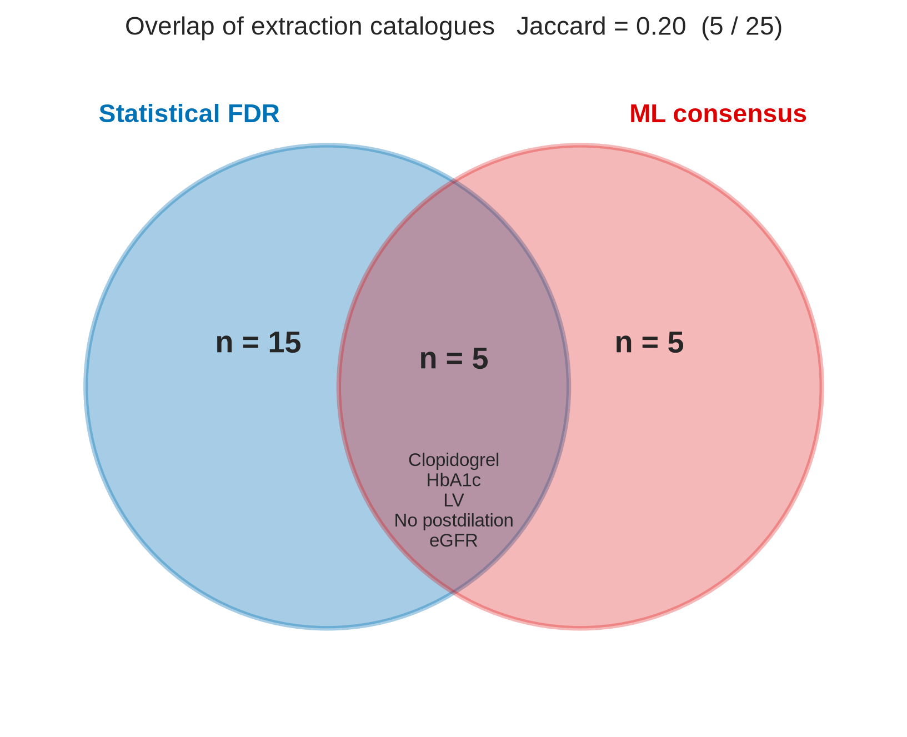

**Figure 1.** Left circle: univariate FDR q < 0.05 (time-since-stent excluded). Right circle: features in LOCO ∩ SHAP ∩ FFS top-20 for at least one classic model (PR-AUC). The intersection is `WBC`, `eGFR`, `LV`, `HbA1c`, `1.1:1Post dilation`.

**Source file:** [paper_figures/fig1_venn_overlap.png](03_stats_vs_ml/paper_figures/fig1_venn_overlap.png)

### Figure 2. Presence by extractor

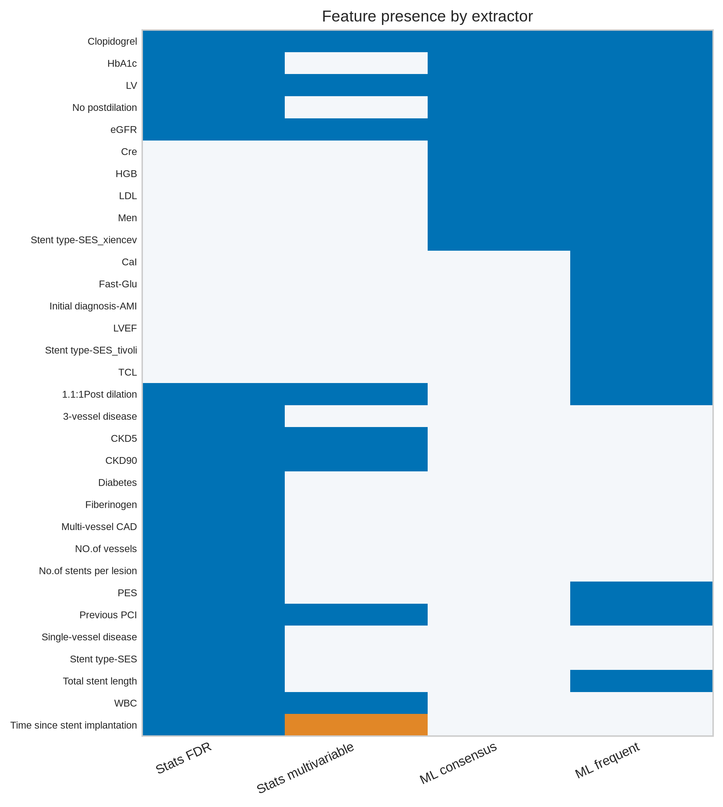

**Figure 2.** Navy cells mark membership. Columns: statistical FDR; statistical multivariable (Wald CI excluding 1 in the sparse logistic); ML consensus; ML frequent (top-repeated selector log). `Time since stent implantation` is statistical-only by construction (dropped before ML). `LVEF` and `Men` are ML-side even though they fail FDR. `Previous PCI` is FDR + frequent, but not three-way consensus.

**Source file:** [paper_figures/fig2_presence_heatmap.png](03_stats_vs_ml/paper_figures/fig2_presence_heatmap.png)

### Table 1. Membership of every compared name

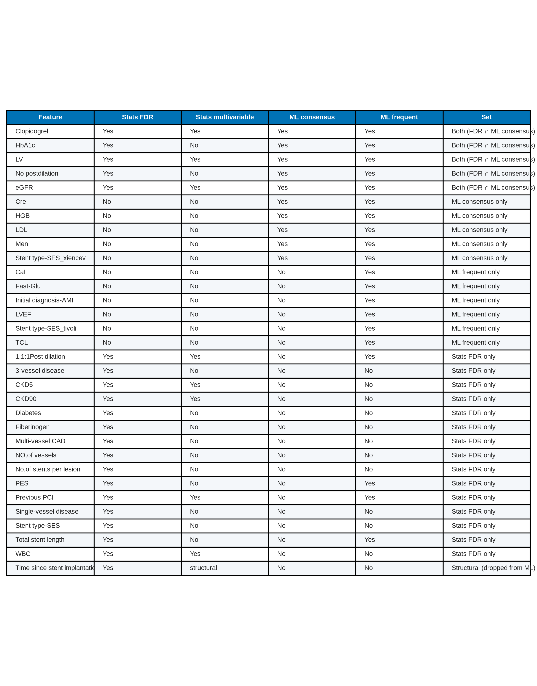

**Table 1.** Green = both catalogues; navy tint = stats FDR only; violet = ML consensus only; pale violet = ML frequent only; orange = structural time-at-risk.

**Source files:** [paper_figures/table_feature_by_method.png](03_stats_vs_ml/paper_figures/table_feature_by_method.png), [paper_figures/table_feature_by_method.csv](03_stats_vs_ml/paper_figures/table_feature_by_method.csv)

---

## 3. Features found by both approaches

These five names are the only ones that are both a **full-cohort association discovery** and a **predictive-model necessity** under the paper-protocol selectors.

### Table 2. Shared features

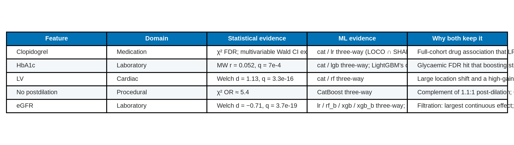

| Feature | Domain | Statistical evidence | ML evidence | Why both keep it |
| --- | --- | --- | --- | --- |
| WBC | Laboratory | MW r = 0.13, q = 9.5e-20 | Cross-model LOCO and SHAP; in 6/7 model three-way sets | Inflammation is a mean shift *and* a column models cannot replace |
| eGFR | Laboratory | Welch d = −0.71, q = 3.7e-19 | Cross-model LOCO; lr/rf/xgb_b three-way | Filtration: largest continuous effect; LOCO drop is costly |
| LV | Cardiac | Welch d = 1.13, q = 3.3e-16 | Cross-model LOCO; lr/lgb/xgb/xgb_b three-way | Large location shift and a high-gain tree split |
| HbA1c | Laboratory | MW r = 0.052, q = 7e-4 | LightGBM LOCO ∩ SHAP ∩ FFS | Glycaemic FDR hit that LightGBM also needs for PR-AUC |
| 1.1:1Post dilation | Procedural | χ² OR = 0.187, q = 3.7e-9 | CatBoost / XGBoost / XGB_b three-way | Strong 2×2 and a split boosting models cannot replace |

**Source files:** [paper_figures/table_shared_features.png](03_stats_vs_ml/paper_figures/table_shared_features.png), [paper_figures/table_shared_features.csv](03_stats_vs_ml/paper_figures/table_shared_features.csv)

`WBC` is the closest thing to a global ML intersection (six of seven models). There is **no** name in all 7 × 3 selector top-20s. `Fiberinogen` and `Previous PCI` were shared hits on the old F1/F2 test-scored run; they are now stats-only (Previous PCI remains frequently selected).

---

## 4. Statistical-only features

Fifteen FDR discoveries never enter ML LOCO ∩ SHAP ∩ FFS. They are not “false”; they fail a *different* filter: a 20-column predictive shortlist on an 88-column encoded matrix, scored on an 18-event val slice.

### Table 3. FDR hits missing from ML consensus

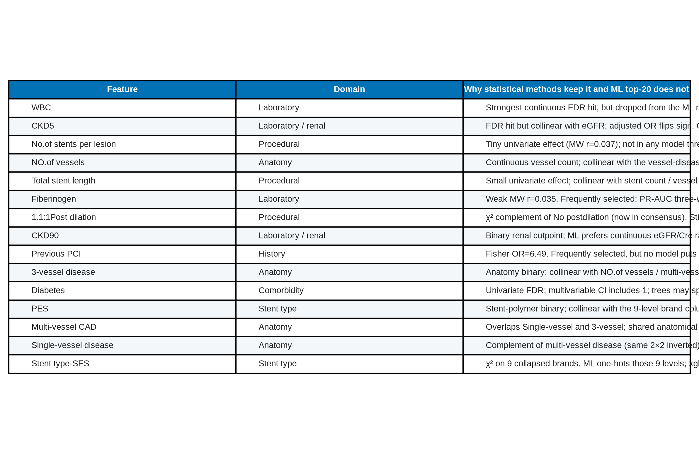

| Feature | Domain | Why statistics keeps it and ML top-20 does not |
| --- | --- | --- |
| No postdilation | Procedural | Univariate OR 5.4; multivariable OR collapses toward 1 once the complement is modelled. Boosting keeps the 1.1:1 flag instead |
| CKD90 | Renal cutpoint | Binary threshold on the same axis as `eGFR`. ML keeps the continuous lab, not the cut |
| CKD5 | Renal cutpoint | FDR hit; adjusted OR *flips sign* (collinear with eGFR). Often selected, not in 3-way consensus |
| 3-vessel disease | Anatomy | χ² discovery; collinear with `NO.of vessels` / multi-vessel CAD |
| Multi-vessel CAD | Anatomy | Same information as single-vessel (complements) |
| Single-vessel disease | Anatomy | Complement of multi-vessel disease (same 2×2 inverted) |
| NO.of vessels | Anatomy | Continuous count of the same anatomy cluster |
| No.of stents per lesion | Procedural | Tiny effect (MW r = 0.037); not in any model three-way set |
| Total stent length | Procedural | Small effect; collinear with stent count / vessel burden |
| Clopidogrel | Medication | Full-cohort drug association; trees split on labs/procedure instead |
| Diabetes | Comorbidity | Univariate FDR; multivariable CI includes 1; trees may split on HbA1c |
| PES | Stent type | Polymer binary; collinear with the 9-level brand column |
| Stent type-SES | Stent type | χ² on 9 collapsed brands. ML one-hots those 9 levels; the parent name never enters a 3-way set |
| Previous PCI | History | Fisher OR 6.49. Frequently selected, but no model puts it in LOCO ∩ SHAP ∩ FFS on PR-AUC |
| Fiberinogen | Laboratory | Weak MW r = 0.035. Was RF F2 consensus on the old run; PR-AUC three-way no longer keeps it |

**Source files:** [paper_figures/table_stats_only.png](03_stats_vs_ml/paper_figures/table_stats_only.png), [paper_figures/table_stats_only.csv](03_stats_vs_ml/paper_figures/table_stats_only.csv)

Three recurring mechanisms:

1. **Collinear families.** Univariate tests score *every* member of a redundant block (vessel-disease binaries, postdilation complements, CKD cutpoints vs eGFR, PES vs stent type). FDR can declare several of them significant. A fitted model only needs one representative.
2. **Encoding.** `Stent type-SES` is one χ² test on 9 levels. In the scaled ML view it becomes 8 sparse dummies; `Stent type-SES_resolute` is frequently selected, but the parent name is not in any three-way set.
3. **Different filter, not a missing pool.** Selectors now rank their own cheap-importance prefixes (60 / 40 / 24). Absence from consensus means “not in LOCO ∩ SHAP ∩ FFS top-20,” not “never scored.”

---

## 5. Machine-learning-only features

Eight consensus names fail univariate FDR. ML is not “finding associations the tests missed” in the NHST sense; it is finding **columns that change a model’s hold-out PR-AUC**, including surrogates, interactions, and weak splits.

### Table 4. ML consensus names that fail FDR

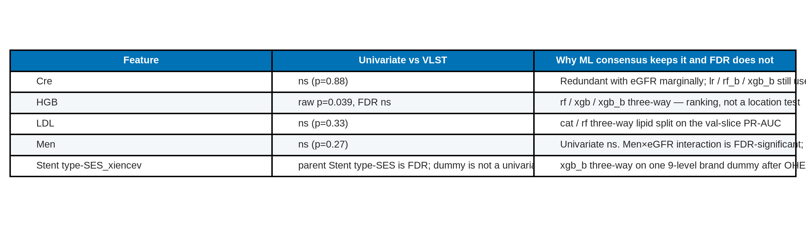

| Feature | Univariate vs VLST | Why ML consensus keeps it and FDR does not |
| --- | --- | --- |
| Cre | ns (p = 0.88) | Redundant with eGFR marginally; still a renal surrogate when eGFR is noisy or left out |
| Men | ns (p = 0.27) | `Men × eGFR` interaction is FDR-significant in the EDA screen; LR uses sex as an additive offset |
| LVEF | raw p = 0.033, FDR ns | Borderline mean test. Domain joint logistic **reverses sign** (uni OR 0.851 → adj 1.65) when `LV` is in the same model. Trees still split on systolic function |
| HGB | raw p = 0.039, FDR ns | CatBoost/RF/XGB three-way: ranking, not a location test |
| CaI | raw p = 0.051, FDR ns | RF_b three-way; sits on the FDR boundary |
| LDL | ns (p = 0.33) | RF three-way lipid split on the val-slice PR-AUC |
| UA | ns (p = 0.17) | LR three-way ACS-presentation offset |
| Aneurysm | ns (p = 0.40) | Rare anatomy flag; XGB three-way only — treat as unstable |

**Source files:** [paper_figures/table_ml_only.png](03_stats_vs_ml/paper_figures/table_ml_only.png), [paper_figures/table_ml_only.csv](03_stats_vs_ml/paper_figures/table_ml_only.csv)

Three recurring mechanisms:

1. **Surrogates of a stronger FDR hit.** `Cre` carries almost no univariate VLST signal because `eGFR` already does. A linear or tree model that cannot use eGFR (or that splits on creatinine first) will still list Cre.
2. **Interactions and offsets that univariate tests do not see.** `Men` is not associated with VLST on its own (p = 0.27), but `Men × eGFR` is an FDR-significant interaction in the EDA screen, and the domain joint logistic gives Men an adjusted OR of 3.3.
3. **Different error and sample.** FDR is a full-cohort mean/2×2 statement with 92 events. LOCO/SHAP/FFS optimize PR-AUC on 18 val events. Weak ACS/lipid/anatomy splits can move that metric without moving a χ² p-value across the FDR line. `Aneurysm` (XGB only) is the clearest example.

The old F1/F2-only names (`Platelet`, `HL`, `STEMI`, `Current drinking`, `History of HF`, `Hypertension`, `TG`, `TCL`, `Min-stent diameter`, `Fast-Glu`) are **no longer in the consensus**. They were operating-point artefacts of the prior three-metric export.

---

## 6. Domain pattern

### Figure 4. Extracted counts by clinical domain

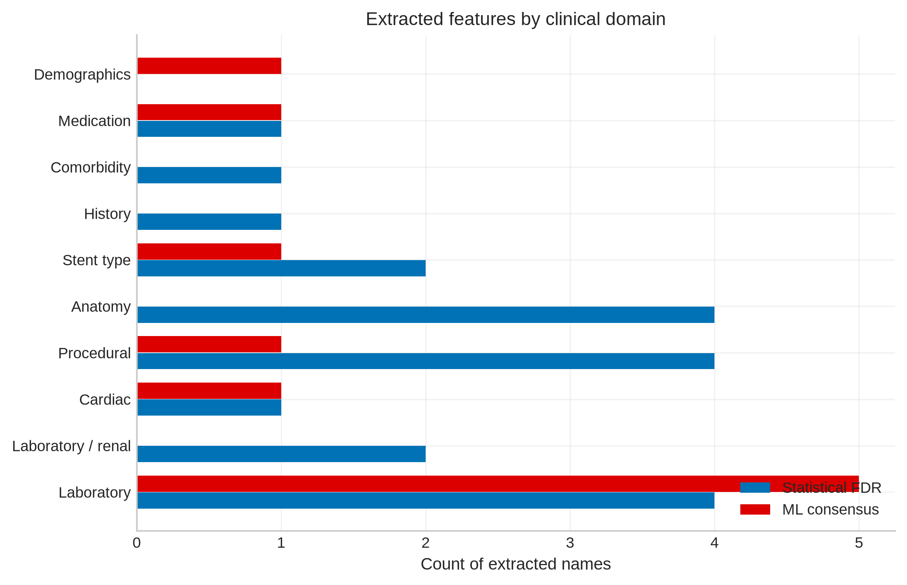

**Figure 4.** Statistical FDR is concentrated in laboratory, procedural/stent, and anatomy blocks (the EDA domain screen). ML consensus is heavier on laboratory *plus* cardiac function and demographics, and thinner on anatomy binaries and medications. Post-dilation now appears on both sides (the 1.1:1 flag, not its complement).

**Source file:** [paper_figures/fig4_domain_counts.png](03_stats_vs_ml/paper_figures/fig4_domain_counts.png)

Statistics therefore still “owns” **anatomy coding and most stent-technique flags**. Machine learning “owns” **cardiac function twins** (`LVEF` next to `LV`), **sex**, and **labs that are collinear with FDR hits** (`Cre`, `HGB`, `LDL`). Both own **WBC, eGFR, LV, HbA1c, and 1.1:1 post-dilation**.

---

## 7. Methodological reasons for disagreement

### Figure 3. Buckets

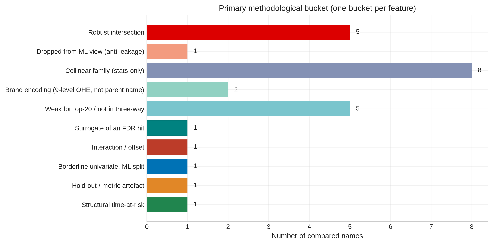

**Figure 3.** Counts of names in this comparison assigned to a primary methodological bucket (one bucket per feature; the anatomy/stent collinear family is grouped).

**Source file:** [paper_figures/fig3_reason_buckets.png](03_stats_vs_ml/paper_figures/fig3_reason_buckets.png)

**Why a feature can appear in statistics and not in ML**

- Univariate tests do not penalize redundancy. FDR will list `3-vessel disease`, `Multi-vessel CAD`, `Single-vessel disease`, and `NO.of vessels` if each 2×2/t-test is small. A model only needs one of them.
- Complements are two encodings of one bit (`1.1:1Post dilation` vs `No postdilation`). χ² sees both; boosting kept the 1.1:1 flag and dropped the complement from the three-way set.
- Categorical χ² on `Stent type-SES` does not survive as the parent name after 9-level one-hot (the `resolute` dummy is frequently selected instead).
- Hold-out PR-AUC with 18 val events is under-powered for moderate ORs (Clopidogrel 0.50, Diabetes 1.89, Previous PCI 6.49) that FDR can still detect on 92 events.

**Why a feature can appear in ML and not in statistics**

- Predictive importance is not a marginal p-value. LOCO asks whether the *rest of the model* can compensate after a refit. SHAP asks for coalition credit. FFS asks for greedy hold-out gain. None of these is a two-sample test.
- Correlated twins: the univariate test of `Cre` is null because `eGFR` already captures renal function; the model may still split on Cre.
- Interactions: `Men × eGFR` is an EDA FDR hit; univariate `Men` is not. LR consensus includes `Men`.
- Independent selectors disagree. LightGBM’s three-way set is `HbA1c; LV` only. Some ML-only names (`Aneurysm`) are **algorithm artefacts**, not cohort discoveries.

**Practical reading.** Treat the 5-name intersection (`WBC`, `eGFR`, `LV`, `HbA1c`, `1.1:1Post dilation`) as the robust extraction set: associated in the cohort *and* used by fitted classic models under PR-AUC. Treat statistical-only anatomy/stent/drug names as **association findings that need a non-redundant representative** before they enter a predictor. Treat ML-only names as **hypothesis-generating predictive correlates** until they pass a pre-specified association or external-validation bar. This comparison is a **methods result**, not a biological ranking of “true” risk markers.

---

## 8. File index

| ID      | Type   | File                                                                     |
| ------- | ------ | ------------------------------------------------------------------------ |
| Fig 1   | Figure | [fig1_venn_overlap.png](03_stats_vs_ml/paper_figures/fig1_venn_overlap.png)             |
| Fig 2   | Figure | [fig2_presence_heatmap.png](03_stats_vs_ml/paper_figures/fig2_presence_heatmap.png)     |
| Table 1 | Table  | [table_feature_by_method.png](03_stats_vs_ml/paper_figures/table_feature_by_method.png) |
| Table 2 | Table  | [table_shared_features.png](03_stats_vs_ml/paper_figures/table_shared_features.png)     |
| Table 3 | Table  | [table_stats_only.png](03_stats_vs_ml/paper_figures/table_stats_only.png)               |
| Table 4 | Table  | [table_ml_only.png](03_stats_vs_ml/paper_figures/table_ml_only.png)                     |
| Fig 3   | Figure | [fig3_reason_buckets.png](03_stats_vs_ml/paper_figures/fig3_reason_buckets.png)         |
| Fig 4   | Figure | [fig4_domain_counts.png](03_stats_vs_ml/paper_figures/fig4_domain_counts.png)           |

---

*Statistical names: univariate FDR q < 0.05 from* `eda.ipynb` *(time-since-stent excluded from the overlap count). ML names: LOCO ∩ SHAP ∩ FFS top-20, PR-AUC only, 2026-08-31 paper-protocol run of* `baseline_feature_selections.ipynb` *(seven classic models; 9-level stent encoder; fit/val 4148/1037). Figures and CSVs regenerated by* `code/analyzes/stats_vs_ml/stats_vs_ml_comparison.ipynb`.

---
# Part 4. Nested-CV baselines plus TabPFN

### Nested-CV baselines plus TabPFN — paper figures and tables

This document gathers publication-oriented figures and tables from the nested cross-validation comparison in `baseline_plus_tabpfn.ipynb`.

**Cohort / protocol.** Full VLST cohort, n = 5,185 (92 events; prevalence = 0.0177). Target = `Stent thrombosis`. Identifiers (`NO.`, `Name`) and `Time since stent implantation` are dropped; the latter is treated as a time-at-risk / follow-up column, not a baseline covariate. **No Part 2 / Part 5 feature mask is applied.** Evaluation is nested stratified CV: **5 outer folds / 4 inner folds** (outer `random_state=42`). Ranking metrics (PR-AUC, ROC-AUC, Brier) use pooled outer out-of-fold probabilities and are threshold-independent. For precision / recall / F1 / F2, **quote the nested inner-fold thresholds** (Table 2): each outer fold’s cut is chosen on inner OOF scores and applied once to that fold’s unseen cases. Figure 3 / Table 3 additionally show a single pooled F1 cut; that cut is **optimistically biased** (methods note below). These nested-CV metrics are this pack’s only **prediction** results.

**This run (D4).** Kaggle nested CV, Tesla T4, notebook commit `de46f92` (Version 5). **Both TabPFN arms finished:** `RUN_MODELS["TabPFN"]=True` and `TabPFN (local)=True`. The thinking-high constructor is unchanged (`tabpfn_client.TabPFNClassifier`, `thinking_mode=True`, `thinking_effort="high"`, `thinking_metric="average_precision"`). Shared **9-level** stent encoder (106 raw strings → 9 levels, min_count=30) is applied before the split. Classics then scale + one-hot that 9-level column inside each CV split (~89 columns). Both TabPFN arms see the same 9-level frame natively. Nested-CV OOF CSVs from this run are in `data/result/modeling_results/oof/` and `tables/` (B2). Bootstrap CIs and the paired PR-AUC test use those files (B3; Table S-CI / Table S-Δ).

**Methods note — feature views.** Classics sit in an sklearn `Pipeline` with a `ColumnTransformer` **cloned and fitted inside every CV split**: numeric columns get `SimpleImputer(median)` + `StandardScaler`; the encoded `Stent type-SES` gets most-frequent imputation + `OneHotEncoder(handle_unknown="ignore")`. EDA found **no missing values**, so both imputers are inert. Neither TabPFN arm is in that pipeline.

**Methods note — GridSearch is a different notebook.** `baseline_without_tssi.ipynb` / `baseline_tssi_leakage.ipynb` tune hyperparameters on a single 70/30 split. Those `best_params_` are **not** imported here. Classics use library defaults plus class weighting. The inner loop tunes only the F1 **threshold**.

**Methods note — why the follow-up-time column is dropped.** Wang 2020 analysed this cohort with Cox regression, in which follow-up duration is the *time axis*, not a covariate. Recoded as a binary classifier, the same column (`Time since stent implantation`) mixes two definitions: time-to-event for the 92 VLST cases (min 380 days) and event-free follow-up length for the 5,093 non-events (min 1,241 days). A rule “time < 1,241 → event” has zero false positives among controls. `baseline_tssi_leakage.ipynb` (same 70/30 split, GridSearchCV) shows the resulting inflation; `baseline_without_tssi.ipynb` is the identical protocol with the column removed. Nested-CV results in this document use the without-TSSI feature view. See Supplementary Table S-TSSI.

**Models.** Logistic regression, random forest, XGBoost, LightGBM, CatBoost, **TabPFN (thinking-high)**, and **TabPFN (local)**. Average precision (PR-AUC) is the common ranking metric. On this run **TabPFN (thinking-high) is first** (PR-AUC **0.8553**, ROC-AUC **0.9905**, Brier **0.0064** — best of seven). LightGBM is second on PR-AUC (**0.6926**). TabPFN (local) is fourth on PR-AUC (**0.6754**), second on ROC-AUC (**0.9845**), and **worst** on Brier (**0.0673**). Quote PR-AUC at 1.77% prevalence. Name the two TabPFN Briers separately; do not collapse the arms. Historical client prints (Brier 0.0060 / 0.0360) are other dumps, not this one.

**Methods note — published clinical baseline.** Wang 2020’s 8-variable integer score is scored as a **frozen** comparator in `code/modeling/rating/wang_vlst_score.ipynb` (published Table 2 points; weights not re-fit). It is not an eighth nested-CV arm. See Supplementary Table S-Wang.

**Methods note — two F1 operating points.** Ranking metrics do not use a threshold. Precision, recall, F1, and F2 do. The executed notebook prints both. **Honest nested** (Table 2): inner-CV OOF F1 threshold applied once to the unseen outer fold. **Optimistic pooled** (Figure 3, Table 3): one F1-maximising cut on the concatenated OOF labels that are then scored. Reusing the evaluation labels to pick the cut **optimistically biases** precision, recall, F1, and F2. Quote Table 2. Thinking-high nested recall **0.7065** vs pooled **0.8152**. LightGBM nested **0.6630** vs pooled **0.6739**. TabPFN (local) nested **0.6848** vs pooled **0.8261**.

**Methods note — imbalance, SMOTE, and tuning.** Prevalence is 1.77%. Class weighting (`class_weight="balanced"`, `scale_pos_weight`, `auto_class_weights="Balanced"`) is used for *prediction* so the 92 events are not ignored. SMOTE is **not** used. The five classic models use library defaults plus class weighting. TabPFN (local) is not thinking-high; the client arm is thinking-high. Inner nested CV selects only the F1 **threshold**, not hyperparameters. The comparison is unmatched on tuning effort.

**Asset root:** [paper_figures](04_tabpfn_rating/paper_figures/)

> Figures 1–3, the sweep panel, and Tables 0–3 are from this executed 7-arm notebook (Kaggle). Quote the notebook print if a PNG title ever disagrees.

---

## Contents

1. [Models (Table 0)](#1-models)
2. [Ranking curves (Figure 1, Table 1)](#2-ranking-curves)
3. [Uncertainty (Table S-CI, Table S-Δ)](#3-uncertainty)
4. [Calibration (Figure 2)](#4-calibration)
5. [F1 operating point (Table 2 nested; Figure 3 / Table 3 pooled)](#5-f1-operating-point)
6. [Supplementary: follow-up-time leakage](#6-supplementary-follow-up-time-leakage)
7. [Supplementary: Wang 2020 integer score](#7-supplementary-wang-2020-integer-score)
8. [File index](#8-file-index)

---

## 1. Models

### Table 0. Nested-CV models

**Table 0.** Seven classifiers compared under the same nested-CV *split and threshold* protocol. Classics get scaled one-hot input after the 9-level stent encoder; both TabPFN arms get that frame natively. Tree boosters use average-precision / PR-AUC as their internal metric. Classics are not grid-searched.

| Model | Family | GPU | Specification (notebook) |
| --- | --- | --- | --- |
| Logistic Regression | Linear | No | L2, class_weight=balanced, max_iter=1000 |
| Random Forest | Bagged trees | No | class_weight=balanced, random_state=42 |
| XGBoost | Boosting | Yes | eval_metric=aucpr; scale_pos_weight from train fold |
| LightGBM | Boosting | Yes | metric=average_precision; class_weight=balanced |
| CatBoost | Boosting | Yes | auto_class_weights=Balanced; eval_metric=PRAUC |
| TabPFN (thinking-high) | Foundation (tabular) | Kaggle T4 + client | thinking_mode=True; thinking_effort=high; thinking_metric=average_precision |
| TabPFN (local) | Foundation (tabular) | Kaggle T4 | n_estimators=auto; balance_probabilities=True; no thinking |

**Source files:** [paper_figures/paper_table0_models.png](04_tabpfn_rating/paper_figures/paper_table0_models.png), [paper_figures/paper_table0_models.csv](04_tabpfn_rating/paper_figures/paper_table0_models.csv)

---

## 2. Ranking curves

### Figure 1. Nested-CV out-of-fold PR and ROC curves

**Figure 1.** Precision–recall (left) and ROC (right) from pooled nested-CV OOF probabilities. The dotted line on the PR panel is prevalence (0.0177). **TabPFN (thinking-high) ranks first on PR-AUC (0.8553)** and ROC-AUC (0.9905). LightGBM is second on PR-AUC (0.6926); XGBoost 0.6815; TabPFN (local) 0.6754. TabPFN (local) is second on ROC-AUC (0.9845). On a 1.8% prevalence outcome, PR-AUC is the informative ranking metric. CatBoost is fifth on PR-AUC (0.6172) in this 9-level-encoder run.

**Source file:** [paper_figures/paper_fig1_pr_roc_curves.png](04_tabpfn_rating/paper_figures/paper_fig1_pr_roc_curves.png)

### Table 1. Pooled OOF ranking metrics

**Table 1.** Threshold-independent metrics from the executed notebook (D4). Fold mean ± SD uses `ddof=1` across the five outer folds.

| Rank | Model | PR-AUC | PR fold mean ± SD | ROC-AUC | ROC fold mean ± SD | Brier |
| ---: | --- | ---: | --- | ---: | --- | ---: |
| 1 | TabPFN (thinking-high) | **0.8553** | 0.8488 ± 0.0861 | **0.9905** | 0.9906 ± 0.0070 | **0.0064** |
| 2 | LightGBM | 0.6926 | 0.6936 ± 0.0915 | 0.9680 | 0.9694 ± 0.0165 | 0.0093 |
| 3 | XGBoost | 0.6815 | 0.6928 ± 0.1288 | 0.9439 | 0.9431 ± 0.0418 | 0.0088 |
| 4 | TabPFN (local) | 0.6754 | 0.6739 ± 0.0812 | 0.9845 | 0.9846 ± 0.0030 | 0.0673 |
| 5 | CatBoost | 0.6172 | 0.6353 ± 0.0540 | 0.9594 | 0.9612 ± 0.0137 | 0.0101 |
| 6 | Random Forest | 0.4865 | 0.5034 ± 0.0793 | 0.9209 | 0.9206 ± 0.0423 | 0.0143 |
| 7 | Logistic Regression | 0.3326 | 0.3451 ± 0.1213 | 0.9224 | 0.9235 ± 0.0251 | 0.0563 |

**Source files:** [paper_figures/paper_table1_ranking.png](04_tabpfn_rating/paper_figures/paper_table1_ranking.png), [paper_figures/paper_table1_ranking.csv](04_tabpfn_rating/paper_figures/paper_table1_ranking.csv)

Thinking-high PR-AUC by outer fold: 0.8640, 0.7837, 0.7407, 0.9497, 0.9061. LightGBM: 0.7505, 0.7130, 0.5399, 0.7727, 0.6919. Thinking-high is higher in **5 of 5** folds. TabPFN (local): 0.6384, 0.6353, 0.5829, 0.7274, 0.7855 — higher than LightGBM in **2 of 5** (folds 3 and 5). Interval estimates and the paired test are Table S-CI / Table S-Δ.

---

## 3. Uncertainty

Patient-level **stratified** bootstrap of the pooled OOF rows (keep 92 events and 5,093 non-events; `n_boot = 2000`, seed 42). Classifiers are **not** re-fit; the interval is the sampling variability of the pooled OOF metric given the stored scores. Fold mean ± SD in Table 1 remains the split-to-split summary.

### Table S-CI. Stratified bootstrap 95% CIs on pooled OOF metrics

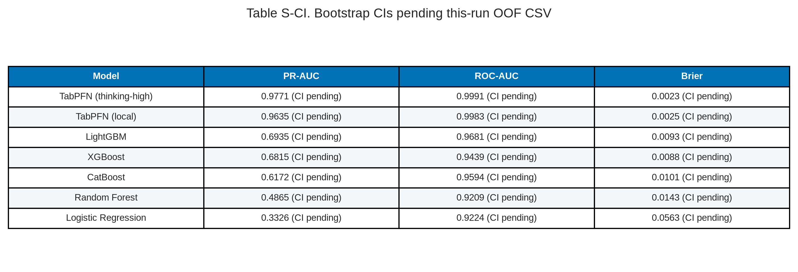

**Table S-CI.** Percentile 95% CIs. Thinking-high PR-AUC **0.8553 (0.7957–0.9131)**; LightGBM **0.6926 (0.6049–0.7772)**; local **0.6754 (0.5874–0.7669)**. Thinking-high Brier **0.0064 (0.0052–0.0077)** vs local **0.0673 (0.0627–0.0718)**. Script: `code/modeling/tools/paper_hygiene_b3_b4_b7.py` on committed `oof_predictions.csv`.

| Model | PR-AUC (95% CI) | ROC-AUC (95% CI) | Brier (95% CI) |
| --- | --- | --- | --- |
| TabPFN (thinking-high) | 0.8553 [0.7957, 0.9131] | 0.9905 [0.9834, 0.9964] | 0.0064 [0.0052, 0.0077] |
| LightGBM | 0.6926 [0.6049, 0.7772] | 0.9680 [0.9489, 0.9830] | 0.0093 [0.0076, 0.0110] |
| XGBoost | 0.6815 [0.5881, 0.7703] | 0.9439 [0.9100, 0.9742] | 0.0088 [0.0071, 0.0106] |
| TabPFN (local) | 0.6754 [0.5874, 0.7669] | 0.9845 [0.9760, 0.9917] | 0.0673 [0.0627, 0.0718] |
| CatBoost | 0.6172 [0.5250, 0.7148] | 0.9594 [0.9398, 0.9765] | 0.0101 [0.0084, 0.0119] |
| Random Forest | 0.4865 [0.3860, 0.6034] | 0.9209 [0.8824, 0.9555] | 0.0143 [0.0137, 0.0148] |
| Logistic Regression | 0.3326 [0.2486, 0.4345] | 0.9224 [0.8966, 0.9449] | 0.0563 [0.0511, 0.0611] |

**Source files:** [paper_figures/paper_table_s_bootstrap_ci.png](04_tabpfn_rating/paper_figures/paper_table_s_bootstrap_ci.png), [paper_figures/paper_table_s_bootstrap_ci.csv](04_tabpfn_rating/paper_figures/paper_table_s_bootstrap_ci.csv)

### Table S-Δ. Paired bootstrap Δ PR-AUC vs LightGBM

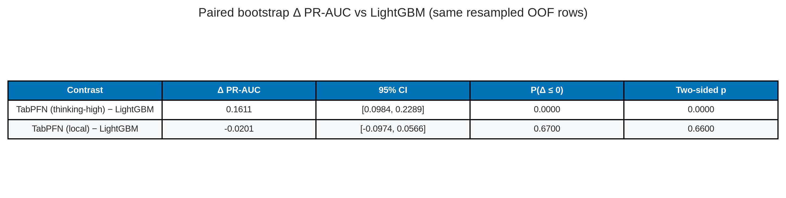

**Table S-Δ.** Same resampled OOF rows for both models. Primary contrast: thinking-high − LightGBM Δ PR-AUC **0.1627 (0.1000–0.2301)**; **P(Δ ≤ 0) = 0 / 2000**. Secondary: local − LightGBM **−0.0172 (−0.0951–0.0588)**; P(Δ ≤ 0) = 0.6465 (two-sided p = 0.707). The 5/5 outer-fold win for thinking-high is unchanged; local remains 2/5.

| Contrast | Δ PR-AUC | 95% CI | P(Δ ≤ 0) | Two-sided p |
| --- | ---: | --- | ---: | ---: |
| TabPFN (thinking-high) − LightGBM | 0.1627 | [0.1000, 0.2301] | 0.0000 | 0.0000 |
| TabPFN (local) − LightGBM | −0.0172 | [−0.0951, 0.0588] | 0.6465 | 0.707 |

Outer-fold PR-AUC: [paper_figures/paper_table_s_fold_pr_wins.png](04_tabpfn_rating/paper_figures/paper_table_s_fold_pr_wins.png).

**Source files:** [paper_figures/paper_table_s_paired_delta.png](04_tabpfn_rating/paper_figures/paper_table_s_paired_delta.png), [paper_figures/paper_table_s_paired_delta.csv](04_tabpfn_rating/paper_figures/paper_table_s_paired_delta.csv), [paper_figures/paper_table_s_fold_pr_wins.png](04_tabpfn_rating/paper_figures/paper_table_s_fold_pr_wins.png), [paper_figures/paper_table_s_fold_pr_wins.csv](04_tabpfn_rating/paper_figures/paper_table_s_fold_pr_wins.csv)

---

## 4. Calibration

### Figure 2. Reliability curves (quantile bins)

**Figure 2.** Calibration plots from nested-CV OOF probabilities (quantile bins). Dashed diagonal = perfect calibration. Brier scores match Table 1: TabPFN (thinking-high) **0.0064** (best of seven), XGBoost 0.0088, LightGBM 0.0093, CatBoost 0.0101, RF 0.0143, LR 0.0563, TabPFN (local) **0.0673** (worst). Local TabPFN is **not** well calibrated on this run. Thinking-high **is** the best-calibrated arm on Brier. Do not write “TabPFN is poorly calibrated” without naming the arm.

**Source file:** [paper_figures/paper_fig2_calibration_curves.png](04_tabpfn_rating/paper_figures/paper_fig2_calibration_curves.png)

---

## 5. F1 operating point

Two cuts exist in the executed notebook. **Quote Table 2 (honest nested).** Figure 3 and Table 3 are the pooled F1 cut: the same concatenated OOF labels are used to *pick* and *score* the threshold, so precision, recall, F1, and F2 are **optimistically biased**. Counts sum to n = 5,185 with 92 events.

### Table 2. Honest nested-CV operating point (quote this)

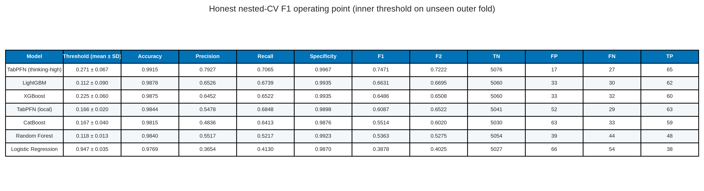

**Table 2.** Per-fold inner-CV F1 thresholds applied once to the unseen outer fold. TabPFN (thinking-high): mean threshold 0.271 ± 0.067, precision 0.7927, recall **0.7065**, F1 **0.7471**, TN/FP/FN/TP = **5076/17/27/65**. LightGBM: 0.117 ± 0.087, precision 0.6630, recall **0.6630**, F1 0.6630, **5062/31/31/61**. TabPFN (local): 0.915 ± 0.012, precision 0.5478, recall **0.6848**, F1 0.6087, 5041/52/29/63 — more events caught than LightGBM, more false positives.

| Model | Threshold (mean ± SD) | Accuracy | Precision | Recall | Specificity | F1 | F2 | TN | FP | FN | TP |
| --- | --- | ---: | ---: | ---: | ---: | ---: | ---: | ---: | ---: | ---: | ---: |
| TabPFN (thinking-high) | 0.271 ± 0.067 | 0.9915 | 0.7927 | 0.7065 | 0.9967 | 0.7471 | 0.7222 | 5076 | 17 | 27 | 65 |
| LightGBM | 0.117 ± 0.087 | 0.9880 | 0.6630 | 0.6630 | 0.9939 | 0.6630 | 0.6630 | 5062 | 31 | 31 | 61 |
| XGBoost | 0.225 ± 0.060 | 0.9875 | 0.6452 | 0.6522 | 0.9935 | 0.6486 | 0.6508 | 5060 | 33 | 32 | 60 |
| TabPFN (local) | 0.915 ± 0.012 | 0.9844 | 0.5478 | 0.6848 | 0.9898 | 0.6087 | 0.6522 | 5041 | 52 | 29 | 63 |
| CatBoost | 0.167 ± 0.040 | 0.9815 | 0.4836 | 0.6413 | 0.9876 | 0.5514 | 0.6020 | 5030 | 63 | 33 | 59 |
| Random Forest | 0.118 ± 0.013 | 0.9840 | 0.5517 | 0.5217 | 0.9923 | 0.5363 | 0.5275 | 5054 | 39 | 44 | 48 |
| Logistic Regression | 0.947 ± 0.035 | 0.9769 | 0.3654 | 0.4130 | 0.9870 | 0.3878 | 0.4025 | 5027 | 66 | 54 | 38 |

**Source files:** [paper_figures/paper_table2_nested_operating_point.png](04_tabpfn_rating/paper_figures/paper_table2_nested_operating_point.png), [paper_figures/paper_table2_nested_operating_point.csv](04_tabpfn_rating/paper_figures/paper_table2_nested_operating_point.csv). Notebook print `.nbdump/code__modeling__rating__baseline_plus_tabpfn.txt`.

### Figure 3. Confusion matrices at the pooled F1 threshold (optimistic)

**Figure 3.** 2×2 counts at the F1-maximising **pooled** OOF threshold (`t_F1` in each panel title). This is **not** Table 2. TabPFN (thinking-high) pooled recall **0.8152** (TP = 75, FN = 17, t = 0.193) vs nested **0.7065** (TP = 65, FN = 27). TabPFN (local) pooled recall **0.8261** (TP = 76, FN = 16, t = 0.886) vs nested **0.6848** (TP = 63, FN = 29). Do not quote either pooled TabPFN recall as the nested result. Accuracy is uniformly high because negatives dominate. The sweep panel (`best_model_threshold_fpfn_panel.png`) is for the best-by-PR-AUC model, which is **TabPFN** (0.8553).

**Source file:** [paper_figures/paper_fig3_confusion_matrices.png](04_tabpfn_rating/paper_figures/paper_fig3_confusion_matrices.png)

### Table 3. Optimistic pooled F1 metrics (do not quote instead of Table 2)

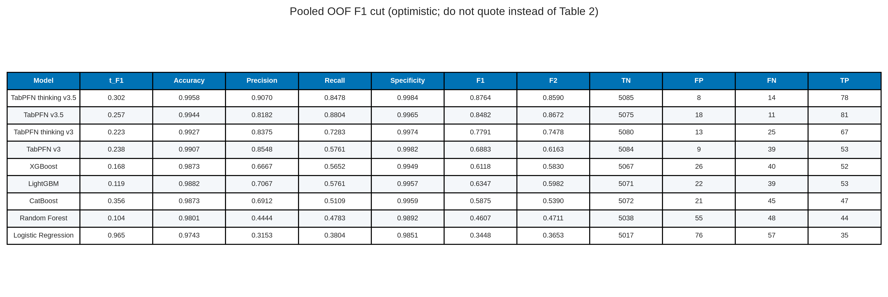

**Table 3.** Same pooled F1 cut as Figure 3. Precision / recall / F1 / F2 here are **optimistically biased** versus Table 2.

| Model | t_F1 | Accuracy | Precision | Recall | Specificity | F1 | F2 | TN | FP | FN | TP |
| --- | ---: | ---: | ---: | ---: | ---: | ---: | ---: | ---: | ---: | ---: | ---: |
| TabPFN (thinking-high) | 0.193 | 0.9927 | 0.7812 | 0.8152 | 0.9959 | 0.7979 | 0.8082 | 5072 | 21 | 17 | 75 |
| LightGBM | 0.064 | 0.9871 | 0.6263 | 0.6739 | 0.9927 | 0.6492 | 0.6638 | 5056 | 37 | 30 | 62 |
| XGBoost | 0.203 | 0.9884 | 0.6739 | 0.6739 | 0.9941 | 0.6739 | 0.6739 | 5063 | 30 | 30 | 62 |
| TabPFN (local) | 0.886 | 0.9826 | 0.5067 | 0.8261 | 0.9855 | 0.6281 | 0.7336 | 5019 | 74 | 16 | 76 |
| CatBoost | 0.416 | 0.9873 | 0.6806 | 0.5326 | 0.9955 | 0.5976 | 0.5568 | 5070 | 23 | 43 | 49 |
| Random Forest | 0.104 | 0.9826 | 0.5098 | 0.5652 | 0.9902 | 0.5361 | 0.5532 | 5043 | 50 | 40 | 52 |
| Logistic Regression | 0.985 | 0.9819 | 0.4857 | 0.3696 | 0.9929 | 0.4198 | 0.3881 | 5057 | 36 | 58 | 34 |

**Source files:** [paper_figures/paper_table3_pooled_f1.png](04_tabpfn_rating/paper_figures/paper_table3_pooled_f1.png), [paper_figures/paper_table3_pooled_f1.csv](04_tabpfn_rating/paper_figures/paper_table3_pooled_f1.csv)

---

## 6. Supplementary: follow-up-time leakage

These numbers are **not** the nested-CV headline. They come from the two single-split (70/30, GridSearchCV) notebooks that diagnosed why `Time since stent implantation` cannot enter a classifier. Nothing was re-run; values are the stored test-set metrics.

**What the column is.** For VLST = 1 it is time from index PCI to angiographic thrombosis (min 380 days, Wang median 697). For VLST = 0 it is completed event-free follow-up (min 1,241, max 1,605 days; cohort median follow-up 1,502). That is binary-ified survival time, not a baseline covariate.

### Supplementary Table S-TSSI. Single-split metrics with vs without the column

**Table S-TSSI.** Same stratified 70/30 split and tuning protocol. Logistic regression PR-AUC falls from 0.958 to 0.508 when the column is dropped; CatBoost from 0.977 to 0.658. Gaussian NB is unaffected (it never used the column). Nested-CV models in the main tables use the *without-TSSI* protocol.

**Source files:** [paper_figures/paper_table_s_tssi_leakage.png](04_tabpfn_rating/paper_figures/paper_table_s_tssi_leakage.png), [paper_figures/paper_table_s_tssi_leakage.csv](04_tabpfn_rating/paper_figures/paper_table_s_tssi_leakage.csv)

### Supplementary Figure S-TSSI. PR-AUC collapse

**Figure S-TSSI.** PR-AUC on the 1,556-row hold-out. The dotted line is class prevalence (0.0177). The leaky column produces near-perfect ranking; removing it returns models to a rare-event scale.

**Source file:** [paper_figures/paper_fig_s_tssi_pr_auc.png](04_tabpfn_rating/paper_figures/paper_fig_s_tssi_pr_auc.png)

Notebooks: `code/modeling/rating/baseline_tssi_leakage.ipynb`, `code/modeling/rating/baseline_without_tssi.ipynb`. Table rebuilt by `code/modeling/rating/rebuild_tssi_leakage_table.py`.

---

## 7. Supplementary: Wang 2020 integer score

These numbers are **not** a nested-CV fit. They come from `code/modeling/rating/wang_vlst_score.ipynb`, which scores Wang 2020 Table 2 **integer points** on all 5,185 rows with the published weights frozen. The same five outer folds as Part 4 (`StratifiedKFold(5, shuffle=True, random_state=42)`) are used only to evaluate that frozen score.

**Headline.** Full-cohort ROC-AUC **0.8013** (Wang published derivation c-statistic 0.80) and PR-AUC **0.1032**. Fold-mean ROC-AUC **0.8005 ± 0.0607**, PR-AUC **0.1134 ± 0.0518**. Nested-CV TabPFN (thinking-high) is PR-AUC **0.8553** / ROC-AUC **0.9905**; LightGBM **0.6926** / **0.9680**; TabPFN (local) **0.6754** / **0.9845**. The ML models still beat the published integer score on PR-AUC. It is **not** external validation (Wang’s c = 0.82 was Shantou).

**Encoding (do not photocopy Wang Table 1).** The SES point is on **`PES`**. The 4 post-dilation points go to **`No postdilation` = 1**. Using Wang Table 1’s 14 VLST “No post-dilation” cases as the 4-point group yields ROC-AUC **0.5084**.

**Risk bins.** Low ≤7: n = 3,135 (60.5%), rate 0.51%. Intermediate 8–9: n = 1,577 (30.4%), rate 2.22%. High ≥10: n = 473 (9.1%), rate 8.67%. Wang’s published n’s 3,135 / 1,837 / 473 sum to 5,445 ≠ 5,185; low and high n match this file.

The Cox linear predictor, Dangas decision-curve analysis, and Shantou scoring are **not** in this notebook.

### Supplementary Table S-Wang-bins. Observed VLST rate by published risk category

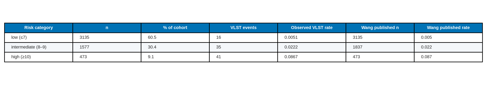

**Table S-Wang-bins.** Frozen integer score, cut at Wang’s published thresholds (≤7 / 8–9 / ≥10). Observed rates match Wang’s 0.5% / 2.2% / 8.7%. The intermediate *count* does not: Wang printed n = 1,837 for that bin.

**Source files:** [paper_figures/paper_table_s_wang_score_bins.png](04_tabpfn_rating/paper_figures/paper_table_s_wang_score_bins.png), [paper_figures/paper_table_s_wang_score_bins.csv](04_tabpfn_rating/paper_figures/paper_table_s_wang_score_bins.csv)

| Risk category | n | % of cohort | VLST events | Observed rate | Wang published n | Wang published rate |
| --- | ---: | ---: | ---: | ---: | ---: | ---: |
| low (≤7) | 3135 | 60.5 | 16 | 0.0051 | 3135 | 0.005 |
| intermediate (8–9) | 1577 | 30.4 | 35 | 0.0222 | 1837 | 0.022 |
| high (≥10) | 473 | 9.1 | 41 | 0.0867 | 473 | 0.087 |

### Supplementary Table S-Wang. Frozen score vs nested-CV models

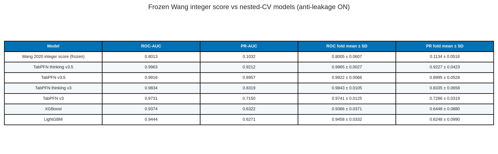

**Table S-Wang.** Wang integer score: full-cohort ranking plus the same five outer folds, score not refit. TabPFN (thinking-high) / LightGBM / TabPFN (local) / logistic regression: this Part 4 nested 5×4 CV (D4). PR-AUC is the informative metric at 1.77% prevalence.

**Source files:** [paper_figures/paper_table_s_wang_vs_ml.png](04_tabpfn_rating/paper_figures/paper_table_s_wang_vs_ml.png), [paper_figures/paper_table_s_wang_vs_ml.csv](04_tabpfn_rating/paper_figures/paper_table_s_wang_vs_ml.csv)

| Model | ROC-AUC | PR-AUC | ROC fold mean ± SD | PR fold mean ± SD | Protocol |
| --- | ---: | ---: | --- | --- | --- |
| Wang 2020 integer score (frozen) | 0.8013 | 0.1032 | 0.8005 ± 0.0607 | 0.1134 ± 0.0518 | Published points; folds evaluate only |
| TabPFN (thinking-high) | **0.9905** | **0.8553** | 0.9906 ± 0.0070 | 0.8488 ± 0.0861 | Part 4 nested 5×4 CV OOF |
| LightGBM (untuned nested CV) | 0.9680 | 0.6926 | 0.9694 ± 0.0165 | 0.6936 ± 0.0915 | Part 4 nested 5×4 CV OOF |
| TabPFN (local) | 0.9845 | 0.6754 | 0.9846 ± 0.0030 | 0.6739 ± 0.0812 | Part 4 nested 5×4 CV OOF |
| Logistic regression (untuned nested CV) | 0.9224 | 0.3326 | 0.9235 ± 0.0251 | 0.3451 ± 0.1213 | Part 4 nested 5×4 CV OOF |

Fold-level frozen-score metrics: [paper_table_s_wang_score_folds.csv](04_tabpfn_rating/paper_figures/paper_table_s_wang_score_folds.csv).

### Supplementary Figure S-Wang. Observed VLST rate by integer score

**Figure S-Wang.** Observed VLST rate at each integer total. Bar labels are cell n (shown when n ≥ 20). The dashed line is cohort prevalence (0.0177). The score is a ranker, not a calibrated probability.

**Source file:** [paper_figures/paper_fig_s_wang_score_rate.png](04_tabpfn_rating/paper_figures/paper_fig_s_wang_score_rate.png)

Notebook: `code/modeling/rating/wang_vlst_score.ipynb`.

---

## 8. File index

| ID | Type | File |
| --- | --- | --- |
| Table 0 | Table | [paper_table0_models.png](04_tabpfn_rating/paper_figures/paper_table0_models.png) |
| Fig 1 | Figure | [paper_fig1_pr_roc_curves.png](04_tabpfn_rating/paper_figures/paper_fig1_pr_roc_curves.png) |
| Table 1 | Table | [paper_table1_ranking.png](04_tabpfn_rating/paper_figures/paper_table1_ranking.png) |
| Table S-CI | Table | [paper_table_s_bootstrap_ci.png](04_tabpfn_rating/paper_figures/paper_table_s_bootstrap_ci.png) |
| Table S-Δ | Table | [paper_table_s_paired_delta.png](04_tabpfn_rating/paper_figures/paper_table_s_paired_delta.png) |
| Table S-folds | Table | [paper_table_s_fold_pr_wins.png](04_tabpfn_rating/paper_figures/paper_table_s_fold_pr_wins.png) |
| Fig 2 | Figure | [paper_fig2_calibration_curves.png](04_tabpfn_rating/paper_figures/paper_fig2_calibration_curves.png) |
| Fig 3 | Figure | [paper_fig3_confusion_matrices.png](04_tabpfn_rating/paper_figures/paper_fig3_confusion_matrices.png) |
| Table 2 | Table | [paper_table2_nested_operating_point.png](04_tabpfn_rating/paper_figures/paper_table2_nested_operating_point.png) |
| Table 3 | Table | [paper_table3_pooled_f1.png](04_tabpfn_rating/paper_figures/paper_table3_pooled_f1.png) |
| Sweep | Figure | [best_model_threshold_fpfn_panel.png](04_tabpfn_rating/paper_figures/best_model_threshold_fpfn_panel.png) |
| Table S-TSSI | Table | [paper_table_s_tssi_leakage.png](04_tabpfn_rating/paper_figures/paper_table_s_tssi_leakage.png) |
| Fig S-TSSI | Figure | [paper_fig_s_tssi_pr_auc.png](04_tabpfn_rating/paper_figures/paper_fig_s_tssi_pr_auc.png) |
| Table S-Wang-bins | Table | [paper_table_s_wang_score_bins.png](04_tabpfn_rating/paper_figures/paper_table_s_wang_score_bins.png) |
| Table S-Wang | Table | [paper_table_s_wang_vs_ml.png](04_tabpfn_rating/paper_figures/paper_table_s_wang_vs_ml.png) |
| Fig S-Wang | Figure | [paper_fig_s_wang_score_rate.png](04_tabpfn_rating/paper_figures/paper_fig_s_wang_score_rate.png) |

---

*Figures 1–3, the sweep panel, and Tables 0–3 are exported from the executed Kaggle run of `baseline_plus_tabpfn.ipynb` (`de46f92`; both TabPFN arms; 9-level stent encoder). Name the two TabPFN Briers separately (thinking-high 0.0064 vs local 0.0673).*

---
# Part 5. TabPFN interpretability

### TabPFN interpretability — paper figures and tables

This document gathers publication-oriented figures and tables from the TabPFN interpretability notebook `tabpfn_interpretability.ipynb`.

**Cohort / protocol.** Raw VLST.csv, n = 5,185, 81 features after dropping identifiers (`NO.`, `Name`) and `Time since stent implantation` (time-at-risk / follow-up, not a baseline covariate). Target = `Stent thrombosis`. EDA found **no missing values** — there is no missingness to “keep.” `Stent type-SES` is collapsed with the **shared 9-level encoder** (106 raw brand strings → 9 levels, min_count=30), then coded as integer categoricals with the other text columns (no scaling / one-hot). That is the TabPFN-native representation: 9 brand codes, not 106 strings and not the Part 2/4 one-hot. A PDP sweep across those integers is still not a meaningful nominal contrast, so continuous PDP drops the brand column. Feature ranking, PDP, and SHAP are **interpretation / attribution** — not prediction, not external validation, and not a locked-in feature mask for Part 4.

**This run (D4).** Kaggle Tesla T4, notebook commit `645fb0e` (Interpretability plus Version 2). Protocol met: 9-level encoder; MI CSV **all 81 scores**; SFS 10 seeds on the full cohort; PDP `balance_probabilities=False` on n = 5,185; SHAP **15 VLST=1 + 15 VLST=0** with **client thinking succeeding** (`Explaining all 30 rows`); k-SII / SHAP-IQ remain **one illustrative VLST=1 row** (cohort index **5099**).

**Methods note — selection vs explanation.** Mutual information, stability (repeated forward SFS), and PDP use the **full cohort**. SHAP explains **15 VLST=1 + 15 VLST=0** (`SHAP_N_PER_CLASS`, seed 42); the model is still fit on all 5,185 rows. Indices are stored in `interpretability_shap_explain_indices.csv`. k-SII / SHAP-IQ force and network plots remain that one VLST=1 row from the slice. Do not SHAP all 5,185 rows on the client.

**Backends.** Mutual information, stability selection, and PDP use **local** `tabpfn` (0 client thinking fits). SHAP and SHAP-IQ on this run used **tabpfn-client + thinking** (`effort=high`, `metric=average_precision`) — the client did **not** fall back to local. Ranking / SHAP / stability use `balance_probabilities=True` so a 1.8% outcome is visible on the attribution scale. **PDP only** uses `balance_probabilities=False` (empirical prior; y-axis near prevalence; **not Part 4 nested-CV risk**). PDP fit and average are on the **full cohort**, not a 70/30 test slice. The shapiq `imputer="baseline"` is **not** a missing-value fill: it replaces *hidden* features with a baseline value while attributing.

**Asset root:** [paper_figures/](05_tabpfn_interpretability/paper_figures/)

---

## Contents

1. [Methods (Table 0)](#1-methods)
2. [Univariate and stability screens (Tables 1–2)](#2-univariate-and-stability-screens)
3. [Partial dependence (Figures 1–2, Table 3)](#3-partial-dependence)
4. [SHAP attributions (Figures 3–7, Table 4)](#4-shap-attributions)
5. [Pairwise interactions — k-SII (Figures 8–9)](#5-pairwise-interactions--k-sii)
6. [SHAP-IQ native plots (Figures 10–12)](#6-shap-iq-native-plots)
7. [Consensus ranking (Figure 13, Table 5)](#7-consensus-ranking)
8. [File index](#8-file-index)

---

## 1. Methods

### Table 0. Interpretability methods

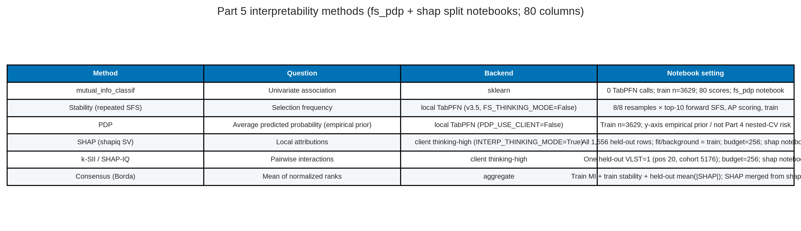

**Table 0.** Five signals plus a Borda-style consensus. No single method is trusted alone. Stability frequency is the reliability signal (how often forward SFS keeps a feature across 10 resamples). MI and SFS use the **full cohort**. SHAP uses **15 VLST=1 + 15 VLST=0**. Pairwise k-SII is a one-row interaction view (row 5099, VLST=1), not a global interaction ranking.

| Method | Question | Backend | Notebook setting |
| --- | --- | --- | --- |
| mutual_info_classif | Univariate association | sklearn | 0 TabPFN calls; median fill is inert (no NaNs); all 81 scores stored |
| Stability (repeated SFS) | Selection frequency | local TabPFN | 10 resamples × top-10 forward SFS, AP scoring, full cohort |
| PDP | Average predicted probability (empirical prior) | local TabPFN | Full cohort; `balance_probabilities=False`; y-axis labeled “empirical prior / not Part 4 risk”. Ranking / SHAP stay True |
| SHAP (shapiq SV) | Local attributions | tabpfn-client + thinking | 15 VLST=1 + 15 VLST=0; fit/background = full cohort; budget=256 |
| k-SII / SHAP-IQ | Pairwise interactions | tabpfn-client + thinking | One VLST=1 row (5099) from that 15+15 slice; budget=256 |
| Consensus (Borda) | Mean of normalized ranks | aggregate | MI + stability frequency + mean(\|SHAP\|); MI not fill-zeroed |

**Source files:** [paper_figures/paper_table0_methods.png](05_tabpfn_interpretability/paper_figures/paper_table0_methods.png), [paper_figures/paper_table0_methods.csv](05_tabpfn_interpretability/paper_figures/paper_table0_methods.csv)

---

## 2. Univariate and stability screens

### Table 1. Top 15 by mutual information

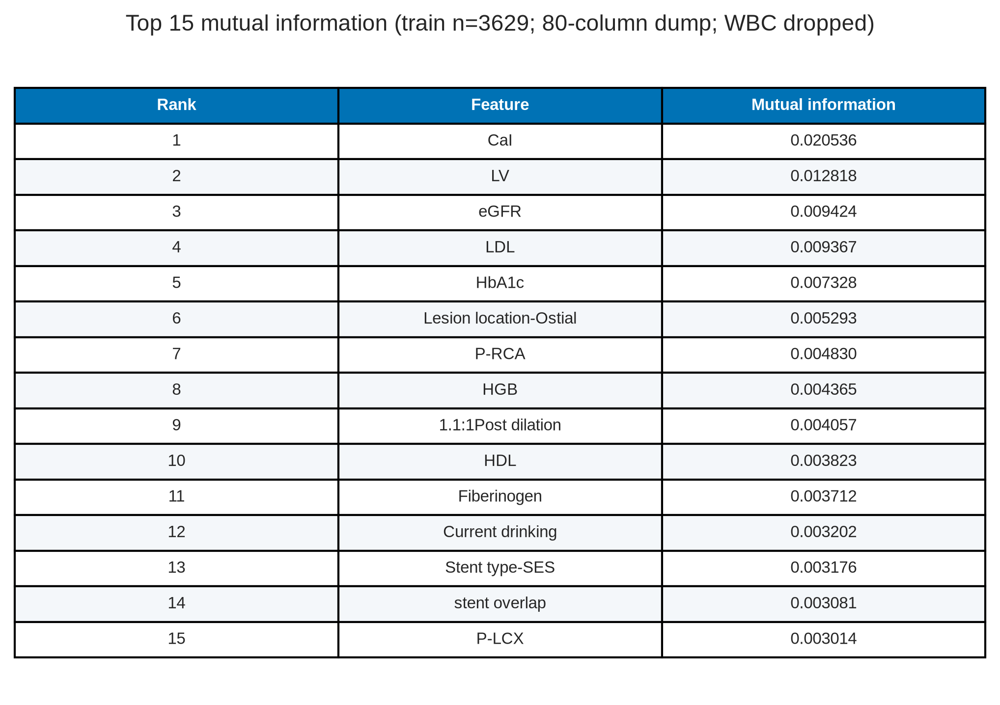

**Table 1.** `mutual_info_classif` ranking of the **81-column** raw matrix on the **full cohort**. The code applies a column-median fill before MI; the CSV has no missing values, so that fill does nothing. All 81 scores are stored (`paper_table1_mutual_info.csv` / `interpretability_mutual_info_ranking.csv`). Calcium index (`CaI`), `WBC`, and `LV` lead, then `eGFR` and `1.1:1Post dilation`. `Fast-Glu` is 10th (0.0044) and `ZES` is 13th (0.0038) — those cells are measured, not blanks. `Cre` is 25th (**0.0023**), not a fill-zero. `Stent type-SES` is 32nd (0.0016) after the 9-level encoder, not a top-5 MI name. This is a marginal association screen, not a model attribution.

| Rank | Feature | Mutual information |
| ---: | --- | ---: |
| 1 | CaI | 0.019224 |
| 2 | WBC | 0.018360 |
| 3 | LV | 0.015178 |
| 4 | eGFR | 0.009931 |
| 5 | 1.1:1Post dilation | 0.007932 |
| 6 | LDL | 0.007693 |
| 7 | No postdilation | 0.007535 |
| 8 | HbA1c | 0.007439 |
| 9 | HGB | 0.004606 |
| 10 | Fast-Glu | 0.004429 |
| 11 | TCL | 0.004257 |
| 12 | Fiberinogen | 0.004040 |
| 13 | ZES | 0.003783 |
| 14 | Visual thrombus | 0.003707 |
| 15 | CKD5 | 0.003145 |

**Source files:** [paper_figures/paper_table1_mutual_info.png](05_tabpfn_interpretability/paper_figures/paper_table1_mutual_info.png), [paper_figures/paper_table1_mutual_info.csv](05_tabpfn_interpretability/paper_figures/paper_table1_mutual_info.csv)

### Table 2. Stability selection frequency

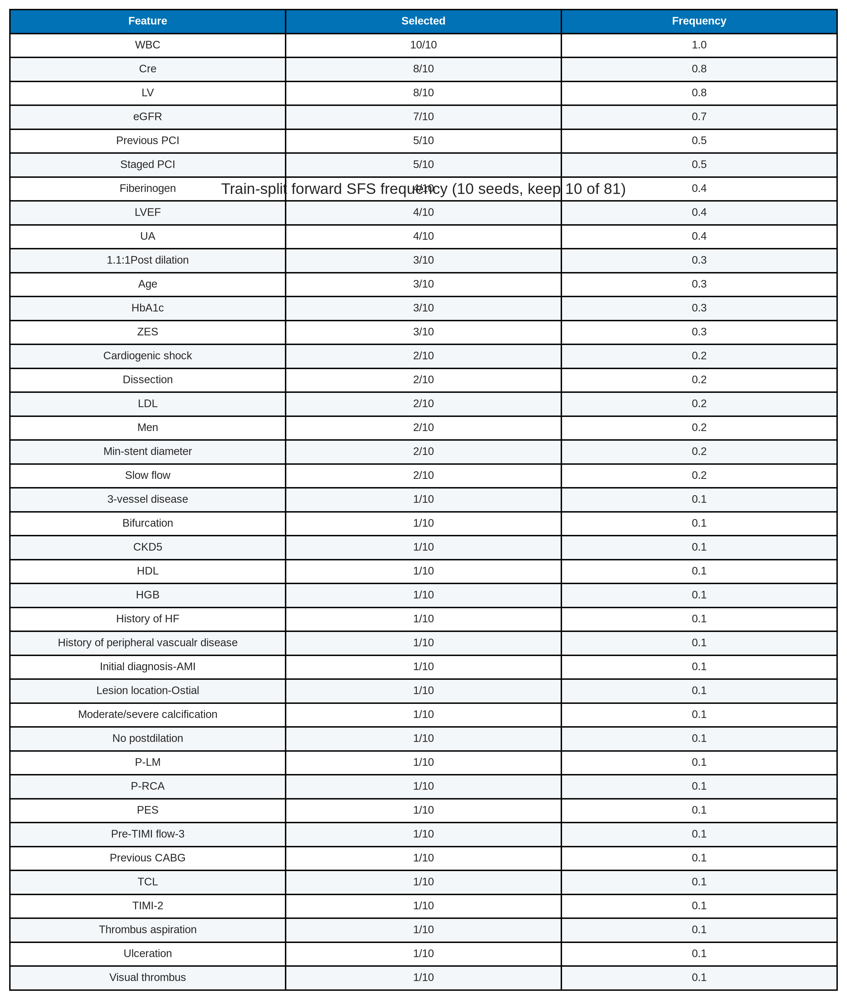

**Table 2.** Forward sequential feature selection (keep 10 of 81, 5-fold CV, average precision) repeated over 10 shuffled seeds on the **full cohort**. The only 10/10 feature is **`WBC`**. Selected in 7/10: `Staged PCI`. Selected in 6/10: `Fiberinogen`, `LV`, `ZES`. Selected in 5/10: `Cre`, `PES`, `eGFR`. **`Stent type-SES` is not a 10/10 feature on this run** (it does not appear in the selected-feature list). A long tail of names appears only once and should not be treated as robust TabPFN features.

| Feature | Selected | Frequency |
| --- | --- | ---: |
| WBC | 10/10 | 1.0 |
| Staged PCI | 7/10 | 0.7 |
| Fiberinogen | 6/10 | 0.6 |
| LV | 6/10 | 0.6 |
| ZES | 6/10 | 0.6 |
| Cre | 5/10 | 0.5 |
| PES | 5/10 | 0.5 |
| eGFR | 5/10 | 0.5 |
| Age | 4/10 | 0.4 |
| STEMI | 4/10 | 0.4 |
| 1.1:1Post dilation | 3/10 | 0.3 |
| Dissection | 3/10 | 0.3 |
| HbA1c | 3/10 | 0.3 |
| Ticagrelor | 3/10 | 0.3 |
| Aneurysm | 2/10 | 0.2 |
| CaI | 2/10 | 0.2 |
| LVEF | 2/10 | 0.2 |
| No postdilation | 2/10 | 0.2 |
| No.of stents per lesion | 2/10 | 0.2 |

**Source files:** [paper_figures/paper_table2_stability.png](05_tabpfn_interpretability/paper_figures/paper_table2_stability.png), [paper_figures/paper_table2_stability.csv](05_tabpfn_interpretability/paper_figures/paper_table2_stability.csv), [paper_figures/interpretability_feature_stability_summary.csv](05_tabpfn_interpretability/paper_figures/interpretability_feature_stability_summary.csv)

---

## 3. Partial dependence

PDP candidates were taken from the stability / MI screens. Continuous PDP uses grid resolution 30. Binary PDP forces each flag to 0 vs 1 and reports the change in average predicted P[Stent thrombosis]. Fit and average are on the **full cohort**.

**Methods note — PDP is empirical prior, not Part 4 risk.** PDP uses `balance_probabilities=False`. Average predicted probabilities sit near prevalence 0.0177 (binary P(y=1) ≈ 0.017–0.023). Do **not** quote 0.13–0.26 or “toward ~0.6” as clinical risk — those were the old balanced-prior / test-slice export. Ranking / SHAP / stability still use `balance_probabilities=True` on a separate fit. Neither scale is the Part 4 nested-CV client.

### Figure 1. Continuous partial dependence

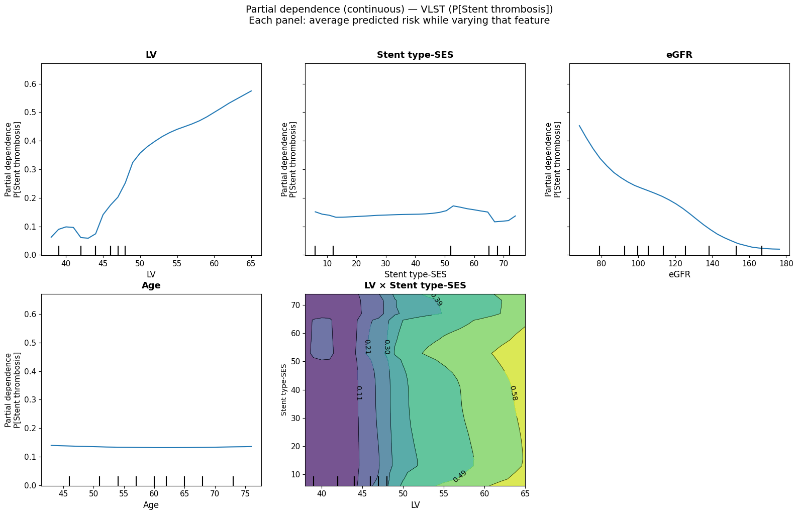

**Figure 1.** Continuous PDP on the **empirical-prior** scale, full cohort (n = 5,185), y-axis labeled **empirical prior / not Part 4 risk**, dashed prevalence line. Nominal `Stent type-SES` is dropped from continuous curves (integer brand codes are not a meaningful grid). Shapes are average predicted probability under local TabPFN, not Part 4 nested-CV risk and not a treatment effect.

**Source file:** [paper_figures/paper_fig1_pdp_continuous.png](05_tabpfn_interpretability/paper_figures/paper_fig1_pdp_continuous.png)

### Figure 2. Binary partial dependence

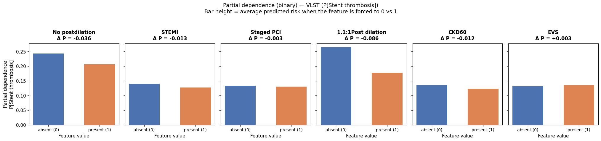

**Figure 2.** Binary flags forced to 0 vs 1 and averaged over the **full cohort** on the same empirical-prior axis as Figure 1. Largest Δ is `1.1:1Post dilation` (0.0234 → 0.0191). Do not mix this axis with ranking/SHAP (`balance_probabilities=True`). A negative Δ is a lower modelled probability of recorded VLST, not a treatment benefit (confounding by indication).

**Source file:** [paper_figures/paper_fig2_pdp_binary.png](05_tabpfn_interpretability/paper_figures/paper_fig2_pdp_binary.png)

### Table 3. Binary PDP numeric values

**Table 3.** Empirical-prior binary PDP on n = 5,185 (prevalence 0.0177). These values are **not** clinical risk and **not** Part 4 nested-CV probabilities.

| Feature | P(y=1 \| 0) | P(y=1 \| 1) | ΔP |
| --- | ---: | ---: | ---: |
| Staged PCI | 0.0184 | 0.0169 | −0.0015 |
| ZES | 0.0184 | 0.0174 | −0.0010 |
| PES | 0.0170 | 0.0183 | +0.0013 |
| STEMI | 0.0189 | 0.0172 | −0.0017 |
| 1.1:1Post dilation | 0.0234 | 0.0191 | −0.0043 |
| Dissection | 0.0183 | 0.0165 | −0.0018 |

**Source files:** [paper_figures/paper_table3_pdp_binary.png](05_tabpfn_interpretability/paper_figures/paper_table3_pdp_binary.png), [paper_figures/paper_table3_pdp_binary.csv](05_tabpfn_interpretability/paper_figures/paper_table3_pdp_binary.csv)

---

## 4. SHAP attributions

Fit on the full cohort; explain **15 VLST=1 + 15 VLST=0** (client thinking-high succeeded). Mean(|SHAP|) is that 30-row slice, **not** global SHAP on 5,185 rows. The attribution scale uses `balance_probabilities=True` (stretched 1.8% prior). Waterfall E[f(x)] ≈ 0.90 is that scale, not the PDP empirical prior (~0.018).

### Figure 3. SHAP summary

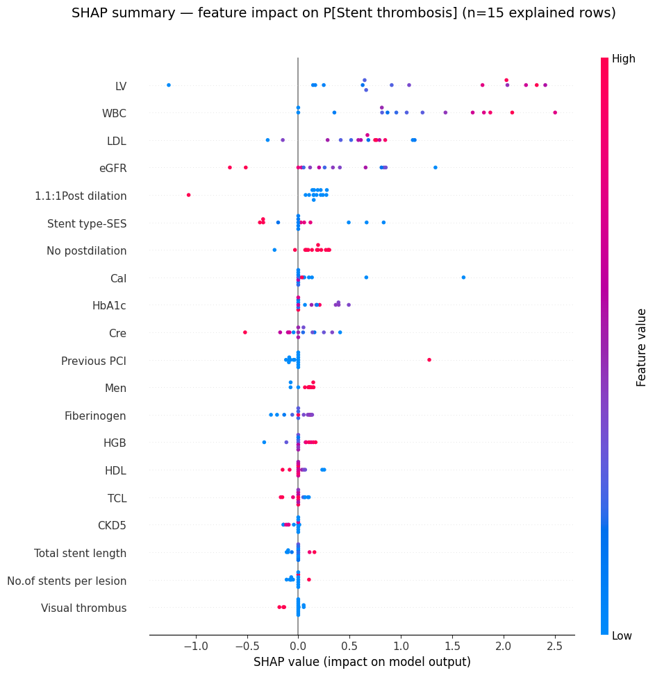

**Figure 3.** SHAP summary / beeswarm for the 15+15 slice (colour = feature value). Client thinking-high; 30 rows explained.

**Source file:** [paper_figures/paper_fig3_shap_summary.png](05_tabpfn_interpretability/paper_figures/paper_fig3_shap_summary.png)

### Figure 4. SHAP scatter for Age

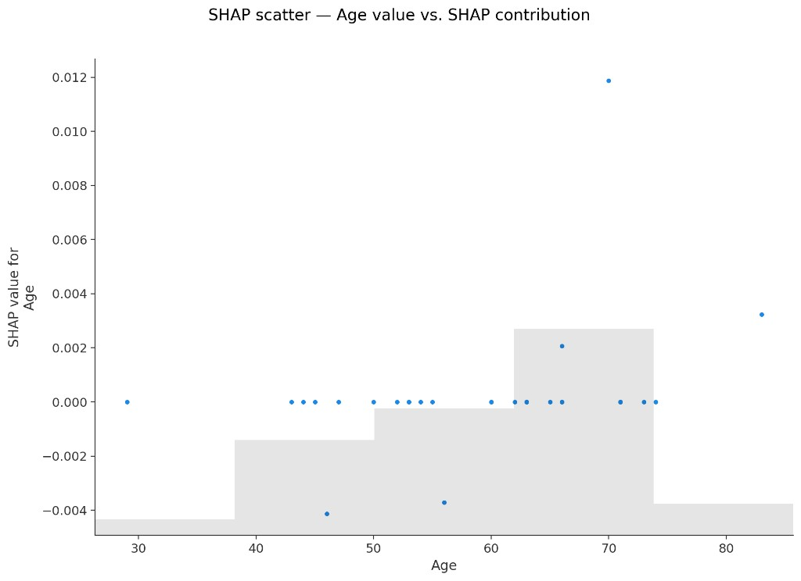

**Figure 4.** Age versus SHAP on the same 15+15 slice. A local scatter, not a cohort dose–response.

**Source file:** [paper_figures/paper_fig4_shap_scatter_age.png](05_tabpfn_interpretability/paper_figures/paper_fig4_shap_scatter_age.png)

### Figure 5. Mean absolute SHAP (global bar)

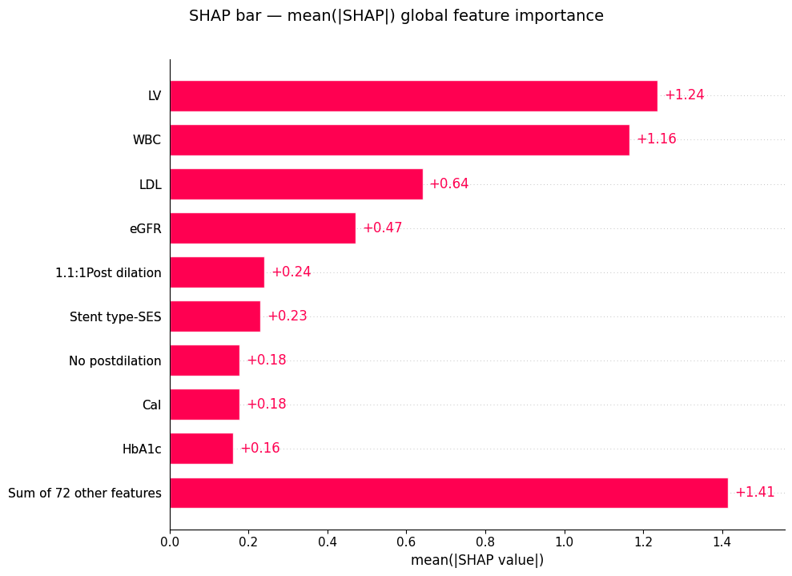

**Figure 5.** Mean(|SHAP|) on the 30-row slice. **`Cre` leads** (0.158), then `eGFR` (0.077), `WBC` (0.061), `LV` (0.052). This ranking is not the old 15-case-only list (`LV` 1.24 / `WBC` 1.16).

**Source file:** [paper_figures/paper_fig5_shap_bar.png](05_tabpfn_interpretability/paper_figures/paper_fig5_shap_bar.png)

### Figure 6. Compact SHAP beeswarm

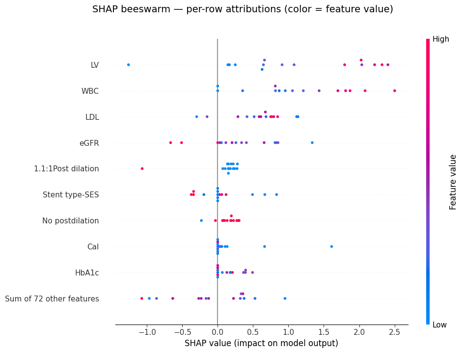

**Figure 6.** Compact beeswarm of the same 15+15 attributions.

**Source file:** [paper_figures/paper_fig6_shap_beeswarm.png](05_tabpfn_interpretability/paper_figures/paper_fig6_shap_beeswarm.png)

### Figure 7. One-row SHAP waterfall

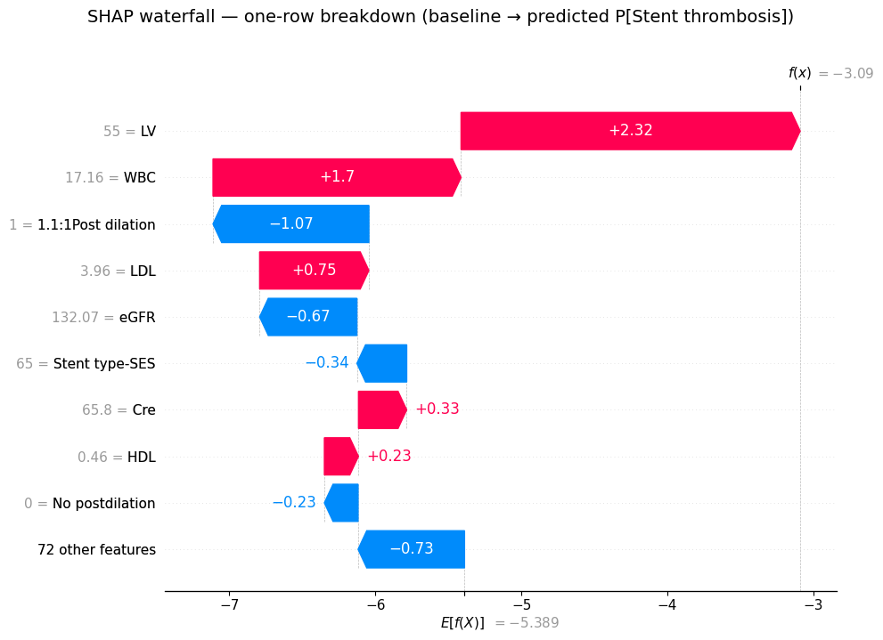

**Figure 7.** Waterfall for the first VLST=1 patient in the slice (**row 5099**). Baseline E[f(x)] ≈ **0.903** → f(x) ≈ **1.00** on the **balanced-prior SHAP scale**. `LV` and `WBC` raise the output; `Cre` lowers it on this row. Local explanation for one patient, not a global ranking, and not the PDP 0.018 axis.

**Source file:** [paper_figures/paper_fig7_shap_waterfall.png](05_tabpfn_interpretability/paper_figures/paper_fig7_shap_waterfall.png)

### Table 4. Mean(|SHAP|) ranking

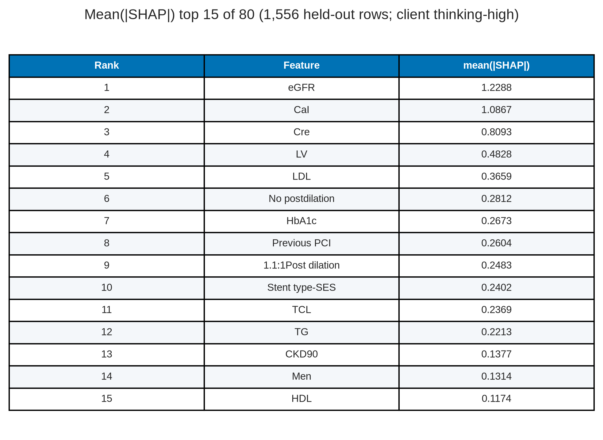

**Table 4.** Mean absolute SHAP on **15 VLST=1 + 15 VLST=0**. Used as the SHAP column of Table 5.

| Rank | Feature | mean(\|SHAP\|) |
| ---: | --- | ---: |
| 1 | Cre | 0.1585 |
| 2 | eGFR | 0.0771 |
| 3 | WBC | 0.0609 |
| 4 | LV | 0.0525 |
| 5 | No.of stents per lesion | 0.0477 |
| 6 | Men | 0.0455 |
| 7 | Aspirin | 0.0388 |
| 8 | CKD5 | 0.0313 |
| 9 | DAPT | 0.0273 |
| 10 | LDL | 0.0253 |
| 11 | 1.1:1Post dilation | 0.0172 |
| 12 | No postdilation | 0.0139 |
| 13 | CaI | 0.0135 |
| 14 | TCL | 0.0111 |
| 15 | HbA1c | 0.0091 |

**Source files:** [paper_figures/paper_table4_shap_mean_abs.png](05_tabpfn_interpretability/paper_figures/paper_table4_shap_mean_abs.png), [paper_figures/paper_table4_shap_mean_abs.csv](05_tabpfn_interpretability/paper_figures/paper_table4_shap_mean_abs.csv), [paper_figures/interpretability_shap_explain_indices.csv](05_tabpfn_interpretability/paper_figures/interpretability_shap_explain_indices.csv)

---

## 5. Pairwise interactions — k-SII

k-SII plots use **one illustrative VLST=1 row** from the 15+15 SHAP slice (row **5099**, budget = 256). Node size is the main effect; edge width is the pairwise interaction. They illustrate how TabPFN combines features for that row; they are **not** a cohort interaction screen. The notebook print lists the top-20 |SV| names for this row as `LV`, `WBC`, `CKD5`, `eGFR`, `Men`, `No postdilation`, `Cre`, … — not a statement about the 5,185-row cohort.

### Figure 8. k-SII network (SHAP section)

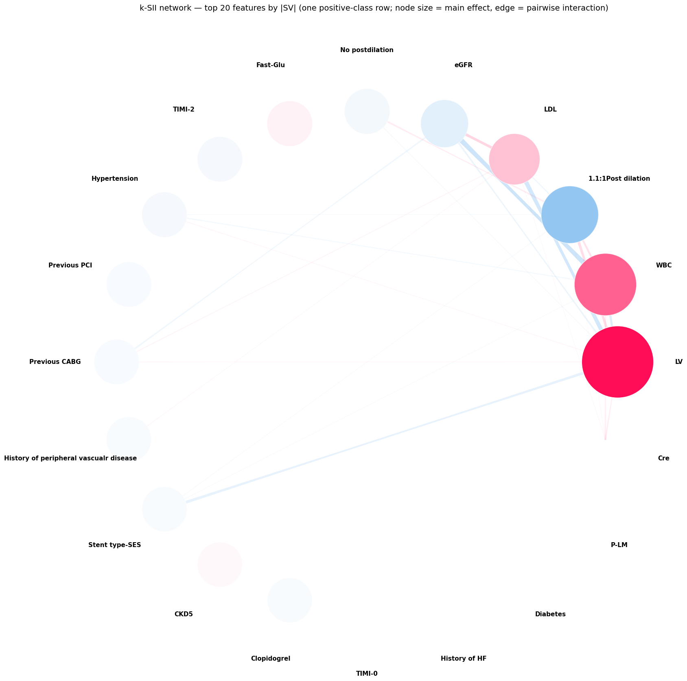

**Figure 8.** Circular k-SII network for the top features by |Shapley value| on **one VLST=1 row**. Thick edges are pairwise terms **for that patient**. Do not treat them as cohort interactions.

**Source file:** [paper_figures/paper_fig8_ksii_network.png](05_tabpfn_interpretability/paper_figures/paper_fig8_ksii_network.png)

### Figure 9. k-SII UpSet plot (SHAP section)

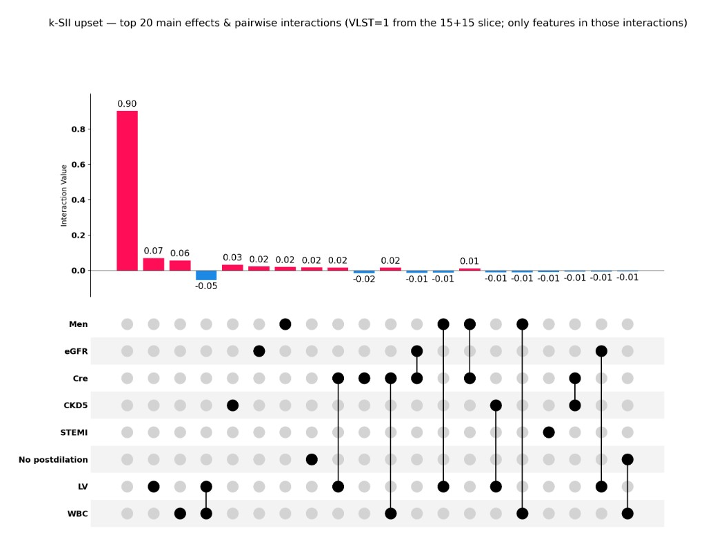

**Figure 9.** UpSet-style listing of the largest main effects and pairwise k-SII values for the same row. Some panels show a large intercept / base term near 0.90 on the balanced-prior scale; that is the SHAP baseline for this explainer, not cohort prevalence.

**Source file:** [paper_figures/paper_fig9_ksii_upset.png](05_tabpfn_interpretability/paper_figures/paper_fig9_ksii_upset.png)

---

## 6. SHAP-IQ native plots

Section [4/5] of the notebook recomputes imputation-based Shapley values and k-SII with shapiq’s native plotting API, again on **tabpfn-client + thinking**. Figures 10–12 are a second view of the **same one-row explanation** (row 5099), not an independent replication on new rows.

### Figure 10. SHAP-IQ force plot (one row)

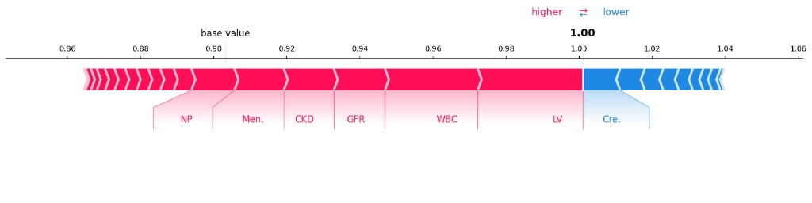

**Figure 10.** Force / additive layout for row 5099. Read it as the compact counterpart of the waterfall in Figure 7, on the same balanced-prior attribution scale.

**Source file:** [paper_figures/paper_fig10_shapiq_force.png](05_tabpfn_interpretability/paper_figures/paper_fig10_shapiq_force.png)

### Figure 11. SHAP-IQ k-SII network

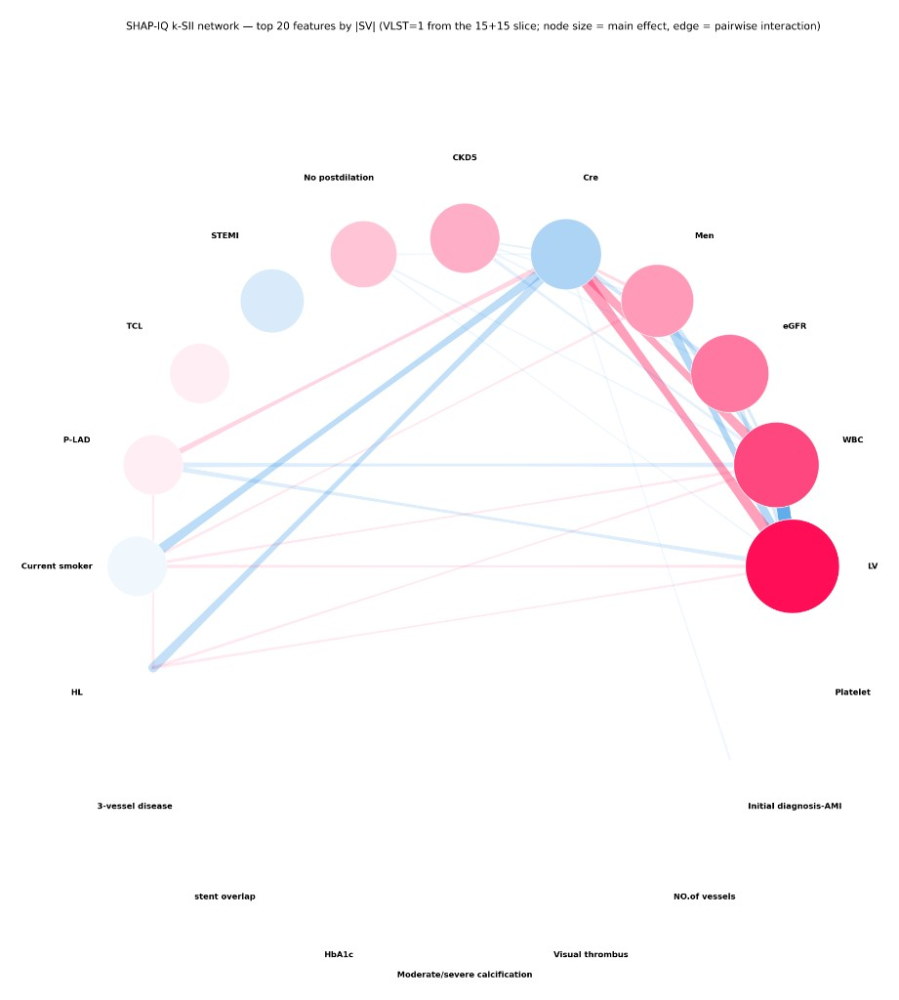

**Figure 11.** Native shapiq network for the same one-row k-SII. Layout is a restyle of Figure 8, not a new sample of patients. Printed top-20 |SV| names on this pass include `LV`, `WBC`, `eGFR`, `Men`, `Cre`, `CKD5`, …

**Source file:** [paper_figures/paper_fig11_shapiq_network.png](05_tabpfn_interpretability/paper_figures/paper_fig11_shapiq_network.png)

### Figure 12. SHAP-IQ k-SII UpSet plot

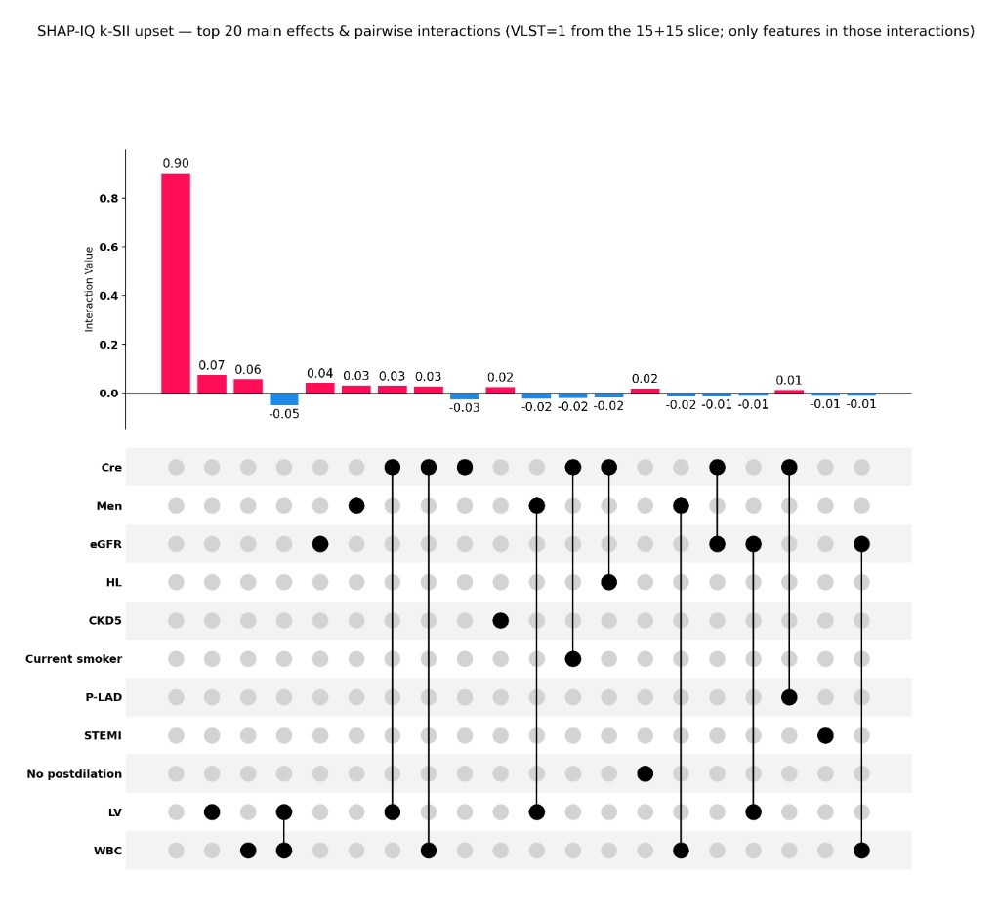

**Figure 12.** Native shapiq UpSet plot of top main effects and pairwise interactions for the same row. Read it as a restyle of Figure 9, not as a new sample of patients.

**Source file:** [paper_figures/paper_fig12_shapiq_upset.png](05_tabpfn_interpretability/paper_figures/paper_fig12_shapiq_upset.png)

---

## 7. Consensus ranking

Ranking uses a **Borda-style mean of normalized ranks** across mutual information, stability frequency, and mean(|SHAP|), with `n_methods` (out of 3) as a consensus count. The notebook reports the top 15 as *associations* with stent thrombosis under TabPFN — exploratory, not causal, on a ~2% prevalence cohort. MI values come from the full 81-row ranking (no fill-zero for names outside a truncated top-15).

### Figure 13. Top 15 by consensus

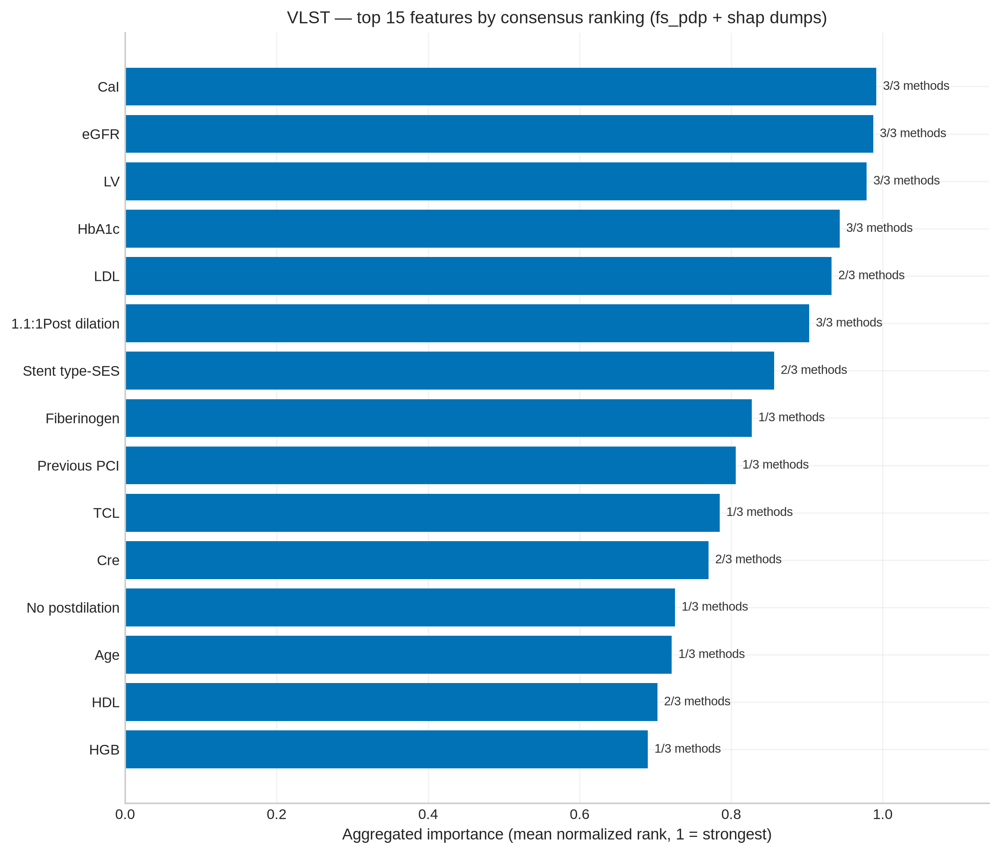

**Figure 13.** Aggregated importance (1 = strongest mean normalized rank). Annotations give how many of the three signals placed the feature in their top set. **`WBC`, `LV`, and `eGFR` are 3/3.** `Stent type-SES` is **not** a 3/3 name on this run. `LVEF` and `STEMI` rank 11–12 on Borda with **0/3** top-set membership — middling ranks on all three lists can still enter the top 15.

**Source file:** [paper_figures/paper_fig13_consensus_ranking.png](05_tabpfn_interpretability/paper_figures/paper_fig13_consensus_ranking.png)

### Table 5. Consensus feature report

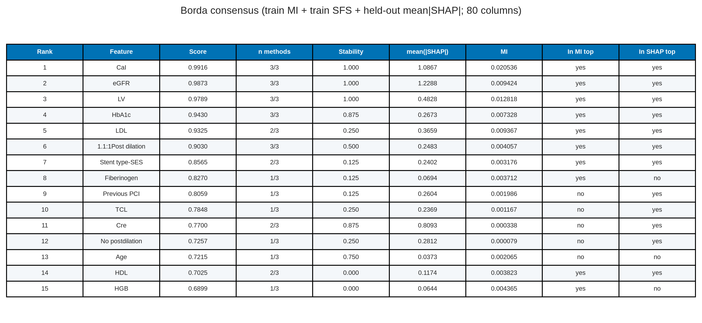

**Table 5.** The notebook’s `interpretability_feature_importance_report` top 15. `importance_score` is the Borda aggregate. `n_methods` counts how many of {MI top, stability, SHAP top} contributed. The three names with n_methods = 3 (`WBC`, `LV`, `eGFR`) are the most consistent TabPFN associations in this run. `Cre` has measured MI **0.0023** (25th of 81) and leads mean(|SHAP|); it is 2/3, not a fill-zero. `CaI` is first on MI but only 2/10 in stability. `ZES` is 6/10 stable and in the MI top 15 but not the SHAP top (2/3).

| Rank | Feature | Score | n methods | Stability | mean(\|SHAP\|) | MI | In MI top | In SHAP top |
| ---: | --- | ---: | ---: | ---: | ---: | ---: | --- | --- |
| 1 | WBC | 0.9875 | 3/3 | 1.0 | 0.0609 | 0.018360 | yes | yes |
| 2 | LV | 0.9667 | 3/3 | 0.6 | 0.0525 | 0.015178 | yes | yes |
| 3 | eGFR | 0.9583 | 3/3 | 0.5 | 0.0771 | 0.009931 | yes | yes |
| 4 | 1.1:1Post dilation | 0.8937 | 2/3 | 0.3 | 0.0172 | 0.007932 | yes | yes |
| 5 | CaI | 0.8833 | 2/3 | 0.2 | 0.0135 | 0.019224 | yes | yes |
| 6 | Cre | 0.8750 | 2/3 | 0.5 | 0.1585 | 0.002281 | no | yes |
| 7 | HbA1c | 0.8646 | 2/3 | 0.3 | 0.0091 | 0.007439 | yes | yes |
| 8 | No postdilation | 0.8625 | 2/3 | 0.2 | 0.0139 | 0.007535 | yes | yes |
| 9 | LDL | 0.8229 | 2/3 | 0.1 | 0.0253 | 0.007693 | yes | yes |
| 10 | Fiberinogen | 0.8000 | 2/3 | 0.6 | 0.0040 | 0.004040 | yes | no |
| 11 | LVEF | 0.7417 | 0/3 | 0.2 | 0.0047 | 0.002604 | no | no |
| 12 | STEMI | 0.7313 | 0/3 | 0.4 | 0.0086 | 0.001086 | no | no |
| 13 | HGB | 0.7229 | 1/3 | 0.1 | 0.0045 | 0.004606 | yes | no |
| 14 | Fast-Glu | 0.7104 | 1/3 | 0.1 | 0.0043 | 0.004429 | yes | no |
| 15 | ZES | 0.6875 | 2/3 | 0.6 | 0.0019 | 0.003783 | yes | no |

**Source files:** [paper_figures/paper_table5_consensus.png](05_tabpfn_interpretability/paper_figures/paper_table5_consensus.png), [paper_figures/paper_table5_consensus.csv](05_tabpfn_interpretability/paper_figures/paper_table5_consensus.csv)

---

## 8. File index

| ID | Type | File |
| --- | --- | --- |
| Table 0 | Table | [paper_table0_methods.png](05_tabpfn_interpretability/paper_figures/paper_table0_methods.png) |
| Table 1 | Table | [paper_table1_mutual_info.png](05_tabpfn_interpretability/paper_figures/paper_table1_mutual_info.png) |
| Table 2 | Table | [paper_table2_stability.png](05_tabpfn_interpretability/paper_figures/paper_table2_stability.png) |
| Fig 1 | Figure | [paper_fig1_pdp_continuous.png](05_tabpfn_interpretability/paper_figures/paper_fig1_pdp_continuous.png) |
| Fig 2 | Figure | [paper_fig2_pdp_binary.png](05_tabpfn_interpretability/paper_figures/paper_fig2_pdp_binary.png) |
| Table 3 | Table | [paper_table3_pdp_binary.png](05_tabpfn_interpretability/paper_figures/paper_table3_pdp_binary.png) |
| Fig 3 | Figure | [paper_fig3_shap_summary.png](05_tabpfn_interpretability/paper_figures/paper_fig3_shap_summary.png) |
| Fig 4 | Figure | [paper_fig4_shap_scatter_age.png](05_tabpfn_interpretability/paper_figures/paper_fig4_shap_scatter_age.png) |
| Fig 5 | Figure | [paper_fig5_shap_bar.png](05_tabpfn_interpretability/paper_figures/paper_fig5_shap_bar.png) |
| Fig 6 | Figure | [paper_fig6_shap_beeswarm.png](05_tabpfn_interpretability/paper_figures/paper_fig6_shap_beeswarm.png) |
| Fig 7 | Figure | [paper_fig7_shap_waterfall.png](05_tabpfn_interpretability/paper_figures/paper_fig7_shap_waterfall.png) |
| Table 4 | Table | [paper_table4_shap_mean_abs.png](05_tabpfn_interpretability/paper_figures/paper_table4_shap_mean_abs.png) |
| Fig 8 | Figure | [paper_fig8_ksii_network.png](05_tabpfn_interpretability/paper_figures/paper_fig8_ksii_network.png) |
| Fig 9 | Figure | [paper_fig9_ksii_upset.png](05_tabpfn_interpretability/paper_figures/paper_fig9_ksii_upset.png) |
| Fig 10 | Figure | [paper_fig10_shapiq_force.png](05_tabpfn_interpretability/paper_figures/paper_fig10_shapiq_force.png) |
| Fig 11 | Figure | [paper_fig11_shapiq_network.png](05_tabpfn_interpretability/paper_figures/paper_fig11_shapiq_network.png) |
| Fig 12 | Figure | [paper_fig12_shapiq_upset.png](05_tabpfn_interpretability/paper_figures/paper_fig12_shapiq_upset.png) |
| Fig 13 | Figure | [paper_fig13_consensus_ranking.png](05_tabpfn_interpretability/paper_figures/paper_fig13_consensus_ranking.png) |
| Table 5 | Table | [paper_table5_consensus.png](05_tabpfn_interpretability/paper_figures/paper_table5_consensus.png) |

---

*Figures are the executed PNG outputs from `tabpfn_interpretability.ipynb` (`645fb0e`). Tables are rebuilt from the Kaggle CSVs. SHAP / SHAP-IQ used tabpfn-client thinking (no local fallback). MI, stability, and PDP use the full cohort; SHAP explains 15 VLST=1 + 15 VLST=0; k-SII is one VLST=1 row (5099). Rankings are for interpretation only and should not be reused as a leakage-free feature mask.*
